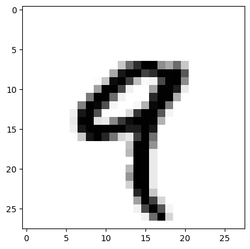

# 케라스 창시자에게 배우는 딥러닝
## 2장, *신경망의 수학적 구성 요소*

딥러닝에 익숙해지려면 텐서, 텐서 연산, 미분, 경사 하강법 등의 수학적인 개념들과 친숙해져야 한다.

## 2.1 신경망과의 첫 만남

**코드 2-1. 케라스에서 MNIST 데이터셋 적재하기**
```
from tensorflow.keras.datasets import mnist
(train_images, train_labels), (test_images, test_labels) = mnist.load_data()
```

`train_images`, `train_labels`가 모델이 학습해야 할 **훈련 세트**(training set)를 구성한다. 모델은 `test_images`, `test_labels`로 구성된 **테스트 세트**(test set)에서 테스트될 것이다.

**코드 2-2. 신경망 구조**
```
from tensorflow import keras
from tensorflow.keras import layers

model = keras.Sequential([
    layers.Dense(512, activation="relu"),
    layers.Dense(10, activation="softmax")
])
```

신경망의 핵심 구성 요소는 데이터를 위한 필터(filter) 역할을 수행하는 **층**(layer)이다. 층은 주어진 문제에 더 의미 있는 **표현**(representation)을 입력된 데이터로부터 추출한다. 딥러닝 모델은 데이터 정제 층이 연속되어 있는 여과기와 같다.

예제에서는 **완전 연결**(fully connected) 신경망 층인 `Dense` 층 2개가 연결되어 있다. 마지막 층은 **소프트맥스**(softmax) 분류 층으로 층 크기 만큼의 확률 배열을 반환한다. 소프트맥스 층 배열의 합은 1으로 배열 요소는 해당 클래스에 속할 확률을 나타낸다.

신경망 훈련을 위해서 다음의 세 가지 요소가 더 필요하다.

- **옵티마이저**(optimizer): 성능을 향상시키기 위해 입력된 데이터를 기반으로 모델을 업데이트하는 메커니즘이다.
- **손실 함수**(loss function): 훈련 데이터에서 모델의 성능을 측정하는 방법으로 모델이 옳은 방향으로 학습될 수 있도록 도와준다.
- **훈련과 테스트 과정을 모니터링할 지표**: 이 예제에서는 정확도만을 고려한다.

**코드 2-3. 컴파일 단계**
```
model.compile(optimizer="rmsprop",
              loss="sparse_categorical_crossentropy",
              metrics=["accuracy"])
```

**코드 2-4. 이미지 데이터 준비하기**
```
train_images = train_images.reshape((60000, 28 * 28))
train_images = train_images.astype("float32") / 255
test_images = test_images.reshape((10000, 28 * 28))
test_images = test_images.astype("float32") / 255
```

데이터를 모델에 맞는 크기로 바꾸고 모든 값을 0과 1 사이로 스케일링한다.

**코드 2-5. 모델 훈련하기**
```
model.fit(train_images, train_labels, epochs=5, batch_size=128)
```

**코드 2-6. 모델을 사용하여 예측 만들기**
```
test_digits = test_images[0:10]
predictions = model.predict(test_digits)
predictions[0]
```

**코드 2-7. 새로운 데이터에서 모델 평가하기**
```
test_loss, test_acc = model.evaluate(test_images, test_labels)
print(f"테스트 정확도: {test_acc}")
```


## 2.2 신경망을 위한 데이터 표현

**텐서**(tensor)란 데이터를 위한 컨테이너, 일반적으로 수치형 데이터를 위한 컨테이너이다. 임의의 차원 개수를 가지는 행렬의 일반화된 모습으로, **차원**(dimension)을 **축**(axis)이라고 부른다.

### 2.2.1 스칼라(랭크-0 텐서)

단 하나의 숫자를 **스칼라**(scalar)라고 한다. 텐서의 축 개수를 **랭크**(rank)라고 부르기도 하는데, 스칼라는 랭크 0이다.

### 2.2.2 벡터(랭크-1 텐서)

숫자의 배열을 **벡터**(vector), 랭크-1 텐서, 또는 1D 텐서라고 부른다.

5개의 원소를 갖는 벡터는 5차원 벡터라고 불린다. **5D 벡터**는 하나의 축을 따라 5개의 원소가 있는 것이고, **5D 텐서**는 다섯 개의 축을 갖는 텐서이다.

### 2.2.3 행렬(랭크-2 텐서)

벡터의 배열은 **행렬**(matrix), 랭크-2 텐서, 또는 2D 텐서라고 부른다.

첫 번째 축 방향으로 놓여 있는 원소 집합을 **행**(row), 두 번째 축 방향으로 놓여 있는 원소 집합을 **열**(column)이라고 한다.

### 2.2.4 랭크-3 텐서와 더 높은 랭크의 텐서

행렬을 배열로 합치면 직육면체 형태로 해석할 수 있는 랭크-3 텐서 또는 3D 텐서가 형성된다. 또 다시 랭크-3 텐서를 배열로 합치면 랭크-4 텐서가 형성되는 식이다.

### 2.2.5 핵심 속성

텐서는 다음과 같은 3개의 핵심 속성이 있다.

- **축의 개수(랭크)**: 넘파이나 텐서플로 같은 파이썬 라이브러리에서 `ndim`에 저장되어 있다.
- **크기**(shape): 텐서의 각 축을 따라 얼마나 많은 차원이 있는지를 나타내는 파이썬 튜플(tuple)이다.
- **데이터 타입(dtype)**: 텐서에 포함된 데이터의 타입이다. `float16`, `float32`, `float64`, `uint8` 등이 될 수 있다. 텐서플로에서는 `string` 텐서를 사용하기도 한다.

**코드 2-8. 다섯 번째 이미지 출력하기**
```
from tensorflow.keras.datasets import mnist
(train_images, train_labels), (test_images, test_labels) = mnist.load_data()

import matplotlib.pyplot as plt

digit = train_images[4]
plt.imshow(digit, cmap=plt.cm.binary)
plt.show()
```



### 2.2.6 넘파이로 텐서 조작하기

슬라이싱을 통해 텐서를 조작할 수 있다.

### 2.2.7 배치 데이터

일반적으로 딥러닝에서 사용하는 모든 데이터의 0번째 축을 **샘플 축**(sample axis)이라고 한다. MNIST 예제에서는 숫자 이미지가 샘플이다.

딥러닝 모델은 전체 데이터셋을 작은 배치(batch)로 나눈다.

배치 데이터를 다룰 때 0번째 축을 **배치 축**(batch axis) 또는 **배치 차원**(batch dimension)이라고 부른다.

### 2.2.8 텐서의 실제 사례

- **벡터 데이터**
- **시계열 데이터 또는 시퀀스 데이터**
- **이미지**
- **동영상**

### 2.2.9 벡터 데이터

대부분의 경우에 해당된다. 첫 번째 축은 **샘플 축**이고, 두 번째 축은 **특성 축**(feature axis)이다.

- 사람의 나이, 성별, 소득으로 구성된 인구 통계 데이터가 있다고 하자. 사람이 10만 명이라면 이를 나타내는 전체 데이터셋은 (100000, 3) 크기의 랭크-2 텐서에 저장될 수 있다.
- 공통 단어 2만 개로 만든 사전이 있고, 500개의 텍스트 문서 각각에서 사전에 있는 단어들이 사용된 횟수를 저장한다고 하자. 이를 나타내는 전체 데이터셋은 (500, 20000) 크기의 랭크-2 텐서에 저장될 수 있다.

### 2.2.10 시계열 데이터 또는 시퀀스 데이터

데이터에서 시간 또는 연속된 순서가 중요할 때는 시간 축을 포함하여 랭크-3 텐서로 저장된다. 각 샘플은 벡터의 시퀀스(랭크-2 텐서)로 인코딩되므로 배치 데이터는 랭크-3 텐서로 인코딩된다.

관례적으로 시간 축은 항상 두 번째 축(인덱스 1)이다.

- 1분마다 현재 주식 가격, 지난 1분 간 동안의 최고 가격, 최소 가격의 세 속성을 저장한다고 하자. 1분마다 데이터는 3D 벡터로 인코딩되고, 하루 거래 시간이 390분이므로 하루 동안의 거래는 (390, 3) 크기의 행렬로 인코딩된다. 250일치의 데이터는 (250, 390, 3) 크기의 랭크-3 텐서로 저장될 수 있다. 여기서 1일치 데이터가 하나의 샘플이 된다.
- 하나의 트윗이 128개의 알파벳으로 구성된 280개의 문자 시퀀스라고 하자. 여기서 각 문자가 해당 문자의 인덱스만 1이고 나머지는 0인 이진 벡터로 인코딩될 수 있다. 그러면 각 트윗은 (280, 128) 크기의 랭크-2 텐서로 인코딩된다. 100만 개의 트윗으로 구성된 데이터셋은 (1000000, 280, 128) 크기의 랭크-3 텐서에 저장될 수 있다.

### 2.2.11 이미지 데이터

이미지는 전형적으로 높이, 너비, 컬러 채널의 3차원으로 이루어진다. 여기에 배치 데이터의 차원이 추가된다. 예를 들어 256 X 256 크기의 RGB 이미지에 대한 128개의 배치는 (128, 256, 256, 3) 크기의 랭크-4 텐서에 저장될 수 있다. 흑백일 경우엔 컬러 채널의 차원 크기가 1이다.

이미지 텐서의 크기를 지정하는 방식은 **채널 마지막**(channel-last) 방식과 **채널 우선**(channel-first) 방식이 사용된다. 전자는 (samples, height, width, color_depth)와 같이 컬러 채널의 깊이가 마지막 축에 있고, 후자는 (samples, color_depth, height, width)와 같이 컬러 채널의 깊이가 배치 축 바로 뒤에 오게 된다.

### 2.2.12 비디오 데이터

하나의 비디오는 프레임의 연속이고, 각 프레임은 하나의 컬러 이미지이다. 그러므로 여러 비디오의 배치는 (samples, frames, height, width, color_depth)와 같이 랭크-5 텐서로 저장될 수 있다.


## 2.3 신경망의 톱니바퀴: 텐서 연산