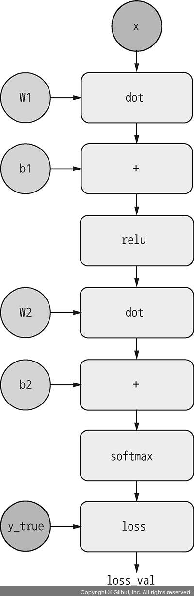

# 케라스 창시자에게 배우는 딥러닝
## 2장, *신경망의 수학적 구성 요소*

딥러닝에 익숙해지려면 텐서, 텐서 연산, 미분, 경사 하강법 등의 수학적인 개념들과 친숙해져야 한다.

## 2.1 신경망과의 첫 만남

**코드 2-1. 케라스에서 MNIST 데이터셋 적재하기**
```
from tensorflow.keras.datasets import mnist
(train_images, train_labels), (test_images, test_labels) = mnist.load_data()
```

`train_images`, `train_labels`가 모델이 학습해야 할 **훈련 세트**(training set)를 구성한다. 모델은 `test_images`, `test_labels`로 구성된 **테스트 세트**(test set)에서 테스트될 것이다.

**코드 2-2. 신경망 구조**
```
from tensorflow import keras
from tensorflow.keras import layers

model = keras.Sequential([
    layers.Dense(512, activation="relu"),
    layers.Dense(10, activation="softmax")
])
```

신경망의 핵심 구성 요소는 데이터를 위한 필터(filter) 역할을 수행하는 **층**(layer)이다. 층은 주어진 문제에 더 의미 있는 **표현**(representation)을 입력된 데이터로부터 추출한다. 딥러닝 모델은 데이터 정제 층이 연속되어 있는 여과기와 같다.

예제에서는 **완전 연결**(fully connected) 신경망 층인 `Dense` 층 2개가 연결되어 있다. 마지막 층은 **소프트맥스**(softmax) 분류 층으로 층 크기 만큼의 확률 배열을 반환한다. 소프트맥스 층 배열의 합은 1으로 배열 요소는 해당 클래스에 속할 확률을 나타낸다.

신경망 훈련을 위해서 다음의 세 가지 요소가 더 필요하다.

- **옵티마이저**(optimizer): 성능을 향상시키기 위해 입력된 데이터를 기반으로 모델을 업데이트하는 메커니즘이다.
- **손실 함수**(loss function): 훈련 데이터에서 모델의 성능을 측정하는 방법으로 모델이 옳은 방향으로 학습될 수 있도록 도와준다.
- **훈련과 테스트 과정을 모니터링할 지표**: 이 예제에서는 정확도만을 고려한다.

**코드 2-3. 컴파일 단계**
```
model.compile(optimizer="rmsprop",
              loss="sparse_categorical_crossentropy",
              metrics=["accuracy"])
```

**코드 2-4. 이미지 데이터 준비하기**
```
train_images = train_images.reshape((60000, 28 * 28))
train_images = train_images.astype("float32") / 255
test_images = test_images.reshape((10000, 28 * 28))
test_images = test_images.astype("float32") / 255
```

데이터를 모델에 맞는 크기로 바꾸고 모든 값을 0과 1 사이로 스케일링한다.

**코드 2-5. 모델 훈련하기**
```
model.fit(train_images, train_labels, epochs=5, batch_size=128)
```

**코드 2-6. 모델을 사용하여 예측 만들기**
```
test_digits = test_images[0:10]
predictions = model.predict(test_digits)
predictions[0]
```

**코드 2-7. 새로운 데이터에서 모델 평가하기**
```
test_loss, test_acc = model.evaluate(test_images, test_labels)
print(f"테스트 정확도: {test_acc}")
```


## 2.2 신경망을 위한 데이터 표현

**텐서**(tensor)란 데이터를 위한 컨테이너, 일반적으로 수치형 데이터를 위한 컨테이너이다. 임의의 차원 개수를 가지는 행렬의 일반화된 모습으로, **차원**(dimension)을 **축**(axis)이라고 부른다.

### 2.2.1 스칼라(랭크-0 텐서)

단 하나의 숫자를 **스칼라**(scalar)라고 한다. 텐서의 축 개수를 **랭크**(rank)라고 부르기도 하는데, 스칼라는 랭크 0이다.

### 2.2.2 벡터(랭크-1 텐서)

숫자의 배열을 **벡터**(vector), 랭크-1 텐서, 또는 1D 텐서라고 부른다.

5개의 원소를 갖는 벡터는 5차원 벡터라고 불린다. **5D 벡터**는 하나의 축을 따라 5개의 원소가 있는 것이고, **5D 텐서**는 다섯 개의 축을 갖는 텐서이다.

### 2.2.3 행렬(랭크-2 텐서)

벡터의 배열은 **행렬**(matrix), 랭크-2 텐서, 또는 2D 텐서라고 부른다.

첫 번째 축 방향으로 놓여 있는 원소 집합을 **행**(row), 두 번째 축 방향으로 놓여 있는 원소 집합을 **열**(column)이라고 한다.

### 2.2.4 랭크-3 텐서와 더 높은 랭크의 텐서

행렬을 배열로 합치면 직육면체 형태로 해석할 수 있는 랭크-3 텐서 또는 3D 텐서가 형성된다. 또 다시 랭크-3 텐서를 배열로 합치면 랭크-4 텐서가 형성되는 식이다.

### 2.2.5 핵심 속성

텐서는 다음과 같은 3개의 핵심 속성이 있다.

- **축의 개수(랭크)**: 넘파이나 텐서플로 같은 파이썬 라이브러리에서 `ndim`에 저장되어 있다.
- **크기**(shape): 텐서의 각 축을 따라 얼마나 많은 차원이 있는지를 나타내는 파이썬 튜플(tuple)이다.
- **데이터 타입(dtype)**: 텐서에 포함된 데이터의 타입이다. `float16`, `float32`, `float64`, `uint8` 등이 될 수 있다. 텐서플로에서는 `string` 텐서를 사용하기도 한다.

**코드 2-8. 다섯 번째 이미지 출력하기**
```
from tensorflow.keras.datasets import mnist
(train_images, train_labels), (test_images, test_labels) = mnist.load_data()

import matplotlib.pyplot as plt

digit = train_images[4]
plt.imshow(digit, cmap=plt.cm.binary)
plt.show()
```


### 2.2.6 넘파이로 텐서 조작하기

슬라이싱을 통해 텐서를 조작할 수 있다.

### 2.2.7 배치 데이터

일반적으로 딥러닝에서 사용하는 모든 데이터의 0번째 축을 **샘플 축**(sample axis)이라고 한다. MNIST 예제에서는 숫자 이미지가 샘플이다.

딥러닝 모델은 전체 데이터셋을 작은 배치(batch)로 나눈다.

배치 데이터를 다룰 때 0번째 축을 **배치 축**(batch axis) 또는 **배치 차원**(batch dimension)이라고 부른다.

### 2.2.8 텐서의 실제 사례

- **벡터 데이터**
- **시계열 데이터 또는 시퀀스 데이터**
- **이미지**
- **동영상**

### 2.2.9 벡터 데이터

대부분의 경우에 해당된다. 첫 번째 축은 **샘플 축**이고, 두 번째 축은 **특성 축**(feature axis)이다.

- 사람의 나이, 성별, 소득으로 구성된 인구 통계 데이터가 있다고 하자. 사람이 10만 명이라면 이를 나타내는 전체 데이터셋은 (100000, 3) 크기의 랭크-2 텐서에 저장될 수 있다.
- 공통 단어 2만 개로 만든 사전이 있고, 500개의 텍스트 문서 각각에서 사전에 있는 단어들이 사용된 횟수를 저장한다고 하자. 이를 나타내는 전체 데이터셋은 (500, 20000) 크기의 랭크-2 텐서에 저장될 수 있다.

### 2.2.10 시계열 데이터 또는 시퀀스 데이터

데이터에서 시간 또는 연속된 순서가 중요할 때는 시간 축을 포함하여 랭크-3 텐서로 저장된다. 각 샘플은 벡터의 시퀀스(랭크-2 텐서)로 인코딩되므로 배치 데이터는 랭크-3 텐서로 인코딩된다.

관례적으로 시간 축은 항상 두 번째 축(인덱스 1)이다.

- 1분마다 현재 주식 가격, 지난 1분 간 동안의 최고 가격, 최소 가격의 세 속성을 저장한다고 하자. 1분마다 데이터는 3D 벡터로 인코딩되고, 하루 거래 시간이 390분이므로 하루 동안의 거래는 (390, 3) 크기의 행렬로 인코딩된다. 250일치의 데이터는 (250, 390, 3) 크기의 랭크-3 텐서로 저장될 수 있다. 여기서 1일치 데이터가 하나의 샘플이 된다.
- 하나의 트윗이 128개의 알파벳으로 구성된 280개의 문자 시퀀스라고 하자. 여기서 각 문자가 해당 문자의 인덱스만 1이고 나머지는 0인 이진 벡터로 인코딩될 수 있다. 그러면 각 트윗은 (280, 128) 크기의 랭크-2 텐서로 인코딩된다. 100만 개의 트윗으로 구성된 데이터셋은 (1000000, 280, 128) 크기의 랭크-3 텐서에 저장될 수 있다.

### 2.2.11 이미지 데이터

이미지는 전형적으로 높이, 너비, 컬러 채널의 3차원으로 이루어진다. 여기에 배치 데이터의 차원이 추가된다. 예를 들어 256 X 256 크기의 RGB 이미지에 대한 128개의 배치는 (128, 256, 256, 3) 크기의 랭크-4 텐서에 저장될 수 있다. 흑백일 경우엔 컬러 채널의 차원 크기가 1이다.

이미지 텐서의 크기를 지정하는 방식은 **채널 마지막**(channel-last) 방식과 **채널 우선**(channel-first) 방식이 사용된다. 전자는 (samples, height, width, color_depth)와 같이 컬러 채널의 깊이가 마지막 축에 있고, 후자는 (samples, color_depth, height, width)와 같이 컬러 채널의 깊이가 배치 축 바로 뒤에 오게 된다.

### 2.2.12 비디오 데이터

하나의 비디오는 프레임의 연속이고, 각 프레임은 하나의 컬러 이미지이다. 그러므로 여러 비디오의 배치는 (samples, frames, height, width, color_depth)와 같이 랭크-5 텐서로 저장될 수 있다.


## 2.3 신경망의 톱니바퀴: 텐서 연산

심층 신경망이 학습한 모든 변환을 수치 데이터 텐서에 적용되는 몇 종류의 **텐서 연산**(tensor operation) 또는 텐서 함수(tensor function)으로 나타낼 수 있다.

`keras.layers.Dense(512, activation="relu")` 층은 행렬을 입력으로 받고 입력 텐서의 새로운 표현인 또 다른 행렬을 반환하는 함수처럼 해석될 수 있다. 즉, 구체적으로 `output = relu(dot(W, input) + b)`와 같다.

위 식에는 세 가지 텐서 연산이 존재한다.

- 입력 텐서와 텐서 W 사이의 점곱(dot)
- 점곱으로 만들어진 행렬과 벡터 b 사이의 덧셈(+)
- relu(렐루) 연산, relu(x) = max(x, 0)

### 2.3.1 원소별 연산

relu 함수와 덧셈은 **원소별 연산**(element-wise operation)이다. 이 연산은 텐서에 있는 각 원소에 독립적으로 적용된다. 이는 고도의 병렬 구현이 가능함을 의미하기도 한다.

### 2.3.2 브로드캐스팅

크기가 다른 두 텐서가 더해질 때는 모호하지 않은 이상 작은 텐서가 큰 텐서의 크기에 맞추어 **브로드캐스팅**(broadcasting)된다. 브로드캐스팅은 다음과 같은 두 단계로 이루어진다.

1. 큰 텐서의 ndim에 맞도록 작은 텐서에 브로드캐스팅 축이 추가된다.
2. 작은 텐서가 새 축을 따라서 큰 텐서의 크기에 맞게 반복된다.

### 2.3.3 텐서 곱셈

**텐서 곱셈**(tensor product) 또는 점곱(dot product)은 가장 널리 사용되는 연산이다. 행렬곱과 같은 역할이며, 두 텐서 중 하나라도 ndim이 1보다 크면 dot 연산에 교환 법칙이 성립하지 않는다.


### 2.3.4 텐서 크기 변환

**텐서 크기 변환**(tensor reshaping)은 모델에 주입할 데이터를 전처리할 때 자주 사용되는 연산이다. 텐서의 크기를 변환한다는 것은 특정 크기에 맞게 열과 행을 재배열한다는 것이다. 크기가 변환된 텐서는 원래의 텐서와 원소 개수가 같다.

자주 사용되는 특별한 크기 변환은 행과 열을 바꾸는 **전치**(transposition)이다.

### 2.3.5 텐서 연산의 기하학적 해석

텐서의 내용은 어떤 기하학적 공간에 있는 좌표 포인트로 해석될 수 있다. 그러므로 모든 텐서 연산은 기하학적 해석이 가능하다.


예를 들어 A = [0.5, 1]은 위와 같이 나타낼 수 있다.


그리고 A에 B = [1, 0.25]를 더하면 위와 같이 나타낼 수 있다. 따라서 텐서 덧셈은 객체를 특정 방향으로 특정한 양만큼 왜곡 없이 이동하는 행동을 나타낸다.

일반적으로 이동(translation), 회전(rotation), 크기 변경(scaling), 기울이기(skewing) 등과 같은 기하학적 연산은 텐서 연산으로 표현 가능하다.

- **이동**: 한 점에 벡터를 더하면 고정된 방향으로 고정된 양만큼 점을 이동시킨다. 이 연산을 점 집합에 적용하는 것을 이동(translation)이라고 표현한다.
- **회전**: 각도 theta만큼 2D 벡터를 반시계 방향 회전한 결과는 2X2 행렬 R = [[cos(theta), -sin(theta)], [sin(theta), cos(theta)]]와 점곱하여 얻을 수 있다.
- **크기 변경**: 2X2 행렬 S = [[horizontal_factor, 0], [0, vertical_factor]]와 점곱하여 수직과 수평 방향으로 크기를 변경시킨 이미지를 얻을 수 있다.
- **선형 변환**(linear transform): 임의의 행렬과 점곱하면 선형 변환이 수행된다. 크기 변경과 회전은 선형 변환에 해당된다.
- **아핀 변환**(affine transform): 선형 변환과 이동의 조합이다. 이는 Dense 층에서 수행되는 y = W · x + b 계산과 정확히 일치한다. 활성화 함수를 사용하지 않는 Dense 층은 일종의 아핀 변환 층이다. 아핀 변환을 반복해서 적용해도 결국 하나의 아핀 변환이 되므로 활성화 함수가 없다면 결국 모든 다층 신경망이 사실상 하나의 심층 신경망이 된다.
- **relu 활성화 함수를 사용하는 Dense 층**: 활성화 함수가 Dense 층에 중첩되어 매우 복잡하고 비선형적인 기하학적 변형을 구현하며 심층 신경망에 매우 풍부한 가설 공간을 제공한다.

### 2.3.6 딥러닝의 기하학적 해석

단순한 단계들이 이어져 구현된 신경망을 고차원 공간에서 매우 복잡한 기하학적 변환을 하는 것으로 해석할 수 있다.

3D로 비유하면 구겨진 종이를 펼쳐서 깔끔하게 특정 클래스로 분리될 수 있게 하는 변환을 찾는 작업과 같다.


## 2.4 신경망의 엔진: 그레이디언트 기반 최적화

이전 절에서 살펴본 모델 예제의 각 층은 입력 데이터를 다음과 같이 변환한다.

    output = relu(dot(W, input) + b)

이 식에서 텐서 W와 b는 층의 속성처럼 여겨진다. 이를 **가중치**(weight) 또는 훈련되는 파라미터(trainable parameter)라고 부른다. 특히 W를 커널(kernel), b를 편향(bias)라고 부르기도 한다. 가중치에는 훈련 데이터를 모델에 노출시켜 학습된 정보가 담겨 있다.

초기에는 **무작위 초기화**(random initialization) 단계를 통해 가중치 행렬을 작은 난수들로 채운다. 이후에는 피드백 신호에 기초하여 가중치가 점진적으로 조정된다. 이러한 점진적인 조정 또는 **훈련**(training)이 머신 러닝 학습의 핵심이다.

훈련은 손실이 충분히 낮아질 때까지 다음과 같은 **훈련 반복 루프**(training loop) 안에서 일어난다.

1. 훈련 샘플 x와 이에 상응하는 타깃 y_true의 배치를 추출한다.
2. 정방향 패스 단계: x를 사용해 모델을 실행하고 예측 y_pred를 구한다.
3. y_pred와 y_true의 차이를 측정하여 이번 배치에 대한 모델의 손실을 계산한다.
4. 손실이 감소되는 방향으로 모델의 모든 가중치를 소폭 업데이트한다.

훈련 반복 루프에서 모델의 가중치를 업데이트하는 방식을 **경사 하강법**(gradient descent)으로 최적화 가능하다. 모델에 사용되는 모든 함수는 **미분 가능**(differentiable)한데, 이들을 연결하여 만든 함수 역시 미분 가능하다. 이는 배치 데이터에서 가중치와 모델의 손실을 연결하는 함수에도 적용되는 속성이므로 **그레이디언트**(gradient)라는 수학 연산을 사용하여 모델 가중치를 여러 방향으로 이동했을 때 손실이 얼마나 변하는지 설명할 수 있다. 그레이디언트를 계산하면 손실이 감소하는 방향으로 가중치를 이동시킬 수 있고, 한 번에 하나씩 이동되는 것이 아니라 전체 가중치가 동시에 이동될 수 있다.

### 2.4.1 도함수란?

생략

### 2.4.2 텐서 연산의 도함수: 그레이디언트

텐서 연산의 도함수를 **그레이디언트**(gradient)라고 부른다. 그레이디언트는 텐서를 입력으로 받는 함수로 도함수의 개념을 일반화한 것이다. 텐서 함수의 그레이디언트는 함수가 설명하는 다차원 표면의 **곡률**(curvature)을 나타낸다. 입력 파라미터가 바뀔 때 함수의 출력이 어떻게 바뀌는지 결정한다.

머신 러닝 기반의 예를 살펴보자.

- 입력 벡터 x(데이터셋에 있는 샘플)
- 행렬 W(모델의 가중치)
- 타깃 y_true(모델이 x에 연관시키기 위해 학습해야 할 값)
- 손실 함수 loss(현재의 예측과 y_true 간의 차이를 측정하기 위해 사용하는 함수)

W를 사용하여 y_pred를 계산하고, y_pred와 y_true 간의 손실 또는 차이를 계산한다.

```
y_pred = dot(W, x)
loss_value = loss(y_pred, y_true)
```

위 식에서 고정된 입력 x와 y_true가 있을 때 앞의 연산은 W 값을 손실 값에 매핑하는 함수로 해석할 수 있다.

```
loss_value = f(W)
```

현재의 W 값을 W0이라고 할 때, W0에서 f의 도함수는 크기가 같은 텐서 grad(loss_value, W0)이다. 이 텐서의 각 원소 grad(loss_value, W0)[i, j]는 W0[i, j]를 수정했을 때 loss_value가 바뀌는 방향, 크기를 나타낸다. 즉, 텐서 `grad(loss_value, W0)`가 W0에서 함수 f(W) = loss_value의 그레이디언트이다. 또는 W0 근처에서 W에 대한 loss_value의 그레이디언트라고 말한다.

구체적으로 `grad(loss_value, W0)`은 W0에서 loss_value = f(x)가 가장 가파르게 상승하는 방향과 이 방향의 기울기를 나타내는 텐서로 해석할 수 있다. 편도함수는 f의 특정 방향 기울기를 나타낸다.

그러므로 f(x)에 대해 도함수의 반대 방향으로 x를 조금 움직이면 f(x)의 값을 감소시킬 수 있다. 동일한 방식으로 텐서의 함수 f(W)의 입장에서는 그레이디언트의 반대 방향으로 W를 움직이면 loss_value = f(W)의 값을 줄일 수 있다. 대신 이때 W0에서 너무 크게 벗어나지 않게 하기 위한 스케일링이 필요하다.

### 2.4.3 확률적 경사 하강법

W에 대한 식 `grad(f(W), W) = 0`을 풀면 가장 작은 손실 함수의 값을 만드는 가중치의 조합을 해석적으로 찾을 수 있다. 이 식은 모델의 가중치 개수만큼의 변수로 이루어진 다항식이다. 그러나 실제 신경망에서는 파라미터의 개수가 수천 개보다 적은 경우가 거의 없고 종종 수천 만 개까지도 있으므로 해석적으로 해결하지 않고 다음의 알고리즘을 사용한다.

1. 훈련 샘플 x와 이에 상응하는 타깃 y_true의 배치를 추출한다.
2. 정방향 패스 단계: x를 사용해 모델을 실행하고 예측 y_pred를 구한다.
3. y_pred와 y_true의 차이를 측정하여 이번 배치에 대한 모델의 손실을 계산한다.
4. **역방향 패스**(backward pass): 모델의 파라미터에 대한 손실 함수의 그레이디언트를 계산한다.
5. 그레이디언트의 반대 방향으로 `W -= learning_rate * gradient`처럼 파라미터를 조금 이동시킨다. **학습률**(learning rate)는 경사 하강법의 속도를 조절하는 스칼라 값이다.

이것을 **미니 배치 확률적 경사 하강법**(mini-batch stochastic gradient descent, 미니 배치 SGD)이라고 부른다. **확률적**(stochastic)은 각 배치 데이터가 무작위로 선택된다는 것을 의미한다.

학습률이 너무 작으면 곡선을 따라 내려가는 데 너무 많은 반복이 필요해지고 지역 최솟값(local minimum)에 갇힐 수 있다. 반대로 너무 크면 손실 함수 곡선 상에서 완전히 임의의 위치로 이동할 수 있다.

true SGD는 반복마다 하나의 샘플과 하나의 타깃을 뽑는 것이고, **배치 경사 하강법**은 한 번의 반복에 전체 데이터와 전체 타깃을 이용하는 것이다. 미니 배치 확률적 경사 하강법은 두 극단적인 방법의 절충안이다.

또한, 다음 가중치 계산 시 이전에 업데이트된 가중치를 여러 가지 방식으로 고려하는 SGD의 변형이 많이 있다. 예를 들어 모멘텀을 사용한 SGD, Adagrad, RMSProp 등이 있다. 이런 변종들을 모두 **최적화 방법**(optimization method) 또는 옵티마이저라고 부른다. 특히 여러 변형에서 사용되는 **모멘텀**(momentum) 개념은 수렴 속도와 지역 최솟값 문제를 해결한다.


### 2.4.4 도함수 연결: 역전파 알고리즘

복잡한 모델에서 가중치에 대한 손실의 그레이디언트를 구하기 위해 **역전파 알고리즘**(Backpropagation algorithm)이 필요하다.

#### 연쇄 법칙

역전파란 덧셈, 렐루, 텐서 곱셈 같은 간단한 연산의 도함수를 사용해 복잡한 연산의 그레이디언트를 쉽게 계산하는 방법이다.

```
loss_value = loss(y_true, softmax(dot(relu(dot(inputs, Wi) + b1), W2) + b2))
```

위와 같이 복잡하게 얽힌 함수도 미적분의 **연쇄 법칙**(chain rule)을 이용하면 도함수를 구할 수 있다. 예를 들어, `grad(y, x) == grad(y, x1) * grad(x1, x)`이다. 따라서 어떤 함수 f, g의 도함수를 알고 있다면 f(g(x))의 도함수도 계산할 수 있다.

#### 계산 그래프를 활용한 자동 미분

**계산 그래프**(computation graph)란 이 맥락에서는 텐서 연산의 유향 비순환 그래프이다.



```
loss_value = loss(y_true, softmax(dot(relu(dot(inputs, Wi) + b1), W2) + b2))
```

위와 같은 계산 그래프는 정방향 패스를 나타내고 있다. 그래프를 뒤집어 A에서 B로 가는 그래프의 모든 간선에 대해 B에서 A로 가는 반대 간선을 만든다. 그리고 A가 바뀔 때 B가 얼마나 변하는지, 즉 `grad(B, A)`를 반대 간선에 표시한다.

그리고 이러한 반대 방향 도함수를 모두 곱하면 연쇄 법칙에 의해 `grad(loss_value, w)`까지도 계산 가능하다. 이것이 역전파이고, 최종 손실 값부터 거꾸로 거슬러 올라가며 각 파라미터가 손실 값에 기여한 정도를 계산한다. 이러한 원리를 이용해 **자동 미분**(automatic differentiation)이 이루어진다. 텐서플로와 같은 프레임워크로 신경망을 구현할 때도 자동 미분이 이루어진다.

#### 텐서플로의 그레이디언트 테이프

텐서플로의 `GradientTape` API를 파이썬의 `with` 문과 함께 사용하여 해당 코드 블록 안의 모든 텐서 연산을 계산 그래프로 기록할 수 있다. 그 다음 변경 가능한 상태(mutable)를 담기 위한 `tf.Variable` 클래스의 변수 또는 변수 집합에 대해 모든 출력의 그레이디언트를 계산할 수 있다. 예를 들어 다음과 같이 사용한다.

```
import tensorflow as tf

x = tf.Variable(0.)                     # 초기값 0으로 스칼라 변수 생성
with tf.GradientTape() as tape:         # GradientTape 블록 시작
    y = 2 * x + 3                       # 블록 안에서 변수에 텐서 연산 적용
grad_of_y_wrt_x = tape.gradient(y, x)   # tape를 사용해서 변수 x에 대한 출력 y의 그레이디언트 계산
```

다음과 같이 다차원 텐서와 함께 사용할 수도 있다.

```
import tensorflow as tf

x = tf.Variable(tf.zeros((2, 2)))       # 크기가 (2, 2)고 초기값이 모두 0인 랭크-2 텐서 생성
with tf.GradientTape() as tape:
    y = 2 * x + 3
grad_of_y_wrt_x = tape.gradient(y, x)   # x와 크기가 같은 (2, 2) 크기의 랭크-2 텐서로 x = [[0, 0], [0, 0]]일 때 y = 2 * x + 3의 곡률을 나타낸다
```

변수 리스트의 그레이디언트를 계산할 수도 있다.

```
import tensorflow as tf

W = tf.Variable(tf.random.uniform((2, 2)))
b = tf.Variable(tf.zeros(2, ))
x = tf.random.uniform((2, 2))
with tf.GradientTape() as tape:
    y = tf.matmul(x, W) + b
grad_of_y_wrt_W_and_b = tape.gradient(y, [W, b])
```

`grad_of_y_wrt_W_and_b`는 W, b 2개의 텐서를 담은 리스트이다. 각 텐서는 W, b와 크기가 같다.


## 2.5 첫 번째 예제 다시 살펴보기

층이 서로 연결되어 모델을 구성하고, 모델은 입력 데이터를 예측으로 매핑한다. 그리고 손실 함수가 예측과 타깃을 비교하여 손실 값을 만든다. 옵티마이저는 손실 값을 사용해 모델의 가중치를 업데이트한다.

2장의 첫 번째 예제를 다시 한번 살펴보며 코드를 리뷰한다.

```
from tensorflow.keras.datasets import mnist

(train_images, train_labels), (test_images, test_labels) = mnist.load_data()

train_images = train_images.reshape((60000, 28 * 28))
train_images = train_images.astype("float32") / 255
test_images = test_images.reshape((10000, 28 * 28))
test_images = test_images.astype("float32") / 255
```

입력 이미지의 데이터 타입은 float32로, 훈련 데이터는 (60000, 784) 크기이고 테스트 데이터는 (10000, 784) 크기의 넘파이 배열로 저장된다.

```
from tensorflow import keras
from tensorflow.keras import layers

model = keras.Sequential([
    layers.Dense(512, activation="relu"),
    layers.Dense(10, activation="softmax")
])
```

모델은 2개의 Dense 층이 연결되어 있고, 각 층은 가중치 텐서를 포함하여 입력 데이터에 몇 개의 간단한 텐서 연산을 적용한다.

```
model.compile(optimizer="rmsprop",
              loss="sparse_categorical_crossentropy",
              metrics=["accuracy"])
```

`sparse_categorical_crossentropy`는 손실 함수이다. 가중치 텐서를 학습하기 위한 피드백 신호로 사용되며, 훈련하는 동안 최소화된다.

미니 배치 확률적 경사 하강법을 통해 손실이 감소되고, 경사 하강법을 적용하는 구체적인 방식은 `rmsprop` 옵티마이저에 의해 결정된다.

```
model.fit(train_images, train_labels, epochs=5, batch_size=128)
```

`fit` 메소드를 호출함으로써 모델이 128개 샘플의 미니 배치로 훈련 데이터를 **에포크**(epoch)만큼 반복한다. 에포크는 전체 훈련 데이터에 수행되는 각 반복을 의미한다. 연쇄 법칙에서 파생된 역전파 알고리즘을 사용하여 각 배치마다 모델이 가중치에 대한 손실의 그레이디언트를 계산한다. 그 다음 이번 배치에서 손실 값을 감소시키는 방향으로 가중치를 소폭 이동시킨다.

훈련 샘플이 6만 개이므로 128개씩 배치로 나누면 469개의 배치가 만들어진다. 그러므로 각 에포크마다 469회, 다섯 번의 에포크 동안 모델은 총 2,345회의 그레이디언트 업데이트를 수행할 것이다.

### 2.5.1 텐서플로를 사용하여 첫 번째 예제를 밑바닥부터 다시 구현하기

이번 절에서는 2장의 첫 번째 딥러닝 예제에 대해 케라스 기능을 사용하지 않는 저수준의 구현을 만들어본다.

#### 단순한 Dense 클래스

앞서 Dense 층이 `output = activation(dot(W, input) + b)`과 같은 입력 변환을 구현한다고 배웠다. 여기서 `W`, `b`는 모델 파라미터고 `activation`은 각 원소에 적용되는 함수이다.

간단한 파이썬 클래스 `NaiveDense`를 구현하여 2개의 텐서플로 변수 W, b를 만들고 `__call__()` 메소드에서 앞서 언급한 변환을 적용한다.

```
import tensorflow as tf

class NaiveDense:
    def __init__(self, input_size, output_size, activation):
        self.activation = activation
        
        # 랜덤한 값으로 초기화된 (input_size, output_size) 크기의 행렬 W를 만든다
        w_shape = (input_size, output_size)
        w_initial_value = tf.random.uniform(w_shape, minval=0, maxval=1e-1)
        self.W = tf.Variable(w_initial_value)
        
        # 0으로 초기화된 (output_size, ) 크기의 벡터 b를 만든다
        b_shape = (output_size, )
        b_initial_value = tf.zeros(b_shape)
        self.b = tf.Variable(b_initial_value)
        
    # 정방향 패스
    def __call__(self, inputs):
        return self.activation(tf.matmul(inputs, self.W) + self.b)
    
    # 층의 가중치 추출 메소드
    @property
    def weights(self):
        return [self.W, self.b]
```

#### 단순한 Sequential 클래스

이제 `NaiveSequential` 클래스를 만들어 층을 연결한다. 층의 리스트를 받고, `__call__()` 메소드에서 입력을 사용하여 층을 순서대로 호출한다. 층의 파라미터를 쉽게 구할 수 있도록 `weights` 속성을 제공한다.

```
class NaiveSequential:
    def __init__(self, layers):
        self.layers = layers
        
    def __call__(self, inputs):
        x = inputs
        for layer in self.layers:
            x = layer(x)
        return x
    
    @property
    def weights(self):
        weights = []
        for layer in self.layers:
            weights += layer.weights
        return weights
```

다음과 같이 `NaiveDense`, `NaiveSequential` 클래스를 사용하여 케라스와 유사한 모델을 만들 수 있다.

```
model = NaiveSequential([
    NaiveDense(input_size=(28 * 28), output_size=(512), activation=(tf.nn.relu)),
    NaiveDense(input_size=(512), output_size=(10), activation=(tf.nn.softmax))
])

assert len(model.weights) == 4
```

#### 배치 제네레이터

그 다음 MNIST 데이터를 미니 배치로 순회할 방법이 필요하다.

```
import math

class BatchGenerator:
    def __init__(self, images, labels, batch_size=128):
        assert len(images) == len(labels)
        self.index = 0
        self.images = images
        self.labels = labels
        self.batch_size = batch_size
        self.num_batches = math.ceil(len(images) / batch_size)
    
    def next(self):
        images = self.images[self.index : self.index + self.batch_size]
        labels = self.labels[self.index : self.index + self.batch_size]
        self.index += self.batch_size
        return images, labels
```

### 2.5.2 훈련 스텝 실행하기

한 배치 데이터에서 모델을 실행하고 가중치를 업데이트한다. 이를 위해 다음과 같은 작업이 필요하다.

1. 배치에 있는 이미지에 대해 모델 예측을 계산한다.
2. 실제 레이블을 사용하여 예측의 손실 값을 계산한다.
3. 모델 가중치에 대한 손실의 그레이디언트를 계산한다.
4. 그레이디언트의 반대 방향으로 가중치를 소폭 이동시킨다.

그레이디언트 계산을 위해 `GradientTape` 객체를 사용한다.

```
import tensorflow as tf

def one_training_step(model, images_batch, labels_batch):
    # 정방향 패스
    with tf.GradientTape() as tape:
        predictions = model(images_batch)
        per_sample_losses = tf.keras.losses.sparse_categorical_crossentropy(
            labels_batch, predictions
        )
        average_loss = tf.reduce_mean(per_sample_losses)
    # 가중치에 대한 손실의 그레이디언트 계산
    gradients = tape.gradient(average_loss, model.weights)
    update_weights(gradients, model.weights)
    return average_loss
```

`update_weights` 함수의 목적은 배치의 손실을 감소시키는 방향으로 가중치를 소폭 이동하는 것이다. 이동의 크기는 학습률에 의해 결정된다. 가장 간단한 구현 방법은 각 가중치에서 `gradient * learning_rate`를 빼는 것이다.

```
learning_rate = 1e-3

def update_weights(gradients, weights):
    for g, w in zip(gradients, weights):
        w.assign_sub(g * learning_rate)
```

그러나 실제로 가중치 업데이트 단계를 수동으로 구현하는 경우는 거의 없다. 대신 케라스의 `Optimizer` 인스턴스를 사용한다.

```
from tensorflow.keras import optimizers

optimizer = optimizers.SGD(learning_rate=1e-3)

def update_weights(gradients, weights):
    optimizer.apply_gradients(zip(gradients, weights))
```

### 2.5.3 전체 훈련 루프

훈련 에포크는 단순히 각 배치에 대한 훈련 스텝을 반복하는 것이다. 전체 훈련 루프는 단순한 에포크의 반복이다.

```
def fit(model, images, labels, epochs, batch_size=128):
    for epoch_counter in range(epochs):
        print(f"에포크 {epoch_counter}")
        batch_generator = BatchGenerator(images, labels)
        for batch_counter in range(batch_generator.num_batches):
            images_batch, labels_batch = batch_generator.next()
            loss = one_training_step(model, images_batch, labels_batch)
            if (batch_counter % 100 == 0):
                    print(f"{batch_counter}번째 배치 손실: {loss:.2f}")
```

이 함수를 테스트한다.

```
from tensorflow.keras.datasets import mnist
(train_images, train_labels), (test_images, test_labels) = mnist.load_data()

train_images = train_images.reshape((60000, 28 * 28))
train_images = train_images.astype("float32") / 255
test_images = test_images.reshape((10000, 28 * 28))
test_images = test_images.astype("float32") / 255

fit(model, train_images, train_labels, epochs=10, batch_size=128)
```

### 2.5.4 모델 평가하기

테스트 이미지에 대한 예측에 `argmax` 함수를 적용하고, 예상 레이블과 비교하여 모델을 평가할 수 있다.

```
import numpy as np

predictions = model(test_images)
predictions = predictions.numpy()
predicted_labels = np.argmax(predictions, axis=1)
matches = predicted_labels == test_labels
print(f"정확도: {matches.mean():.2f}")
```

## 2.6 요약

- **텐서**는 현대 머신 러닝 시스템의 기초이다. `dtype`, `ndim`, `shape` 속성을 제공한다.
- 텐서 연산(덧셈, 텐서 곱셈, 원소별 곱셈 등)을 통해 수치 텐서를 조작할 수 있다. 이러한 연산을 기하학적 변형을 적용하는 것으로 이해할 수 있다. 일반적으로 딥러닝의 모든 것은 기하학적으로 해석할 수 있다.
- 딥러닝 모델은 가중치 텐서를 매개변수로 받는 간단한 텐서 연산을 연결하여 구성된다. 모델의 가중치는 모델이 학습한 지식을 저장하는 곳이다.
- **학습**(learning)은 훈련 데이터 샘플과 그에 상응하는 타깃이 주어졌을 때 손실 함수를 최소화하는 모델의 가중치 값을 찾는 과정이다.
- 데이터 샘플과 타깃의 배치를 랜덤하게 뽑고 이 배치에서 모델 파라미터에 대한 손실의 그레이디언트를 계산함으로써 학습이 진행된다. 모델의 파라미터는 그레이디언트의 반대 방향으로 학습률에 의해 정의된 만큼 소폭 이동한다. 이러한 방법을 **미니 배치 경사 하강법**이라고 부른다.
- 전체 학습 과정은 신경망에 있는 모든 텐서 연산이 미분 가능하기 때문에 가능하다. 따라서 현재 파라미터와 배치 데이터를 그레이디언트 값에 매핑해 주는 그레이디언트 함수를 구성하기 위해 미분의 연쇄 법칙을 사용할 수 있고, 이를 **역전파**라고 부른다.
- 이어지는 장에서 자주 보게 될 두 가지 핵심 개념은 **손실**과 **옵티마이저**이다. 이 두 가지는 모델에 데이터를 주입하기 전에 정의되어야 한다.
- 손실은 훈련하는 동안 최소화해야 할 양으로 해결할 문제의 성공을 측정하는 데 사용된다.
- 옵티마이저는 손실에 대한 그레이디언트가 파라미터를 업데이트하는 정확한 방식을 정의한다. 예를 들어 RMSProp, 모멘텀을 사용한 SGD 등이 있다.