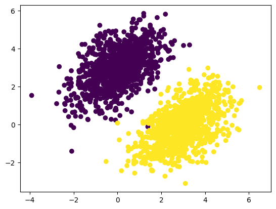
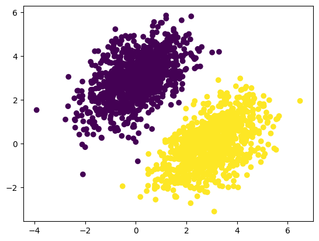
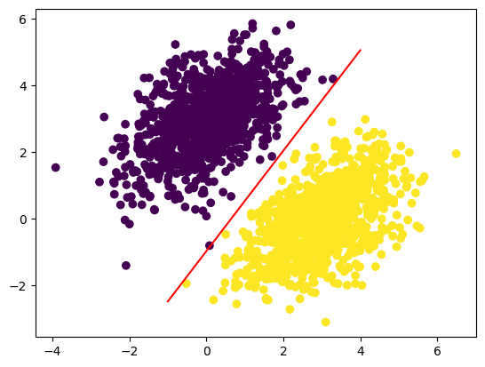

# 케라스 창시자에게 배우는 딥러닝
## 3장, *케라스와 텐서플로 소개*

## 3.1 텐서플로란?

텐서플로(Tensorflow)는 구글에서 만든 파이썬 기반의 무료 오픈 소스 머신 러닝 플랫폼이다. 수치 텐서에 대한 수학적 표현을 적용할 수 있도록 하는 것을 목적으로 한다. 다음과 같이 넘파이 이상의 기능을 제공한다.

- 미분 가능한 모든 표현식에 대해 자동으로 그레이디언트를 계산할 수 있다.
- CPU뿐만 아니라 고도로 병렬화된 하드웨어 가속기인 GPU와 TPU에서도 실행할 수 있다.
- 텐서플로에서 정의한 계산은 여러 머신에 쉽게 분산시킬 수 있다.
- 텐서플로 프로그램은 C++, 자바스크립트, 텐서플로 라이트 등과 같은 다른 런타임에 맞게 변환할 수 있다. 따라서 텐서플로 애플리케이션을 실전 환경에 쉽게 배포할 수 있다.


## 3.2 케라스란?

케라스는 텐서플로 위에 구축된 파이썬용 딥러닝 API로 어떤 종류의 딥러닝 모델도 쉽게 만들고 훈련할 수 있는 방법을 제공한다.

텐서플로를 통해 다양한 하드웨어(CPU, GPU, TPU 등)에서 실행하고 수천 대의 머신으로 매끄럽게 확장할 수 있다.


## 3.3 케라스와 텐서플로의 간략한 역사

생략


## 3.4 딥러닝 작업 환경 설정하기

생략


## 3.5 텐서플로 시작하기

신경망 훈련은 다음과 같은 개념을 중심으로 진행된다.

- 저수준 텐서 연산, 다음과 같은 텐서플로 API로 변환될 수 있다.
  - **텐서**(신경망의 상태를 저장하는 특별한 텐서인 **변수**도 포함)
  - 덧셈, relu, matmul과 같은 **텐서 연산**
  - 수학 표현식의 그레이디언트를 계산하는 방법인 **역전파**(텐서플로의 `GradientTape` 객체를 통해 처리됨)
- 고수준 딥러닝 개념, 다음과 같은 케라스 API로 변환될 수 있다.
  - **모델**을 구성하는 **층**
  - 학습에 사용하는 피드백 신호를 정의하는 **손실 함수**
  - 학습 진행 방법을 결정하는 **옵티마이저**
  - 정확도처럼 모델의 성능을 평가하는 **측정 지표**
  - 미니 배치 확률적 경사 하강법을 수행하는 **훈련 루프**

### 3.5.1 상수 텐서와 변수

텐서플로에서 어떤 작업을 하기 위해선 텐서가 필요하다. 텐서를 만들려면 초깃값이 필요하다. 예를 들어 모두 1이거나 0인 텐서, 또는 랜덤한 분포에서 뽑은 값으로 텐서를 만들 수 있다.

**코드 3-1. 모두 1 또는 0인 텐서**
```
import tensorflow as tf

x = tf.ones(shape=(2, 1))
print(x)

x = tf.zeros(shape=(2, 1))
print(x)
```

**코드 3-2. 랜덤 텐서**
```
import tensorflow as tf

# 정규 분포(normal distribution)
x = tf.random.normal(shape=(3, 1), mean=0., stddev=1.)
print(x)

# 균등 분포(uniform distribution)
x = tf.random.uniform(shape=(3, 1), minval=0., maxval=1.)
print(x)
```

넘파이 배열에는 값을 할당할 수 있지만 텐서플로 텐서는 상수이므로 값을 할당할 수 없다.

**코드 3-3. 넘파이 배열에 값 할당하기**
```
import numpy as np

x = np.ones(shape=(2, 2))
x[0, 0] = 0.
```

**코드 3-4. 텐서플로 텐서에 값을 할당하지 못함**
```
x = tf.ones(shape=(2, 2))
x[0, 0] = 0.
# TypeError: 'tensorflow.python.framework.ops.EagerTensor' object does not support item assignment
```

**변수**(`tf.Variable`)를 사용하면 텐서플로에서 수정 가능한 상태를 관리할 수 있다. 이를 통해 모델을 훈련 가능하다.

변수를 만들려면 랜덤 텐서와 같이 초기값을 제공해야 한다.

**코드 3-5. 텐서플로 변수 만들기**
```
v = tf.Variable(initial_value=tf.random.normal(shape=(3, 1)))
print(v)
```

변수의 상태는 `assign` 메소드로 수정할 수 있다.

**코드 3-6. 텐서플로 변수에 값 할당하기**
```
v.assign(tf.ones((3, 1)))
```

일부 원소에만 적용할 수도 있다.

**코드 3-7. 변수 일부에 값 할당하기**
```
v[0, 0].assign(3.)
```

`assign_add()`와 `assign_sub()`은 각각 `+=`, `-=`과 동일하다.

**코드 3-8. assign_add() 사용하기**
```
v.assign_add(tf.ones((3, 1)))
```

### 3.5.2 텐서 연산: 텐서플로에서 수학 계산하기

**코드 3-9. 기본적인 수학 연산**
```
a = tf.ones((2, 2))
b = tf.square(a)        # 제곱
c = tf.sqrt(a)          # 제곱근
d = b + c               # 두 텐서의 합(원소별 연산)
e = tf.matmul(a, b)     # 두 텐서의 점곱
e *= d                  # 두 텐서의 곱(원소별 연산)
```

중요한 점은 연산이 모두 바로 실행된다는 점이다. 이를 **즉시 실행**(eager execution) 모드라고 부른다.

### 3.5.3 GradientTape API 다시 살펴보기

미분 가능한 모든 표현에 대해 그레이디언트를 계산할 수 있다는 점이 텐서플로와 넘파이의 중요한 차이점이다.

**코드 3-10. GradientTape 사용하기**
```
input_var = tf.Variable(initial_value=3.)
with tf.GradientTape() as tape:
    result = tf.square(input_var)
gradient = tape.gradient(result, input_var)
```

`gradient = tape.gradient(loss, weights)`와 같은 표현식은 가중치에 대한 모델 손실의 그레이디언트를 계산하는 데 가장 널리 사용되는 방법이다.

지금까지 `tape.gradient()`의 입력 텐서가 텐서플로 변수인 경우만 살펴 보았다. 실제로 입력은 어떤 텐서라도 가능하다. 하지만 텐서플로는 기본적으로 훈련 가능한 변수만 추적한다. 상수 텐서의 경우 `tape.watch()`를 호출하여 추적한다는 것을 수동으로 알려주어야 한다.

**코드 3-11. 상수 텐서 입력과 함께 GradientTape 사용하기**
```
input_const = tf.constant(3.)
with tf.GradientTape() as tape:
    tape.watch(input_const)
    result = tf.square(input_const)
gradient = tape.gradient(result, input_const)
```

모든 텐서에 대한 모든 그레이디언트를 계산하기 위해 필요한 정보를 미리 저장하는 것은 비용이 너무 많이 들기 때문에 필요한 방법이다. 훈련 가능한 변수는 기본적으로 감시 대상이고, 이 외에 자원 낭비를 막기 위해 테이프는 감시할 대상을 알아야 한다.

그레이디언트 테이프를 사용해 이계도(second-order) 그레이디언트도 계산할 수 있다. 예를 들어 시간에 대한 물체 위치의 그레이디언트는 물체의 속도고, 이계도 그레이디언트는 가속도이다.

수직 방향으로 낙하하는 사과의 위치를 시간에 따라 측정하고 `position(time) = 4.9 * time ** 2`임을 알았을 때의 가속도를 측정하는 예제를 살펴본다.

**코드 3-12. 그레이디언트 테이프를 중첩하여 이계도 그레이디언트 계산하기**
```
time = tf.Variable(0.)
with tf.GradientTape() as outer_tape:
    with tf.GradientTape() as inner_tape:
        position = 4.9 * time ** 2
    speed = inner_tape.gradient(position, time)
acceleration = outer_tape.gradient(speed, time)
```

### 3.5.4 엔드-투-엔드 예제: 텐서플로 선형 분류기

먼저 선형적으로 잘 구분되는 합성 데이터를 만든다. 2D 평면의 포인트로 2개의 클래스를 가진다. 특정한 평균과 공분산 행렬(covariance matrix)을 가진 랜덤 분포에서 좌표 값을 추출한다.

공분산 행렬은 포인트 클라우드의 모양을 정하고, 평균은 포인트 클라우드의 위치를 정한다. 따라서 같은 공분산 행렬을 사용하고 평균값만 다르게 조정하여 두 개의 포인트 클라우드를 생성한다.

**코드 3-13. 2D 평면에 두 클래스의 랜덤한 포인트 생성하기**
```
num_samples_per_class = 1000
# 왼쪽 아래에서 오른쪽 위로 향하는 타원형의 포인트 클라우드에 첫 번째 클래스의 포인트 1,000개 생성
negative_samples = np.random.multivariate_normal(
    mean=[0, 3],
    cov=[[1, 0.5], [0.5, 1]],
    size=num_samples_per_class
)
# 동일한 공분산 행렬에 다른 평균을 사용하여 다른 클래스의 포인트 생성
positive_samples = np.random.multivariate_normal(
    mean=[3, 0],
    cov=[[1, 0.5], [0.5, 1]],
    size=num_samples_per_class
)
```

**코드 3-14. 두 클래스를 (2000, 2) 크기의 한 배열로 쌓기**
```
inputs = np.vstack((negative_samples, positive_samples)).astype(np.float32)
```

(2000, 1) 크기의 0 배열과 1 배열을 합쳐 타깃 레이블을 생성한다. `inputs[i]`가 클래스 0에 속하면 `targets[i, 0]`은 0이다.

**코드 3-15. 0과 1로 구성된 타깃 생성하기**
```
targets = np.vstack((np.zeros((num_samples_per_class, 1), dtype="float32"),
                     np.ones((num_samples_per_class, 1), dtype="float32")))
```

**코드 3-16. 두 클래스의 포인트를 그래프로 그리기**
```
import matplotlib.pyplot as plt

plt.scatter(inputs[:, 0], inputs[:, 1], c=targets[:, 0])
plt.show()
```



이제 두 포인트 클라우드를 구분할 수 있는 선형 분류기를 만든다. 선형 분류기는 하나의 아핀 변환(`prediction = W · input + b`)이며, 예측과 타깃 사이의 차이를 제곱한 값을 최소화하도록 훈련된다.

먼저 랜덤한 값과 0으로 초기화한 변수 `W`, `b`를 만든다.

**코드 3-17. 선형 분류기의 변수 만들기**
```
input_dim = 2
output_dim = 1

W = tf.Variable(initial_value=tf.random.uniform(shape=(input_dim, output_dim)))
b = tf.Variable(initial_value=tf.zeros(shape=(output_dim, )))
```

**코드 3-18. 정방향 패스 함수**
```
def model(inputs):
    return tf.matmul(inputs, W) + b
```

이 선형 분류기는 2D 입력을 다루기 때문에 W는 2개의 스칼라 가중치 w1, w2로 이루어진다. (`W = [[w1], [w2]]`) 반면 b는 하나의 스칼라 값이다. 따라서 어떤 입력 포인트 [x, y]가 주어지면 예측 값은 `prediction = [[w1], [w2]] · [x, y] + b = w1 * x + x2 * y + b`가 된다.

다음 코드는 손실 함수를 보여준다.

**코드 3-19. 평균 제곱 오차 손실 함수**
```
def square_loss(targets, predictions):
    per_sample_losses = tf.square(targets - predictions)
    return tf.reduce_mean(per_sample_losses)
```

다음은 훈련 스탭으로 훈련 데이터를 받아 손실을 최소화하도록 가중치 `W`, `b`를 업데이트한다.

**코드 3-20. 훈련 스탭 함수**
```
learning_rate = 0.1

def training_step(inputs, targets):
    # 정방향 패스
    with tf.GradientTape() as tape:
        predictions = model(inputs)
        loss = square_loss(targets, predictions)
    # 가중치에 대한 손실의 그레이디언트 계산
    grad_loss_wrt_W, grad_loss_wrt_b = tape.gradient(loss, [W, b])
    # 가중치 업데이트
    W.assign_sub(grad_loss_wrt_W * learning_rate)
    b.assign_sub(grad_loss_wrt_b * learning_rate)
    
    return loss
```

구현을 간단히 하기 위해 미니 배치 훈련 대신 한 번에 전체 데이터를 사용하는 배치 훈련을 사용한다. 이렇게 하면 결과적으로 미니 배치 훈련 때보다 일반적으로 큰 학습률을 사용할 수 있다.

**코드 3-21. 배치 훈련 루프**
```
for step in range(40):
    loss = training_step(inputs, targets)
    print(f"{step}번째 스텝의 손실: {loss:.4f}")
```

다음 코드는 이 선형 모델이 훈련 데이터 포인트를 어떻게 분류하는지 그린다.

```
predictions = model(inputs)
plt.scatter(inputs[:, 0], inputs[:, 1], c=predictions[:, 0] > 0.5)
plt.show()
```



포인트 [x, y]에 대한 예측 값은 `prediction == [[w1], [w2]] · [x, y] + b == w1 * x + w2 * y + b`이다. 따라서 클래스 0은 `w1 * x + w2 * y + b < 0.5`이고, 클래스 1은 `w1 * x + w2 * y + b > 0.5`으로 정의할 수 있다. 그리고 이것은 2D 평면 위의 직선의 방정식 `w1 * x + w2 * y + b = 0.5`이다. 이 직선보다 위에 있으면 클래스 1, 이 직선보다 아래에 있으면 클래스 0으로 분류된다. 이 직선을 그려보자.

```
import numpy as np

x = np.linspace(-1, 4, 1000)
y = - W[0] / W[1] * x + (0.5 - b) / W[1]
plt.plot(x, y, "-r")
plt.scatter(inputs[:, 0], inputs[:, 1], c=predictions[:, 0] > 0.5)
plt.show()
```



선형 분류기란 즉, 데이터에 있는 두 클래스를 잘 구분하는 직선(고차원 공간의 경우 초평면(hyperplane))의 파라미터를 찾는 것이다.


## 3.6 신경망의 구조: 핵심 Keras API 이해하기