# 케라스 창시자에게 배우는 딥러닝
## 4장, *신경망 시작하기: 분류와 회귀*

이 장에서는 다음과 같은 엔드-투-엔드 머신 러닝 워크플로(workflow)들을 통해 데이터 전처리, 모델 구조의 기본 원리, 모델 평가에 대해 알아본다.

- 영화 리뷰의 긍정/부정 분류(이진 분류)
- 신문 기사를 토픽별로 분류(다중 분류)
- 부동산 데이터를 바탕으로 주택 가격 예측(스칼라 회귀)

**분류와 회귀에서 사용하는 용어**
- **샘플** 또는 **입력**: 모델에 주입될 하나의 데이터 포인트(data point)
- **예측** 또는 **출력**: 모델로부터 나오는 값
- **타깃**: 정답, 외부 데이터 소스에 근거하여 모델이 완벽하게 예측해야 하는 값
- **예측 오차** 또는 **손실 값**: 모델의 예측과 타깃 사이의 거리를 측정한 값
- **클래스**: 분류 문제에서 선택할 수 있는 가능한 레이블의 집합
- **레이블**: 분류 문제에서 클래스 할당의 구체적인 사례
- **참 값**(ground-truth) 또는 **애너테이션**(annotation): 데이터셋에 대한 모든 타깃, 일반적으로 사람에 의해 수집되는 것
- **이진 분류**: 각 입력 샘플이 2개의 배타적인 범주로 구분되는 분류 작업
- **다중 분류**: 각 입력 샘플이 2개 이상의 범주로 구분되는 분류 작업
- **다중 레이블 분류**: 각 입력 샘플이 여러 개의 레이블에 할당될 수 있는 분류 작업, 예를 들어 하나의 그림에 고양이와 강아지가 동시에 있다면 이 그림은 고양이와 강아지 두 레이블이 동시 할당됨
- **스칼라 회귀**: 타깃이 연속적인 스칼라 값인 작업
- **벡터 회귀**: 타깃이 연속적인 값의 집합인 작업
- **미니 배치** 또는 **배치**: 모델에 의해 동시 처리되는 소량의 샘플 묶음(일반적으로 8개에서 128개 사이)


## 4.1 영화 리뷰 분류: 이진 분류 문제

이 예제에서는 2종 분류(two-class classification) 또는 이진 분류(binary classification)를 수행한다. 리뷰 텍스트를 기반으로 영화 리뷰를 긍정(positive)과 부정(negative)으로 분류하는 방법을 배울 것이다.

### 4.1.1 IMDB 데이터셋

인터넷 영화 데이터베이스(Internet Movie Database)에서 가져온 양극단의 리뷰 5만 개로 이루어진 IMDB 데이터셋을 사용한다.

이 데이터는 전처리가 되어 있어 텍스트가 사전상의 고유한 단어 번호들의 시퀀스로 대체되어 있다.

먼저 데이터셋을 로드한다.

**코드 4-1. IMDB 데이터셋 로드하기**
```
from tensorflow.keras.datasets import imdb

(train_data, train_labels), (test_data, test_labels) = imdb.load_data(num_words = 10000)
```

`num_words`를 설정함으로써 훈련 데이터에서 가장 자주 나타나는 단어 1만 개만 사용하겠다는 의미이다. 현재 훈련 데이터에는 8만 8,585개의 고유한 단어가 존재하기 때문에 이런 식으로 단어에 대한 적절한 크기의 벡터 데이터를 얻을 수 있다.

`train_data`, `test_data`는 리뷰를 담은 배열로 단어 인덱스의 리스트이다. `train_labels`, `test_labels`는 부정은 0, 긍정은 1로 나타낸 리스트이다.

다음은 리뷰 데이터를 원래의 데이터로 바꾸는 예이다.

**코드 4-2. 리뷰를 다시 텍스트로 디코딩하기**
```
word_index = imdb.get_word_index()
reverse_word_index = dict([(value, key) for (key, value) in word_index.items()])
decoded_review = " ".join([reverse_word_index.get(i - 3, "?") for i in train_data[0]])
```

0, 1, 2는 패딩, 문서 시작, 사전에 없음을 나타내기 위해 예약되어 있으므로 인덱스에서 3을 뺀다.

### 4.1.2 데이터 준비

현재의 입력 데이터는 숫자 리스트이지만 이를 바로 신경망에 주입할 수는 없다. 신경망은 일정한 크기의 입력 데이터를 기대하기 때문이다. 이러한 리스트를 텐서로 변환하는 데에는 두 가지 방법이 있다.

- 같은 길이가 되도록 리스트에 패딩(padding)을 추가하고 (samples, max_length) 크기의 정수 텐서로 변환한다. 그 다음 정수 텐서를 다룰 수 있는 층으로 신경망을 시작한다.
- 리스트를 멀티-핫 인코딩(multi-hot encoding)하여 0과 1의 벡터로 변환한다. 예를 들어 시퀀스 [8, 5]를 인덱스 8과 5의 위치만 1이고 나머지는 모두 0인 10,000차원의 벡터로 각각 변환한다. 그 다음 부동 소수점 벡터 데이터를 다룰 수 있는 Dense 층을 신경망의 첫 번째 층으로 사용한다.

여기서는 두 번째 방식을 사용하고, 직접 데이터를 멀티-핫 벡터로 만들어본다.

**코드 4-3. 정수 시퀀스를 멀티-핫 인코딩으로 인코딩하기**
```
import numpy as np

def vectorize_sequences(sequences, dimension=10000):
    # 크기가 (len(sequences), dimension)인 영행렬을 만든다
    results = np.zeros((len(sequences), dimension))
    for i, sequence in enumerate(sequences):
        for j in sequence:
            results[i, j] = 1.
    return results

x_train = vectorize_sequences(train_data)
x_test = vectorize_sequences(test_data)
```

레이블 또한 쉽게 벡터로 변환할 수 있다.

```
y_train = np.asarray(train_labels).astype("float32")
y_test = np.asarray(test_labels).astype("float32")
```

이제 신경망에 주입할 데이터가 준비되었다.

### 4.1.3 신경망 모델 만들기

입력 데이터는 벡터이고, 레이블은 0 또는 1의 값을 갖는 스칼라이다. 이런 간단한 문제에 가장 잘 작동하는 모델은 `relu` 활성화 함수를 사용한 `Dense` 연결 층을 단순히 쌓은 것이다.

`Dense` 층을 쌓을 때는 두 가지 중요한 구조상의 결정이 필요하다.

- 얼마나 많은 층을 사용할 것인가?
- 각 층에 얼마나 많은 유닛을 둘 것인가?

이러한 결정에 도움이 되는 일반적인 원리는 5장에서 다룬다. 지금은 다음과 같은 구조를 사용한다.

- 16개의 유닛을 가진 2개의 중간층
- 현재 리뷰의 감정을 스칼라 값의 예측으로 출력하는 세 번째 층

다음 코드는 이 신경망의 구현이다.

**코드 4-4. 모델 정의하기**
```
from tensorflow import keras
from tensorflow.keras import layers

model = keras.Sequential([
    layers.Dense(16, activation="relu"),
    layers.Dense(16, activation="relu"),
    layers.Dense(1, activation="sigmoid")
])
```

`Dense` 층에 전달한 첫 번째 매개변수는 층의 유닛(unit) 개수이며, 층이 가진 표현 공간(representation space)의 차원이다. `relu` 활성화 함수를 사용한 `Dense` 층은 `output = relu(dot(W, input) + b)`와 같은 텐서 연산을 연결하여 구현된다.

16개의 유닛이 있다는 것은 가중치 행렬 W의 크기가 (input_dimension, 16)이라는 의미이다. 그러므로 입력 데이터와 W를 점곱하면 입력 데이터가 16차원으로 표현된 공간으로 투영된 이후 편향 벡터 b를 더하고 relu 연산이 적용된다. 여기서 표현 공간의 차원은 모델이 내재된 표현을 학습할 때 가질 수 있는 자유도로 이해할 수 있다. 유닛을 늘리면 모델이 더욱 복잡한 표현을 학습할 수 있지만, 계산 비용이 커지고 원치 않는 패턴을 학습할 수도 있다.

중간층은 활성화 함수로 `relu`를 사용하고 마지막 층은 확률을 출력하기 위해 `sigmoid` 활성화 함수를 사용한다. `relu`는 음수를 0으로 만드는 함수이고, `sigmoid`는 임의의 값을 [0, 1] 사이로 압축하므로 출력 값을 확률처럼 해석할 수 있는 함수이다.

`relu`와 같은 활성화 함수(또는 **비선형성**(non-linearity))가 없다면 `Dense` 층은 선형적인 연산으로만 구성된다. 그러므로 층이 아무리 연결되어도 결국 입력에 대해 **선형 변환**(아핀 변환)만 학습할 수 있고, 층을 아무리 쌓아도 하나의 선형 연산이 되므로 층을 쌓는 것에 의미가 없게 만든다.

가설 공간을 풍부하게 만들어 층을 깊게 만드는 것에 대한 장점을 살리기 위해서는 비선형성 또는 활성화 함수를 추가해야 한다.

마지막으로 손실 함수와 옵티마이저를 선택한다. 이진 분류 문제이고 모델의 출력이 확률이기 때문에 `binary_crossentropy` 손실 함수가 적합하다. 이 함수 외에도 `mean_squared_error`도 사용할 수 있다. 확률을 출력하는 모델을 사용할 때는 크로스엔트로피가 최선의 선택이다. **크로스엔트로피**(crossentropy)는 정보 이론(information theory) 분야에서 온 개념으로 확률 분포 간의 차이를 측정한다. 여기에서는 원본 분포와 예측 분포 간의 차이를 측정한다.

옵티마이저는 `rmsprop`을 사용한다. 이 옵티마이저는 일반적으로 거의 모든 문제에 대한 기본적인 선택으로 적합하다.

**코드 4-5. 모델 컴파일하기**
```
model.compile(optimizer="rmsprop",
              loss="binary_crossentropy",
              metrics=["accuracy"])
```

### 4.1.4 훈련 검증

검증 세트를 사용하여 훈련 과정 중 모델의 정확도를 모니터링하는 것은 표준적인 관행이다. 따라서 원본 훈련 데이터에서 1만 개의 샘플을 추출하여 검증 데이터를 구성한다.

**코드 4-6. 검증 세트 준비하기**
```
x_val = x_train[:10000]
partial_x_train = x_train[10000:]
y_val = y_train[:10000]
partial_y_train = y_train[10000:]
```

이제 512개의 샘플로 미니 배치를 구성하여 20번의 에포크 동안 모델을 훈련시킨다.

**코드 4-7. 모델 훈련하기**
```
history = model.fit(partial_x_train,
          partial_y_train,
          epochs=20,
          batch_size=512,
          validation_data=(x_val, y_val))
```

`fit()` 메소드가 반환하는 `History` 객체에는 훈련하는 동안 발생한 모든 정보를 담고 있는 딕셔너리인 `history` 속성이 존재한다. 맷플롯립을 사용하여 훈련과 검증 데이터에 대한 손실과 정확도를 그린다.

**코드 4-8. 훈련과 검증 손실 그리기**
```
import matplotlib.pyplot as plt

history_dict = history.history
loss_values= history_dict["loss"]
val_loss_values = history_dict["val_loss"]
epochs = range(1, len(loss_values) + 1)

plt.plot(epochs, loss_values, "bo", label="Training loss")
plt.plot(epochs, val_loss_values, "b", label="Validation loss")
plt.title("Training and validation loss")
plt.xlabel("Epochs")
plt.ylabel("Loss")
plt.legend()
plt.show()
```

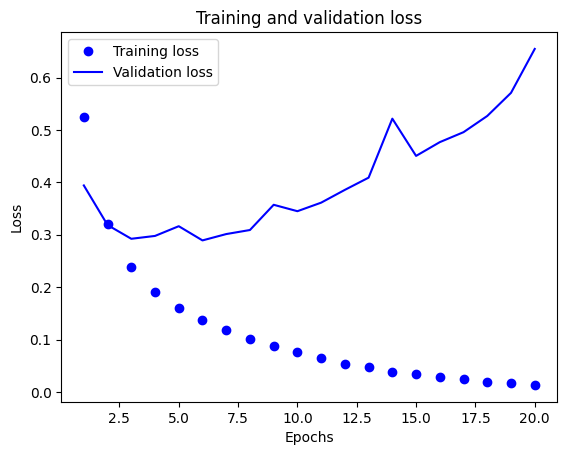

**코드 4-9. 훈련과 검증 정확도 그리기**
```
import matplotlib.pyplot as plt

plt.clf()
acc = history_dict["accuracy"]
val_acc = history_dict["val_accuracy"]

plt.plot(epochs, acc, "bo", label="Training acc")
plt.plot(epochs, val_acc, "b", label="Validation acc")
plt.title("Training and validation accuracy")
plt.xlabel("Epochs")
plt.ylabel("Accuracy")
plt.legend()
plt.show()
```

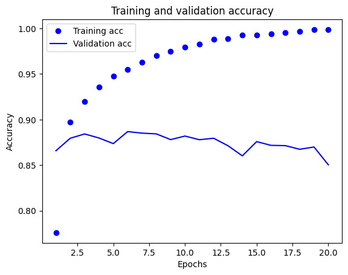

시각적으로 확인할 수 있듯이 훈련 손실은 에포크마다 감소하고 훈련 정확도는 에포크마다 증가한다. 이는 경사 하강법 최적화를 사용한 효과이다. 그러나 검증 손실과 정확도는 이와 같지 않고 특정 지점에서 추세가 반전된다. 이를 **과대적합**(overfitting)되었다고 말한다.

과대적합을 방지하기 위해 그래프상에서 추세가 확실히 반전되기 시작하는 6번째 에포크까지만 학습하도록 다시 한번 모델을 훈련시킨다.

**코드 4-10. 모델을 처음부터 다시 훈련하기**
```
model = keras.Sequential([
    layers.Dense(16, activation="relu"),
    layers.Dense(16, activation="relu"),
    layers.Dense(1, activation="sigmoid")
])

model.compile(optimizer="rmsprop",
              loss="binary_crossentropy",
              metrics=["accuracy"])

model.fit(x_train, y_train, epochs=6, batch_size=512)

results = model.evaluate(x_test, y_test)
```

`results`는 [0.3214523196220398, 0.8750399947166443]으로 테스트 손실이 0.32, 테스트 정확도가 0.87이다. 아주 단순한 방식으로도 87%의 정확도를 달성한 것이다.

### 4.1.5 훈련된 모델로 새로운 데이터에 대해 예측하기

`predict` 메소드를 사용하여 새로운 리뷰 데이터에 대한 확률을 예측할 수 있다.

```
>>> model.predict(x_test)
array([[0.10042857],
       [0.9999626 ],
       [0.56381375],
       ...,
       [0.04830426],
       [0.03912807],
       [0.53730667]], dtype=float32)
```

모델이 샘플에 대해 예측한 확률이 0 또는 1에 가까울수록 이 모델이 확신을 갖고 있다고 말할 수 있고, 0.5에 가까울수록 확신을 갖고 있지 않다고 말할 수 있다.

### 4.1.6 추가 실험

이 실험에서 사용할 코드의 기본 템플릿은 다음과 같다.

```
# 모델 훈련
from tensorflow import keras
from tensorflow.keras import layers

model = keras.Sequential([
    layers.Dense(16, activation="relu"),
    layers.Dense(16, activation="relu"),
    layers.Dense(1, activation="sigmoid")
])

model.compile(optimizer="rmsprop",
              loss="binary_crossentropy",
              metrics=["accuracy"])

x_val = x_train[:10000]
partial_x_train = x_train[10000:]
y_val = y_train[:10000]
partial_y_train = y_train[10000:]

history = model.fit(partial_x_train,
          partial_y_train,
          epochs=20,
          batch_size=512,
          validation_data=(x_val, y_val))

# 훈련과 검증 손실
import matplotlib.pyplot as plt

history_dict = history.history
loss_values= history_dict["loss"]
val_loss_values = history_dict["val_loss"]
epochs = range(1, len(loss_values) + 1)

plt.plot(epochs, loss_values, "bo", label="Training loss")
plt.plot(epochs, val_loss_values, "b", label="Validation loss")
plt.title("Training and validation loss")
plt.xlabel("Epochs")
plt.ylabel("Loss")
plt.legend()
plt.show()

# 훈련과 검증 정확도
import matplotlib.pyplot as plt

plt.clf()
acc = history_dict["accuracy"]
val_acc = history_dict["val_accuracy"]

plt.plot(epochs, acc, "bo", label="Training acc")
plt.plot(epochs, val_acc, "b", label="Validation acc")
plt.title("Training and validation accuracy")
plt.xlabel("Epochs")
plt.ylabel("Accuracy")
plt.legend()
plt.show()

# 모델 재훈련 및 테스트 데이터 평가
from tensorflow import keras
from tensorflow.keras import layers

model = keras.Sequential([
    layers.Dense(16, activation="relu"),
    layers.Dense(16, activation="relu"),
    layers.Dense(1, activation="sigmoid")
])

model.compile(optimizer="rmsprop",
              loss="binary_crossentropy",
              metrics=["accuracy"])

model.fit(x_train,
          y_train,
          epochs=20,
          batch_size=512)

model.evaluate(x_test, y_test)
```

- **1개 또는 3개의 표현 층을 사용하고 검증과 테스트 정확도에 어떤 영향을 미치는지 확인하라.**

먼저 표현 층이 1개인 경우의 검증 손실, 검증 정확도 및 테스트 데이터에 대한 결과이다.

```
model = keras.Sequential([
    layers.Dense(16, activation="relu"),
    layers.Dense(1, activation="sigmoid")
])
```

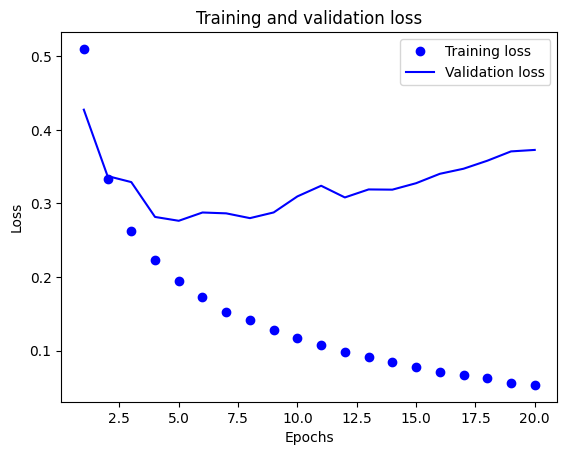

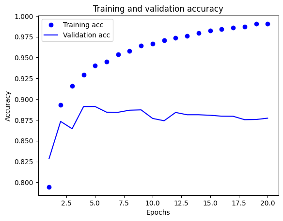

적합한 에포크 횟수는 5회로 확인된다. 모델을 재훈련하여 테스트 데이터에 대해 평가한다.

```
# 모델 재훈련 및 테스트 데이터 평가
from tensorflow import keras
from tensorflow.keras import layers

model = keras.Sequential([
    layers.Dense(16, activation="relu"),
    layers.Dense(1, activation="sigmoid")
])

model.compile(optimizer="rmsprop",
              loss="binary_crossentropy",
              metrics=["accuracy"])

model.fit(x_train,
          y_train,
          epochs=5,
          batch_size=512)

model.evaluate(x_test, y_test)
```

결과는 [0.2805018126964569, 0.8864399790763855]으로 표현 층이 2개일 때보다 손실이 낮고 정확도가 높게 관찰된다.

다음으로는 표현 층을 3개 사용한다.

```
model = keras.Sequential([
    layers.Dense(16, activation="relu"),
    layers.Dense(16, activation="relu"),
    layers.Dense(16, activation="relu"),
    layers.Dense(1, activation="sigmoid")
])
```

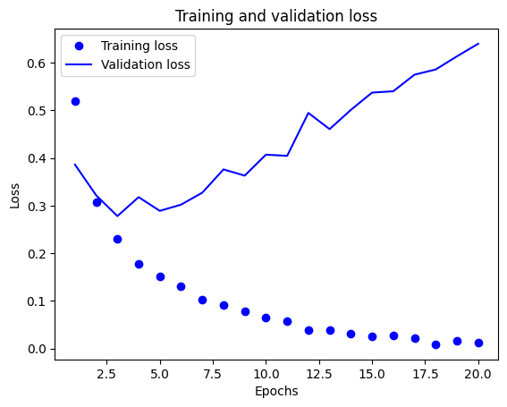

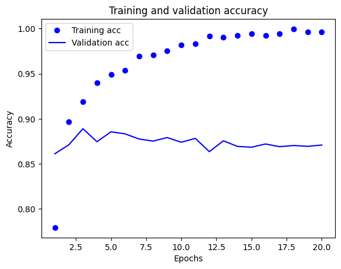

적합한 에포크 횟수는 3회로 확인된다. 모델을 재훈련하여 테스트 데이터를 평가한다.

```
# 모델 재훈련 및 테스트 데이터 평가
from tensorflow import keras
from tensorflow.keras import layers

model = keras.Sequential([
    layers.Dense(16, activation="relu"),
    layers.Dense(16, activation="relu"),
    layers.Dense(16, activation="relu"),
    layers.Dense(1, activation="sigmoid")
])

model.compile(optimizer="rmsprop",
              loss="binary_crossentropy",
              metrics=["accuracy"])

model.fit(x_train,
          y_train,
          epochs=3,
          batch_size=512)

model.evaluate(x_test, y_test)
```

결과는 [0.28462278842926025, 0.8853999972343445]으로 표현 층을 두 개 사용했을 때보다 낮은 손실, 높은 정확도를 보인다.

- **8개, 32개, 64개 등 층의 유닛을 추가하거나 줄여보아라.**

모델의 구조는 예제와 동일하게 하면서 층의 유닛 개수만 달리 설정하고 검증 손실, 검증 정확도 및 재훈련 이후 테스트 데이터에 대한 평가 결과를 실험해 보겠다.

먼저 유닛 개수를 8개로 설정했을 때의 결과이다.

```
model = keras.Sequential([
    layers.Dense(8, activation="relu"),
    layers.Dense(8, activation="relu"),
    layers.Dense(1, activation="sigmoid")
])
```

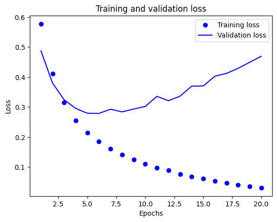

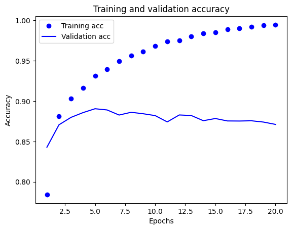

적합한 에포크 횟수는 5회로 확인된다. 모델을 재훈련한 후 테스트 데이터에 대해 평가한다.

```
# 모델 재훈련 및 테스트 데이터 평가
from tensorflow import keras
from tensorflow.keras import layers

model = keras.Sequential([
    layers.Dense(8, activation="relu"),
    layers.Dense(8, activation="relu"),
    layers.Dense(1, activation="sigmoid")
])

model.compile(optimizer="rmsprop",
              loss="binary_crossentropy",
              metrics=["accuracy"])

model.fit(x_train,
          y_train,
          epochs=5,
          batch_size=512)

model.evaluate(x_test, y_test)
```

결과는 [0.285649836063385, 0.8864799737930298]으로 예제 모델에 비해 낮은 손실, 높은 정확도를 보인다.

다음으로는 중간 층의 유닛 개수를 32개로 설정해 보겠다.

```
model = keras.Sequential([
    layers.Dense(32, activation="relu"),
    layers.Dense(32, activation="relu"),
    layers.Dense(1, activation="sigmoid")
])
```

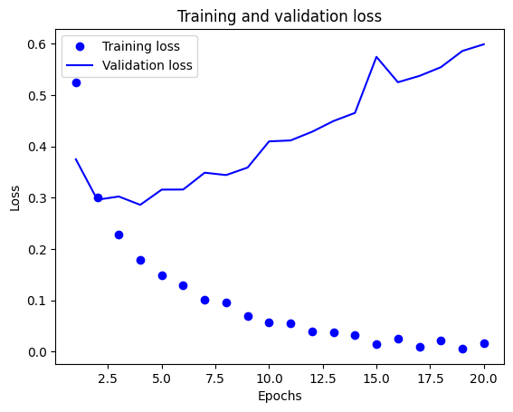

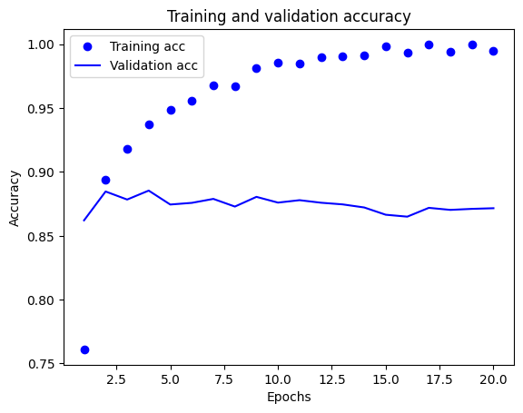

적절한 에포크 횟수는 4회로 확인된다. 재훈련하고 테스트 데이터를 평가한다.

```
# 모델 재훈련 및 테스트 데이터 평가
from tensorflow import keras
from tensorflow.keras import layers

model = keras.Sequential([
    layers.Dense(32, activation="relu"),
    layers.Dense(32, activation="relu"),
    layers.Dense(1, activation="sigmoid")
])

model.compile(optimizer="rmsprop",
              loss="binary_crossentropy",
              metrics=["accuracy"])

model.fit(x_train,
          y_train,
          epochs=4,
          batch_size=512)

model.evaluate(x_test, y_test)
```

결과는 [0.2999429404735565, 0.8820400238037109]으로 예제 모델에 비해 낮은 손실, 높은 정확도를 보인다.

마지막으로 중간 층의 유닛 개수를 64개로 설정했을 때의 결과이다.

```
model = keras.Sequential([
    layers.Dense(64, activation="relu"),
    layers.Dense(64, activation="relu"),
    layers.Dense(1, activation="sigmoid")
])
```

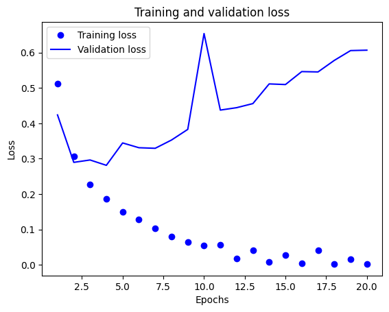

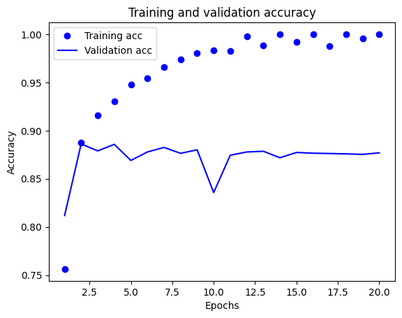

적절한 에포크 횟수는 4회로 확인된다. 모델을 재훈련하고 테스트 데이터를 평가해 보겠다.

```
# 모델 재훈련 및 테스트 데이터 평가
from tensorflow import keras
from tensorflow.keras import layers

model = keras.Sequential([
    layers.Dense(64, activation="relu"),
    layers.Dense(64, activation="relu"),
    layers.Dense(1, activation="sigmoid")
])

model.compile(optimizer="rmsprop",
              loss="binary_crossentropy",
              metrics=["accuracy"])

model.fit(x_train,
          y_train,
          epochs=4,
          batch_size=512)

model.evaluate(x_test, y_test)
```

결과는 [0.29299813508987427, 0.8826799988746643]으로 예제 모델에 비해 낮은 손실, 높은 정확도를 보인다.

모든 조건에서 예제 모델에 비해 나은 결과를 보이고 있다.

- **binary_crossentropy 대신 mse 손실 함수를 사용해 보아라.**

모델의 구조는 예제와 동일하게 하면서 검증 손실, 검증 정확도 및 재훈련 이후 테스트 데이터에 대한 결과를 실험해 보겠다.

```
model.compile(optimizer="rmsprop",
              loss="mean_squared_error",
              metrics=["accuracy"])
```

컴파일 시 손실 함수를 `mean_squared_error`로 변경한다.

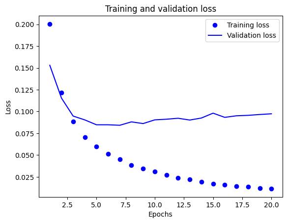

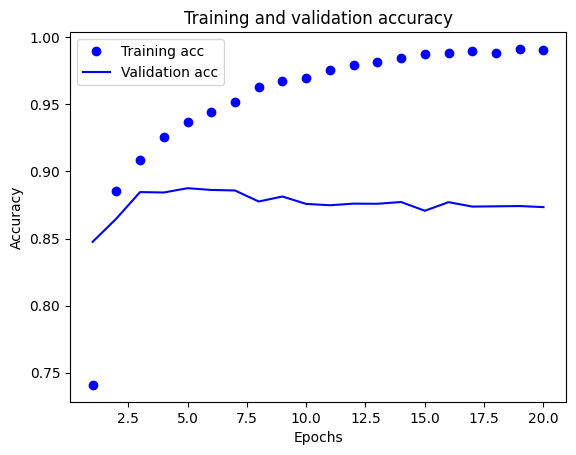

적절한 에포크 횟수는 5회로 확인된다. 모델을 재훈련하고 테스트 데이터를 평가한다.

```
# 모델 재훈련 및 테스트 데이터 평가
from tensorflow import keras
from tensorflow.keras import layers

model = keras.Sequential([
    layers.Dense(16, activation="relu"),
    layers.Dense(16, activation="relu"),
    layers.Dense(1, activation="sigmoid")
])

model.compile(optimizer="rmsprop",
              loss="mean_squared_error",
              metrics=["accuracy"])

model.fit(x_train,
          y_train,
          epochs=5,
          batch_size=512)

model.evaluate(x_test, y_test)
```

결과는 [0.08376169949769974, 0.8877599835395813]으로 예제 모델에 비해 높은 정확도를 보인다. mse도 손실 함수로 선택하기에 좋은 선택임을 확인할 수 있다.

- **relu 대신 tanh 활성화 함수를 사용해 보아라.**

모델의 구조는 예제와 동일하게 하면서 검증 손실, 검증 정확도 및 재훈련 이후 테스트 데이터에 대한 결과를 실험해 보겠다.

```
model = keras.Sequential([
    layers.Dense(16, activation="tanh"),
    layers.Dense(16, activation="tanh"),
    layers.Dense(1, activation="sigmoid")
])
```

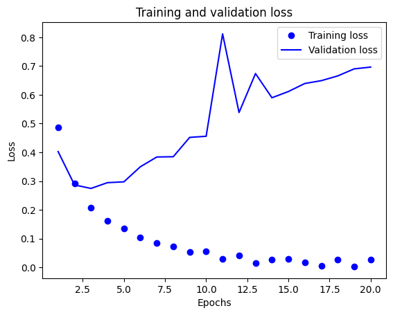

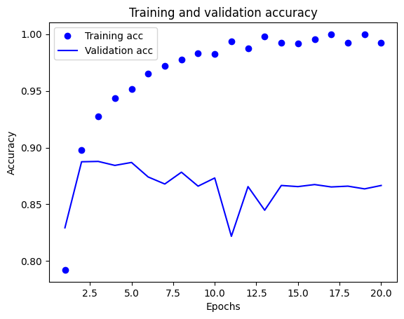

적절한 에포크 횟수는 3회로 판단된다. 모델을 재훈련하고 테스트 데이터를 평가한다.

```
# 모델 재훈련 및 테스트 데이터 평가
from tensorflow import keras
from tensorflow.keras import layers

model = keras.Sequential([
    layers.Dense(16, activation="tanh"),
    layers.Dense(16, activation="tanh"),
    layers.Dense(1, activation="sigmoid")
])

model.compile(optimizer="rmsprop",
              loss="binary_crossentropy",
              metrics=["accuracy"])

model.fit(x_train,
          y_train,
          epochs=3,
          batch_size=512)

model.evaluate(x_test, y_test)
```

결과는 [0.30655667185783386, 0.8754799962043762]으로 예제 모델보다 낮은 손실, 높은 정확도를 보인다.

모든 실험에서 예제 모델보다 나은 결과가 관찰되었다.

### 4.1.7 정리

- 원본 데이터를 신경망에 텐서로 주입하기 위해서는 꽤 많은 전처리가 필요하다. 단어 시퀀스는 이진 벡터로 인코딩될 수 있지만 다른 인코딩 방식도 존재한다.
- 출력 클래스가 2개인 이진 분류에서 모델은 하나의 유닛과 sigmoid 활성화 함수를 가진 Dense 층으로 끝나야 한다. 이 모델의 출력은 확률을 나타내는 0과 1 사이의 스칼라 값이다.
- 이진 분류 문제에서 이런 스칼라 시그모이드 출력에 대해 사용할 손실 함수는 binary_crossentropy이다.
- rmsprop 옵티마이저는 문제에 상관없이 일반적으로 충분히 좋은 선택이다.
- 훈련 데이터에 대해 성능이 향상됨에 따라 신경망은 과대적합되기 시작하고 이전에 본 적 없는 새로운 데이터에서는 결과가 점점 나빠지게 된다. 항상 훈련 세트 이외의 데이터에서의 성능을 모니터링해야 한다.


## 4.2 뉴스 기사 분류: 다중 분류 문제

이 절에서는 로이터 뉴스를 46개의 상호 배타적인 토픽으로 분류하는 신경망을 만든다. 클래스가 많기 때문에 이 문제는 **다중 분류**(multiclass classification)의 예이다. 그리고 각 데이터 포인트가 여러 개의 클래스에 속하지 않고 정확히 하나의 범주로 분류되기 때문에 정확히 **단일 레이블 다중 분류**(single-label, multiclass classification) 문제이다. 반대로 각 데이터 포인트가 여러 개의 클래스에 속할 수 있으면 그것은 **다중 레이블 다중 분류**(multi-label, multiclass classification) 문제가 된다.

### 4.2.1 로이터 데이터셋

**코드 4-11. 로이터 데이터셋 로드하기**
```
from tensorflow.keras.datasets import reuters

(train_data, train_labels), (test_data, test_labels) = reuters.load_data(num_words=10000)
```

자주 등장하는 10,000개의 단어만으로 데이터를 제한한다.

이 데이터셋은 8,982개의 훈련 샘플과 2,246개의 테스트 샘플이 있으며, 각 샘플은 정수 리스트이다.

다음은 이 데이터를 단어로 디코딩하는 방법이다.

**코드 4-12. 로이터 데이터셋을 텍스트로 디코딩하기**
```
word_index = reuters.get_word_index()
reverse_word_index = dict([(value, key) for (key, value) in word_index.items()])
decoded_newswire = " ".join([reverse_word_index.get(i - 3, "?") for i in train_data[0]])

print(decoded_newswire)
```

### 4.2.2 데이터 준비

이전의 예제와 동일한 코드를 사용해 데이터를 벡터로 변환한다.

**코드 4-13. 데이터 인코딩하기**
```
x_train = vectorize_sequences(train_data)
x_test = vectorize_sequences(test_data)
```

레이블을 벡터로 변환하는 방법은 두 가지이다. 첫 번째는 레이블의 리스트를 정수 텐서로 변환하는 것이고, 두 번째는 **원-핫 인코딩**(one-hot encoding)을 사용하는 것이다. 원-핫 인코딩은 범주형 데이터에 널리 사용되기 때문에 **범주형 인코딩**(categorical encoding)이라고도 부른다. 이 경우 레이블의 원-핫 인코딩은 각 레이블의 인덱스 자리가 1이고 나머지가 모두 0인 벡터이다.

**코드 4-14. 레이블 인코딩하기**
```
def to_one_hot(labels, dimension=46):
    results = np.zeros((len(labels), dimension))
    for i, label in enumerate(labels):
        results[i, label] = 1.
    return results

y_train = to_one_hot(train_labels)
y_test = to_one_hot(test_labels)
```

케라스에는 이를 위한 내장 함수가 있다. 위의 코드와 다음의 코드는 같은 동작을 한다.

```
from tensorflow.keras.utils import to_categorical

y_train = to_categorical(train_labels)
y_test = to_categorical(test_labels)
```

### 4.2.3 모델 구성

이전 예제와 비슷하지만 출력 클래스의 개수가 2개에서 46개로 늘어남에 따라 출력 공간의 차원이 훨씬 커졌다.

이전 예제의 모델과 같이 16개의 유닛을 가진 `Dense` 층을 쌓는 것은 정보의 병목(information bottleneck)을 발생시킬 수 있다. 한 층이 분류 문제에 필요한 정보를 일부 누락하면 다음 층에서 복원할 방법이 없어지는 것이다.

그러므로 이번 예제에서는 46개의 클래스를 분류하기 위해 64개의 유닛을 가진 조금 더 큰 층을 사용한다.

**코드 4-15. 모델 정의하기**
```
from tensorflow import keras
from tensorflow.keras import layers

model = keras.Sequential([
    layers.Dense(64, activation="relu"),
    layers.Dense(64, activation="relu"),
    layers.Dense(46, activation="softmax")
])
```

이 구조에서 주목해야 할 점은 두 가지가 있다.

- 마지막 `Dense` 층의 유닛이 46개이다. 각 입력 샘플에 대해 46차원의 벡터를 출력한다는 의미이다. 이 벡터의 각 원소(차원)는 각기 다른 출력 클래스가 인코딩된 것이다.
- 마지막 층의 활성화 함수가 `softmax`이다. 각 입력 샘플마다 46개의 출력 클래스에 대한 확률 분포를 출력한다. 즉, 46차원의 출력 벡터를 만들며 `output[i]`는 어떤 샘플이 클래스 i에 속할 확률을 의미한다. 46개의 값을 모두 더하면 1이 된다.

이런 문제에 사용할 수 있는 최선의 함수는 `categorical_crossentropy`이다. 이 함수는 두 확률 분포 사이의 거리를 측정한다. 이 문제에서는 모델이 출력한 확률 분포와 실제 레이블의 분포 간의 거리이다. 두 분포 사이의 거리를 최소화함으로써 실제 레이블에 가능한 가까운 출력을 내도록 모델을 훈련한다.

**코드 4-16. 모델 컴파일하기**
```
model.compile(optimizer="rmsprop",
              loss="categorical_crossentropy",
              metrics=["accuracy"])
```

### 4.2.4 훈련 검증

훈련 데이터에서 1,000개의 샘플을 추출하여 검증 세트로 사용한다.

**코드 4-17. 검증 세트 준비하기**
```
x_val = x_train[:1000]
partial_x_train = x_train[1000:]
y_val = y_train[:1000]
partial_y_train = y_train[1000:]
```

이제 20번의 에포크로 모델을 훈련시킨다.

**코드 4-18. 모델 훈련하기**
```
model.fit(partial_x_train,
          partial_y_train,
          epochs=20,
          batch_size=512,
          validation_data=(x_val, y_val))
```

마지막으로 손실과 정확도 곡선을 그린다.

**코드 4-19. 훈련과 검증 손실 그리기**
```
import matplotlib.pyplot as plt

loss = history.history["loss"]
val_loss = history.history["val_loss"]
epochs = range(1, len(loss) + 1)

plt.plot(epochs, loss, "bo", label="Training loss")
plt.plot(epochs, val_loss, "b", label="Validation loss")
plt.title("Training and validation loss")
plt.xlabel("Epochs")
plt.ylabel("Loss")
plt.legend()
plt.show()
```


**코드 4-20. 훈련과 검증 정확도 그리기**
```
import matplotlib.pyplot as plt

acc = history.history["accuracy"]
val_acc = history.history["val_accuracy"]
epochs = range(1, len(acc) + 1)

plt.plot(epochs, acc, "bo", label="Training accuracy")
plt.plot(epochs, val_acc, "b", label="Validation accuracy")
plt.title("Training and validation accuracy")
plt.xlabel("Epochs")
plt.ylabel("Accuracy")
plt.legend()
plt.show()
```

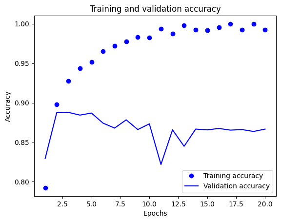

그래프에 의하면 이 모델은 세 번째 에포크 이후 과대적합이 시작되는 것으로 확인된다. 세 번의 에포크로 새로운 모델을 훈련하고 테스트 세트에서 평가한다.

**코드 4-21. 모델을 처음부터 다시 훈련하기**
```
from tensorflow import keras
from tensorflow.keras import layers

model = keras.Sequential([
    layers.Dense(64, activation="relu"),
    layers.Dense(64, activation="relu"),
    layers.Dense(46, activation="softmax")
])

model.compile(optimizer="rmsprop",
              loss="categorical_crossentropy",
              metrics=["accuracy"])

model.fit(x_train,
          y_train,
          epochs=3,
          batch_size=512)

results = model.evaluate(x_test, y_test)

print(results)
```

최종 결과는 [1.1990054845809937, 0.7279608249664307]으로 약 73%의 정확도를 달성했다. 랜덤한 분류기를 사용했을 때엔 얼마 정도의 정확도가 나오는지 테스트해보자.

```
import copy
test_labels_copy = copy.copy(test_labels)
np.random.shuffle(test_labels_copy)
hits_array = np.array(test_labels) == np.array(test_labels_copy)

print(hits_array.mean())
```

결과는 0.1834372217275156으로 약 18%의 정확도를 보인다. 따라서 앞서 확인한 모델의 결과가 꽤 좋은 것이라고 생각할 수 있다.

### 4.2.5 새로운 데이터에 대해 예측하기

새로운 샘플로 모델의 `predict` 메소드를 호출하면 각 샘플에 대해 46개의 토픽에 대한 클래스 확률 분포를 반환한다.

```
predictions = model.predict(x_test)
```

`predictions`의 각 항목은 길이가 46인 벡터이다.

```
>>> predictions[0].shape
(46,)
```

이 벡터는 확률 분포를 나타내기 때문에 원소를 모두 더하면 1이 된다.

```
>>> np.sum(predictions[0])
0.99999994
```

정확히 1이 되지 않는 이유는 컴퓨터의 부동 소수점 표시 규칙에 의한 것이다.

가장 큰 값의 인덱스가 예측 클래스가 된다.

```
>>> np.argmax(predictions[0])
3
```

### 4.2.6 레이블과 손실을 다루는 다른 방법

레이블은 다음과 같이 정수 텐서로 변환함으로써 인코딩될 수도 있다.

```
y_train = np.array(train_labels)
y_test = np.array(test_labels)
```

이 방식을 사용하기 위해서는 손실 함수 하나만 바꾸면 된다. `categorical_crossentropy`는 레이블이 범주형 인코딩되어 있을 것이라고 기대한다. 정수 레이블을 사용할 때는 `sparse_categorical_crossentropy`를 사용해야 한다.

```
model.compile(optimizer="rmsprop",
              loss="sparse_categorical_crossentropy",
              metrics=["accuracy"])
```

이 손실 함수는 인터페이스만 다르고, 수학적으로는 `categorical_crossentropy`와 동일하다.

### 4.2.7 충분히 큰 중간층을 두어야 하는 이유

마지막 출력이 46차원이기 때문에 중간층의 중간 유닛은 46개보다 많이 적어서는 안 된다. 46차원보다 훨씬 작은 중간층을 두었을 때의 정보의 병목을 확인해보자.

**코드 4-22. 정보 병목이 있는 모델**
```
model = keras.Sequential([
    layers.Dense(64, activation="relu"),
    layers.Dense(4, activation="relu"),
    layers.Dense(46, activation="softmax")
])

model.compile(optimizer="rmsprop",
              loss="categorical_crossentropy",
              metrics=["accuracy"])

history = model.fit(partial_x_train,
          partial_y_train,
          epochs=20,
          batch_size=128,
          validation_data=(x_val, y_val))
```

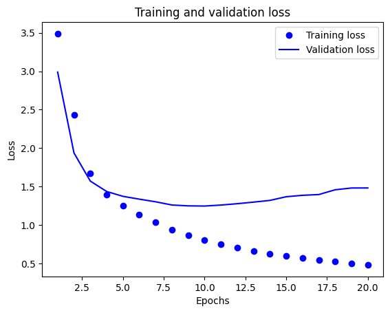

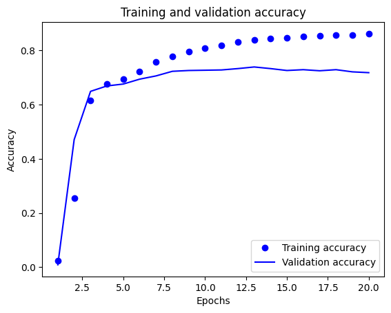

손실과 정확도가 이전에 정의한 모델에 비해 훨씬 안 좋음을 확인할 수 있다. 이러한 손실의 대부분은 많은 정보, 즉 클래스 46개의 분할 초평면을 복원하기에 충분한 정보를 중간층의 저차원 표현 공간으로 압축한 데에서 기인한다.

### 4.2.8 추가 실험

이 실험에서는 다음과 같은 코드 템플릿을 사용한다.

```
# 모델 훈련
from tensorflow import keras
from tensorflow.keras import layers

model = keras.Sequential([
    layers.Dense(64, activation="relu"),
    layers.Dense(64, activation="relu"),
    layers.Dense(46, activation="softmax")
])

model.compile(optimizer="rmsprop",
              loss="categorical_crossentropy",
              metrics=["accuracy"])

history = model.fit(partial_x_train,
                    partial_y_train,
                    epochs=20,
                    batch_size=512,
                    validation_data=(x_val, y_val))

# 훈련과 검증 손실
import matplotlib.pyplot as plt

loss = history.history["loss"]
val_loss = history.history["val_loss"]
epochs = range(1, len(loss) + 1)

plt.plot(epochs, loss, "bo", label="Training loss")
plt.plot(epochs, val_loss, "b", label="Validation loss")
plt.title("Training and validation loss")
plt.xlabel("Epochs")
plt.ylabel("Loss")
plt.legend()
plt.show()

# 훈련과 검증 정확도
import matplotlib.pyplot as plt

acc = history.history["accuracy"]
val_acc = history.history["val_accuracy"]
epochs = range(1, len(acc) + 1)

plt.plot(epochs, acc, "bo", label="Training accuracy")
plt.plot(epochs, val_acc, "b", label="Validation accuracy")
plt.title("Training and validation accuracy")
plt.xlabel("Epochs")
plt.ylabel("Accuracy")
plt.legend()
plt.show()

# 모델 재훈련 및 테스트 데이터 평가
model = keras.Sequential([
    layers.Dense(64, activation="relu"),
    layers.Dense(64, activation="relu"),
    layers.Dense(46, activation="softmax")
])

model.compile(optimizer="rmsprop",
              loss="categorical_crossentropy",
              metrics=["accuracy"])

model.fit(x_train,
          y_train,
          epochs=20,
          batch_size=512)

model.evaluate(x_test, y_test)
```

- **32개의 유닛, 128개의 유닛 등 더 크거나 작은 층을 사용해 보아라.**

기본적인 모델의 구조는 예제와 동일하게 하면서 검증 손실, 검증 정확도 및 재훈련 이후 테스트 데이터에 대한 평가를 측정해 보겠다.

먼저 32개의 유닛을 사용하여 층을 구성했을 때의 결과이다.

```
model = keras.Sequential([
    layers.Dense(32, activation="relu"),
    layers.Dense(32, activation="relu"),
    layers.Dense(46, activation="softmax")
])
```

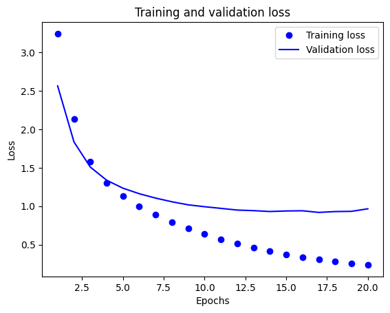

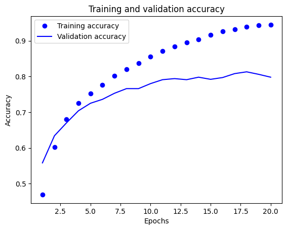

적절한 에포크 횟수는 18회로 확인된다. 모델을 재훈련하고 테스트 데이터를 평가한다.

```
# 모델 재훈련 및 테스트 데이터 평가
model = keras.Sequential([
    layers.Dense(32, activation="relu"),
    layers.Dense(32, activation="relu"),
    layers.Dense(46, activation="softmax")
])

model.compile(optimizer="rmsprop",
              loss="categorical_crossentropy",
              metrics=["accuracy"])

model.fit(x_train,
          y_train,
          epochs=18,
          batch_size=512)

model.evaluate(x_test, y_test)
```

결과는 [0.972261905670166, 0.7974176406860352]으로 예제 모델에 비해 낮은 손실, 높은 정확도를 보인다.

다음으로 128개의 유닛을 사용하여 층을 구성했을 때의 결과를 살펴본다.

```
model = keras.Sequential([
    layers.Dense(128, activation="relu"),
    layers.Dense(128, activation="relu"),
    layers.Dense(46, activation="softmax")
])
```

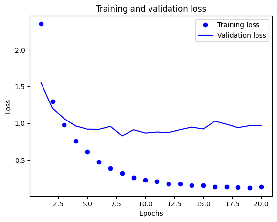

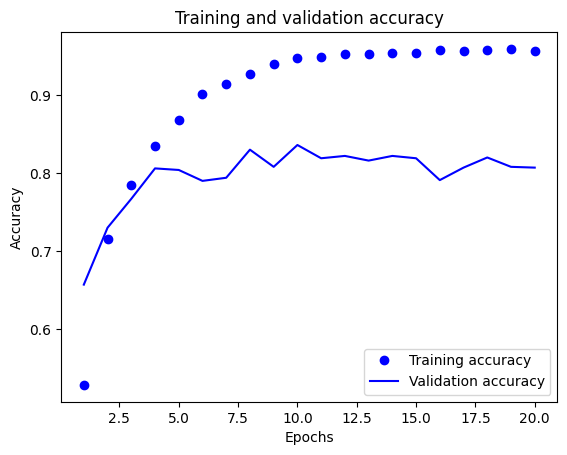

적절한 에포크 횟수는 8회로 확인된다. 모델을 재훈련하고 테스트 데이터를 평가한다.

```
# 모델 재훈련 및 테스트 데이터 평가
model = keras.Sequential([
    layers.Dense(128, activation="relu"),
    layers.Dense(128, activation="relu"),
    layers.Dense(46, activation="softmax")
])

model.compile(optimizer="rmsprop",
              loss="categorical_crossentropy",
              metrics=["accuracy"])

model.fit(x_train,
          y_train,
          epochs=8,
          batch_size=512)

model.evaluate(x_test, y_test)
```

결과는 [0.9020348787307739, 0.8005343079566956]으로 예제 모델보다 낮은 손실, 높은 정확도를 보인다.

- **1개나 3개의 중간 층을 사용해 보아라.**

기본적인 모델의 구조는 예제와 동일하게 하면서 검증 손실, 검증 정확도 및 재훈련 이후 테스트 데이터에 대한 평가를 측정해 보겠다.

먼저 1개의 중간 층을 사용했을 때의 결과이다.

```
model = keras.Sequential([
    layers.Dense(64, activation="relu"),
    layers.Dense(46, activation="softmax")
])
```

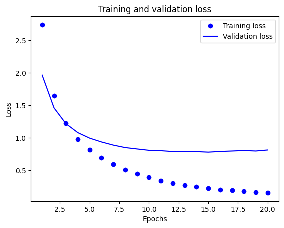

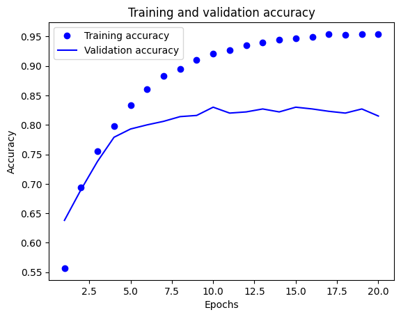

적절한 에포크 횟수는 10회로 확인된다. 다시 훈련한 이후 테스트 데이터를 평가해 보겠다.

```
# 모델 재훈련 및 테스트 데이터 평가
model = keras.Sequential([
    layers.Dense(64, activation="relu"),
    layers.Dense(46, activation="softmax")
])

model.compile(optimizer="rmsprop",
              loss="categorical_crossentropy",
              metrics=["accuracy"])

model.fit(x_train,
          y_train,
          epochs=10,
          batch_size=512)

model.evaluate(x_test, y_test)
```

결과는 [0.8486769795417786, 0.8036509156227112]으로 예제 모델보다 낮은 손실, 높은 정확도를 보인다.

다음으로 3개의 중간 층을 두었을 때의 결과를 확인해 보겠다.

```
model = keras.Sequential([
    layers.Dense(64, activation="relu"),
    layers.Dense(64, activation="relu"),
    layers.Dense(64, activation="relu"),
    layers.Dense(46, activation="softmax")
])
```

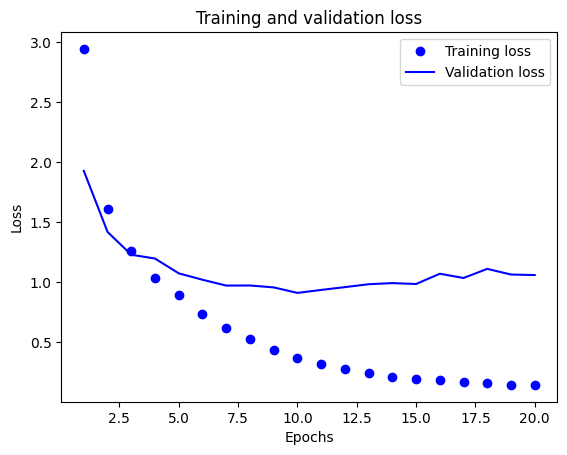

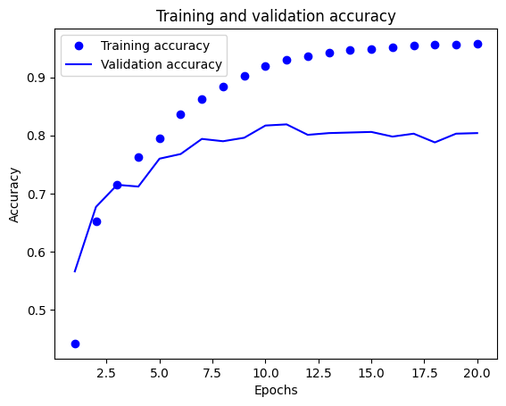

적절한 에포크 횟수는 10회로 확인된다. 모델을 재훈련한 후 테스트 데이터를 평가한다.

```
# 모델 재훈련 및 테스트 데이터 평가
model = keras.Sequential([
    layers.Dense(64, activation="relu"),
    layers.Dense(64, activation="relu"),
    layers.Dense(64, activation="relu"),
    layers.Dense(46, activation="softmax")
])

model.compile(optimizer="rmsprop",
              loss="categorical_crossentropy",
              metrics=["accuracy"])

model.fit(x_train,
          y_train,
          epochs=10,
          batch_size=512)

model.evaluate(x_test, y_test)
```

결과는 [1.135304570198059, 0.7626892328262329]으로 예제 모델에 비해 낮은 손실, 높은 정확도를 보인다.

결과적으로 모든 실험에서 예제 모델보다 우수한 모델이 생성되었다.

### 4.2.9 정리

- N개의 클래스로 데이터 포인트를 분류하려면 모델의 마지막 Dense 층의 크기는 N이어야 한다.
- 단일 레이블, 다중 분류 문제에서는 N개의 클래스에 대한 확률 분포를 출력하기 위해 softmax 활성화 함수를 사용해야 한다.
- 단일 레이블, 다중 분류 문제에는 항상 범주형 크로스엔트로피 손실 함수를 사용해야 한다. 이 함수는 모델이 출력한 확률 분포와 타깃 확률 분포 사이의 거리를 최소화한다.
- 다중 분류에서 레이블을 다루는 방법에는 두 가지가 있다.
  - 레이블을 범주형 인코딩(또는 원-핫 인코딩)으로 인코딩하고 categorical_crossentropy 손실 함수를 사용한다.
  - 레이블을 정수로 인코딩하고 sparse_categorical_crossentropy 손실 함수를 사용한다.
- 많은 수의 범주를 분류할 때 중간 층의 크기가 너무 작아 모델에 정보 병목이 생기는 일이 없도록 해야 한다.


## 4.3 주택 가격 예측: 회귀 문제

**회귀**(regression)는 분류처럼 개별적인 레이블을 예측하기보단 연속적인 값을 예측하는 머신 러닝 문제이다. 참고로 **로지스틱 회귀**(logistic regression) 알고리즘은 이름만 회귀일 뿐 분류 알고리즘에 속한다.

### 4.3.1 보스턴 주택 가격 데이터셋

이 절에서는 1970년 중반 보스턴 외곽 지역의 범죄율, 지방세율 등의 데이터가 주어졌을 때 주택 가격의 중간 값을 예측해볼 것이다. 사용할 데이터셋은 데이터 포인트가 506개로 비교적 적은 개수이고, 404개는 훈련 샘플, 102개는 테스트 샘플로 나뉘어진다. 또한 입력 데이터에 있는 **특성**(feature)의 스케일이 서로 다르다. 어떤 값은 0과 1 사이의 비율을 나타내고, 어떤 값은 1과 12 사이의 값을 가지거나 1과 100 사이의 값을 가지기도 한다.

**코드 4-23. 보스턴 주택 데이터셋 로드하기**
```
from tensorflow.keras.datasets import boston_housing

(train_data, train_targets), (test_data, test_targets) = (boston_housing.load_data())
```

```
>>> print(train_data.shape, test_data.shape)
(404, 13) (102, 13)
```

```
>>> print(train_targets)
[15.2 42.3 50.  21.1 17.7 18.5 11.3 15.6 15.6 14.4 12.1 17.9 23.1 19.9
...
```

### 4.3.2 데이터 준비

상이한 스케일을 가진 값을 신경망에 주입하면 문제가 된다. 이런 데이터를 다룰 때는 특성별로 정규화를 하는 것이 대표적인 방법이다. 각 특성에 평균을 빼고 표준 편차로 나누면 데이터 값의 중앙이 0으로 맞추어지고 표준 편차가 1이 된다.

**코드 4-24. 데이터 정규화하기**
```
mean = train_data.mean(axis = 0)
train_data -= mean
std = train_data.std(axis = 0)
train_data /= std

test_data -= mean
test_data /= std
```

테스트 데이터도 훈련 데이터에서 계산한 값을 기반으로 정규화한 점에 주목한다. 머신 러닝 작업 과정에선 절대로 테스트 데이터에서 계산한 값을 사용해선 안 된다.

### 4.3.3 모델 구성

일반적으로 훈련 데이터가 작으면 과대 적합이 쉽게 일어나므로 작은 모델을 사용하는 것이 이를 피하는 한 방법으로 권장된다. 따라서 64개의 유닛을 가진 2개의 중간 층으로 작은 모델을 구성하여 사용한다.

**코드 4-25. 모델 정의하기**
```
from tensorflow import keras
from tensorflow.keras import layers

def build_model():
    model = keras.Sequential([
        layers.Dense(64, activation="relu"),
        layers.Dense(64, activation="relu"),
        layers.Dense(1)
    ])
    model.compile(optimizer="rmsprop", loss="mse", metrics=["mae"])
    return model
```

하나의 연속적인 값을 예측하는 회귀인 스칼라 회귀에선 전형적으로 이 모델의 마지막 층처럼 활성화 함수가 없고 하나의 유닛을 가지는 층을 배치하게 된다. 이를 선형 층이라고 부른다. 선형 층은 어떠한 범위의 값이든 예측할 수 있도록 자유롭게 학습된다.

`mse` 손실 함수는 **평균 제곱 오차**(mean squared error)의 약어로 예측과 타깃 사이 거리의 제곱이다. 회귀 문제에서 널리 사용된다.

훈련 모니터링을 위해 측정 지표로 **평균 절대 오차**(Mean Absolute Error, MAE)를 사용한다. 이는 예측과 타깃 사이 거리의 절댓값이다. 예를 들어 이 예제에서 MAE가 0.5라면 예측이 평균적으로 500달러 정도 차이가 난다는 의미이다.

### 4.3.4 K-겹 검증을 사용한 훈련 검증

에포크 횟수와 같은 매개변수들을 조정하면서 모델을 평가하기 위해 데이터를 훈련 세트와 검증 세트로 분리한다. 데이터 포인트가 적기 때문에 검증 세트도 약 100개의 샘플로 매우 작아진다. 이러한 경우엔 검증 세트 분할에 대한 검증 점수의 **분산**(variance)이 높기 때문에 훈련 세트와 검증 세트가 어떻게 분리되었느냐에 따라 훈련 결과가 크게 달라질 수 있다.

이러한 상황에서는 **K-겹 교차 검증**(K-fold cross-validation)을 사용하는 것이 가장 좋은 방법이다. 데이터를 K개의 분할(폴드(fold))로 나누고 K개의 모델을 각각 만들어 K - 1개의 분할에서 훈련하고 나머지 분할에서 평가하는 방법이다. 모델의 검증 점수는 K개의 검증 점수의 평균이 된다.

**코드 4-26. K-겹 검증하기**
```
k = 4
num_val_samples = len(train_data) // k
num_epochs = 100
all_scores = []

for i in range(k):
    print(f"#{i}번째 폴드 처리 중")
    
    val_data = train_data[i * num_val_samples : (i + 1) * num_val_samples]
    val_targets = train_targets[i * num_val_samples : (i + 1) * num_val_samples]
    partial_train_data = np.concatenate(
        [train_data[: i * num_val_samples],
         train_data[(i + 1) * num_val_samples :]],
        axis=0
    )
    partial_train_targets = np.concatenate(
        [train_targets[: i * num_val_samples],
         train_targets[(i + 1) * num_val_samples :]],
        axis=0
    )
    
    model = build_model()
    model.fit(partial_train_data,
            partial_train_targets,
            epochs=num_epochs,
            batch_size=16,
            verbose=0)              # verbose=0이면 훈련 과정이 출력되지 않는다
    # 검증 세트로 모델을 평가한다
    val_mse, val_mae = model.evaluate(val_data, val_targets, verbose=0)
    all_scores.append(val_mae)
```

```
>>> all_scores
[1.9447104930877686,
 2.5547187328338623,
 2.6054697036743164,
 2.2518203258514404]
>>> np.mean(all_scores)
2.339179813861847
```

각 폴드에서의 점수 차이가 크므로 평균 값(약 2.3)이 훨씬 신뢰할 만하다.

다음으로는 이 모델을 조금 더 오래 500 에포크 동안 훈련한다. 각 에포크마다 모델이 얼마나 개선되는지 기록하기 위해 훈련 루프를 수정하여 에포크마다의 각 폴드 검증 점수를 로그에 저장한다.

**코드 4-27. 각 폴드의 검증 점수 저장하기**
```
num_epochs = 500
all_mae_histories = []

for i in range(k):
    print(f"#{i}번째 폴드 처리 중")
    
    val_data = train_data[i * num_val_samples : (i + 1) * num_val_samples]
    val_targets = train_targets[i * num_val_samples : (i + 1) * num_val_samples]
    partial_train_data = np.concatenate(
        [train_data[: i * num_val_samples],
         train_data[(i + 1) * num_val_samples :]],
        axis=0
    )
    partial_train_targets = np.concatenate(
        [train_targets[: i * num_val_samples],
         train_targets[(i + 1) * num_val_samples :]],
        axis=0
    )
    
    model = build_model()
    history = model.fit(partial_train_data,
                        partial_train_targets,
                        validation_data=(val_data, val_targets),
                        epochs=num_epochs,
                        batch_size=16,
                        verbose=0)
    mae_history = history.history["val_mae"]
    all_mae_histories.append(mae_history)
```

그 다음 모든 폴드에 대해 MAE 점수 평균을 계산한다.

**코드 4-28. K-겹 검증 점수 평균 기록하기**
```
average_mae_history = np.zeros((num_epochs, ))
for x in all_mae_histories:
    for i in range(num_epochs):
        average_mae_history[i] += x[i]
average_mae_history /= len(all_mae_histories)
```

그래프로 나타낸다.

**코드 4-29. 검증 점수 그래프 그리기**
```
import matplotlib.pyplot as plt

plt.plot(range(1, len(average_mae_history) + 1), average_mae_history)
plt.xlabel("Epochs")
plt.ylabel("Validation MAE")
plt.show()
```

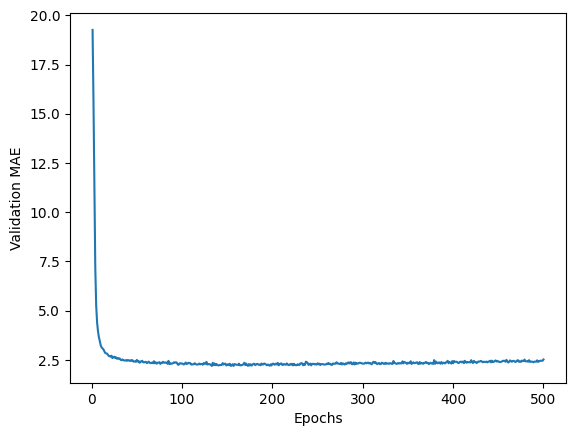

이 그래프는 범위가 크기 때문에 값의 차이를 관찰하기 어렵다. 나머지 곡선 부분과 스케일이 크게 다른 처음 10개의 데이터 포인트를 제외하고 다시 그래프를 그린다.

**코드 4-30. 처음 10개의 데이터 포인트를 제외한 검증 점수 그래프 그리기**
```
truncated_mae_history = average_mae_history[10:]
plt.plot(range(1, len(truncated_mae_history) + 1), truncated_mae_history)
plt.xlabel("Epochs")
plt.ylabel("Validation MAE")
plt.show()
```

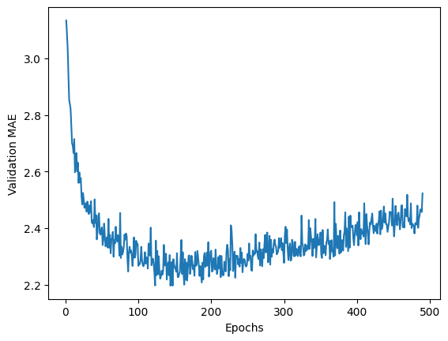

그래프에서 확인할 수 있듯이 검증 MAE가 약 140~150번째 에포크 이후에 감소를 멈추고 과대 적합이 시작된다.

모델의 여러 매개변수에 대한 튜닝이 끝나면 모든 훈련 데이터를 사용하고 최상의 매개변수로 최종 모델을 훈련시킨다. 그 다음 테스트 데이터로 성능을 확인할 수 있다.

**코드 4-31. 최종 모델 훈련하기**
```
model = build_model()
model.fit(train_data,
          train_targets,
          epochs=np.argmin(average_mae_history),
          batch_size=16,
          verbose=0)

test_mse_score, test_mae_score = model.evaluate(test_data, test_targets)
```

```
>>> test_mae_score
2.341470956802368
```

최종 모델도 비슷한 성능을 보인다. 오히려 첫 번째 모델이 성능은 더 우수한 것으로 확인된다.

### 4.3.5 새로운 데이터에 대해 예측하기

스칼라 회귀 모델의 `predict()` 메소드를 사용하여 새로운 샘플의 가격을 1,000달러 단위로 예측할 수 있다.

```
>>> predictions = model.predict(test_data)
>>> predictions[0]
array([8.829581], dtype=float32)
```

테스트 세트의 첫 번째 주택 가격은 약 8,800달러로 예상된다.

### 4.3.6 정리

- 회귀는 분류에서 사용했던 것과는 다른 손실 함수를 사용한다. 평균 제곱 오차(MSE)는 회귀에서 자주 사용되는 손실 함수이다.
- 회귀에서 사용되는 평가 지표는 분류와 다르다. 정확도 개념은 회귀에 적용될 수 없으며, 일반적으로 평균 절대 오차(MAE)를 사용한다.
- 입력 데이터의 특성이 서로 다른 범위를 가지면 전처리 단계에서 각 특성을 개별적으로 스케일링해야 한다.
- 가용 데이터 개수가 적다면 K-겹 검증을 사용하는 것이 신뢰할 수 있는 모델 평가 방법이다.
- 가용 데이터 개수가 적다면 과대 적합을 피하기 위해 일반적으로 중간 층의 수를 1~2개로 줄여 작은 모델을 사용하는 것이 좋다.


## 4.4 요약

- 벡터 데이터를 사용하는 가장 일반적인 머신 러닝 작업은 이진 분류, 다중 분류, 스칼라 회귀이다.
  - 회귀에서 사용하는 손실 함수와 평가 지표는 분류와 다르다.
- 보통 원본 데이터를 신경망에 주입하기 전에 전처리해야 한다.
- 데이터에 범위가 다른 특성이 있다면 전처리 단계에서 각 특성을 독립적으로 스케일링해야 한다.
- 훈련이 진행됨에 따라 신경망의 과대 적합이 시작되고 새로운 데이터에 대해 나쁜 결과를 얻게 된다.
- 훈련 데이터가 많지 않으면 과대 적합을 피하기 위해 1개 또는 2개의 중간 층을 가진 모델을 사용한다.
- 데이터가 많은 범주로 나뉘어 있을 때 중간 층이 너무 작으면 정보의 병목이 생길 수 있다.
- 데이터 양이 적을 때는 K-겹 검증이 신뢰할 수 있는 모델 평가를 도와준다.