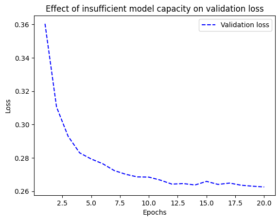
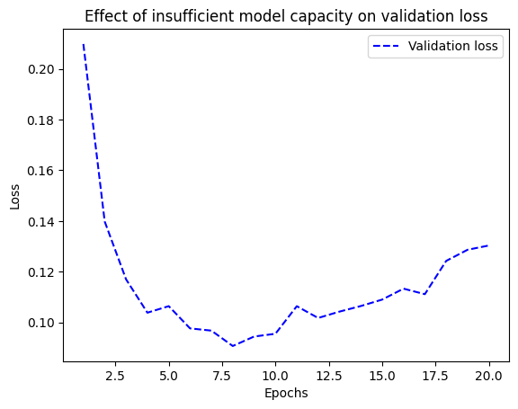
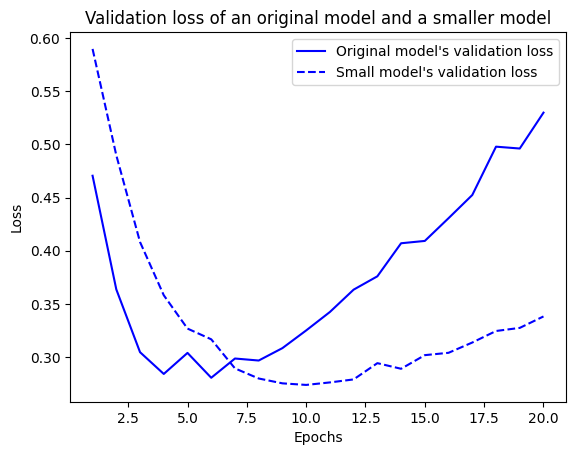
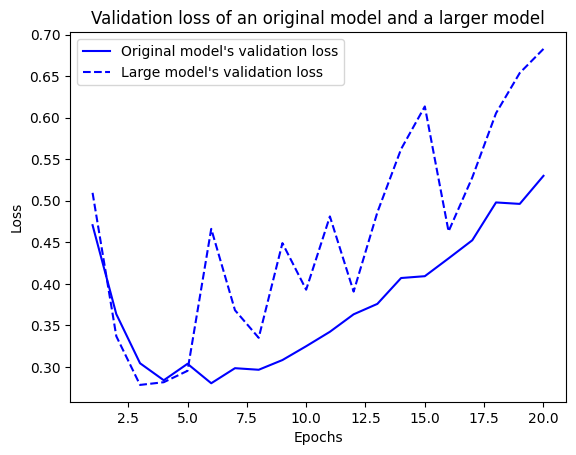
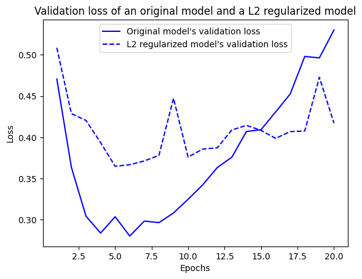
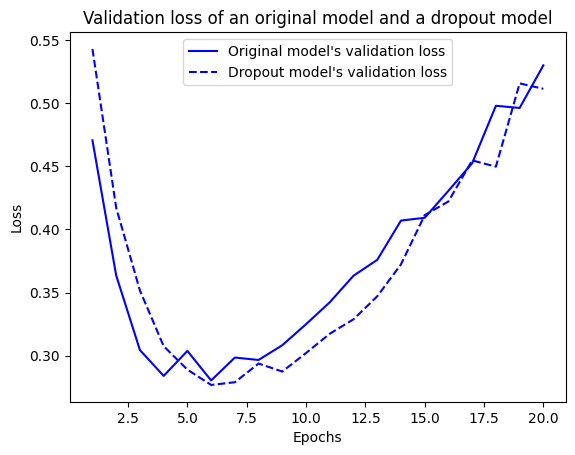

# 케라스 창시자에게 배우는 딥러닝
## 5장, *머신 러닝의 기본 요소*

## 5.1 일반화: 머신 러닝의 목표

**최적화**(optimization)는 가능한 훈련 데이터에서 최고의 성능을 얻기 위해 모델을 조정하는 과정으로 머신 러닝에서 학습에 해당된다. 반면 **일반화**(generalization)는 훈련된 모델이 이전에 본 적 없는 데이터에서 얼마나 잘 수행되는지를 의미한다. 머신 러닝의 근본적인 이슈는 최적화와 일반화 사이의 줄다리기이다. 좋은 일반화 성능을 얻는 것이 목표지만 일반호 성능을 제어할 방법은 없고 최적화가 과해지면 과대적합이 시작된다.

### 5.1.1 과소적합과 과대적합

4장에서의 모델들은 홀드아웃(holdout) 검증 데이터에서의 손실이 에포크 횟수에 따라 점차 감소하다가 필연적으로 높아지는 패턴을 보인다. 이런 패턴은 일반적이고 어떤 데이터셋에서든 확인된다.

훈련 데이터의 손실이 낮아질수록 테스트 데이터의 손실도 낮아지는 경우 이를 **과소적합**(underfitting)되었다고 말한다. 이는 즉, 네트워크가 훈련 데이터에 있는 모든 관련 패턴을 학습하지 못했음을 의미하고 모델의 성능이 계속 발전될 여지가 있다. 그러나 훈련이 특정 횟수 반복된 이후엔 더 이상 일반화 성능이 개선되지 않으며 과대적합이 시작된다. 이는 훈련 데이터에만 특화된 패턴을 학습하기 시작했다는 의미이다.

과대적합은 데이터에 노이즈가 있거나, 불확실성이 존재하거나, 드문 특성이 포함되어 있을 때 특히 발생 가능성이 높다.

#### 잡음 섞인 훈련 데이터

MNIST 데이터셋조차도 숫자로 판단되지 않거나 아예 검은색만 존재하는 이미지가 있다. 더 안 좋은 것은 정상적인 이미지에 레이블링이 잘못된 경우이다. 이러한 이상치에 모델을 맞추려고 하면 일반화 성능이 감소한다.

#### 불확실한 특성

특성 공간의 일부 영역이 동시에 여러 클래스에 연관된 경우가 종종 있다. 즉, 초평면상에서 어떤 클래스로 분류되기엔 너무나도 불확실한 영역이 존재할 수 있는 것이다. 이 영역에 모델이 너무 확신을 크게 가지면 확률적인 데이터에 과대적합될 수 있다.

#### 드문 특성과 가짜 상관관계

예를 들어 훈련 데이터에서 100개의 샘플에 등장하는 단어가 있고, 그 샘플 중 54%는 긍정, 46%는 부정이라고 가정해 보자. 이 차이는 통계적으로 완전히 우연일 수 있지만 모델은 이를 유의하다 판단하고 분류 작업에 이용할 수 있다. 이것이 과대적합의 가장 보편적인 원인 중 하나이다.

MNIST를 활용해 확실한 예를 하나 살펴보자. 기존 데이터의 784개 차원에 백색 잡음인 784개 차원을 연결하여 새로운 훈련 세트를 만든다. 이렇게 하면 데이터의 절반이 잡음이 된다. 그리고 비교를 위해 모든 값이 0인 784개의 차원을 연결하여 동일한 데이터셋을 만든다. 인간이 분류할 때는 이러한 변환이 전혀 영향을 줄 수 없다.

**코드 5-1. MNIST에 백색 잡음 픽셀과 0 픽셀 추가하기**
```
from tensorflow.keras.datasets import mnist
import numpy as np

(train_images, train_labels), _ = mnist.load_data()
train_images = train_images.reshape((60000, 28 * 28))
train_images = train_images.astype("float32") / 255
train_images_with_noise_channels = np.concatenate(
    [train_images, np.random.random((len(train_images), 784))],
    axis=1
)
train_images_with_zero_channels = np.concatenate(
    [train_images, np.zeros((len(train_images), 784))],
    axis=1
)
```

두 훈련 세트에서 2장의 모델을 훈련한다.

**코드 5-2. 백색 잡음과 0을 추가한 MNIST 데이터에서 모델 훈련하기**
```
from tensorflow import keras
from tensorflow.keras import layers

def get_model():
    model = keras.Sequential([
        layers.Dense(512, activation="relu"),
        layers.Dense(10, activation="softmax")
    ])
    model.compile(optimizer="rmsprop",
                  loss="sparse_categorical_crossentropy",
                  metrics=["accuracy"])
    return model

model = get_model()
history_noise = model.fit(
    train_images_with_noise_channels,
    train_labels,
    epochs=10,
    batch_size=128,
    validation_split=0.2
)

model = get_model()
history_zeros = model.fit(
    train_images_with_zero_channels,
    train_labels,
    epochs=10,
    batch_size=128,
    validation_split=0.2
)
```

에포크 횟수에 따라 각 모델의 검증 정확도가 어떻게 변화하는지 비교한다.

**코드 5-3. 검증 정확도 비교 그래프 그리기**
```
import matplotlib.pyplot as plt

val_acc_noise = history_noise.history["val_accuracy"]
val_acc_zeros = history_zeros.history["val_accuracy"]
epochs = range(1, 11)

plt.plot(epochs, val_acc_noise, "b-", label="Validation accuracy with noise channels")
plt.plot(epochs, val_acc_zeros, "b--", label="Validation accuracy with zeros channels")
plt.title("Effect of noise channels on validation accuracy")
plt.xlabel("Epochs")
plt.ylabel("Accuracy")
plt.legend()
plt.show()
```


잡음이 섞인 데이터에서 훈련된 모델의 검증 정확도가 일관적으로 낮게 관찰된다. 이는 순전히 가짜 상관관계의 영향 때문이다.

잡음 특성은 필연적으로 과대적합을 발생시키기 때문에 훈련 전에 **특성 선택**(feature selection)을 수행하여 모델에 미치는 영향이 확실하지 않은 특성을 제외할 수 있다. IMDB 데이터를 다룰 때처럼 최빈출 어휘 1만 개만 사용하는 것은 세련되지 않은 특성 선택 방식이다. 일반적으로 가용한 특성들에 대해 유용성 점수를 계산하는 방식이 사용된다. 특성과 레이블 사이의 상호 의존 정보(mutual information)처럼 작업에 대해 특성이 얼마나 유익한지 측정한다. 그 다음 일정한 임계 값을 넘긴 특성만 사용하면 된다.


### 5.1.2 딥러닝에서 일반화의 본질

딥러닝에서는 표현 능력이 충분하다면 어떤 것에도 맞추도록 훈련이 가능하다.

예를 들어 MNIST 레이블을 무작위하게 섞은 후 모델을 훈련하면, 입력과 뒤섞인 레이블들 사이에 아무런 관계가 없지만 비교적 작은 모델에서도 훈련 손실이 잘 감소한다. 당연하게도 가능한 일반화는 존재하지 않으므로 검증 손실은 개선되지 않는다.

**코드 5-4. 랜덤하게 섞은 레이블로 MNIST 모델 훈련하기**
```
(train_images, train_labels), _ = mnist.load_data()
train_images = train_images.reshape((60000, 28 * 28))
train_images = train_images.astype("float32") / 255

random_train_labels = train_labels[:]
np.random.shuffle(random_train_labels)

model = keras.Sequential([
    layers.Dense(512, activation="relu"),
    layers.Dense(10, activation="softmax")
])

model.compile(optimizer="rmsprop",
              loss="sparse_categorical_crossentropy",
              metrics=["accuracy"])

model.fit(
    train_images,
    random_train_labels,
    epochs=100,
    batch_size=128,
    validation_split=0.2
)
```

이런 경우엔 파이썬 딕셔너리와 같이 훈련 입력과 타깃 사이의 임의적인 매핑을 학습하게 되어 있다. 이런 매핑은 새로운 입력에 작동할 것이라고 기대하기 어렵다.

결국 딥러닝에서 일반화의 본질은 딥러닝 모델 자체와는 거의 관련이 없고 실제 세상의 정보 구조와 많은 관련이 있다.

#### 매니폴드 가설

전처리하기 전의 MNIST 분류기 입력은 28X28 크기의 정수 배열이며, 0~255 사이의 값을 가지므로 가능한 전체 입력의 가짓수는 784<sup>256</sup>이다. 하지만 매우 적은 수만이 유효한 MNIST 샘플이다. 실제 손글씨가 차지하는 공간은 모든 28X28 uint8 배열로 이루어진 공간에서 아주 작은 부분적인 공간만 차지하고, 포인트가 매우 구조적으로 배치되어 있다.

유효한 손글씨 숫자의 부분 공간은 연속적이다. 즉, 하나의 샘플을 조금 수정해도 여전히 같은 손글씨 숫자로 인식할 수 있다. 그리고 유효한 부분 공간 안에 있는 모든 샘플은 이 부분 공간을 가로지르는 매끈한 경로로 연결되어 있다. 즉, 2개의 MNIST 숫자 A와 B를 랜덤하게 선택했을 때 A를 B로 변형시키는 연속적인 중간 이미지가 있다는 의미이다.

기술적으로는 손글씨 숫자가 가능한 모든 28X28 uint8 배열로 이루어진 공간 안에서 **매니폴드**(manifold)를 형성한다고 말한다. 매니폴드란 국부적으로 선형(유클리드) 공간과 비슷하게 보이는 부모 공간의 저차원 부분 공간이다. 예를 들어 평면상의 매끄러운 한 곡선은 2D 공간 안에 있는 1D 매니폴드이다. 이 곡선의 모든 포인트에서 접선을 그릴 수 있기 때문이다. 또한 3D 공간상의 매끄러운 표면은 2D 매니폴드가 되는 셈이다.

더 일반적으로 **매니폴드 가설**(manifold hypothesis)은 실제 세상의 모든 데이터가 고차원 공간 안에 있는 저차원 매니폴드에 놓여 있다고 가정한다. 이는 우주에 있는 정보 구조에 관한 매우 강력한 가정이다. 인간이 밝혀온 지식에 따르면 이것은 타당하며 딥러닝이 작동하는 이유이다. MNIST 숫자, 사람 얼굴, 나무 형태, 음성, 자연어(natural language)까지도 이에 해당된다.

매니폴드 가설이 의미하는 바는 다음과 같다.

- 머신 러닝 모델은 가능한 입력 공간 안에서 비교적 간단하고, 저차원이며, 매우 구조적인 부분 공간(잠재 매니폴드(latent manifold))만 학습하면 된다.
- 이런 매니폴드가 존재한다면 그 중 하나 안에서 두 입력 사이를 보간(interpolation)하는 것이 항상 가능하다. 즉, 연속적인 경로를 따라 한 입력에서 다른 입력으로 변형할 때 모든 포인트가 이 매니폴드에 속한다.

샘플 사이를 보간하는 능력은 딥러닝에서 일반화를 이해하는 열쇠이다.

#### 일반화의 원천인 보간

다루는 데이터 포인트를 보간할 수 있다면 이전에 본 적 없는 포인트를 해당 매니폴드에서 가까이 놓인 다른 포인트와 연결하여 이해할 수 있다. 즉, 공간 안의 샘플만 사용하여 공간 전체를 이해할 수 있다. 보간을 사용하면 빈 곳을 채울 수 있기 때문이다.

잠재 매니폴드에서의 보간은 부모 공간에서의 선형 보간과 달리 2개의 MNIST 숫자 사이의 픽셀을 평균한다고 해도 일반적으로 유효한 숫자가 만들어지지 않는다.

근사적으로 학습된 데이터 매니폴드에서 보간을 통해 딥러닝의 일반화가 달성된다. 보간은 이전에 본 것과 매우 가까운 것을 이해하는 데 도움을 줄 수 있다. 이를 **지역 일반화**(local generalization)라고 한다.

사람은 보간 이외의 인지 메커니즘으로 **궁극 일반화**(extreme generalization)를 할 수 있다. 직관이나 패턴 인식과 같은 것은 대체로 보간에 해당하지만, 인간 고유의 추상화, 세상에 대한 상징적 모델링, 추론, 논리, 상식 등의 이성적 기능들은 그렇지 않다.

#### 딥러닝이 작동하는 이유

딥러닝은 잠재 매니폴드를 풀기 위한 도구이다. 예를 들어, 구겨진 종이 공 비유에서 종이는 3D 공간 안의 2D 매니폴드를 나타낸다. 딥러닝 모델은 여기서 2D 매니폴드를 푸는 것이다.

딥러닝 모델은 근본적으로 매우 고차원의, 미분 가능한 곡선이다. 경사 하강법을 통해 이 곡선을 부드럽고 점진적으로 데이터 포인트에 맞춘다. 딥러닝은 본질적으로 크고 복잡한 곡선(매니폴드)을 선택하여 훈련 데이터 포인트에 맞을 때까지 파라미터를 점진적으로 조정하는 과정이다.

경사 하강법을 통해 시간이 지남에 따라 모델이 데이터의 매니폴드를 대략적으로 근사하는 중간 지점이 있을 것이다. 그 지점에서 모델이 학습한 곡선을 따라 이동하는 것은 데이터의 실제 잠재 매니폴드를 따라 이동하는 것과 비슷하다. 따라서 모델이 훈련 입력 사이를 보간하여 이전에 본 적 없는 입력을 이해할 수 있을 것이다.

이처럼 딥러닝 모델이 충분한 표현 능력을 가진다는 일반적인 사실 외에도 다음과 같이 잠재 매니폴드 학습에 특히 잘 맞는 몇 가지 속성이 있다.

- 딥러닝 모델은 입력에서부터 출력으로 매끄럽고 연속적인 매핑을 구현한다. 이는 미분 가능하며, 미분 가능성 자체가 동일한 속성을 가진 잠재 매니폴드를 근사하는 데 도움이 된다.
- 딥러닝 모델은 모델 구조에 대한 가정을 바탕으로 훈련 데이터에 있는 정보의 형태를 반영하는 식으로 구조화되는 경향이 있다. 특히 이미지 처리나 시퀀스 처리 모델에서 그렇다. 더 일반적으로 심층 신경망은 학습한 표현을 계층적이고 모듈화된 방식으로 구조화하며 이는 자연적인 데이터가 구성되는 방식을 반영한 것이다.

#### 가장 중요한 훈련 데이터

일반화 능력은 모델의 어떤 속성보다는 데이터 자체의 자연적인 구조가 큰 영향을 준다. 데이터가 보간할 수 있는 매니폴드를 형성하는 경우에만 일반화할 수 있다. 특성이 유익하고 잡음이 적을수록 입력 공간이 더 간단하고 구조적이기 때문에 더 잘 일반화할 수 있다. 데이터 큐레이션(data curation)과 특성 공학(feature engineering)은 일반화에 필수적이다.

또한, 딥러닝은 곡선을 맞추는 과정이기 때문에 모델이 이를 잘 수행하려면 입력 데이터 매니폴드 전체를 조밀하게 커버해야 한다. 결정 경계 근처에서는 특히 그렇다. 충분히 조밀하게 샘플링하면 모델이 참고할 수 없는 상식, 요약, 추론 또는 세상에 대한 외부 지식을 사용하지 않고도 훈련 입력 사이를 보간하여 새로운 입력을 이해할 수 있다.

따라서 딥러닝 모델을 강화시키는 가장 좋은 방법은 더 좋고 더 많은 데이터에서 훈련하는 것이다. 그리고 딥러닝 모델이 보간 이상의 것을 할 수 있을 것이라 기대하면 안 되고, 가능한 쉽게 보간하기 위해 할 수 있는 모든 것을 다 해야 한다.

데이터를 더 수집하는 것이 불가능하다면 차선책은 모델이 저장할 수 있는 정보량을 조정하거나 모델 곡선의 매끄러운 정도에 제약을 추가하는 것이다. 네트워크가 적은 개수의 패턴만 기억하거나 매우 규칙적인 패턴만 기억할 수 있게 함으로써 최적화 과정에서 일반화 가능성이 높은, 가장 눈에 띄는 패턴에만 모델의 초점을 맞추도록 하는 것을 **규제**(regularization)라고 한다.


## 5.2 머신 러닝 모델 평가

제어할 수 있는 것은 오직 관찰할 수 있는 것이다. 일반화 성능이 좋은 모델을 개발하는 것이 목표이므로 모델의 일반화 성능을 신뢰 있게 측정할 수 있어야 한다. 이 절에선 머신 러닝 모델 평가 방법을 알아본다.

### 5.2.1 훈련, 검증, 테스트 세트

모델 평가의 핵심은 가용한 데이터를 항상 훈련 세트, 검증 세트, 테스트 세트로 나누는 것이다. 훈련 세트에서 모델을 훈련, 검증 세트에서 모델을 평가한다. 테스트 세트는 모델 출시 준비가 완료되면 최종적으로 단 한 번 테스트하는 용도이다. 그러므로 테스트 데이터는 가능한 제품 환경 데이터와 유사해야 한다. 그 다음 모델이 제품 환경에 배포된다.

검증 세트가 사용되는 이유는 모델 개발 시 항상 층, 유닛 개수 등(**하이퍼파라미터**(hyperparameter)) 모델의 설정을 튜닝하기 때문이다. 이러한 튜닝도 파라미터 공간에서 좋은 설정을 찾는 **학습**에 해당한다. 그러나 검증 세트의 성능을 기반으로 모델을 튜닝하면 **검증 세트에 과대적합**될 수 있다.

**정보 누설**(information leak) 개념에 의하면, 검증 세트의 모델 성능에 기반하여 하이퍼파라미터를 튜닝할 때마다 검증 데이터에 관한 정보가 모델로 샌다. 그러므로 모델 조정 과정이 여러 번 반복되면 검증 데이터 정보가 그만큼 많이 노출된다.

다음으로는 데이터를 3개의 세트로 나누어야 하는데 데이터의 절대적인 양이 부족할 때 사용할 수 있는 방법들을 알아본다.

#### 단순 홀드아웃 검증

데이터의 일정량을 테스트 세트로 떼어 놓고, 남은 데이터에서 훈련한 후 테스트 세트로 평가한다. 정보 누설을 막기 위해 테스트 세트를 사용하여 모델을 튜닝해서는 안 된다. 이러한 이유로 검증 세트로 따로 떼어 놓아야 한다. 다음 코드는 간단한 예이다.

**코드 5-5. 홀드아웃 검증 구현 예**
```
num_validation_samples = 10000
# 데이터를 섞는 것이 일반적으로 좋다
np.random.shuffle(data)
# 검증 세트를 만든다
validation_data = data[: num_validation_samples]
# 훈련 세트를 만든다
training_data = data[num_validation_samples :]
# 훈련 세트에서 모델을 훈련하고 검증 세트로 평가한다
model = get_model()
model.fit(training_data, ...)
validation_score = model.evaluate(validation_data, ...)

# 모델 튜닝, 훈련, 평가 과정 반복 ...

# 하이퍼파라미터 튜닝이 끝나면 테스트 데이터를 제외한 모든 데이터를 사용하여 모델을 다시 훈련시킨다
model = get_model()
model.fit(np.concatenate([training_data, validation_data]), ...)
test_score = mode.evaluate(test_data, ...)
```

이 평가 방법은 단순해서 데이터가 적을 때는 검증 세트와 테스트 세트가 전체 데이터를 통계적으로 대표하지 못할 수 있다. 다른 난수 초기값으로 셔플링해서 데이터를 나누었을 때 모델의 성능이 매우 달라지면 이 문제에 해당한다. 다음에 알아볼 방법들은 이 문제를 해결할 수 있다.

#### K-겹 교차 검증

데이터를 동일한 크기의 K개 분할로 나눈다. 각 분할에 대해 나머지 K - 1개의 분할로 모델을 훈련하고 선택된 분할로 모델을 평가한다. 최종 점수는 이렇게 K번 구한 평가치의 평균이다. 이 방법은 모델의 성능이 데이터 분할에 따라 큰 편차를 보일 때 도움이 된다.

**코드 5-6. K-겹 교차 검증 구현 예**
```
k = 3
num_validation_samples = len(data) // k
np.random.shuffle(data)
validation_scores = []
for fold in range(k):
    validation_data = data[num_validation_samples * fold : num_validation_samples * (fold + 1)]
    training_data = np.concatenate(
        data[: num_validation_samples * fold],
        data[num_validation_samples * (fold + 1) :]
    )
    model = get_model()
    model.fit(training_data, ...)
    validation_score = model.evaluate(validation_data, ...)
    validation_scores.append(validation_score)
validation_score = np.average(validation_scores)
model = get_model()
model.fit(data, ...)
test_score = model.evaluate(test_data, ...)
```

#### 셔플링을 사용한 반복 K-겹 교차 검증

비교적 가용 데이터가 적음에도 가능한 모델을 정확히 평가하고자 할 때 사용하는 방법이다. 캐글 경연에서 크게 도움이 되는 방법으로, K-겹 교차 검증을 여러 번 적용하되 K개의 분할로 나누기 전 매번 데이터를 무작위로 섞는다. 최종 점수는 모든 K-겹 교차 검증을 실행해 얻은 점수의 평균이다. 결국 P(반복 횟수) * K개의 모델을 훈련하고 평가하는 것이다. 그러므로 비용이 많이 드는 것이 단점이다.

### 5.2.2 상식 수준의 기준점 넘기

데이터셋으로 작업하기 전 항상 모델이 넘어야 할 간단한 기준점을 정해야 한다. 이 기준점은 랜덤한 분류기의 성능이나 머신 러닝 없이 생각할 수 있는 가장 간단한 방법의 성능 등이 될 수 있다.

### 5.2.3 모델 평가에 대해 유념해야 할 점

- **대표성 있는 데이터**: 훈련 세트와 테스트 세트는 주어진 데이터에 대해 통계적으로 대표성이 있어야 한다.
- **시간의 방향**: 과거로부터 미래를 예측하는 데이터의 경우 절대로 무작위로 섞으면 안 된다. 이 경우엔 훈련 세트보다 테스트 세트가 무조건 미래의 것이어야 한다.
- **데이터 중복**: 데이터셋에 어떤 데이터 포인트가 중복해서 등장하면 훈련 세트와 검증 세트로 양분되어 검증 세트로 훈련하는 상황이 일어날 수 있다. 이는 최악의 경우이다.


## 5.3 훈련 성능 향상하기

최적적합 모델을 얻으려면 먼저 과대적합되어야 한다. 과대적합되었다는 건 최적적합의 경계가 파악됐다는 의미이기 때문이다. 따라서 문제를 다루기 시작할 때 초기 목표는 약간의 일반화 능력을 보이고 과대적합할 수 있는 모델을 얻는 것이다. 이런 모델을 얻은 후 일반화 성능 개선을 위해 힘쓴다. 이 단계에서 일반적으로 다음과 같은 문제가 발생한다.

- **훈련이 되지 않는 문제**: 시간이 지나도 훈련 손실이 줄어들지 않는 경우이다.
- **훈련은 잘 시작되었으나 모델이 의미 있는 일반화를 달성하지 못하는 문제**: 상식 수준의 기준점을 넘어설 수 없는 경우이다.
- 시간이 지남에 따라 훈련과 검증 손실이 모두 줄어들고 기준점을 넘어설 수 있지만 과대적합이 되지 않는 문제: 과소적합 상태가 갱신되기만 하는 경우이다.

지금부터는 이런 이슈를 해결하여 상식 수준의 기준점을 넘을 수 있어 약간의 일반화 성능이 보장되고 과대적합할 수 있는 모델을 얻는 방법을 알아본다.

### 5.3.1 경사 하강법의 핵심 파라미터 튜닝하기

이따금 훈련이 시작되지 않거나 일찍 중단되고 손실이 멈추어 있는 문제가 발생한다. 이 문제는 항상 극복할 수 있다.

이런 상황에는 항상 경사 하강법 과정에 대한 설정에 문제가 있다. 옵티마이저, 모델 가중치의 초기값 분포, 학습률, 배치 크기들은 상호의존적이다. 일반적으로 나머지 파라미터는 고정하고 학습률과 배치 크기를 튜닝하는 것으로 충분하다.

구체적인 예로 MNIST 모델을 부적절하게 큰 학습률인 1.0으로 훈련한다.

**코드 5-7. 잘못된 높은 학습률로 MNIST 모델 훈련하기**
```
from tensorflow.keras.datasets import mnist
from tensorflow import keras
from tensorflow.keras import layers

(train_images, train_labels), _ = mnist.load_data()
train_images = train_images.reshape((60000, 28 * 28))
train_images = train_images.astype("float32") / 255

model = keras.Sequential([
    layers.Dense(512, activation="relu"),
    layers.Dense(10, activation="softmax")
])

model.compile(optimizer=keras.optimizers.RMSprop(1.),
              loss="sparse_categorical_crossentropy",
              metrics=["accuracy"])

model.fit(train_images, train_labels,
          epochs=10,
          batch_size=128,
          validation_split=0.2)
```

이 모델은 약 20% 정도의 훈련 정확도와 검증 정확도를 보인다. 조금 더 합리적인 값인 1e-2로 학습률을 낮추어 보자.

**코드 5-8. 같은 모델을 적절한 학습률로 훈련하기**
```
from tensorflow.keras.datasets import mnist
from tensorflow import keras
from tensorflow.keras import layers

(train_images, train_labels), _ = mnist.load_data()
train_images = train_images.reshape((60000, 28 * 28))
train_images = train_images.astype("float32") / 255

model = keras.Sequential([
    layers.Dense(512, activation="relu"),
    layers.Dense(10, activation="softmax")
])

model.compile(optimizer=keras.optimizers.RMSprop(1e-2),
              loss="sparse_categorical_crossentropy",
              metrics=["accuracy"])

model.fit(train_images, train_labels,
          epochs=10,
          batch_size=128,
          validation_split=0.2)
```

이 모델은 100%에 가까운 훈련 정확도와 검증 정확도를 달성한다.

요약하자면 다음과 같은 해결 방법이 있다.

- 학습률을 낮추거나 높인다. 너무 높은 학습률은 최적적합을 크게 뛰어넘는 업데이트를 발생시킬 수 있고, 너무 낮은 학습률은 훈련 속도를 느리게 만들어 업데이트가 발생하지 않는 것처럼 보일 수 있다.
- 배치 크기를 증가시킨다. 배치 샘플을 늘릴수록 유익하고 잡음이 적은 그레이디언트가 만들어진다.

### 5.3.2 구조에 대해 더 나은 가정하기

모델이 훈련되지만 일반화되지 않는 경우는 최악의 머신 러닝 상황이다. 이는 접근 방식에 근본적인 문제가 있다는 의미이다.

먼저 단순하게 입력 데이터에 타깃 예측을 위한 정보가 충분하지 않을 수 있다. 이 경우엔 문제를 풀 수 없다. 이는 레이블을 뒤섞은 모델 훈련과 비슷한 상황으로, 훈련 데이터에만 들어맞고 일반화는 전혀 불가능한 모델이 생성된다.

또는 현재 사용하는 모델의 종류가 문제에 적합하지 않을 수 있다. 예를 들어 밀집 연결 신경망을 사용하는 시계열(timeseries) 예측 문제는 단순한 기준점을 넘어설 수 없다. 이 경우엔 순환 신경망(recurrent neural network)이 더 적합하며 일반화가 잘된다. 일반화를 달성하려면 문제에 대해 올바른 가정을 하는 모델을 사용해야 한다. 즉, 구조에 대한 올바른 가정이 필요하다.

### 5.3.3 모델 용량 늘리기

모델이 훈련되고 검증 지표가 향상되며 어느 정도의 일반화 능력을 달성한 것 같다면 다음으로는 과대적합을 달성해야 한다.

다음과 같이 MNIST 픽셀에서 훈련하는 간단한 로지스틱 회귀(logistic regression) 모델을 가정해본다.

**코드 5-9. MNIST 데이터를 사용한 간단한 로지스틱 회귀 모델**
```
model = keras.Sequential([layers.Dense(10, activation="softmax")])

model.compile(optimizer="rmsprop",
              loss="sparse_categorical_crossentropy",
              metrics=["accuracy"])

history_small_model = model.fit(
    train_images,
    train_labels,
    epochs=20,
    batch_size=128,
    validation_split=0.2
)
```

이 모델 훈련 후 얻은 손실 곡선은 다음과 같다.

```
import matplotlib.pyplot as plt

val_loss = history_small_model.history["val_loss"]
epochs = range(1, 21)

plt.plot(epochs, val_loss, "b--", label="Validation loss")
plt.title("Effect of insufficient model capacity on validation loss")
plt.xlabel("Epochs")
plt.ylabel("Loss")
plt.legend()
plt.show()
```



검증 손실이 증가하지 않고 그 감소량이 정체되어 있다. 하지만 과대적합은 항상 가능하다. 그러므로 이러한 문제도 항상 해결할 수 있다. 과대적합할 수 없는 것처럼 보인다면 그것은 모델의 **표현 능력**(representation power)이 부족한 것이다. 이런 경우엔 용량이 더 큰, 정보를 더 많이 저장할 수 있는 모델이 필요하다. 층을 추가하거나, 층 크기를 늘리거나, 현재 문제에 더 적합한 종류의 층을 사용할 수 있다.

다시 96개의 유닛을 가진 2개의 중간층으로 구성되어 용량이 더 큰 모델을 훈련하고 손실 곡선을 관찰해보자.

```
model = keras.Sequential([
    layers.Dense(96, activation="relu"),
    layers.Dense(96, activation="relu"),
    layers.Dense(10, activation="softmax")
])

model.compile(optimizer="rmsprop",
              loss="sparse_categorical_crossentropy",
              metrics=["accuracy"])

history_large_model = model.fit(
    train_images,
    train_labels,
    epochs=20,
    batch_size=128,
    validation_split=0.2
)
```

```
import matplotlib.pyplot as plt

val_loss = history_large_model.history["val_loss"]
epochs = range(1, 21)

plt.plot(epochs, val_loss, "b--", label="Validation loss")
plt.title("Effect of insufficient model capacity on validation loss")
plt.xlabel("Epochs")
plt.ylabel("Loss")
plt.legend()
plt.show()
```



검증 곡선에 의하면 모델이 빠르게 훈련되고 8번째 에포크 이후 과대적합이 시작된다.


## 5.4 일반화 성능 향상하기

모델이 어느 정도의 일반화 성능을 갖고 과대적합할 수 있다면 다음으로는 일반화 성능을 극대화하는 데 초점을 맞춘다.

### 5.4.1 데이터셋 큐레이션

데이터를 사용하여 샘플 사이를 부드럽게 보간할 수 있다면 일반화 성능을 가진 딥러닝 모델을 훈련할 수 있다. 따라서 적절한 데이터셋으로 작업하고 있는지 확인해 주는 것이 좋다.

- 데이터가 충분한지 확인한다. 입력에서 출력을 매핑하는 공간은 조밀하게 샘플링되어야 한다. 데이터가 많을수록 좋은 모델이 만들어진다. 
- 레이블 할당 에러를 최소화한다. 입력을 시각화하여 이상치를 확인하고, 레이블을 교정한다.
- 데이터를 정제하고 누락된 값을 처리한다.
- 많은 특성 중에서 어떤 것이 유용한지 확실하지 않다며 특성 선택을 수행한다.

데이터의 일반화 가능성을 향상시키는 매우 중요한 방법 중 하나가 **특성 공학**(feature engineering)이다.

### 5.4.2 특성 공학

특성 공학은 데이터와 머신 러닝 알고리즘에 관한 지식을 사용하는 단계이다. 모델에 데이터를 주입하기 전 하드코딩된 변환을 적용하여 알고리즘이 더 잘 수행되도록 만들어 준다. 데이터들은 모델이 수월하게 작업할 수 있도록 표현될 필요가 있다.

예를 들어 시계 이미지 입력을 받고 시간을 출력하는 모델을 만든다고 가정하자. 시계 이미지를 그대로 사용하여 학습한다면 복잡한 머신 러닝 모델이 필요할 것이지만, 이미지 중심에 대한 좌표와 시계 침의 각도를 이미지로부터 미리 추출하는 등의 작업을 통해 모델을 훨씬 간단하게 만들 수 있다. 이러면 문제는 쉬워지고, 잠재 매니폴드를 더 매끄럽고 간단하고 구조적으로 만들 수 있다. 그러면 결과적으로 일반화 성능이 좋아지게 된다.

고전적인 머신 러닝 워크플로에서는 이러한 특성 공학이 필수적이었지만, 최신 딥러닝에서는 필요하지 않게 되었다. 신경망이 자동으로 원본 데이터에서 유용한 특성을 추출하게 된다. 그러나 다음과 같은 이유로 심층 신경망을 사용할 때에도 특성 공학에 대해 신경써야 한다.

- 좋은 특성은 적은 자원을 사용하여 문제를 더 깔끔하게 풀 수 있도록 만들어준다.
- 좋은 특성은 더 적은 데이터로 문제를 풀 수 있다. 딥러닝 모델이 스스로 특성을 학습하는 능력은 가용한 훈련 데이터가 많을 때의 이야기로, 샘플 개수가 적다면 특성에 있는 정보가 매우 중요해진다.

### 5.4.3 조기 종료 사용하기

딥러닝에서는 항상 지나치게 파라미터가 많은 모델을 사용하기 때문에 잠재 매니폴드를 학습하기 위해 필요한 최소한의 자유도보다 훨씬 많은 자유도를 가진다.

훈련 중에 일반화 성능이 가장 높은 최적적합의 지점을 찾기 위해서 이전 장의 예제들은 필요보다 오랫동안 모델을 훈련했다. 그리고 최적적합 에포크 횟수를 찾아 다시 한번 모델을 학습했다. 그러나 이는 종종 많은 비용이 든다. 그 대신 에포크가 끝날 때마다 모델을 저장하고, 최상의 에포크를 찾은 후 저장된 모델을 사용할 수 있다. 케라스에서는 일반적으로 `EarlyStopping` 콜백(callback)을 사용하여 이를 처리한다. 검증 지표가 향상을 멈추면 즉시 훈련을 중지하고 최상의 검증 점수를 낸 모델을 남길 수 있다.

### 5.4.4 모델 규제하기

**규제**(regularization) 기법은 모델이 훈련 데이터에 완벽하게 맞추려는 경향을 적극적으로 방해한다. 이를 통해 검증 점수를 향상시키는 것이 목적이다. 모델이 훈련 세트에 덜 특화되고 데이터의 잠재 매니폴드를 조금 더 가깝게 근사함으로써 일반화 능력을 높일 수 있다. 모델 규제는 항상 정확한 평가 절차를 따라야 한다. 지금부터는 가장 널리 사용되는 규제 기법에 대해 알아본다.

알맞은 층의 개수나 각 층의 유닛 개수를 결정하는 공식은 없다. 알맞은 모델을 찾으려면 검증 세트에서 일일이 평가해 보아야 한다. 적절한 모델 크기를 찾기 위해선 일반적으로 먼저 비교적 적은 수의 층과 파라미터로 시작하여 검증 손실이 감소되기 시작할 때까지 층이나 유닛 개수를 늘려간다.

이를 영화 리뷰 분류 모델에 적용해 보겠다. 다음 코드는 원래 모델이다.

**코드 5-10. 원본 모델**
```
from tensorflow.keras.datasets import imdb
import numpy as np

(train_data, train_labels), _ = imdb.load_data(num_words=10000)

def vectorize_sequences(sequences, dimension=10000):
    results = np.zeros((len(sequences), dimension))
    for i, sequence in enumerate(sequences):
        results[i, sequence] = 1.
    return results
train_data = vectorize_sequences(train_data)

model = keras.Sequential([
    layers.Dense(16, activation="relu"),
    layers.Dense(16, activation="relu"),
    layers.Dense(1, activation="sigmoid")
])

model.compile(optimizer="rmsprop",
              loss="binary_crossentropy",
              metrics=["accuracy"])

history_original = model.fit(train_data, train_labels, epochs=20, batch_size=512, validation_split=0.4)
```

이를 더 작은 모델로 바꾸어보자.

**코드 5-11. 작은 용량의 모델**
```
model = keras.Sequential([
    layers.Dense(4, activation="relu"),
    layers.Dense(4, activation="relu"),
    layers.Dense(1, activation="sigmoid")
])

model.compile(optimizer="rmsprop",
              loss="binary_crossentropy",
              metrics=["accuracy"])

history_small_model = model.fit(
    train_data, train_labels,
    epochs=20, batch_size=512, validation_split=0.4
)
```

```
original_val_loss = history_original.history["val_loss"]
small_val_loss = history_small_model.history["val_loss"]
epochs = range(1, 21)

plt.plot(epochs, original_val_loss, "b-", label="Original model's validation loss")
plt.plot(epochs, small_val_loss, "b--", label="Small model's validation loss")
plt.title("Validation loss of an original model and a smaller model")
plt.xlabel("Epochs")
plt.ylabel("Loss")
plt.legend()
plt.show()
```



작은 모델의 과대적합이 더 늦게 시작되었따.

이번에는 문제에 필요한 것보다 훨씬 더 많은 용량을 가진 네트워크와 비교해 보겠다. 학습 대상에 대해 과도하게 많은 파라미터를 가진 모델을 만드는 것이 표준이지만 기억 용량이 너무 많을 수 있다. 이럴 경우 모델이 즉시 과대적합되고 검증 손실 곡선의 분산이 크게 나타난다. 검증 지표가 고르지 않다는 것은 신뢰할 수 있는 검증 과정을 사용하지 않는다는 징후일 수 있다.

**코드 5-12. 큰 용량의 모델**
```
model = keras.Sequential([
    layers.Dense(512, activation="relu"),
    layers.Dense(512, activation="relu"),
    layers.Dense(1, activation="sigmoid")
])

model.compile(optimizer="rmsprop",
              loss="binary_crossentropy",
              metrics=["accuracy"])

history_large_model = model.fit(
    train_data, train_labels,
    epochs=20, batch_size=512, validation_split=0.4
)
```

```
original_val_loss = history_original.history["val_loss"]
large_val_loss = history_large_model.history["val_loss"]
epochs = range(1, 21)

plt.plot(epochs, original_val_loss, "b-", label="Original model's validation loss")
plt.plot(epochs, large_val_loss, "b--", label="Large model's validation loss")
plt.title("Validation loss of an original model and a larger model")
plt.xlabel("Epochs")
plt.ylabel("Loss")
plt.legend()
plt.show()
```



용량의 큰 모델의 과대적합이 더 빨리 발생하고 검증 손실도 매우 불안정한 양상을 띠고 있음을 확인할 수 있다. 용량이 큰 모델일수록 훈련 데이터를 빠르게 모델링할 수 있고, 그만큼 과대적합에 민감해진다.

#### 가중치 규제 추가

**오캄의 면도날**(Occam's razor) 이론은 어떤 것에 대한 여러 가지 설명이 있다면 그들 중 더 적은 가정이 필요한 간단한 설명이 옳을 것이라고 말한다. 이 개념은 신경망 모델에도 적용된다. 어떤 훈련 데이터와 네트워크 구조가 주어졌을 때 데이터를 설명할 수 있는 가중치 값의 집합(모델)은 여러 개이다. 간단한 모델이 복잡한 모델보다 덜 과대적합될 가능성이 높다.

간단한 모델이란 파라미터 값 분포의 엔트로피가 적거나 적은 수의 파라미터를 가진 모델이다. 그러므로 과대적합을 완화하기 위해 일반적으로 모델의 복잡도에 제한을 두어 가중치가 작은 값을 가지도록 강제할 수 있다. 이로 인해 가중치 값의 분포가 더 균일하게 되는 것을 **가중치 규제**(weight regularization)이라고 한다. 모델의 손실 함수에 큰 가중치에 따른 비용을 추가한다. 이에는 두 가지 형태의 비용이 있다.

- **L1 규제**: 가중치의 절댓값에 비례하는 비용이 추가된다(가중치의 **L1 노름**(norm)).
- **L2 규제**: 가중치의 제곱에 비례하는 비용이 추가된다(가중치의 **L2 노름**). 신경망에서 **가중치 감쇠**(weight decay)라고도 부른다.

케라스에서는 가중치 규제 객체를 층의 키워드 매개변수로 전달하여 추가할 수 있다. 초기 영화 리뷰 분류 모델에 L2 가중치 규제를 추가해 보자.

**코드 5-13. 모델에 L2 가중치 규제 추가하기**
```
from tensorflow.keras import regularizers

model = keras.Sequential([
    layers.Dense(16,
                 kernel_regularizer=regularizers.l2(0.002),
                 activation="relu"),
    layers.Dense(16,
                 kernel_regularizer=regularizers.l2(0.002),
                 activation="relu"),
    layers.Dense(1, activation="sigmoid")
])

model.compile(optimizer="rmsprop",
              loss="binary_crossentropy",
              metrics=["accuracy"])

history_l2_reg = model.fit(
    train_data, train_labels,
    epochs=20, batch_size=512, validation_split=0.4
)
```

코드에서 L2 가중치 규제에 0.002라는 값을 전달한 것은 가중치 행렬의 모든 원소를 제곱한 뒤 0.002를 곱해 모델의 전체 손실에 더해진다는 의미이다. 이 페널티(penalty) 항은 훈련할 때만 추가된다. 그러므로 이 모델의 손실은 테스트 시보다 훈련 시에 더 높을 것이다.

```
original_val_loss = history_original.history["val_loss"]
l2_val_loss = history_l2_reg.history["val_loss"]
epochs = range(1, 21)

plt.plot(epochs, original_val_loss, "b-", label="Original model's validation loss")
plt.plot(epochs, l2_val_loss, "b--", label="L2 regularized model's validation loss")
plt.title("Validation loss of an original model and a L2 regularized model")
plt.xlabel("Epochs")
plt.ylabel("Loss")
plt.legend()
plt.show()
```



L2 규제를 가진 모델이 훨씬 더 과대적합에 잘 견디고 있음을 확인할 수 있다.

케라스에서는 L2 규제 대신에 다음 가중치 규제 중 하나를 사용할 수 있다.

**코드 5-14. 케라스에서 사용할 수 있는 가중치 규제**
```
from tensorflow.keras import regularizers

regularizers.l1(0.001)                  # L1 가중치 규제
regularizers.l1_l2(l1=0.001, l2=0.001)  # L1, L2 가중치 규제 병행
```

가중치 규제는 일반적으로 작은 딥러닝 모델에서 사용된다. 대규모 딥러닝 모델은 파라미터가 너무 많기 때문에 가중치 값을 제약하는 것이 모델 용량과 일반화에 큰 영향을 미치지 않는 경향이 있다.

#### 드롭아웃 추가

**드롭아웃**(dropout)은 대규모 딥러닝 모델에서 사용될 수 있는 규제 방식이다. 신경망을 위해 사용되는 기법들 중 가장 효과적이고 널리 사용된다. 모델 층에 드롭아웃을 적용하면 훈련하는 동안 무작위로 층의 출력 특성을 일부 (0으로 만들어) 제외시킨다. 드롭아웃 비율은 이 과정에서 0이 될 특성의 비율로 보통 0.2에서 0.5 사이로 지정된다. 테스트 단계에선 어떤 유닛도 드롭아웃되지 않는 대신 층의 출력이 드롭아웃 비율에 맞추어 줄어든다.

드롭아웃을 고안해낸 제프리 힌튼은 이 방식이 뉴런들의 부정한 협업을 깨뜨린다고 설명했다. 만약 드롭아웃(노이즈)이 없다면 모델이 중요하지 않은 우연한 패턴을 기억하고 부정한 협업을 하게 될 것이다.

케라스에서는 층의 출력 바로 뒤에 `Dropout` 층을 추가하여 모델에 드롭아웃을 적용할 수 있다. IMDB 모델에 2개의 `Dropout` 층을 추가하고 과대적합을 얼마나 줄여 주는지 확인해 보자.

**코드 5-15. IMDB 모델에 드롭아웃 추가하기**
```
model = keras.Sequential([
    layers.Dense(16, activation="relu"),
    layers.Dropout(0.5),
    layers.Dense(16, activation="relu"),
    layers.Dropout(0.5),
    layers.Dense(1, activation="sigmoid")
])

model.compile(optimizer="rmsprop",
              loss="binary_crossentropy",
              metrics=["accuracy"])

history_dropout = model.fit(
    train_data, train_labels,
    epochs=20, batch_size=512, validation_split=0.4
)
```

```
original_val_loss = history_original.history["val_loss"]
dropout_val_loss = history_dropout.history["val_loss"]
epochs = range(1, 21)

plt.plot(epochs, original_val_loss, "b-", label="Original model's validation loss")
plt.plot(epochs, dropout_val_loss, "b--", label="Dropout model's validation loss")
plt.title("Validation loss of an original model and a dropout model")
plt.xlabel("Epochs")
plt.ylabel("Loss")
plt.legend()
plt.show()
```



기본 모델보다 검증 손실이 낮을뿐만 아니라 과대적합도 더 늦게 발생하는 것을 확인할 수 있다.

정리하자면, 신경망에서 일반화 성능을 극대화하고 과대적합을 방지하기 위해 가장 널리 사용하는 방법은 다음과 같다.

- 훈련 데이터를 더 수집한다. 또는 양질의 데이터를 모은다.
- 양질의 특성을 개발한다.
- 네트워크의 용량을 감소시킨다.
- 작은 모델을 만들기 위해 가중치 규제를 추가한다.
- 드롭아웃을 추가한다.


## 5.5 요약

- 머신 러닝 모델의 목적은 이전에 본 적 없는 입력에서 정확하게 동작하는 일반화이다.
- 심층 신경망은 훈련 샘플 사이를 성공적으로 보간할 수 있는 모수 모델(parametric model)을 훈련하여 일반화를 달성한다. 이런 모델은 훈련 데이터의 잠재 매니폴드를 학습했다고 말할 수 있다. 이것이 딥러닝 모델이 훈련 도중 본 샘플에 매우 가까운 입력만 이해할 수 있는 이유이다.
- 머신 러닝의 근본적인 문제는 최적화와 일반화 사이의 줄다리기이다. 일반화를 달성하기 위해 우선 훈련 데이터에 잘 맞추어야 하지만, 훈련 데이터에 대한 성능 향상은 곧이어 불가피하게 일반화를 저해한다. 딥러닝의 모든 모범 사례는 이러한 긴장 관계를 관리하는 것이다.
- 딥러닝 모델의 일반화 능력은 데이터의 잠재 매니폴드를 근사하는 방법을 학습하고 보간을 통해 새로운 입력을 이해할 수 있다는 사실에서 비롯된다.
- 모델을 개발하는 동안 모델의 일반화 능력을 정확히 평가할 수 있어야 한다. 간단한 홀드아웃 검증부터 K-겹 교차 검증과 셔플링을 사용한 반복 K-겹 교차 검증까지 다양한 평가 방법을 사용할 수 있다. 검증 데이터에서 모델로 정보가 누출될 수 있기 때문에 최종 모델 평가를 위해 완전히 별개의 테스트 세트를 떼어 놓아야 한다.
- 모델을 구축하기 시작할 때는 먼저 약간의 일반화 능력을 가지고 과대적합할 수 있는 모델을 만드는 것이 목표이다. 이를 위한 모범 사례는 학습률과 배치 크기를 튜닝하고, 구조에 대해 더 나은 가정을 활용하고, 모델 용량을 늘리거나 단순히 더 오래 훈련하는 것이다.
- 모델이 과대적합되기 시작할 때 규제를 통해 일반화 성능을 향상시키도록 목표가 바뀐다. 이를 위해 모델의 용량을 줄이고, 드롭아웃이나 가중치 규제를 추가하고 또는 조기 종료를 사용할 수 있다. 또한, 더 크고 양질의 데이터셋을 사용하는 것은 모델의 일반화 성능을 향상시키는 데 항상 좋은 방법이다.