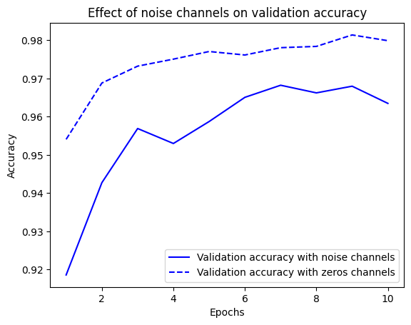

# 케라스 창시자에게 배우는 딥러닝
## 5장, *머신 러닝의 기본 요소*

## 5.1 일반화: 머신 러닝의 목표

**최적화**(optimization)는 가능한 훈련 데이터에서 최고의 성능을 얻기 위해 모델을 조정하는 과정으로 머신 러닝에서 학습에 해당된다. 반면 **일반화**(generalization)는 훈련된 모델이 이전에 본 적 없는 데이터에서 얼마나 잘 수행되는지를 의미한다. 머신 러닝의 근본적인 이슈는 최적화와 일반화 사이의 줄다리기이다. 좋은 일반화 성능을 얻는 것이 목표지만 일반호 성능을 제어할 방법은 없고 최적화가 과해지면 과대적합이 시작된다.

### 5.1.1 과소적합과 과대적합

4장에서의 모델들은 홀드아웃(holdout) 검증 데이터에서의 손실이 에포크 횟수에 따라 점차 감소하다가 필연적으로 높아지는 패턴을 보인다. 이런 패턴은 일반적이고 어떤 데이터셋에서든 확인된다.

훈련 데이터의 손실이 낮아질수록 테스트 데이터의 손실도 낮아지는 경우 이를 **과소적합**(underfitting)되었다고 말한다. 이는 즉, 네트워크가 훈련 데이터에 있는 모든 관련 패턴을 학습하지 못했음을 의미하고 모델의 성능이 계속 발전될 여지가 있다. 그러나 훈련이 특정 횟수 반복된 이후엔 더 이상 일반화 성능이 개선되지 않으며 과대적합이 시작된다. 이는 훈련 데이터에만 특화된 패턴을 학습하기 시작했다는 의미이다.

과대적합은 데이터에 노이즈가 있거나, 불확실성이 존재하거나, 드문 특성이 포함되어 있을 때 특히 발생 가능성이 높다.

#### 잡음 섞인 훈련 데이터

MNIST 데이터셋조차도 숫자로 판단되지 않거나 아예 검은색만 존재하는 이미지가 있다. 더 안 좋은 것은 정상적인 이미지에 레이블링이 잘못된 경우이다. 이러한 이상치에 모델을 맞추려고 하면 일반화 성능이 감소한다.

#### 불확실한 특성

특성 공간의 일부 영역이 동시에 여러 클래스에 연관된 경우가 종종 있다. 즉, 초평면상에서 어떤 클래스로 분류되기엔 너무나도 불확실한 영역이 존재할 수 있는 것이다. 이 영역에 모델이 너무 확신을 크게 가지면 확률적인 데이터에 과대적합될 수 있다.

#### 드문 특성과 가짜 상관관계

예를 들어 훈련 데이터에서 100개의 샘플에 등장하는 단어가 있고, 그 샘플 중 54%는 긍정, 46%는 부정이라고 가정해 보자. 이 차이는 통계적으로 완전히 우연일 수 있지만 모델은 이를 유의하다 판단하고 분류 작업에 이용할 수 있다. 이것이 과대적합의 가장 보편적인 원인 중 하나이다.

MNIST를 활용해 확실한 예를 하나 살펴보자. 기존 데이터의 784개 차원에 백색 잡음인 784개 차원을 연결하여 새로운 훈련 세트를 만든다. 이렇게 하면 데이터의 절반이 잡음이 된다. 그리고 비교를 위해 모든 값이 0인 784개의 차원을 연결하여 동일한 데이터셋을 만든다. 인간이 분류할 때는 이러한 변환이 전혀 영향을 줄 수 없다.

**코드 5-1. MNIST에 백색 잡음 픽셀과 0 픽셀 추가하기**
```
from tensorflow.keras.datasets import mnist
import numpy as np

(train_images, train_labels), _ = mnist.load_data()
train_images = train_images.reshape((60000, 28 * 28))
train_images = train_images.astype("float32") / 255
train_images_with_noise_channels = np.concatenate(
    [train_images, np.random.random((len(train_images), 784))],
    axis=1
)
train_images_with_zero_channels = np.concatenate(
    [train_images, np.zeros((len(train_images), 784))],
    axis=1
)
```

두 훈련 세트에서 2장의 모델을 훈련한다.

**코드 5-2. 백색 잡음과 0을 추가한 MNIST 데이터에서 모델 훈련하기**
```
from tensorflow import keras
from tensorflow.keras import layers

def get_model():
    model = keras.Sequential([
        layers.Dense(512, activation="relu"),
        layers.Dense(10, activation="softmax")
    ])
    model.compile(optimizer="rmsprop",
                  loss="sparse_categorical_crossentropy",
                  metrics=["accuracy"])
    return model

model = get_model()
history_noise = model.fit(
    train_images_with_noise_channels,
    train_labels,
    epochs=10,
    batch_size=128,
    validation_split=0.2
)

model = get_model()
history_zeros = model.fit(
    train_images_with_zero_channels,
    train_labels,
    epochs=10,
    batch_size=128,
    validation_split=0.2
)
```

에포크 횟수에 따라 각 모델의 검증 정확도가 어떻게 변화하는지 비교한다.

**코드 5-3. 검증 정확도 비교 그래프 그리기**
```
import matplotlib.pyplot as plt

val_acc_noise = history_noise.history["val_accuracy"]
val_acc_zeros = history_zeros.history["val_accuracy"]
epochs = range(1, 11)

plt.plot(epochs, val_acc_noise, "b-", label="Validation accuracy with noise channels")
plt.plot(epochs, val_acc_zeros, "b--", label="Validation accuracy with zeros channels")
plt.title("Effect of noise channels on validation accuracy")
plt.xlabel("Epochs")
plt.ylabel("Accuracy")
plt.legend()
plt.show()
```



잡음이 섞인 데이터에서 훈련된 모델의 검증 정확도가 일관적으로 낮게 관찰된다. 이는 순전히 가짜 상관관계의 영향 때문이다.

잡음 특성은 필연적으로 과대적합을 발생시키기 때문에 훈련 전에 **특성 선택**(feature selection)을 수행하여 모델에 미치는 영향이 확실하지 않은 특성을 제외할 수 있다. IMDB 데이터를 다룰 때처럼 최빈출 어휘 1만 개만 사용하는 것은 세련되지 않은 특성 선택 방식이다. 일반적으로 가용한 특성들에 대해 유용성 점수를 계산하는 방식이 사용된다. 특성과 레이블 사이의 상호 의존 정보(mutual information)처럼 작업에 대해 특성이 얼마나 유익한지 측정한다. 그 다음 일정한 임계 값을 넘긴 특성만 사용하면 된다.


### 5.1.2 딥러닝에서 일반화의 본질

딥러닝에서는 표현 능력이 충분하다면 어떤 것에도 맞추도록 훈련이 가능하다.

예를 들어 MNIST 레이블을 무작위하게 섞은 후 모델을 훈련하면, 입력과 뒤섞인 레이블들 사이에 아무런 관계가 없지만 비교적 작은 모델에서도 훈련 손실이 잘 감소한다. 당연하게도 가능한 일반화는 존재하지 않으므로 검증 손실은 개선되지 않는다.

**코드 5-4. 랜덤하게 섞은 레이블로 MNIST 모델 훈련하기**
```
(train_images, train_labels), _ = mnist.load_data()
train_images = train_images.reshape((60000, 28 * 28))
train_images = train_images.astype("float32") / 255

random_train_labels = train_labels[:]
np.random.shuffle(random_train_labels)

model = keras.Sequential([
    layers.Dense(512, activation="relu"),
    layers.Dense(10, activation="softmax")
])

model.compile(optimizer="rmsprop",
              loss="sparse_categorical_crossentropy",
              metrics=["accuracy"])

model.fit(
    train_images,
    random_train_labels,
    epochs=100,
    batch_size=128,
    validation_split=0.2
)
```

이런 경우엔 파이썬 딕셔너리와 같이 훈련 입력과 타깃 사이의 임의적인 매핑을 학습하게 되어 있다. 이런 매핑은 새로운 입력에 작동할 것이라고 기대하기 어렵다.

결국 딥러닝에서 일반화의 본질은 딥러닝 모델 자체와는 거의 관련이 없고 실제 세상의 정보 구조와 많은 관련이 있다.

#### 매니폴드 가설

전처리하기 전의 MNIST 분류기 입력은 28X28 크기의 정수 배열이며, 0~255 사이의 값을 가지므로 가능한 전체 입력의 가짓수는 784<sup>256</sup>이다. 하지만 매우 적은 수만이 유효한 MNIST 샘플이다. 실제 손글씨가 차지하는 공간은 모든 28X28 uint8 배열로 이루어진 공간에서 아주 작은 부분적인 공간만 차지하고, 포인트가 매우 구조적으로 배치되어 있다.

유효한 손글씨 숫자의 부분 공간은 연속적이다. 즉, 하나의 샘플을 조금 수정해도 여전히 같은 손글씨 숫자로 인식할 수 있다. 그리고 유효한 부분 공간 안에 있는 모든 샘플은 이 부분 공간을 가로지르는 매끈한 경로로 연결되어 있다. 즉, 2개의 MNIST 숫자 A와 B를 랜덤하게 선택했을 때 A를 B로 변형시키는 연속적인 중간 이미지가 있다는 의미이다.

기술적으로는 손글씨 숫자가 가능한 모든 28X28 uint8 배열로 이루어진 공간 안에서 **매니폴드**(manifold)를 형성한다고 말한다. 매니폴드란 국부적으로 선형(유클리드) 공간과 비슷하게 보이는 부모 공간의 저차원 부분 공간이다. 예를 들어 평면상의 매끄러운 한 곡선은 2D 공간 안에 있는 1D 매니폴드이다. 이 곡선의 모든 포인트에서 접선을 그릴 수 있기 때문이다. 또한 3D 공간상의 매끄러운 표면은 2D 매니폴드가 되는 셈이다.

더 일반적으로 **매니폴드 가설**(manifold hypothesis)은 실제 세상의 모든 데이터가 고차원 공간 안에 있는 저차원 매니폴드에 놓여 있다고 가정한다. 이는 우주에 있는 정보 구조에 관한 매우 강력한 가정이다. 인간이 밝혀온 지식에 따르면 이것은 타당하며 딥러닝이 작동하는 이유이다. MNIST 숫자, 사람 얼굴, 나무 형태, 음성, 자연어(natural language)까지도 이에 해당된다.

매니폴드 가설이 의미하는 바는 다음과 같다.

- 머신 러닝 모델은 가능한 입력 공간 안에서 비교적 간단하고, 저차원이며, 매우 구조적인 부분 공간(잠재 매니폴드(latent manifold))만 학습하면 된다.
- 이런 매니폴드가 존재한다면 그 중 하나 안에서 두 입력 사이를 보간(interpolation)하는 것이 항상 가능하다. 즉, 연속적인 경로를 따라 한 입력에서 다른 입력으로 변형할 때 모든 포인트가 이 매니폴드에 속한다.

샘플 사이를 보간하는 능력은 딥러닝에서 일반화를 이해하는 열쇠이다.

#### 일반화의 원천인 보간

