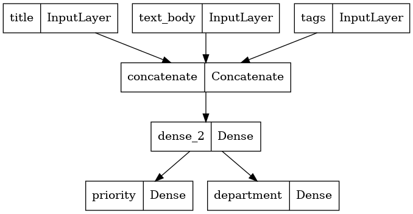
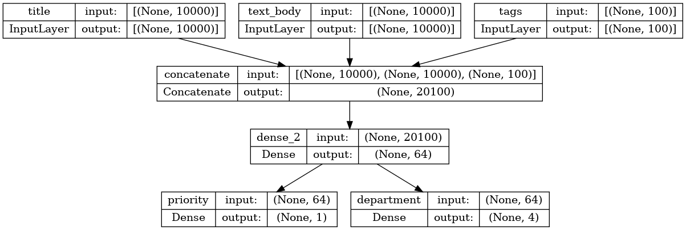
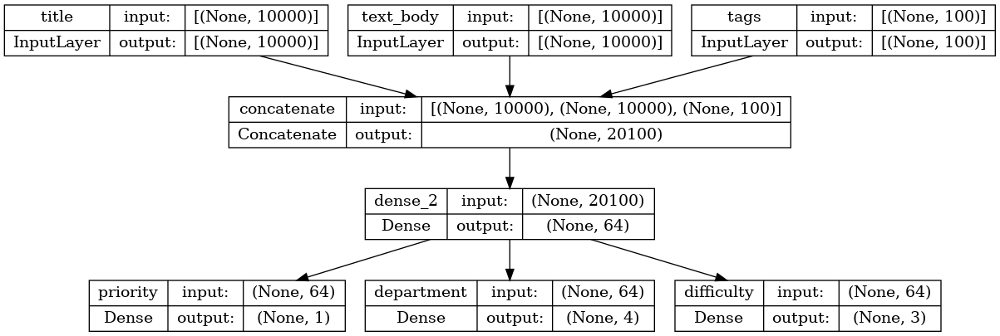
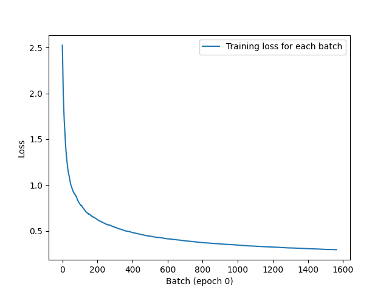

# 케라스 창시자에게 배우는 딥러닝
## 7장, *케라스 완전 정복*

## 7.1 다양한 워크플로

케라스 API 설계는 복잡성의 **단계적 공개**(progressive disclosure) 원칙을 따른다. 시작은 쉽게 하고, 필요할 때 단계마다 점진적으로 학습하여 아주 복잡한 경우를 처리할 수 있다. 누구나 간단한 문제를 처리할 수 있으면서 어떤 고급 워크플로도 가능하다. 즉, 초보자에서 전문가로 성장하면서 동일한 도구를 그대로 사용할 수 있다. 사용 방법만 달라질 뿐이다.

따라서 케라스 모델 사용에 정확히 올바른 하나의 방법이 있는 것이 아니고 유연하게 사용할 수 있다. 모든 워크플로가 동일하게 `Model`, `Layer` 같은 API를 기반으로 하기에 워크플로 간에 호출이 가능하다.


## 7.2 케라스 모델을 만드는 여러 방법

케라스에서 모델을 만드는 방법은 세 가지가 있다.

- **Sequential 모델**: 가장 시작하기 쉬운 API이다. 기본적으로 하나의 파이썬 리스트이기 때문에 층을 쌓을 수만 있다.
- **함수형 API**(functional API): 그래프 같은 모델 구조를 주로 다룬다. 사용성과 유연성 사이의 적절한 중간 지점에 해당된다. 따라서 가장 널리 사용되는 모델 구축 API이다.
- **Model 서브클래싱**(subclassing): 모든 것을 밑바닥부터 구현할 수 있는 가장 저수준의 방법이다. 모든 상세한 내용을 완전히 제어하고 싶은 경우에 적합하지만 여러 가지 케라스 내장 기능을 사용하지 못하기 때문에 실수할 가능성이 크다.

### 7.2.1 Sequential 모델

케라스 모델을 만드는 가장 간단한 방법이다.

**코드 7-1. Sequential 클래스**
```
from tensorflow import keras
from tensorflow.keras import layers

model = keras.Sequential([
    layers.Dense(64, activation="relu"),
    layers.Dense(10, activation="softmax")
])
```

동일한 모델을 `add()` 메소드를 사용해 점진적으로 만들 수도 있다.

**코드 7-2. 점진적으로 Sequential 모델 만들기**
```
model = keras.Sequential()
model.add(layers.Dense(64, activation="relu"))
model.add(layers.Dense(10, activation="softmax"))
```

4장에서 알아본 바와 같이 층은 처음 호출될 때 만들어진다. 층의 가중치 크기가 입력 크기에 따라 달라지기 때문이다. 따라서 앞의 Sequential 모델은 어떤 가중치도 가지고 있지 않다.

**코드 7-3. build() 메소드 호출 전의 모델은 가중치가 없다**
```
>>> model.weights
ValueError: Weights for model 'sequential_1' have not yet been created. Weights are created when the model is first called on inputs or `build()` is called with an `input_shape`.
Output is truncated. View as a scrollable element or open in a text editor. Adjust cell output settings...
```

가중치를 생성하려면 어떤 데이터를 사용해 호출하거나 `build()` 메소드를 호출하여 입력 크기를 직접 지정해야 한다.

**코드 7-4. 가중치를 만들기 위해 모델을 호출한다**
```
>>> model.build(input_shape=(None, 3))
>>> model.weights
[<tf.Variable 'dense_2/kernel:0' shape=(3, 64) dtype=float32, numpy=
 array([[ 0.14485991, -0.19207734,  0.00301257,  0.00564203, -0.2003037 ,
         -0.04069087, -0.03673145,  0.26229954,  0.24616188,  0.01581174,
          0.03658161, -0.23985785,  0.20763212, -0.26009455,  0.2257452 ,
          0.11073321, -0.08046149, -0.18871516,  0.15010571, -0.01123828,
         -0.04747885,  0.07035956, -0.29411757,  0.06580359,  0.05810371,
          0.04807761,  0.15823182,  0.27975678,  0.26390153,  0.2547136 ,
          0.03526282,  0.1512323 , -0.29281834,  0.26212013, -0.04602501,
          0.1381245 ,  0.01172844, -0.00502366,  0.15327391,  0.2831776 ,
          0.12493163, -0.11012411, -0.24750252,  0.26392227, -0.28758195,
         -0.24903813, -0.22205153,  0.07197079, -0.10868582,  0.22222328,
         -0.03826797, -0.2881966 ,  0.05050641,  0.04949784,  0.12121606,
          0.21703112, -0.11255813,  0.06947249, -0.17784923,  0.00337023,
          0.03825685, -0.2860621 ,  0.24071282,  0.07545254],
        [ 0.0132727 , -0.08072604,  0.21542788,  0.10270876, -0.16740084,
         -0.12371565,  0.18598306, -0.22164258, -0.00836241,  0.1760208 ,
          0.12860104,  0.20032847, -0.16698438, -0.13637619,  0.2598145 ,
         -0.18360376, -0.21389788, -0.21184963, -0.08947837, -0.17701876,
          0.04643178,  0.00068694,  0.25474143,  0.09727186, -0.0943014 ,
         -0.1811549 ,  0.07483554,  0.14699018,  0.15854234, -0.05522305,
         -0.04871851, -0.22224703,  0.24921536,  0.01723146, -0.00068259,
          0.12108079,  0.25501966,  0.20947456, -0.28061342,  0.2848066 ,
         -0.2484929 , -0.08790645, -0.03545246, -0.17559594,  0.15264219,
         -0.14418367, -0.07906744, -0.16930538,  0.01421461, -0.12966846,
          0.00444552, -0.12537484,  0.1466229 , -0.13222833, -0.11219049,
...
        [-2.66723335e-01,  2.41590947e-01, -9.45264250e-02,
          1.60042018e-01,  2.16368526e-01,  1.01584792e-01,
         -1.66403294e-01,  6.34652078e-02, -2.50389218e-01,
          2.42061168e-01]], dtype=float32)>,
 <tf.Variable 'dense_3/bias:0' shape=(10,) dtype=float32, numpy=array([0., 0., 0., 0., 0., 0., 0., 0., 0., 0.], dtype=float32)>]
Output is truncated. View as a scrollable element or open in a text editor. Adjust cell output settings...
```

`build()` 메소드 호출 후에는 디버깅에 유용한 `summary()` 메소드를 사용하여 모델 구조를 출력할 수 있다.

**코드 7-5. summary() 메소드**
```
>>> model.summary()
Model: "sequential_1"
_________________________________________________________________
 Layer (type)                Output Shape              Param #   
=================================================================
 dense_2 (Dense)             (None, 64)                256       
                                                                 
 dense_3 (Dense)             (None, 10)                650       
                                                                 
=================================================================
Total params: 906 (3.54 KB)
Trainable params: 906 (3.54 KB)
Non-trainable params: 0 (0.00 Byte)
_________________________________________________________________
```

모델의 이름은 sequential_1로 지정되어 있다. 케라스에서는 모델과 층을 포함한 모든 것의 이름을 지정할 수 있다.

**코드 7-6. name 매개변수로 모델과 층에 이름 지정하기**
```
>>> model = keras.Sequential(name="my_example_model")
>>> model.add(layers.Dense(64, activation="relu", name="my_first_layer"))
>>> model.add(layers.Dense(10, activation="softmax", name="my_last_layer"))
>>> model.build((None, 3))
>>> model.summary()
Model: "my_example_model"
_________________________________________________________________
 Layer (type)                Output Shape              Param #   
=================================================================
 my_first_layer (Dense)      (None, 64)                256       
                                                                 
 my_last_layer (Dense)       (None, 10)                650       
                                                                 
=================================================================
Total params: 906 (3.54 KB)
Trainable params: 906 (3.54 KB)
Non-trainable params: 0 (0.00 Byte)
_________________________________________________________________
```

Sequential 모델의 가중치를 바로 생성하는 방법 중 하나는 `Input` 클래스를 사용하여 모델의 입력 크기를 미리 지정하는 것이다.

**코드 7-7. 모델의 입력 크기를 미리 지정하기**
```
model = keras.Sequential()
model.add(keras.Input(shape=(3, )))
model.add(layers.Dense(64, activation="relu"))
```

```
>>> model.summary()
Model: "sequential_2"
_________________________________________________________________
 Layer (type)                Output Shape              Param #   
=================================================================
 dense_4 (Dense)             (None, 64)                256       
                                                                 
=================================================================
Total params: 256 (1.00 KB)
Trainable params: 256 (1.00 KB)
Non-trainable params: 0 (0.00 Byte)
_________________________________________________________________

>>> model.add(layers.Dense(10, activation="softmax"))
>>> model.summary()
Model: "sequential_2"
_________________________________________________________________
 Layer (type)                Output Shape              Param #   
=================================================================
 dense_4 (Dense)             (None, 64)                256       
                                                                 
 dense_5 (Dense)             (None, 10)                650       
                                                                 
=================================================================
Total params: 906 (3.54 KB)
Trainable params: 906 (3.54 KB)
Non-trainable params: 0 (0.00 Byte)
_________________________________________________________________
```

### 7.2.2 함수형 API

`Sequential` 모델로는 하나의 입력과 하나의 출력을 파이프라이닝한 모델만 표현할 수 있다. 그러나 실제로는 다중 입력 - 다중 출력 또는 비선형적인 구조를 가진 모델이 자주 등장한다. 이런 경우에 함수형 API를 사용하여 모델을 만든다.

#### 간단한 예제

먼저 2개의 층을 쌓아보자. 다음은 함수형 API 버전의 코드이다.

**코드 7-8. 2개의 Dense 층을 가진 간단한 함수형 모델**
```
from tensorflow import keras
from tensorflow.keras import layers

inputs = keras.Input(shape=(3, ), name="my_input")
features = layers.Dense(64, activation="relu")(inputs)
outputs = layers.Dense(10, activation="softmax")(features)
model = keras.Model(inputs=inputs, outputs=outputs)
```

`Input` 클래스 객체는 모델이 처리할 데이터의 크기와 `dtype`에 대한 정보를 가지고 있다. 이렇게 실제 데이터를 가지고 있지 않지만 모델이 보게 될 데이터 텐서의 사양이 인코딩되어 있는 객체를 **심볼릭 텐서**(symbolic tensor)라고 부른다.

모든 케라스 층은 `features = layers.Dense(64, activation="relu")(inputs)` 또는 `outputs = layers.Dense(10, activation="softmax")(features)`와 같이 실제 데이터 텐서나 심볼릭 텐서로 호출할 수 있다.

최종 출력(`output`)을 얻은 후에는 `Model` 클래스에 입력과 출력을 전달하여 모델 객체를 생성한다.

```
>>> model.summary()
Model: "model"
_________________________________________________________________
 Layer (type)                Output Shape              Param #   
=================================================================
 my_input (InputLayer)       [(None, 3)]               0         
                                                                 
 dense (Dense)               (None, 64)                256       
                                                                 
 dense_1 (Dense)             (None, 10)                650       
                                                                 
=================================================================
Total params: 906 (3.54 KB)
Trainable params: 906 (3.54 KB)
Non-trainable params: 0 (0.00 Byte)
_________________________________________________________________
```

#### 다중 입력, 다중 출력 모델

대부분의 딥러닝 모델은 리스트 형태보다는 그래프 형태이다. 이런 모델의 정의에 함수형 API가 유용하게 사용된다.

예를 들어 고객 이슈 티켓에 우선순위를 지정하고 적절한 부서로 전달하는 시스템을 만든다고 하자. 이 모델은 다음 3개의 입력을 사용한다.

- 이슈 티켓의 제목(텍스트 입력)
- 이슈 티켓의 텍스트 본문(텍스트 입력)
- 사용자가 추가한 태그(범주형 입력으로 이 예제에서는 원-핫 인코딩되었다고 가정)

텍스트 입력을 크기가 `vocabulary_size`인 0과 1의 배열로 인코딩할 수 있다.

이 모델은 출력 역시 2개이다.

- 이슈 티켓의 우선순위 점수로 0과 1 사이의 스칼라(시그모이드 출력)
- 이슈 티켓을 처리해야 할 부서(전체 부서 집합에 대한 소프트맥스 출력)

함수형 API를 사용하여 이런 모델을 몇 줄의 코드로 생성할 수 있다.

**코드 7-9. 다중 입력, 다중 출력 함수형 모델**
```
vocabulary_size = 10000
num_tags = 100
num_departments = 4

# 모델의 입력을 정의한다
title = keras.Input(shape=(vocabulary_size, ), name="title")
text_body = keras.Input(shape=(vocabulary_size, ), name="text_body")
tags = keras.Input(shape=(num_tags, ), name="tags")

# 입력 특성을 하나의 텐서 features로 연결한다
features = layers.Concatenate()([title, text_body, tags])
# 중간 층을 적용하여 입력 특성을 더 풍부한 표현으로 재결합시킨다
features = layers.Dense(64, activation="relu")(features)

# 모델의 출력을 정의한다
priority = layers.Dense(1, activation="sigmoid", name="priority")(features)
department = layers.Dense(num_departments, activation="softmax", name="department")(features)

# 입력과 출력을 지정하여 모델을 만든다
model = keras.Model(inputs=[title, text_body, tags],
                    outputs=[priority, department])
```

층으로 구성된 어떤 그래프도 함수형 API로 구현이 가능하다.

#### 다중 입력, 다중 출력 모델 훈련하기

입력과 출력 데이터의 리스트로 `fit()` 메소드를 호출하면 모델을 훈련할 수 있다. 데이터의 리스트는 모델 정의 시 `Model` 클래스에 전달한 순서와 같아야 한다.

**코드 7-10. 입력과 타깃 배열 리스트를 전달하여 모델 훈련하기**
```
import numpy as np

num_samples = 1280

title_data = np.random.randint(0, 2, size=(num_samples, vocabulary_size))
text_body_data = np.random.randint(0, 2, size=(num_samples, vocabulary_size))
tags_data = np.random.randint(0, 2, size=(num_samples, num_tags))

priority_data = np.random.random(size=(num_samples, 1))
department_data = np.random.randint(0, 2, size=(num_samples, num_departments))

model.compile(optimizer="rmsprop",
              loss=["mean_squared_error", "categorical_crossentropy"],
              metrics=[["mean_absolute_error"], ["accuracy"]])

model.fit([title_data, text_body_data, tags_data],
          [priority_data, department_data],
          epochs=1)

model.evaluate([title_data, text_body_data, tags_data],
              [priority_data, department_data])

priority_preds, department_preds = model.predict([title_data, text_body_data, tags_data])
```

입력과 출력이 많은 경우엔 입력 순서에 관계 없이 데이터를 딕셔너리로 전달할 수도 있다. `Input` 객체와 출력 층에 부여한 이름을 활용한다.

**코드 7-11. 입력과 타깃 배열을 딕셔너리로 전달하여 모델 훈련하기**
```
model.compile(optimizer="rmsprop",
              loss={"priority": "mean_squared_error",
                    "department": "categorical_crossentropy"},
              metrics={"priority": ["mean_absolute_error"],
                       "department": ["accuracy"]})

model.fit({"title": title_data,
           "text_body": text_body_data,
           "tags": tags_data},
          {"priority": priority_data,
           "department": department_data},
          epochs=1)

model.evaluate({"title": title_data,
                "text_body": text_body_data,
                "tags": tags_data},
               {"priority": priority_data,
                "department": department_data})

priority_preds, department_preds = model.predict({"title": title_data, "text_body": text_body_data, "tags": tags_data})
```

#### 함수형 API의 장점: 층 연결 구조 활용하기

함수형 모델은 그래프 데이터 구조이다. 따라서 이전 그래프 노드(node)(층의 출력)를 새 모델의 일부로 재사용할 수 있다. 대부분의 연구자들이 심층 신경망에 대해 생각할 때 사용하는 멘탈 모델(mental model)인 층 그래프(graph of layers)에도 잘 맞는다. 이를 통해 모델 시각화와 특성 추출이라는 두 가지 중요한 기능을 사용할 수 있다.

이전에 정의한 모델의 연결 구조(**토폴로지**(topology))를 시각화한다. `plot_model()` 함수를 사용하여 모델을 그래프로 그릴 수 있다.

```
keras.utils.plot_model(model, "ticket_classifier.png")
```



각 층의 입력 크기를 추가하려면 `show_shape` 속성을 True로 전달한다.

```
keras.utils.plot_model(model, "ticket_classifier_with_shape_info.png", show_shapes=True)
```



텐서 크기에서 None에 해당하는 부분은 모델의 배치 크기를 나타낸다. 이 모델은 어떤 크기의 배치에서도 사용 가능하다.

층 연결 구조를 참조하여 그래프에 있는 개별 노드를 조사하고 재사용할 수 있다.

`model.layers` 속성은 모델에 있는 모든 층의 리스트를 가지고 있다. 각 층에 대해 `layer.input`, `layer.output`을 출력해볼 수 있다.

**코드 7-12. 함수형 모델에 있는 층의 입력과 출력을 출력하기**
```
>>> model.layers
[<keras.src.engine.input_layer.InputLayer at 0x7f977de42980>,
 <keras.src.engine.input_layer.InputLayer at 0x7f977de409d0>,
 <keras.src.engine.input_layer.InputLayer at 0x7f977de40850>,
 <keras.src.layers.merging.concatenate.Concatenate at 0x7f970c234250>,
 <keras.src.layers.core.dense.Dense at 0x7f970c238580>,
 <keras.src.layers.core.dense.Dense at 0x7f9707994b80>,
 <keras.src.layers.core.dense.Dense at 0x7f9707997cd0>]
>>> model.layers[3].input
[<KerasTensor: shape=(None, 10000) dtype=float32 (created by layer 'title')>,
 <KerasTensor: shape=(None, 10000) dtype=float32 (created by layer 'text_body')>,
 <KerasTensor: shape=(None, 100) dtype=float32 (created by layer 'tags')>]
>>> model.layers[3].output
<KerasTensor: shape=(None, 20100) dtype=float32 (created by layer 'concatenate')>
```

**특성 추출**(feature extraction)을 사용하여 다른 모델에서 중간 특성을 재사용하는 모델을 만들 수 있다.

이전 모델에 또 다른 출력을 추가한다고 가정해 보자. 이슈 티켓이 해결되는 데 걸리는 시간, 즉 일종의 난이도를 추정하려고 한다. 이를 위해 `quick`, `medium`, `difficult` 3개의 범주에 대한 분류 층을 추가한다. 모델을 처음부터 다시 만들 필요 없이 다음과 같이 중간 층을 참조하여 중간 특성부터 시작한다.

**코드 7-13. 중간 층의 출력을 재사용해서 새로운 모델 만들기**
```
features = model.layers[4].output
difficulty = layers.Dense(3, activation="softmax", name="difficulty")(features)
new_model = keras.Model(inputs=[title, text_body, tags],
                        outputs=[priority, department, difficulty])
```

새로운 모델을 그래프로 출력해 보자.

```
keras.utils.plot_model(new_model, "updated_ticket_classifier.png", show_shapes=True)
```



### 7.2.3 Model 서브클래싱

Model 서브클래싱은 가장 고급의 모델 구축 패턴이다. Model 클래스를 상속하는 방법은 다음과 같다.

- `__init__()` 메소드에서 모델이 사용할 층을 정의한다.
- `call()` 메소드에서 앞서 만든 층을 사용하여 모델의 정방향 패스를 정의한다.
- 서브클래스의 객체를 만들고 데이터와 함께 호출하여 가중치를 만든다.

#### 이전 예제를 서브클래싱 모델로 다시 만들기

`Model` 클래스를 상속하여 고객 이슈 티켓 관리 모델을 다시 구현한다.

**코드 7-14. 간단한 서브클래싱 모델**
```
class CustomerTicketModel(keras.Model):
    def __init__(self, num_departments):
        # 반드시 부모 클래스의 생성자를 호출한다
        super().__init__()
        # 생성자에서 층을 정의한다
        self.concat_layer = layers.Concatenate()
        self.mixing_layer = layers.Dense(64, activation="relu")
        self.priority_scorer = layers.Dense(1, activation="sigmoid")
        self.department_classifier = layers.Dense(num_departments, activation="softmax")
    
    # call() 메소드에서 정방향 패스를 정의한다
    def call(self, inputs):
        title = inputs["title"]
        text_body = inputs["text_body"]
        tags = inputs["tags"]
        features = self.concat_layer([title, text_body, tags])
        features = self.mixing_layer(features)
        priority = self.priority_scorer(features)
        department = self.department_classifier(features)
        return priority, department
```

모델을 정의하면 이 클래스의 객체를 만들 수 있다. `Layer` 클래스와 마찬가지로 데이터로 처음 호출 시 가중치를 생성한다.

```
model = CustomerTicketModel(num_departments=4)
priority, department = model({"title": title_data,
                              "text_body": text_body_data,
                              "tags": tags_data})
```

모델을 컴파일하고 훈련할 수도 있다.

```
model.compile(optimizer="rmsprop",
              # 손실과 측정 지표로 전달하는 값은 call() 메소드가 반환하는 것과 정확히 일치해야 한다
              loss=["mean_squared_error", "categorical_crossentropy"],
              metrics=[["mean_absolute_error"], ["accuracy"]])

model.fit(  # 입력 데이터의 구조는 call() 메소드가 기대하는 것과 정확히 일치해야 한다
          {"title": title_data,
           "text_body": text_body_data,
           "tags": tags_data},
            # 타깃 데이터의 구조는 call() 메소드가 반환하는 것과 정확히 일치해야 한다
          [priority_data, department_data],
          epochs=1)

model.evaluate({"title": title_data,
                "text_body": text_body_data,
                "tags": tags_data},
               [priority_data, department_data])

priority_preds, department_preds = model.predict({"title": title_data,
                                                  "text_body": text_body_data,
                                                  "tags": tags_data})
```

함수형 API로는 층의 유향 비순환 그래프(directed acyclic graph)까지만 표현할 수 있지만 Model 서브클래싱 워크플로는 그 이상을 표현할 수 있다.

#### 주의: 서브클래싱된 모델이 지원하지 않는 것

서브클래싱은 함수형 API처럼 레고 블록을 맞추는 느낌이라기보단 새로운 파이썬 객체를 개발하는 과정이다. 그러므로 디버깅 작업이 더 많이 필요하다.

함수형 모델은 명시적인 데이터 구조인 층의 그래프이므로 출력, 조사, 수정이 가능하다. 그러나 서브클래싱 모델은 한 덩어리의 바이트코드(bytecode)로 원시 코드가 담긴 `call()` 메소드를 가진 파이썬 클래스이다. 이것이 서브클래싱 워크플로 특유의 유연성의 원천이다.

그러나 층이 서로 연결되는 방식이 `call()` 메소드로 추상화되기에 이 정보를 활용할 수 없다. `summary()` 메소드가 층의 연결 구조를 출력할 수 없고, `plot_model()` 함수로 모델의 구조를 시각화할 수도 없다. 이와 같은 이유로 특성 추출을 위해 층 그래프 노드를 참조하는 것도 불가능하다. 모델의 객체를 생성하고 나면 일단 정방향 패스는 완전한 블랙박스가 된다.

### 7.2.4 여러 방식을 혼합하여 사용하기

Sequential 모델, 함수형 API, Model 서브클래싱 패턴끼리는 상호 운영이 가능하다.

예를 들어 다음과 같이 함수형 모델에서 서브클래싱 층이나 모델을 사용할 수 있다.

**코드 7-15. 서브클래싱한 모델을 포함하는 함수형 모델 만들기**
```
class Classifier(keras.Model):
    def __init__(self, num_classes=2):
        super().__init__()
        if num_classes == 2:
            num_units = 1
            activation = "sigmoid"
        else:
            num_units = num_classes
            activation = "softmax"
        self.dense = layers.Dense(num_units, activation=activation)
        
    def call(self, inputs):
        return self.dense(inputs)

inputs = keras.Input(shape=(3, ))
features = layers.Dense(64, activation="relu")(inputs)
outputs = Classifier(num_classes=10)(features)
model = keras.Model(inputs=inputs, outputs=outputs)
```

반대로 서브클래싱 층이나 모델의 일부로 함수형 모델을 사용할 수 있다.

**코드 7-16. 함수형 모델을 포함하는 서브클래싱 모델 만들기**
```
inputs = keras.Input(shape=(64, ))
outputs = layers.Dense(1, activation="sigmoid")(inputs)
binary_classifier = keras.Model(inputs=inputs, outputs=outputs)

class MyModel(keras.Model):
    def __init__(self, num_classes=2):
        super().__init__()
        self.dense = layers.Dense(64, activation="relu")
        self.classifier = binary_classifier
        
    def call(self, inputs):
        features = self.dense(inputs)
        return self.classifier(features)
    
model = MyModel()
```

### 7.2.5 작업에 적합한 도구 사용하기

일반적으로 함수형 API가 쉬운 사용성, 유연성을 적절하게 보장한다. 층 연결 구조를 활용한 모델 출력, 특성 추출과 같은 용도에 잘 맞는다. 모델을 층의 유향 비순환 그래프로 표현할 수 있다면 함수형 API 사용이 권장된다.

앞으로 이 책의 모든 예제는 함수형 API를 사용할 것이다. 하지만 서브클래싱 층을 자주 겸용하여 함수형 API의 장점을 유지하면서 높은 개발 유연성을 보장할 것이다.


## 7.3 내장된 훈련 루프와 평가 루프 사용하기

`compile()`, `fit()`, `evaluate()`, `predict()` 워크플로에 대해 다시 한번 되짚어보자.

**코드 7-17. 표준 워크플로: compile(), fit(), evaluate(), predict()**
```
from tensorflow.keras.datasets import mnist

# 재사용 가능하도록 별도의 함수로 모델을 만든다
def get_mnist_model():
    inputs = keras.Input(shape=(28 * 28, ))
    features = layers.Dense(512, activation="relu")(inputs)
    features = layers.Dropout(0.5)(features)
    outputs = layers.Dense(10, activation="softmax")(features)
    model = keras.Model(inputs, outputs)
    return model

# 데이터를 로드하고 검증 데이터까지 분리한다
(images, labels), (test_images, test_labels) = mnist.load_data()
images = images.reshape((60000, 28 * 28)).astype("float32") / 255
test_images = test_images.reshape((10000, 28 * 28)).astype("float32") / 255
train_images, val_images = images[10000:], images[:10000]
train_labels, val_labels = labels[10000:], labels[:10000]

model = get_mnist_model()

# 옵티마이저, 최소화할 손실 함수, 모니터링할 지표를 지정하여 모델을 컴파일한다
model.compile(optimizer="rmsprop",
              loss="sparse_categorical_crossentropy",
              metrics=["accuracy"])

# fit() 메소드를 사용해 모델을 훈련한다
model.fit(train_images, train_labels,
          epochs=3,
          validation_data=(val_images, val_labels))

# evaluate() 메소드를 사용해 새로운 데이터에 대한 손실과 측정 지표를 계산한다
test_metrics = model.evaluate(test_images, test_labels)

# predict() 메소드를 사용해 새로운 데이터에 대한 분류 확률을 계산한다
predictions = model.predict(test_images)
```

위의 간단한 워크플로를 커스터마이징할 수 있는 몇 가지 방법이 있다.

- 사용자 정의 측정 지표를 전달한다.
- `fit()` 메소드에 **콜백**(callback)을 전달하여 훈련하는 동안 특정 시점에 수행될 행동을 예약한다.

### 7.3.1 사용자 정의 지표 만들기

지표(metric)는 모델의 성능을 측정하는 열쇠이다. 특히 훈련 데이터와 테스트 데이터 성능 간의 차이를 측정하는 것이 중요하다. 분류, 회귀 문제에 일반적으로 사용되는 지표는 `keras.metrics` 모듈에 이미 포함되어 있다.

케라스 지표는 `keras.metrics.Metric` 클래스를 상속한 클래스이다. 층과 마찬가지로 지표는 텐서플로 변수에 내부 상태를 저장한다. 층과 달리 이 변수는 역전파로 업데이트되지 않는다. 따라서 상태 업데이트 로직을 `update_state()` 메소드에 직접 작성해야 한다.

다음은 평균 제곱근 오차(Root Mean Squared Error, RMSE)를 계산하는 간단한 사용자 정의 지표이다.

**코드 7-18. Metric 클래스를 상속하여 사용자 정의 지표 구현하기**
```
import tensorflow as tf

class RootMeanSquaredError(keras.metrics.Metric):
    # 생성자에서 상태 변수를 정의한다. 층과 마찬가지로 add_weight() 메소드를 사용한다.
    def __init__(self, name="rmse", **kwargs):
        super().__init__(name=name, **kwargs)
        self.mse_sum = self.add_weight(name="mse_sum", initializer="zeros")
        self.total_samples = self.add_weight(name="total_samples", initializer="zeros", dtype="int32")
        
    # update_state() 메소드 안에 상태 업데이트 로직을 구현한다
    def update_state(self, y_true, y_pred, sample_weight=None):
        y_true = tf.one_hot(y_true, depth=tf.shape(y_pred)[1])
        mse = tf.reduce_sum(tf.square(y_true - y_pred))
        self.mse_sum.assign_add(mse)
        num_samples = tf.shape(y_pred)[0]
        self.total_samples.assign_add(num_samples)
    
    def result(self):
        return tf.sqrt(self.mse_sum / tf.cast(self.total_samples, tf.float32))
    
    def reset_state(self):
        self.mse_sum.assign(0.)
        self.total_samples.assign(0)
```

`result()` 메소드는 현재 지표 값을 반환하고, `reset_state()` 메소드에서는 객체를 재생성하지 않고 상태를 초기화한다.

사용자 정의 지표는 다음과 같이 내장 지표와 동일한 방식으로 사용할 수 있다.

```
model = get_mnist_model()

model.compile(optimizer="rmsprop",
              loss="sparse_categorical_crossentropy",
              metrics=["accuracy", RootMeanSquaredError()])

model.fit(train_images, train_labels,
          epochs=3,
          validation_data=(val_images, val_labels))

test_metrics = model.evaluate(test_images, test_labels)
```

### 7.3.2 콜백 사용하기

케라스의 `model.fit()`은 종이비행기에 비유할 수 있다. 일단 한 번 손을 벗어나면 경로와 착륙 지점을 제어할 수 없다는 점에서 그러하다. **콜백**(callback)은 이러한 종이비행기를 스스로 판단하고 동적으로 결정하는 자동 드론처럼 만들어 준다.

콜백은 `fit()` 메소드 호출 시 전달되는 객체이다. 이 객체는 특정 메소드가 구현된 클래스 객체이다. 훈련 중 모델은 여러 지점에서 콜백을 호출하고, 콜백은 모델 상태와 성능에 대한 모든 정보에 접근하고 훈련 중지, 모델 저장, 가중치 적재 또는 모델 상태 변경 등을 처리할 수 있다.

다음은 콜백 사용 사례이다.

- **모델 체크포인트(checkpoint) 저장**: 훈련하는 동안 특정 지점에서의 모델의 현재 가중치를 저장한다.
- **조기 종료**(early stopping): 검증 손실이 더 이상 향상되지 않을 때 훈련을 중지한다.
- **훈련하는 동안 하이퍼파라미터 값을 동적으로 조정하는 경우**: 옵티마이저의 학습률 같은 경우이다.
- **훈련과 검증 지표를 로그에 기록하거나 모델이 학습한 표현이 업데이트될 때마다 시각화하는 것**: `fit()` 메소드의 진행 표시줄도 하나의 콜백이다.

`keras.callbacks` 모듈에는 여러 가지 내장 콜백이 포함되어 있다. 예를 들어 다음과 같은 것들이 있다.

- keras.callbacks.ModelCheckpoint
- keras.callbacks.EarlyStopping
- keras.callbacks.LearningRateScheduler
- keras.callbacks.ReduceLROnPlateau
- keras.callbacks.CSVLogger

#### ModelCheckpoint와 EarlyStopping 콜백

`EarlyStopping` 콜백을 사용하면 검증 손실이 더 이상 향상되지 않을 때 훈련을 멈출 수 있다. 기존에 과대적합이 될 때까지 에포크를 증가시키고 다시 최적적합이 될 때까지 훈련을 반복한 비효율적인 과정을 개선할 수 있다.

정해진 에포크 동안 모니터링 지표가 개선되지 않을 때 훈련을 중지한다. 예를 들어 과대적합이 시작되자마자 훈련을 중지할 수 있다. 일반적으로 이 콜백은 훈련하는 동안 모델을 계속 저장해주는 `ModelCheckpoint` 콜백과 함께 사용한다.

**코드 7-19. fit() 메소드에서 callbacks 매개변수 사용하기**
```
# fit() 메소드의 callbacks 매개변수를 사용하여 콜백의 리스트를 모델로 전달한다
callbacks_list = [
    # 성능 향상이 멈추면 훈련을 정지한다
    keras.callbacks.EarlyStopping(
        # 모델의 검증 정확도를 모니터링한다
        monitor="val_accuracy",
        # 두 번의 에포크 동안 지표가 개선되지 않으면 훈련을 중지한다
        patience=2,
    ),
    
    # 매 에포크 끝에서 현재 가중치를 저장한다
    keras.callbacks.ModelCheckpoint(
        # 모델 파일의 저장 경로
        filepath="./checkpoint_model.keras",
        # 검증 손실이 개선되지 않으면 모델 파일을 덮어쓰지 않는다
        monitor="val_loss",
        save_best_only=True,
    )
]

model = get_mnist_model()

model.compile(optimizer="rmsprop",
              loss="sparse_categorical_crossentropy",
              metrics=["accuracy"])

model.fit(train_images, train_labels,
          epochs=10,
          callbacks=callbacks_list,
          validation_data=(val_images, val_labels))
```

`model.save([경로])`를 호출하여 모델을 저장할 수 있고, 저장된 모델은 `model = keras.models.load_model([경로])`로 로드할 수 있다.

### 7.3.3 사용자 정의 콜백 만들기

사용자 정의 콜백은 `keras.callbacks.Callback` 클래스를 상속받아 구현한다. 그 다음 훈련하는 동안 다음과 같이 여러 지점에서 호출될 다음과 같은 메소드를 구현한다.

- `on_epoch_begin(epoch, logs)`: 각 에포크가 시작될 때 호출된다.
- `on_epoch_end(epoch, logs)`: 각 에포크가 종료될 때 호출된다.
- `on_batch_begin(batch, logs)`: 각 배치 처리가 시작되기 전에 호출된다.
- `on_batch_end(batch, logs)`: 각 배치 처리가 끝난 후에 호출된다.
- `on_train_begin(logs)`: 훈련이 시작될 때 호출된다.
- `on_train_end(logs)`: 훈련이 끝날 때 호출된다.

`logs` 매개변수는 이전 배치, 에포크 또는 훈련 실행에 대한 정보가 담긴 딕셔너리이다. 또한, on_epoch_*, on_batch_* 메소드는 에포크 인덱스나 배치 인덱스를 첫 번째 매개변수로 받는다.

다음은 훈련 도중 배치 손실 값을 리스트에 추가하고 에포크 끝에서 그래프로 저장하는 간단한 예제이다.

**코드 7-20. Callback 클래스를 상속하여 사용자 정의 콜백 만들기**
```
from matplotlib import pyplot as plt

class LossHistory(keras.callbacks.Callback):
    def on_train_begin(self, logs):
        self.per_batch_losses = []
        
    def on_batch_end(self, batch, logs):
        self.per_batch_losses.append(logs.get("loss"))
        
    def on_epoch_end(self, epoch, logs):
        plt.clf()
        plt.plot(range(len(self.per_batch_losses)), self.per_batch_losses, label="Training loss for each batch")
        plt.xlabel(f"Batch (epoch {epoch})")
        plt.ylabel("Loss")
        plt.legend()
        plt.savefig(f"./figs/plot_at_epoch_{epoch}")
        self.per_batch_losses = []
```

```
model = get_mnist_model()

model.compile(optimizer="rmsprop",
              loss="sparse_categorical_crossentropy",
              metrics=["accuracy"])

model.fit(train_images, train_labels,
          epochs=10,
          callbacks=[LossHistory()],
          validation_data=(val_images, val_labels))
```



### 7.3.4 텐서보드를 사용한 모니터링과 시각화

텐서보드는 로컬에서 실행할 수 있는 브라우저 기반의 애플리케이션이다. 텐서보드를 사용하면 다음과 같은 일들을 수행할 수 있다.

- 훈련하는 동안 측정 지표를 시각적으로 모니터링한다.
- 모델 구조를 시각화한다.
- 활성화 출력과 그레이디언트의 히스토그램을 그린다.
- 임베딩을 3D로 표현한다.

텐서보드를 사용하는 가장 쉬운 방법은 `keras.callbacks.TensorBoard` 콜백이다.

```
model = get_mnist_model()

model.compile(optimizer="rmsprop",
              loss="sparse_categorical_crossentropy",
              metrics=["accuracy"])

tensorboard = keras.callbacks.TensorBoard(
    log_dir="./logs/tensorboard",
)

model.fit(train_images, train_labels,
          epochs=10,
          validation_data=(val_images, val_labels),
          callbacks=[tensorboard])
```

모델 실행 후에는 지정된 위치에 로그가 기록될 것이다. 다음과 같은 jupyter 스크립트로 `tensorboard` 명령을 사용할 수 있다.

```
!tensorboard --logdir ./logs/tensorboard
```

코랩 노트북에서는 다음과 같은 명령어를 사용하면 된다.

```
%load_ext tensorboard
%tensorboard --logdir ./logs/tensorboard
```


## 7.4 사용자 정의 훈련, 평가 루프 만들기

