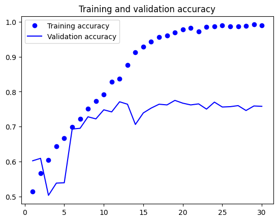

# 케라스 창시자에게 배우는 딥러닝
## 8장, *컴퓨터 비전을 위한 딥러닝*

**합성곱 신경망**(convolutional neural network)은 2011~2015년 사이의 초기 딥러닝의 부흥을 이끈 종류의 딥러닝 모델이다. 이 장에서 소개할 합성곱 신경망은 컨브넷(convnet)이라고도 부른다.

## 8.1 합성곱 신경망 소개

MNIST 숫자 이미지 분류에 컨브넷을 사용해 보겠다. 이 예제는 2장에서 밀집 연결 신경망(densely connected network)으로 해결했던 문제이다.

먼저 함수형 API를 통해 모델을 만들어 보고 이후에 이론적 배경 및 정의 등에 대해 알아보자.

**코드 8-1. 간단한 컨브넷 만들기**
```
from tensorflow import keras
from tensorflow.keras import layers

inputs = keras.Input(shape=(28, 28, 1))
x = layers.Conv2D(filters=32, kernel_size=3, activation="relu")(inputs)
x = layers.MaxPooling2D(pool_size=2)(x)
x = layers.Conv2D(filters=64, kernel_size=3, activation="relu")(x)
x = layers.MaxPooling2D(pool_size=2)(x)
x = layers.Conv2D(filters=128, kernel_size=3, activation="relu")(x)
x = layers.Flatten()(x)
outputs = layers.Dense(10, activation="softmax")(x)
model = keras.Model(inputs=inputs, outputs=outputs)
```

컨브넷이 배치 차원을 제외하고 (image_height, image_width, image_channels) 크기의 입력 텐서를 사용한다는 점이 중요하다. 이 예제에서는 MNIST 이미지 포맷인 (28, 28, 1) 크기의 입력을 처리하도록 컨브넷을 설정해야 한다.

이제 이 컨브넷의 구조를 출력해 보자.

**코드 8-2. 모델의 summary() 메소드 출력**
```
>>> model.summary()
Model: "model"
_________________________________________________________________
 Layer (type)                Output Shape              Param #   
=================================================================
 input_1 (InputLayer)        [(None, 28, 28, 1)]       0         
                                                                 
 conv2d (Conv2D)             (None, 26, 26, 32)        320       
                                                                 
 max_pooling2d (MaxPooling2  (None, 13, 13, 32)        0         
 D)                                                              
                                                                 
 conv2d_1 (Conv2D)           (None, 11, 11, 64)        18496     
                                                                 
 max_pooling2d_1 (MaxPoolin  (None, 5, 5, 64)          0         
 g2D)                                                            
                                                                 
 conv2d_2 (Conv2D)           (None, 3, 3, 128)         73856     
                                                                 
 flatten (Flatten)           (None, 1152)              0         
                                                                 
 dense (Dense)               (None, 10)                11530     
                                                                 
=================================================================
Total params: 104202 (407.04 KB)
Trainable params: 104202 (407.04 KB)
Non-trainable params: 0 (0.00 Byte)
_________________________________________________________________
```

`Conv2D`, `MaxPooling2D` 층의 출력은 (height, width, channels) 크기의 랭크-3 텐서이다. 높이와 너비 차원은 모델이 깊어질수록 작아지는 경향이 있다. 채널의 수는 `Conv2D` 층에 전달된 첫 번째 매개변수인 `filters`에 의해 32개, 64개 또는 128개로 조절된다.

마지막 `Conv2D` 층은 128개의 채널을 가진 3X3 크기의 특성 맵(feature map)이다. 다음 단계는 이 출력을 밀집 연결 분류기로 주입하는 것인데, 1D 벡터를 처리하지만 이전 층의 출력이 랭크-3 텐서이기 때문에 `Dense` 층 이전에 `Flatten` 층으로 먼저 3D 출력을 1D 텐서로 펼친다.

마지막으로 10개의 클래스 분류를 위해 출력 크기를 10으로 하고 소프트맥스 활성화 함수를 사용한다.

이제 MNIST 숫자 이미지에 이 컨브넷을 훈련한다.

**코드 8-3. MNIST 이미지에서 컨브넷 훈련하기**
```
from tensorflow.keras.datasets import mnist

(train_images, train_labels), (test_images, test_labels) = mnist.load_data()
train_images = train_images.reshape((60000, 28, 28, 1))
train_images = train_images.astype("float32") / 255
test_images = test_images.reshape((10000, 28, 28, 1))
test_images = test_images.astype("float32") / 255

model.compile(optimizer="rmsprop",
              loss="sparse_categorical_crossentropy",
              metrics=["accuracy"])

model.fit(train_images, train_labels, epochs=5, batch_size=64)
```

테스트 데이터에서 모델을 평가하면 다음과 같은 결과가 나온다.

**코드 8-4. 컨브넷 평가하기**
```
>>> test_loss, test_acc = model.evaluate(test_images, test_labels)
>>> print(f"테스트 정확도: {test_acc:.3f}")
313/313 [==============================] - 3s 8ms/step - loss: 0.0302 - accuracy: 0.9901
테스트 정확도: 0.990
```

2장의 완전 연결 네트워크보다 높은 성능을 기록하였다. 다음부터는 왜 컨브넷이 완전 연결 네트워크보다 잘 작동하는 것인지에 대해 알아보자.

### 8.1.1 합성곱 연산

완전 연결 층(Dense)은 입력 특성 공간의 전역 패턴(모든 픽셀에 걸친 패턴)을 학습한다. 그러나 합성곱 층은 작은 2D 윈도우와 같은 것으로 지역 패턴을 학습한다. 앞선 예제에서의 윈도우는 모두 3X3 크기였다.

이러한 핵심적인 특징은 컨브넷에 두 가지 흥미로운 성질을 제공한다.

- **학습된 패턴은 평행 이동 불변성(translation invariant)을 가진다.** 예를 들어 컨브넷은 오른쪽 아래 모서리에서 학습한 어떤 패턴을 다른 모서리에서도 인식할 수 있다. 그러나 완전 연결 네트워크는 새로운 위치에서 나타난 패턴은 완전히 새로운 패턴으로 인식한다. 이는 컨브넷이 적은 수의 훈련 샘플만으로 일반화 능력을 가진 표현을 학습할 수 있도록 해준다.
- **컨브넷은 패턴의 공간적 계층 구조를 학습할 수 있다.** 첫 번째 합성곱 층은 에지와 같은 작은 지역 패턴을 학습하고, 두 번째 합성곱 층은 첫 번째 층의 특성으로 구성된 더 큰 패턴을 학습하는 식이다. 이런 방식을 사용하여 컨브넷은 매우 복잡하고 추상적인 시각적 개념을 효과적으로 학습할 수 있다.

합성곱 연산은 **특성 맵**(feature map)이라는 랭크-3 텐서에 적용된다. 이 텐서는 2개의 **공간** 축(**높이**, **너비**)과 **깊이** 축(**채널**)으로 구성된다. 합성곱 연산은 입력 특성 맵에서 작은 패치(patch)들을 추출하고 모든 패치에 같은 변환을 적용해 **출력 특성 맵**(output feature map)을 만든다.

출력 특성 맵도 높이와 너비를 가진 랭크-3 텐서이지마니 깊이는 층의 매개변수로 결정되기 때문에 상황에 따라 상태가 다르다. 이 경우에 깊이 축의 채널은 더 이상 RGB, 흑백과 같이 특정 컬러를 의미하지 않는다. 대신 일종의 **필터**(filter)를 의미한다. 필터는 입력 데이터의 어떤 특성을 인코딩하는데, 예를 들어 입력에 얼굴이 있는지를 필터가 반영하고 있을 수 있다.

MNIST 예제에서는 첫 번째 합성곱 층이 (28, 28, 1) 크기의 특성 맵을 입력으로 받아 (26, 26, 32) 크기의 특성 맵을 출력한다. 즉, 입력에 대해 32개의 필터를 적용하는 것이다. 32개의 출력 채널 각각이 26 X 26 크기의 배열 값을 가진다. 이 값은 입력에 대한 필터의 **응답 맵**(response map)으로 입력 각 위치에서 필터 패턴에 대한 응답을 나타낸다.

깊이 축에 있는 각 차원은 하나의 **특성**(또는 필터)이고, 랭크-2 텐서인 output[:, :, n]은 입력에 대한 이 필터의 응답을 나타내는 2D 공간상의 **맵**이 된다.

합성곱은 다음 2개의 핵심적인 파라미터가 있다.

- **입력으로부터 뽑아낼 패치의 크기**: 전형적으로 3X3 또는 5X5 크기를 사용한다.
- **특성 맵의 출력 깊이**: 합성곱으로 계산할 필터 개수이다.

케라스의 `Conv2D` 층에서 이 파라미터들은 `Conv2D(output_depth, (window_height, window_width))`처럼 첫 번째, 두 번째 매개변수로 전달된다.

이제 3D 입력 특성 맵 위를 3X3 또는 5X5 크기의 윈도우가 **슬라이딩**(sliding)하면서 모든 위치에서 3D 특성 패치((window_height, window_width, input_depth) 크기)를 추출하는 방식으로 합성곱이 작동한다. 이런 3D 패치는 **합성곱 커널**(convolution kernel)이라고 불리는 하나의 학습된 가중치 행렬과의 텐서 곱셈으로 (output_depth, ) 크기의 1D 벡터로 변환된다. 동일한 커널이 모든 패치에 걸쳐서 재사용되고 변환된 모든 벡터는 (height, width, output_depth) 크기의 3D 특성 맵으로 재구성된다. 출력 특성 맵의 공간상 위치는 입력 특성 맵의 같은 위치에 대응된다.

두 가지 이유로 출력의 높이, 너비는 입력의 높이, 너비와 다를 수 있다.

- 경계 문제. 입력 특성 맵에 패딩을 추가하여 대응할 수 있다.
- **스트라이드**(stride) 사용 여부에 따라 다르다.

#### 경계 문제와 패딩 이해하기

5X5 입력 특성 맵에 3X3 윈도우를 사용하는 상황을 떠올려 보자. 윈도우의 중앙에 맞추어 출력 특성 맵을 구성하면 출력 특성 맵은 3X3 크기로 줄어든다. 이처럼 윈도우의 크기가 1X1이 아니기 때문에 입력 특성맵 가장자리 부분이 적게 추출되고 제외되는 것을 경계 문제라고 부른다.

입력과 동일한 높이, 너비의 출력 특성 맵을 얻고 싶다면 **패딩**(padding)을 사용할 수 있다. 이는 입력 특성 맵의 가장자리에 적절한 개수의 행과 열을 추가하는 기법으로, 3X3 윈도우의 경우 가장자리마다 1개의 행 또는 열, 5X5 윈도우의 경우 가장자리마다 2개의 행 또는 열을 추가하면 출력 특성 맵이 같은 크기를 갖게 된다.

`Conv2D` 층에서 패딩은 `padding` 매개변수로 설정할 수 있다. `valid` 값을 전달하면 패딩을 하지 않겠다는 의미이고, `same` 값을 전달하면 패딩을 하여 출력 특성 맵의 크기를 **같게** 만들겠다는 의미이다. 기본값은 valid이다.

#### 합성곱 스트라이드 이해하기

매 반복마다의 윈도우의 이동량을 **스트라이드**라고 정의할 수 있다. 스트라이드의 기본값은 1이고, 스트라이드가 1보다 큰 **스트라이드 합성곱**도 가능하다.

스트라이드 2를 사용했다는 것은 특성 맵의 너비와 높이가 2의 배수로 다운샘플링되었다는 뜻이다. 스트라이드 합성곱은 분류 모델에서 드물게 사용되지만 일부 유형의 모델에서는 유용하다.

분류 모델에서는 특성 맵을 다운샘플링하기 위해 스트라이드 대신에 첫 번째 컨브넷 예제에 사용된 최대 풀링(max pooling) 연산을 사용하는 경우가 많다.

### 8.1.2 최대 풀링 연산

앞선 컨브넷 예제에서 `MaxPooling2D` 층마다 특성 맵 크기가 절반으로 줄어들었다. 최대 풀링은 이처럼 스트라이드와 비슷하게 특성 맵을 강제적으로 다운샘플링한다.

최대 풀링은 입력 특성 맵에서 윈도우 크기만큼의 패치를 추출하고, 각 채널별로 최댓값을 출력한다. 합성곱과 개념적으론 비슷하지만, 추출된 패치에 학습된 선형 변환을 적용하지 않고 하드코딩된 최댓값 추출 연산을 사용한다. 최대 풀링은 보통 2X2 윈도우와 스트라이드 2를 사용하여 특성 맵을 절반 크기로 다운샘플링한다. 이에 반해 합성곱은 전형적으로 3X3 윈도우와 스트라이드 1을 사용한다.

왜 특성 맵을 다운샘플링하는지 이해하기 위해 다운샘플링이 없는 컨브넷을 정의해 보자.

**코드 8-5. 최대 풀링 층이 빠진 잘못된 구조의 컨브넷**
```
inputs = keras.Input(shape=(28, 28, 1))
x = layers.Conv2D(filters=32, kernel_size=3, activation="relu")(inputs)
x = layers.Conv2D(filters=64, kernel_size=3, activation="relu")(x)
x = layers.Conv2D(filters=128, kernel_size=3, activation="relu")(x)
x = layers.Flatten()(x)
outputs = layers.Dense(10, activation="softmax")(x)
model_no_max_pool = keras.Model(inputs=inputs, outputs=outputs)
```

모델 구조는 다음과 같다.

```
Model: "model_2"
_________________________________________________________________
 Layer (type)                Output Shape              Param #   
=================================================================
 input_3 (InputLayer)        [(None, 28, 28, 1)]       0         
                                                                 
 conv2d_6 (Conv2D)           (None, 26, 26, 32)        320       
                                                                 
 conv2d_7 (Conv2D)           (None, 24, 24, 64)        18496     
                                                                 
 conv2d_8 (Conv2D)           (None, 22, 22, 128)       73856     
                                                                 
 flatten_2 (Flatten)         (None, 61952)             0         
                                                                 
 dense_2 (Dense)             (None, 10)                619530    
                                                                 
=================================================================
Total params: 712202 (2.72 MB)
Trainable params: 712202 (2.72 MB)
Non-trainable params: 0 (0.00 Byte)
_________________________________________________________________
```

이 설정에는 두 가지 문제가 있다.

- 특성의 공간적 계층 구조 학습에 도움이 되지 않는다. 세 번째 층의 윈도우는 단순히 초기 입력의 7X7 윈도우 영역에 대한 정보만 담고 있을 뿐이다.
- 너무 많은 파라미터가 존재한다. 그렇게 때문에 심각한 과대적합이 발생하고 학습 시간도 느려질 수밖에 없다.

다운샘플링을 하는 이유는 간단히 처리할 특성 맵의 가중치 개수를 줄이기 위함이다. 또한 연속적인 합성곱 층이 점점 커진 윈도우를 통해 바라보도록 만들어 필터의 공간적인 계층 구조를 구성한다.

최대 풀링 대신 입력 패치의 채널별 평균값을 계산하여 변환하는 **평균 풀링**(average pooling)을 사용할 수도 있다. 그러나 최대 풀링이 다른 방법들보다 잘 작동하는 편이다. 특성이 특성 맵의 각 타일에서 어떤 패턴이나 개념의 존재 여부를 인코딩하는 경향이 있기 때문이다. 그래서 특성의 지도라고 부르는 것이다.

가장 나은 서브샘플링 방법은 스트라이드가 없는 합성곱으로 조밀한 특성 맵을 만들고 작은 패치에 대해 최대로 활성화된 특성을 고르는 것이다.


## 8.2 소규모 데이터셋에서 밑바닥부터 컨브넷 훈련하기

이 절에서는 강아지와 고양이 이미지 분류 문제를 다룰 것이다. 소규모 데이터셋을 이용해 2,000개의 훈련 샘플에서 작은 컨브넷을 규제 없이 훈련하여 기준이 되는 기본 성능을 만든다. 이 방법의 주요 이슈는 과대적합이 될 것이다. 그 다음 컴퓨터 비전 분야에서 과대적합을 줄이기 위해 사용되는 강력한 방법인 **데이터 증식**(data augmentation)을 사용하여 네트워크의 성능을 개선할 것이다.

다음 절에서는 소규모 데이터셋에 딥러닝을 적용하기 위한 핵심적인 기술 두 가지를 살펴본다. **사전 훈련된 네트워크로 특성을 추출**하는 것, **사전 훈련된 네트워크를 세밀하게 튜닝**하는 것이다.

소규모 데이터셋에서 이미지 분류 문제를 수행할 때는 위 세 가지 전략을 포함해야 한다.

- 처음부터 작은 모델 훈련하기
- 사전 훈련된 모델을 사용하여 특성 추출하기
- 사전 훈련된 모델을 세밀하게 튜닝하기

### 8.2.1 작은 데이터셋 문제에서 딥러닝의 타당성

모델이 작고 규제가 잘 되어 있으며 간단한 작업이라면 수백 개의 샘플로도 충분한 샘플이라고 할 수 있다. 컨브넷은 지역적이고 평행 이동으로 변하지 않는 특성을 학습하기 때문에 지각에 관한 문제에서 매우 효율적으로 데이터를 사용한다.

또한 딥러닝 모델은 매우 다목적으로 사용되며, 모델을 조금만 변경하면 다른 문제에 충분히 사용할 수 있다. 이것이 딥러닝의 가장 큰 장점들 중 하나인 특성 재사용이다.

### 8.2.2 데이터 내려받기

사용할 강아지 vs 고양이 데이터셋(Dogs vs Cats dataset)은 케라스에 포함되어 있지 않으므로 캐글에서 구한다.

```
!kaggle competitions download -c dogs-vs-cats
!unzip -qq dogs-vs-cats.zip
!unzip -qq train.zip
```

그리고 클래스별로 훈련 세트 1,000개, 검증 세트 500개, 테스트 세트 1,000개로 서브셋을 만들 것이다. 전체 데이터는 25,000개지만 작은 데이터셋에서의 성능 개선을 위해 크기를 줄인다.

**코드 8-6. 이미지를 훈련, 검증, 테스트 디렉터리로 복사하기**
```
import os, shutil, pathlib

original_dir = pathlib.Path("train")
new_base_dir = pathlib.Path("cats_vs_dogs_small")
def make_subset(subset_name, start_index, end_index):
    for category in ("cat", "dog"):
        dir = new_base_dir / subset_name / category
        os.makedirs(dir)
        fnames = [f"{category}.{i}.jpg" for i in range(start_index, end_index)]
        for fname in fnames:
            shutil.copyfile(src=original_dir / fname, dst=dir / fname)
            
make_subset("train", start_index=0, end_index=1000)
make_subset("validation", start_index=1000, end_index=1500)
make_subset("test", start_index=1500, end_index=2500)
```

이제 이 문제는 균형 잡힌 이진 분류 문제가 되었다.

### 8.2.3 모델 만들기

첫 번째 예제에서 살펴본 일반적인 컨브넷 모델 구조를 재사용한다.

이전보다 이미지가 크고 복잡한 문제이기 때문에 모델을 좀 더 크게 만들어야 한다. `Conv2D`와 `MaxPooling2D` 층을 하나씩 더 추가한다. 이렇게 하면 모델의 용량을 늘리면서도 `Flatten` 층의 크기가 너무 커지지 않도록 특성 맵의 크기를 줄일 수 있다. 모든 컨브넷에서 특성 맵의 깊이는 점진적으로 증가하지만 특성 맵의 크기는 감소한다.

이진 분류 문제이므로 모델은 하나의 유닛과 sigmoid 활성화 함수로 끝난다. 마지막 차이점은 모델이 `Rescaling` 층으로 시작되는 것인데, 이 층은 원래 [0, 255]인 이미지 입력을 [0, 1] 범위로 스케일 변환한다.

**코드 8-7. 강아지 vs 고양이 분류를 위한 소규모 컨브넷 만들기**
```
from tensorflow import keras
from tensorflow.keras import layers

# 이 모델은 180 X 180 크기의 RGB 이미지를 입력으로 받는다
inputs = keras.Input(shape=(180, 180, 3))
# 입력을 255로 나누어 [0, 1] 범위로 스케일을 조정한다
x = layers.Rescaling(1./255)(inputs)
x = layers.Conv2D(filters=32, kernel_size=3, activation="relu")(x)
x = layers.MaxPooling2D(pool_size=2)(x)
x = layers.Conv2D(filters=64, kernel_size=3, activation="relu")(x)
x = layers.MaxPooling2D(pool_size=2)(x)
x = layers.Conv2D(filters=128, kernel_size=3, activation="relu")(x)
x = layers.MaxPooling2D(pool_size=2)(x)
x = layers.Conv2D(filters=256, kernel_size=3, activation="relu")(x)
x = layers.MaxPooling2D(pool_size=2)(x)
x = layers.Conv2D(filters=256, kernel_size=3, activation="relu")(x)
x = layers.Flatten()(x)
outputs = layers.Dense(1, activation="sigmoid")(x)

model = keras.Model(inputs=inputs, outputs=outputs)
```

```
>>> model.summary()
Model: "model"
_________________________________________________________________
 Layer (type)                Output Shape              Param #   
=================================================================
 input_3 (InputLayer)        [(None, 180, 180, 3)]     0         
                                                                 
 rescaling_1 (Rescaling)     (None, 180, 180, 3)       0         
                                                                 
 conv2d (Conv2D)             (None, 178, 178, 32)      896       
                                                                 
 max_pooling2d (MaxPooling2  (None, 89, 89, 32)        0         
 D)                                                              
                                                                 
 conv2d_1 (Conv2D)           (None, 87, 87, 64)        18496     
                                                                 
 max_pooling2d_1 (MaxPoolin  (None, 43, 43, 64)        0         
 g2D)                                                            
                                                                 
 conv2d_2 (Conv2D)           (None, 41, 41, 128)       73856     
                                                                 
 max_pooling2d_2 (MaxPoolin  (None, 20, 20, 128)       0         
 g2D)                                                            
                                                                 
 conv2d_3 (Conv2D)           (None, 18, 18, 256)       295168    
                                                                 
 max_pooling2d_3 (MaxPoolin  (None, 9, 9, 256)         0         
 g2D)                                                            
                                                                 
 conv2d_4 (Conv2D)           (None, 7, 7, 256)         590080    
                                                                 
 flatten (Flatten)           (None, 12544)             0         
                                                                 
 dense (Dense)               (None, 1)                 12545     
                                                                 
=================================================================
Total params: 991041 (3.78 MB)
Trainable params: 991041 (3.78 MB)
Non-trainable params: 0 (0.00 Byte)
_________________________________________________________________
```

컴파일 단계에서는 RMSprop 옵티마이저를 선택하고, 출력층이 시그모이드 유닛이기 때문에 이진 크로스엔트로피(binary crossentropy)를 손실 함수로 사용한다. 6장을 참고하여 다양한 경우에 사용할 수 있는 손실 함수 목록을 확인하자.

**코드 8-8. 모델 훈련 설정하기**
```
model.compile(optimizer="rmsprop",
              loss="binary_crossentropy",
              metrics=["accuracy"])
```

### 8.2.4 데이터 전처리

데이터는 네트워크 주입 전 부동 소수점 타입의 텐서로 적절하게 전처리되어야 한다. 지금은 데이터가 JPEG 파일로 되어 있으므로 네트워크에 주입하려면 대략 다음 과정을 따른다.

1. 사진 파일을 읽는다.
2. JPEG 콘텐츠를 RGB 픽셀 값으로 디코딩한다.
3. 부동 소수점 타입의 텐서로 변환한다.
4. 동일한 크기의 이미지로 변환한다. (180 X 180)
5. 배치로 묶는다. (배치 당 32개 이미지)

케라스에는 이러한 단계를 자동으로 처리하는 `image_dataset_from_directory()` 함수를 제공한다.

`image_dataset_from_directory(directory)`는 먼저 directory의 서브디렉터리를 찾고 각 서브디렉터리에 하나의 클래스에 해당하는 이미지가 담겨 있다고 가정한다. 그 다음 각 서브디렉터리에 있는 이미지 파일을 인덱싱한 후, 파일을 읽고, 순서를 섞고, 텐서로 디코딩하고, 동일 크기로 변경하고배치로 묶어 주는 `tf.data.Dataset` 객체를 만들어 반환한다.

**코드 8-9. image_dataset_from_directory를 사용하여 이미지 읽기**
```
from tensorflow.keras.utils import image_dataset_from_directory

train_dataset = image_dataset_from_directory(
    new_base_dir / "train",
    image_size=(180, 180),
    batch_size=32,
)

validation_dataset = image_dataset_from_directory(
    new_base_dir / "validation",
    image_size=(180, 180),
    batch_size=32,
)

test_dataset = image_dataset_from_directory(
    new_base_dir / "test",
    image_size=(180, 180),
    batch_size=32,
)
```

이제 하나의 배치를 추출하여 `Dataset` 객체의 출력을 확인해 보자.

**코드 8-10. Dataset이 변환하는 데이터와 레이블 크기 확인하기**
```
>>> for data_batch, labels_batch in train_dataset:
>>>     print("데이터 배치 크기:", data_batch.shape)
>>>     print("레이블 배치 크기:", labels_batch.shape)
>>>     break
데이터 배치 크기: (32, 180, 180, 3)
레이블 배치 크기: (32,)
```

이제 이 데이터셋에서 모델을 훈련한다. `ModelCheckpoint` 콜백도 활용하여 검증 데이터에 대한 성능이 가장 좋은 모델을 저장할 것이다.

**코드 8-11. Dataset을 사용하여 모델 훈련하기**
```
callbacks = [
    keras.callbacks.ModelCheckpoint(
        filepath="convnet_from_scratch.keras",
        save_best_only=True,
        monitor="val_loss",
    )
]

history = model.fit(
    train_dataset,
    epochs=30,
    validation_data=validation_dataset,
    callbacks=callbacks,
)
```

훈련 데이터와 검증 데이터에 대한 모델의 손실과 정확도를 그래프로 시각화한다.

**코드 8-12. 훈련 과정의 정확도와 손실 그래프 그리기**
```
import matplotlib.pyplot as plt

accuracy = history.history["accuracy"]
val_accuracy = history.history["val_accuracy"]
loss = history.history["loss"]
val_loss = history.history["val_loss"]
epochs = range(1, len(accuracy) + 1)

plt.plot(epochs, accuracy, "bo", label="Training accuracy")
plt.plot(epochs, val_accuracy, "b", label="Validation accuracy")
plt.title("Training and validation accuracy")
plt.legend()
plt.figure()

plt.plot(epochs, loss, "bo", label="Training loss")
plt.plot(epochs, val_loss, "b", label="Validation loss")
plt.title("Training and validation loss")
plt.legend()
plt.show()
```




훈련 정확도는 계속해서 상승하지만 검증 정확도가 80%에 도달하지 못하고 있다. 검증 손실 역시 10회의 에포크 이후 더 이상 개선되지 않았다.

테스트 정확도를 확인해 보자. 최적적합에서의 점수를 평가하기 위해 파일에서 모델을 로드한다.

**코드 8-13. 테스트 세트에서 모델 평가하기**
```
test_model = keras.models.load_model("convnet_from_scratch.keras")
test_loss, test_acc = test_model.evaluate(test_dataset)
print(f"테스트 정확도: {test_acc:.3f}")
```

테스트 정확도 역시 73.8%를 얻었다.

훈련 샘플의 개수가 2,000개로 비교적 적은 개수이기 때문에 과대적합이 가장 중요한 문제가 된다. 이전에 드롭아웃이나 가중치 감소(규제)처럼 여러 가지 기법을 배웠다. 이 장에서는 추가적으로 컴퓨터 비전에 특화되어 있어 딥러닝으로 이미지를 다룰 때 매우 일반적으로 사용되는 **데이터 증식**을 시도한다.

### 8.2.5 데이터 증식 사용하기

학습할 샘플이 너무 적어 새로운 데이터에 일반화할 수 있는 모델을 훈련시킬 수 없을 때 과대적합이 발생한다. 데이터 증식은 기존 훈련 샘플로부터 더 많은 훈련 데이터를 생성하는 방법이다. 이 방법은 여러 가지 랜덤한 변환을 적용하여 샘플을 늘린다. 모델이 데이터의 여러 측면을 학습함으로써 일반화 성능을 더 올릴 수도 있다.

케라스에서는 모델의 시작 부분에 여러 개의 **데이터 증식 층**(data augmentation layer)을 추가할 수 있다. 예를 들어 다음 Sequential 층은 몇 개의 랜덤한 이미지 변환을 수행한다.

**코드 8-14. 컨브넷에 추가할 데이터 증식 단계 정의하기**
```
data_augmentation = keras.Sequential(
    [
        layers.RandomFlip("horizontal"),
        layers.RandomRotation(0.1),
        layers.RandomZoom(0.2),
    ]
)
```

사용할 수 있는 층은 이보다 더 많다.

- **RandomFlip("horizontal")**: 랜덤하게 50% 이미지를 수평으로 뒤집는다.
- **RandomRotation(0.1)**: [-10%, +10%] 범위 안에서 랜덤한 값만큼 입력 이미지를 회전한다. 전체 원에 대한 비율로 각도로는 [-36도, +36도]에 해당한다.
- **RandomZoom(0.2)**: [-20%, +20%] 범위 안에서 랜덤한 비율만큼 이미지를 확대 또는 축소한다.

증식된 이미지를 확인해 보자.

**코드 8-15. 랜덤하게 증식된 훈련 이미지 출력하기**
```
plt.figure(figsize=(10, 10))
# take(N)을 사용하여 데이터셋에서 N개의 배치만 샘플링한다
for images, _ in train_dataset.take(1):
    for i in range(9):
        # 배치 이미지에 데이터 증식을 적용한다
        augmented_images = data_augmentation(images)
        ax = plt.subplot(3, 3, i + 1)
        # 배치 출력에서 첫 번째 이미지를 출력한다
        plt.imshow(augmented_images[0].numpy().astype("uint8"))
        plt.axis("off")
```


데이터 증식으로 새로운 모델을 훈련시킬 때 동일한 이미지가 두 번 주입되진 않는다. 그러나 적은 수의 원본 이미지에서 생성된 이미지이기 때문에 여전히 입력 데이터 간에 상호 연관성이 크다. 따라서 과대적합을 제거하기에 충분하지 않을 수 있다. 더 억제하기 위해 밀집 연결 분류기 직전에 `Dropout` 층을 추가할 수 있다.

추론 또는 모델 평가 시에는 랜덤한 이미지 증식 층이 마치 Dropout 층처럼 동작하지 않는다.

**코드 8-16. 이미지 증식과 드롭아웃을 포함한 컨브넷 만들기**
```
inputs = keras.Input(shape=(180, 180, 3))
x = data_augmentation(inputs)
x = layers.Rescaling(1./255)(x)
x = layers.Conv2D(filters=32, kernel_size=3, activation="relu")(x)
x = layers.MaxPooling2D(pool_size=2)(x)
x = layers.Conv2D(filters=64, kernel_size=3, activation="relu")(x)
x = layers.MaxPooling2D(pool_size=2)(x)
x = layers.Conv2D(filters=128, kernel_size=3, activation="relu")(x)
x = layers.MaxPooling2D(pool_size=2)(x)
x = layers.Conv2D(filters=256, kernel_size=3, activation="relu")(x)
x = layers.MaxPooling2D(pool_size=2)(x)
x = layers.Conv2D(filters=256, kernel_size=3, activation="relu")(x)
x = layers.Flatten()(x)
x = layers.Dropout(0.5)(x)
outputs = layers.Dense(1, activation="sigmoid")(x)

model = keras.Model(inputs=inputs, outputs=outputs)

model.compile(optimizer="rmsprop",
              loss="binary_crossentropy",
              metrics=["accuracy"])
```

데이터 증식과 드롭아웃을 사용해 모델을 훈련해 보자. 훈련에서 과대적합이 훨씬 늦게 일어날 것으로 기대하기에 100 에포크 동안 훈련한다.

**코드 8-17. 규제를 추가한 컨브넷 훈련하기**
```
callbacks = [
    keras.callbacks.ModelCheckpoint(
        filepath="convnet_from_scratch_with_augmentation.keras",
        save_best_only=True,
        monitor="val_loss",
    )
]

history = model.fit(
    train_dataset,
    epochs=100,
    validation_data=validation_dataset,
    callbacks=callbacks,
)
```

결과를 그래프로 나타낸다.

```
import matplotlib.pyplot as plt

accuracy = history.history["accuracy"]
val_accuracy = history.history["val_accuracy"]
loss = history.history["loss"]
val_loss = history.history["val_loss"]
epochs = range(1, len(accuracy) + 1)

plt.plot(epochs, accuracy, "bo", label="Training accuracy")
plt.plot(epochs, val_accuracy, "b", label="Validation accuracy")
plt.title("Training and validation accuracy")
plt.legend()
plt.figure()

plt.plot(epochs, loss, "bo", label="Training loss")
plt.plot(epochs, val_loss, "b", label="Validation loss")
plt.title("Training and validation loss")
plt.legend()
plt.show()
```


테스트 세트의 정확도를 확인해 보자.

**코드 8-18. 테스트 세트에서 모델 훈련하기**
```
test_model = keras.models.load_model("convnet_from_scratch_with_augmentation.keras")
test_loss, test_acc = test_model.evaluate(test_dataset)
print(f"테스트 정확도: {test_acc:.3f}")
```

84.4%의 테스트 정확도를 얻었다.

합성곱 층의 필터 개수나 모델에 있는 층의 수 등 모델의 파라미터를 튜닝하면 더 높은 정확도를 얻을 수도 있다. 그러나 데이터가 적기 때문에 컨브넷을 처음부터 훈련해서 더 높은 정확도를 달성하기는 어렵다. 이런 상황에서는 사전 훈련된 모델을 사용하여 더 높은 정확도를 달성할 수 있다.


## 8.3 사전 훈련된 모델 활용하기

**사전 훈련된 모델**(pretrained model)은 일반적으로 대규모 이미지 분류 문제를 위해 대량의 데이터셋에서 미리 훈련된 모델이다. 작은 이미지 데이터셋에 딥러닝을 적용할 때는 매우 일반적이고 효과적인 방법이다. 새로운 문제가 원래의 작업과 완전히 다른 클래스에 대한 것이더라도 컴퓨터 비전 문제에 유용하다. 예를 들어 대부분 동물이나 생활용품으로 이루어진 ImageNet 데이터셋에 모델을 훈련한 후 이 모델을 이미지에서 가구를 식별하는 것과 같은 다른 용도로 사용할 수도 있다. 학습된 특성을 다른 문제에 적용할 수 있는 유연성이 딥러닝의 핵심적인 장점이다. 이런 방식으로 인해 작은 데이터셋을 가진 문제에서도 딥러닝이 효율적으로 작동할 수 있다.

여기에서는 1,400만 개의 레이블된 이미지와 1,000개의 클래스로 이루어진 ImageNet 데이터셋에서 훈련된 대규모 컨브넷을 사용한다. ImageNet 데이터셋은 강아지와 고양이를 포함한 다양한 동물을 포함하고 있기에 강아지 vs 고양이 분류 문제에서도 좋은 성능을 낼 수 있다.

또한 캐런 시몬연(Karen Simonyan)과 앤드류 지서먼(Andrew Zisserman)이 2014년 개발한 `VGG16` 구조를 사용한다. 이 모델의 구조는 이전에 보았던 것과 비슷하기 때문에 사용된 것으로, 조금 오래되어 최고 수준의 성능을 보이진 않는다.

사전 훈련된 모델을 사용하는 방법으로는 **특성 추출**(feature extraction)과 **미세 조정**(fine tuning)이 있다.

### 8.3.1 사전 훈련된 모델을 사용한 특성 추출

특성 추출은 사전 학습된 모델의 표현을 사용하여 새로운 샘플에서 흥미로운 특성을 뽑아내는 것이다. 이 특성들로 새로운 분류기를 처음부터 훈련한다.

컨브넷은 이미지 분류를 위해 연속된 합성곱과 풀링 층으로 시작해서 밀집 연결 분류기로 끝난다. 전자를 모델의 **합성곱 기반 층**(convolutional base)이라고 하자. 컨브넷은 특성 추출을 위해 사전 훈련된 모델의 합성곱 기반 층을 선택하여 새로운 데이터를 통과시키고, 그 출력으로 새로운 분류기를 훈련한다.

사전 훈련된 모델의 합성곱 기반 층만 사용하고 밀집 연결 분류기를 사용하지 않는 이유는 합성곱 층에 의해 학습된 표현이 더 일반적이어서 재사용이 가능하기 때문이다.

합성곱 기반 층의 특성 맵은 이미지 속의 일반적인 콘셉트의 존재 여부를 기록한 맵이다. 따라서 주어진 컴퓨터 비전 문제가 무엇이든 유용하게 사용할 수 있다. 그러나 밀집 연결 층 분류기가 학습한 표현은 모델이 훈련된 클래스 집합에만 특화되어 있는 단순한 확률 정보이다. 또한 밀집 연결 층에서 찾은 표현은 입력 이미지의 객체 위치 정보를 담고 있지 않다. 공간 개념을 제거한 것이다. 객체 위치가 중요한 문제라면 밀집 연결 층이 만든 특성은 크게 필요하지 않다.

모델에 있는 층의 깊이에 따라 특정 합성곱 층에서 추출한 표현의 일반성 및 재사용성이 달라진다. 모델의 하위 층은 에지, 색깔, 질감 등 지역적이고 매우 일반적인 특성 맵을 추출한다. 반면 상위 층은 강아지의 눈이나 고양이의 귀 등 조금 더 추상적인 개념을 추출한다. 새로운 데이터셋이 원본 모델이 훈련한 데이터셋과 많이 다르다면 전체 합성곱 기반 층을 사용하는 것보다는 모델의 하위 층 몇 개만 특성 추출에 사용하는 것이 좋다.

ImageNet의 클래스 집합에는 여러 종류의 강아지와 고양이가 포함되어 있다. 이런 경우엔 완전 연결 층의 정보를 재사용하는 것이 도움이 될 수 있다. 그러나 여기에서는 새로운 문제의 클래스가 원본 클래스와 겹치지 않는 일반적인 경우를 다루기 위해 완전 연결 층을 사용하지 않는다. ImageNet 데이터셋에 훈련된 VGG16 네트워크의 합성곱 기반 층을 사용하여 강아지와 고양이 이미지에서 유용한 특성을 추출한다. 그 다음 이 특성으로 강아지 vs 고양이 분류기를 훈련한다.

VGG16 모델은 케라스에 패키지로 포함되어 있다. `keras.application` 모듈에서 임포트한다. 이 외에 같은 모듈에서 사용 가능한 이미지 분류 모델은 다음과 같다.

- Xception
- ResNet
- MobileNet
- EfficientNet
- DenseNet
- 그 외

**코드 8-19. VGG16 합성곱 기반 층 만들기**
```
conv_base = keras.applications.vgg16.VGG16(
    weights="imagenet",
    include_top=False,
    input_shape=(180, 180, 3)
)
```

`VGG16` 함수에는 3개의 매개변수를 전달한다.

- `weights`: 모델을 초기화할 가중치 체크포인트(checkpoint)를 지정한다.
- `include_top`: 네트워크 맨 위에 놓인 밀집 연결 분류기를 포함할지 안 할지 지정한다. 기본값은 ImageNet의 클래스 1,000개에 대응되는 밀집 연결 분류기를 포함하는 것이다.
- `input_shape`: 네트워크에 주입할 이미지 텐서의 크기이다. 선택 사항으로 값을 지정하지 않으면 어떤 크기의 입력이든 주입받을 수 있다.

```
>>> conv_base.summary()
Model: "vgg16"
_________________________________________________________________
 Layer (type)                Output Shape              Param #   
=================================================================
 input_3 (InputLayer)        [(None, 180, 180, 3)]     0         
                                                                 
 block1_conv1 (Conv2D)       (None, 180, 180, 64)      1792      
                                                                 
 block1_conv2 (Conv2D)       (None, 180, 180, 64)      36928     
                                                                 
 block1_pool (MaxPooling2D)  (None, 90, 90, 64)        0         
                                                                 
 block2_conv1 (Conv2D)       (None, 90, 90, 128)       73856     
                                                                 
 block2_conv2 (Conv2D)       (None, 90, 90, 128)       147584    
                                                                 
 block2_pool (MaxPooling2D)  (None, 45, 45, 128)       0         
                                                                 
 block3_conv1 (Conv2D)       (None, 45, 45, 256)       295168    
                                                                 
 block3_conv2 (Conv2D)       (None, 45, 45, 256)       590080    
                                                                 
 block3_conv3 (Conv2D)       (None, 45, 45, 256)       590080    
                                                                 
 block3_pool (MaxPooling2D)  (None, 22, 22, 256)       0         
                                                                 
 block4_conv1 (Conv2D)       (None, 22, 22, 512)       1180160   
                                                                 
 block4_conv2 (Conv2D)       (None, 22, 22, 512)       2359808   
                                                                 
 block4_conv3 (Conv2D)       (None, 22, 22, 512)       2359808   
                                                                 
 block4_pool (MaxPooling2D)  (None, 11, 11, 512)       0         
                                                                 
 block5_conv1 (Conv2D)       (None, 11, 11, 512)       2359808   
                                                                 
 block5_conv2 (Conv2D)       (None, 11, 11, 512)       2359808   
                                                                 
 block5_conv3 (Conv2D)       (None, 11, 11, 512)       2359808   
                                                                 
 block5_pool (MaxPooling2D)  (None, 5, 5, 512)         0         
                                                                 
=================================================================
Total params: 14714688 (56.13 MB)
Trainable params: 14714688 (56.13 MB)
Non-trainable params: 0 (0.00 Byte)
_________________________________________________________________
```

최종 특성 맵의 크기는 (5, 5, 512)이다. 이 특성 위에 밀집 연결 층을 추가할 것이다. 두 가지 방식이 가능하다.

- 새로운 데이터셋에 합성곱 기반 층을 실행하고 그 출력을 넘파이 배열로 디스크에 저장한다. 그 이후 독립적인 밀집 연결 분류기에 넘파이 배열을 입력으로 사용한다. 합성곱 연산은 비용이 매우 크지만 이 방식은 전체 입력 이미지에 합성곱 기반 층을 한 번만 실행하면 되어 빠르고 비용이 적다. 그러나 데이터 증식을 사용할 수 없다.
- 준비한 모델(conv_base) 위에 `Dense` 층을 쌓아 확장한다. 그 다음 입력 데이터에서 엔드-투-엔드로 전체 모델을 실행한다. 모델에 노출된 입력 이미지가 매번 합성곱 기반 층을 통과하기 때문에 데이터 증식을 사용할 수 있다. 하지만 비용이 많이 든다.

두 가지 방식을 모두 사용해 보겠다.

#### 데이터 증식을 사용하지 않는 빠른 특성 추출

먼저 훈련, 검증, 테스트 데이터셋 각각에서 `conv_base` 모델의 `predict()` 메소드를 호출하여 넘파이 배열로 특성을 추출한다.

**코드 8-20. VGG16 특성과 해당 레이블 추출하기**
```
import numpy as np

def get_features_and_labels(dataset):
    all_features = []
    all_labels = []
    for images, labels in dataset:
        preprocessed_images = keras.applications.vgg16.preprocess_input(images)
        features = conv_base.predict(preprocessed_images)
        all_features.append(features)
        all_labels.append(labels)
    return np.concatenate(all_features), np.concatenate(all_labels)

train_features, train_labels = get_features_and_labels(train_dataset)
val_features, val_labels = get_features_and_labels(validation_dataset)
test_features, test_labels = get_features_and_labels(test_dataset)
```

`predict()` 모델은 레이블을 제외한 이미지만 입력으로 기대한다. 하지만 데이터셋은 이미지와 레이블을 함께 갖고 있기 때문에 이를 분리하여 입력으로 전달한다. 또한, VGG16 모델은 적절한 범위로 픽셀 값을 조정해 주는 `keras.applications.vgg16.preprocess_input` 함수로 전처리된 입력을 기대한다.

추출된 특성의 크기는 (samples, 5, 5, 512)이다.

이제 규제를 위해 드롭아웃을 사용한 밀집 연결 분류기를 정의하고 방금 저장한 데이터와 레이블로 훈련할 수 있다.

**코드 8-21. 밀집 연결 분류기 정의하고 훈련하기**
```
inputs = keras.Input(shape=(5, 5, 512))
x = layers.Flatten()(inputs)
x = layers.Dense(256)(x)
x = layers.Dropout(0.5)(x)
outputs = layers.Dense(1, activation="sigmoid")(x)

model = keras.Model(inputs, outputs)

model.compile(optimizer="rmsprop",
              loss="binary_crossentropy",
              metrics=["accuracy"])

callbacks = [
    keras.callbacks.ModelCheckpoint(
        filepath="feature_extraction.keras",
        save_best_only=True,
        monitor="val_loss",
    )
]

history = model.fit(
    train_features, train_labels,
    epochs=20,
    validation_data=(val_features, val_labels),
    callbacks=callbacks,
)
```

훈련 과정의 손실과 정확도를 그래프로 나타내어 보자.

**코드 8-22. 결과를 그래프로 나타내기**
```
import matplotlib.pyplot as plt

accuracy = history.history["accuracy"]
val_accuracy = history.history["val_accuracy"]
loss = history.history["loss"]
val_loss = history.history["val_loss"]
epochs = range(1, len(accuracy) + 1)

plt.plot(epochs, accuracy, "bo", label="Training accuracy")
plt.plot(epochs, val_accuracy, "b", label="Validation accuracy")
plt.title("Training and validation accuracy")
plt.legend()
plt.figure()

plt.plot(epochs, loss, "bo", label="Training loss")
plt.plot(epochs, val_loss, "b", label="Validation loss")
plt.title("Training and validation loss")
plt.legend()
plt.show()
```


98% 정도의 검증 정확도에 도달했다. 작은 모델을 처음부터 훈련시키는 것보다 훨씬 높은 수치이다. 하지만 이것은 사전 훈련된 모델이 문제에 적합하게 학습된 매우 운이 좋은 경우이다.

그래프는 많은 비율로 드롭아웃을 사용했음에도 과대적합이 매우 빨리 일어나는 것을 보여준다. 데이터 증식이 불가능하기 때문에 작은 이미지 데이터셋에서 과대적합이 발생하는 것을 통제할 순 없다.

#### 데이터 증식을 사용한 특성 추출

이번에는 `conv_base`와 밀집 연결 분류기를 연결한다. 이 기법은 데이터 증식을 사용할 수 있다. 입력 데이터를 사용하여 엔드-투-엔드로 실행한다.

이렇게 하려면 먼저 **합성곱 기반 층을 동결**해야 한다. 하나 이상의 층을 **동결**(freezing)한다는 것은 훈련하는 동안 가중치가 업데이트되지 않도록 막는다는 의미이다. 이렇게 하지 않으면 합성곱 기반 층에 의해 사전 학습된 표현이 훈련하는 동안 수정되게 된다. 새롭게 추가된 Dense 층은 초반에 매우 큰 업데이트를 수행할 것이므로 역전파 과정에서 네트워크가 크게 손상될 수 있다.

케라스에서는 `trainable` 속성을 False로 설정하여 층이나 모델을 동결할 수 있다.

**코드 8-23. VGG16 합성곱 기반 층을 만들고 동결하기**
```
conv_base = keras.applications.vgg16.VGG16(
    weights="imagenet",
    include_top=False,
)
conv_base.trainable = False
```

**코드 8-24. 동결하기 전과 후에 훈련 가능한 가중치 리스트 출력하기**
```
>>> conv_base.trainable = True
>>> print("합성곱 기반 층을 동결하기 전의 훈련 가능한 가중치 개수:", len(conv_base.trainable_weights))
>>> conv_base.trainable = False
>>> print("합성곱 기반 층을 동결한 후의 훈련 가능한 가중치 개수:", len(conv_base.trainable_weights))
합성곱 기반 층을 동결하기 전의 훈련 가능한 가중치 개수: 26
합성곱 기반 층을 동결한 후의 훈련 가능한 가중치 개수: 0
```

이제 다음을 연결하여 새로운 모델을 만들 수 있다.

1. 데이터 증식 단계
2. 동결된 합성곱 기반 층
3. 밀집 분류기

**코드 8-25. 데이터 증식 단계와 밀집 분류기를 합성곱 기반 층에 추가하기**
```
data_augmentation = keras.Sequential(
    [
        layers.RandomFlip("horizontal"),
        layers.RandomRotation(0.1),
        layers.RandomZoom(0.2),
    ]
)

inputs = keras.Input(shape=(180, 180, 3))
x = data_augmentation(inputs)
x = keras.applications.vgg16.preprocess_input(x)
x = conv_base(x)
x = layers.Flatten()(x)
x = layers.Dropout(0.5)(x)
outputs = layers.Dense(1, activation="sigmoid")(x)

model = keras.Model(inputs, outputs)

model.compile(optimizer="rmsprop",
              loss="binary_crossentropy",
              metrics=["accuracy"])
```

이제 모델을 훈련한다.

```
callbacks = [
    keras.callbacks.ModelCheckpoint(
        filepath="feature_extraction_with_data_augmentation.keras",
        save_best_only=True,
        monitor="val_loss",
    )
]

history = model.fit(
    train_dataset,
    epochs=50,
    validation_data=validation_dataset,
    callbacks=callbacks,
)
```

똑같이 시각화를 한다.

```
import matplotlib.pyplot as plt

accuracy = history.history["accuracy"]
val_accuracy = history.history["val_accuracy"]
loss = history.history["loss"]
val_loss = history.history["val_loss"]
epochs = range(1, len(accuracy) + 1)

plt.plot(epochs, accuracy, "bo", label="Training accuracy")
plt.plot(epochs, val_accuracy, "b", label="Validation accuracy")
plt.title("Training and validation accuracy")
plt.legend()
plt.figure()

plt.plot(epochs, loss, "bo", label="Training loss")
plt.plot(epochs, val_loss, "b", label="Validation loss")
plt.title("Training and validation loss")
plt.legend()
plt.show()
```


그리고 테스트 정확도를 확인해 보자.

**코드 8-26. 테스트 세트에서 모델 평가하기**
```
test_model = keras.models.load_model("feature_extraction_with_data_augmentation.keras")
test_loss, test_acc = test_model.evaluate(test_dataset)
print(f"테스트 정확도: {test_acc:.3f}")
```

테스트 정확도는 97.1%가 나왔다.

### 8.3.2 사전 훈련된 모델 미세 조정하기

모델 재사용 시 특성 추출을 보완하는 **미세 조정** 기법도 사용된다. 미세 조정은 특성 추출에 사용된 동결 모델의 상위 층 몇 개를 동결 해제하고 모델에 새로이 추가한 층과 함께 훈련하는 것이다. 주어진 모델에 조금 밀접하게 재사용 모델의 표현을 일부 조정하기 때문에 미세 조정이라고 부른다.

동결 해제를 위해선 가장 상위에 있는 분류기가 훈련되어야 한다. 왜냐하면 이 경우에도 사전 훈련 없이 동결을 해제하면 너무 큰 오차 신호가 역전파되기 때문에 미세 조정 대상 층이 사전 학습한 표현들이 손상되게 된다. 네트워크의 미세 조정 단계는 다음과 같다.

1. 사전에 훈련된 기반 네트워크 위에 새로운 네트워크를 추가한다.
2. 기반 네트워크를 동결한다.
3. 새로 추가한 네트워크를 훈련한다.
4. 기반 네트워크에서 일부 층의 동결을 해제한다. 이때 배치 정규화(batch normalization) 층은 동결 해제하면 안 된다.
5. 동결을 해제한 층과 새로 추가한 층을 함께 훈련한다.

합성곱 기반 층을 미세 조정함에 있어 다음 사항을 고려해야 한다.

- 합성곱 기반 층의 하위 층들은 좀 더 일반적이고 재사용 가능한 특성들을 인코딩한다. 반면 상위 층은 조금 더 훈련 데이터에 특화된 특성을 인코딩한다. 새로운 문제에 재활용하도록 수정이 필요한 것은 구체적인 특성이므로 이들을 미세 조정하는 것이 유리하다. 하위 층으로 갈수록 미세 조정에 대한 효과가 감소한다.
- 훈련해야 할 파라미터가 많을수록 과대적합의 위험이 커진다. 합성곱 기반 층은 1,500만 개의 파라미터를 가지고 있다. 작은 데이터셋으로 전부 훈련하려고 하면 위험하다.

이런 상황에서는 최상위 2~3개 층만 미세 조정하는 것이 좋다.

**코드 8-27. 마지막에서 네 번째 층까지 모든 층 동결하기**
```
conv_base.trainable = True
for layer in conv_base.layers[:-4]:
    layer.trainable = False
```

이제 모델의 미세 조정을 시작한다. 학습률을 낮춘 RMSProp 옵티아미저를 사용한다.

**코드 8-28. 모델 미세 조정하기**
```
model.compile(optimizer=keras.optimizers.RMSprop(learning_rate=1e-5),
              loss="binary_crossentropy",
              metrics=["accuracy"])

callbacks = [
    keras.callbacks.ModelCheckpoint(
        filepath="fine_tuning.keras",
        save_best_only=True,
        monitor="val_loss",
    )
]

history = model.fit(
    train_dataset,
    epochs=30,
    validation_data=validation_dataset,
    callbacks=callbacks,
)
```

마지막으로 테스트 데이터에서 모델을 평가한다.

```
model = keras.models.load_model("fine_tuning.keras", safe_mode=False)
test_loss, test_acc = model.evaluate(test_dataset)
print(f"테스트 정확도: {test_acc:.3f}")
```

테스트 정확도는 97.4%가 나왔다.


## 8.4 요약

- 컨브넷은 컴퓨터 비전 작업에 가장 뛰어난 머신 러닝 모델이다. 아주 작은 데이터셋에서도 처음부터 훈련해서 괜찮은 성능을 낼 수 있다.
- 컨브넷은 시각적 세상을 표현하기 위한 패턴과 개념의 계층 구조를 학습한다.
- 작은 데이터셋에서는 과대적합이 큰 문제이다. 데이터 증식은 이미지 데이터를 다룰 때 과대적합을 막을 수 있는 강력한 방법이다.
- 특성 추출 방식으로 새로운 데이터셋에 기존 컨브넷을 쉽게 재사용할 수 있다. 작은 이미지 데이터셋으로 작업할 때 효과적인 기법이다.
- 특성 추출을 보완하기 위해 미세 조정을 사용할 수 있다. 미세 조정은 기존 모델에서 사전에 학습한 표현의 일부를 새로운 문제에 적용시킨다. 이 기법은 조금 더 성능을 끌어올린다.