# 케라스 창시자에게 배우는 딥러닝
## 9장, *컴퓨터 비전을 위한 고급 딥러닝*

## 9.1 세 가지 주요 컴퓨터 비전 작업

컴퓨터 비전 분야에서는 다음과 같은 세 가지의 주요한 작업들이 있다.

- **이미지 분류**(image classification): 이미지에 하나 이상의 레이블을 할당하는 것이 목표이다. 한 범주만 선택하는 단일 레이블 분류, 또는 여러 범주를 선택할 수 있는 다중 레이블 분류가 있다.
- **이미지 분할**(image segmentation): 이미지를 다른 영역으로 나누거나 분할하는 것이 목표이다. 각 영역이 일반적으로 하나의 범주를 나타낸다.
- **객체 탐지**(object detection): 이미지에 있는 관심 객체 주변에 **바운딩 박스**(bounding box)라고 부르는 사각형을 그리는 것이 목표이다. 각 사각형이 하나의 클래스에 연관된다.

객체 탐지는 너무 전문적이고 복잡하기 때문에 이 책에는 담기지 않았다. 이번 장에서는 이미지 분할에 대한 예제를 살펴본다.


## 9.2 이미지 분할 예제

딥러닝을 사용한 이미지 분할은 모델을 사용하여 이미지 각 픽셀에 클래스를 할당한다. 이미지 분할에는 두 종류가 있다.

- **시맨틱 분할**(semantic segmentation): 각 픽셀이 독립적으로 하나의 의미를 가진 범주로 분류된다. 예를 들어 이미지에 고양이가 두 마리 있어도 둘 다 단순히 'cat'으로 분류된다.
- **인스턴스 분할**(instance segmentation): 이미지 픽셀을 범주로 분류하는 것에 더해 개별 객체 인스턴스를 구분한다. 예를 들어 이미지에 고양이가 두 마리 있으면 하나는 'cat 1', 다른 하나는 'cat 2'로 분류된다.

이 예제에서는 시맨틱 분할에 초점을 맞춘다.

실습을 위해 Oxford-IIIT Pets 데이터셋을 사용한다. 이 데이터셋은 다양한 품종의 고양이, 강아지 사진 7,390개와 각 사진의 전경-배경 분할 마스크를 포함한다. **분할 마스크**(segmentation mask)는 이미지 분할에서 레이블에 해당한다. 입력 이미지와 동일한 크기의 이미지이고 컬러 채널은 하나이다. 픽셀에 담긴 정수값은 입력 이미지에서 해당 픽셀의 클래스를 나타낸다. 이 데이터셋의 분할 마스크 픽셀 값은 다음과 같은 의미를 갖는다.

- 1(전경)
- 2(배경)
- 3(윤곽)

먼저 wget, tar 셀 명령어로 데이터셋을 내려받고 압축을 해제한다.

```
!wget http://www.robots.ox.ac.uk/~vgg/data/pets/data/images.tar.gz
!wget http://www.robots.ox.ac.uk/~vgg/data/pets/data/annotations.tar.gz
!tar -xf images.tar.gz
!tar -xf annotations.tar.gz
```

입력 파일 경로와 분할 마스크 파일 경로를 각각 리스트로 구성한다.

```
import os

input_dir = "images/"
target_dir = "annotations/trimaps/"

input_img_paths = sorted(
    [os.path.join(input_dir, fname)
     for fname in os.listdir(input_dir)
     if fname.endswith(".jpg")]
)

target_paths = sorted(
    [os.path.join(target_dir, fname)
     for fname in os.listdir(target_dir)
     if fname.endswith(".png") and not fname.startswith(".")]
)
```

입력과 분할 마스크를 출력해 보자.

```
import matplotlib.pyplot as plt
from tensorflow.keras.utils import load_img, img_to_array

plt.axis("off")
plt.imshow(load_img(input_img_paths[9]))
```

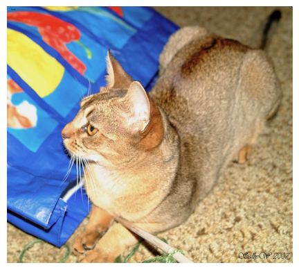

이 이미지에 해당하는 타깃(분할 마스크)은 다음과 같다.

```
def display_target(target_array):
    normalized_array = (target_array.astype("uint8") - 1) * 127
    plt.axis("off")
    plt.imshow(normalized_array[:, :, 0])
    
img = img_to_array(load_img(target_paths[9], color_mode="grayscale"))
display_target(img)
```


그 다음 입력과 타깃을 2개의 넘파이 배열로 로드하고 이 배열을 훈련과 검증 세트로 나눌 것이다.

```
import numpy as np
import random

img_size = (200, 200)
num_imgs = len(input_img_paths)

random.Random(1337).shuffle(input_img_paths)
random.Random(1337).shuffle(target_paths)

def path_to_input_image(path):
    return img_to_array(load_img(path, target_size=img_size))
def path_to_target(path):
    img = img_to_array(load_img(path, target_size=img_size, color_mode="grayscale"))
    img = img.astype("uint8") - 1
    return img

# 전체 이미지를 input_imgs에 float32 배열로 로드하고 타깃 마스크는 순서를 유지한 채 targets에 uint8로 로드한다
input_imgs = np.zeros((num_imgs, ) + img_size + (3, ), dtype="float32")
targets = np.zeros((num_imgs, ) + img_size + (1, ), dtype="uint8")
for i in range(num_imgs):
    input_imgs[i] = path_to_input_image(input_img_paths[i])
    targets[i] = path_to_target(target_paths[i])
    
num_val_samples = 1000
train_input_imgs = input_imgs[:-num_val_samples]
train_targets = targets[:-num_val_samples]
val_input_imgs = input_imgs[-num_val_samples:]
val_targets = targets[-num_val_samples:]
```

이제 모델을 정의한다.

```
from tensorflow import keras
from tensorflow.keras import layers

def get_model(img_size, num_classes):
    inputs = keras.Input(shape=img_size + (3, ))
    x = layers.Rescaling(1./255)(inputs)
    # 패딩이 특성 맵 크기에 영향을 미치지 않도록 padding="same"으로 설정한다
    x = layers.Conv2D(64, 3, strides=2, activation="relu", padding="same")(x)
    x = layers.Conv2D(64, 3, activation="relu", padding="same")(x)
    x = layers.Conv2D(128, 3, strides=2, activation="relu", padding="same")(x)
    x = layers.Conv2D(128, 3, activation="relu", padding="same")(x)
    x = layers.Conv2D(256, 3, strides=2, padding="same", activation="relu")(x)
    x = layers.Conv2D(256, 3, activation="relu", padding="same")(x)
    
    x = layers.Conv2DTranspose(256, 3, activation="relu", padding="same")(x)
    x = layers.Conv2DTranspose(256, 3, activation="relu", padding="same", strides=2)(x)
    x = layers.Conv2DTranspose(128, 3, activation="relu", padding="same")(x)
    x = layers.Conv2DTranspose(128, 3, activation="relu", padding="same", strides=2)(x)
    x = layers.Conv2DTranspose(64, 3, activation="relu", padding="same")(x)
    x = layers.Conv2DTranspose(64, 3, activation="relu", padding="same", strides=2)(x)
    
    # 각 출력 픽셀을 3개의 범주 중 하나로 분류하기 위해 3개의 필터와 소프트맥스 활성화 함수를 가진 Conv2D 층으로 모델을 종료한다
    outputs = layers.Conv2D(num_classes, 3, activation="softmax", padding="same")(x)
    
    model = keras.Model(inputs, outputs)
    return model

model = get_model(img_size=img_size, num_classes=3)
model.summary()
```

`summary()` 출력 결과는 다음과 같다.

```
Model: "model"
_________________________________________________________________
 Layer (type)                Output Shape              Param #   
=================================================================
 input_1 (InputLayer)        [(None, 200, 200, 3)]     0         
                                                                 
 rescaling (Rescaling)       (None, 200, 200, 3)       0         
                                                                 
 conv2d (Conv2D)             (None, 100, 100, 64)      1792      
                                                                 
 conv2d_1 (Conv2D)           (None, 100, 100, 64)      36928     
                                                                 
 conv2d_2 (Conv2D)           (None, 50, 50, 128)       73856     
                                                                 
 conv2d_3 (Conv2D)           (None, 50, 50, 128)       147584    
                                                                 
 conv2d_4 (Conv2D)           (None, 25, 25, 256)       295168    
                                                                 
 conv2d_5 (Conv2D)           (None, 25, 25, 256)       590080    
                                                                 
 conv2d_transpose (Conv2DTr  (None, 25, 25, 256)       590080    
 anspose)                                                        
                                                                 
 conv2d_transpose_1 (Conv2D  (None, 50, 50, 256)       590080    
 Transpose)                                                      
                                                                 
 conv2d_transpose_2 (Conv2D  (None, 50, 50, 128)       295040    
 Transpose)                                                      
                                                                 
 conv2d_transpose_3 (Conv2D  (None, 100, 100, 128)     147584    
 Transpose)                                                      
                                                                 
 conv2d_transpose_4 (Conv2D  (None, 100, 100, 64)      73792     
 Transpose)                                                      
                                                                 
 conv2d_transpose_5 (Conv2D  (None, 200, 200, 64)      36928     
 Transpose)                                                      
                                                                 
 conv2d_6 (Conv2D)           (None, 200, 200, 3)       1731      
                                                                 
=================================================================
Total params: 2880643 (10.99 MB)
Trainable params: 2880643 (10.99 MB)
Non-trainable params: 0 (0.00 Byte)
_________________________________________________________________
```

모델의 처음 절반은 이미지 분류에서 사용하는 컨브넷과 닮아 있다. 3번의 다운샘플링(downsampling)을 통해 마지막 합성곱 층의 활성화 출력은 (25, 25, 256) 크기로 끝난다. 처음 절반 부분은 이미지를 작은 특성 맵으로 인코딩한다. 각 위치가 원본 이미지의 더 큰 영역에 대한 정보를 담고 있다. 일종의 압축으로 해석이 가능하다.

이 모델의 처음 절반은 또한 `MaxPooling2D` 층을 사용하지 않고 **스트라이드**(stride)를 추가하여 다운샘플링하고 있다. 이미지 분할의 경우 모델의 출력으로 픽셀별 타깃 마스크를 생성해야 하므로 정보의 공간상 위치에 많은 관심을 두기 때문에 스트라이드를 사용한 것이다. 풀링 방식 사용 시 풀링 윈도우 안의 위치 정보가 완전히 삭제된다.

따라서 최대 풀링은 분류 작업에는 잘 맞지만 분할 작업에는 상당히 부적합하다. 반면 스트라이드 합성곱은 위치 정보를 유지하면서 특성 맵을 다운샘플링하는 작업에 더 잘 맞는다.

모델의 나머지 절반은 `Conv2DTranspose` 층을 쌓은 것이다. 이 층은 지금까지 적용한 변환을 거꾸로 적용하여 특성 맵을 업샘플링(upsampling)한다. 따라서 특성 맵이 압축되더라도 다시 원본 크기로 복원할 수 있다.

이제 모델을 컴파일하고 훈련한다.

```
model.compile(optimizer="rmsprop", loss="sparse_categorical_crossentropy")
callbacks = [
    keras.callbacks.ModelCheckpoint("oxford_segmentation.keras", save_best_only=True)
]
history = model.fit(train_input_imgs, train_targets,
                    epochs=50,
                    callbacks=callbacks,
                    batch_size=64,
                    validation_data=(val_input_imgs, val_targets))
```

훈련과 검증 손실을 그래프로 나타낸다.

```
epochs = range(1, len(history.history["loss"]) + 1)
loss = history.history["loss"]
val_loss = history.history["val_loss"]

plt.figure()
plt.plot(epochs, loss, "bo", label="Training loss")
plt.plot(epochs, val_loss, "b", label="Validation loss")
plt.title("Training and validation loss")
plt.legend()
```

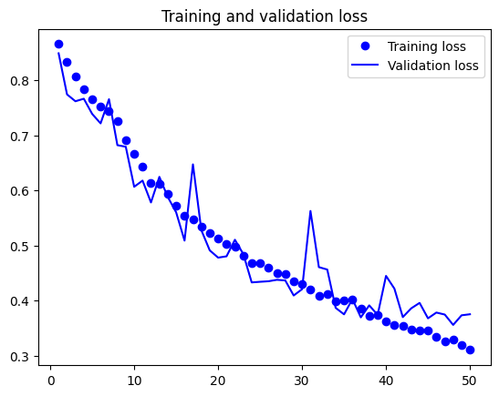

검증 손실이 가장 작은 최상의 모델을 다시 로드하여 분할 마스크를 예측하는 방법을 알아본다.

```
from tensorflow.keras.utils import array_to_img

model = keras.models.load_model("oxford_segmentation.keras")

i = 4
test_image = val_input_imgs[i]
plt.axis("off")
plt.imshow(array_to_img(test_image))

mask = model.predict(np.expand_dims(test_image, 0))[0]

def display_mask(pred):
    mask = np.argmax(pred, axis=-1)
    mask *= 127
    plt.axis("off")
    plt.imshow(mask)

display_mask(mask)
```

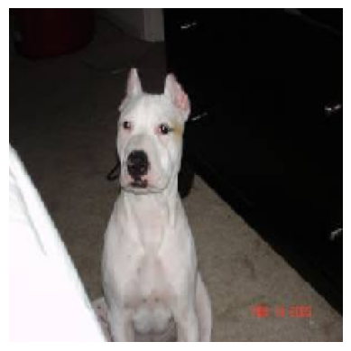
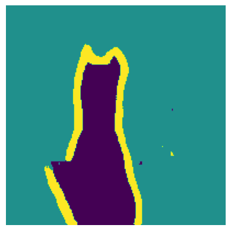

이제 최고 수준의 모델을 만들기 위해 전문가가 빠르고 정확한 결정을 내릴 수 있도록 만드는 멘탈 모델과 사고 과정이 필요하다. 이를 위해 **아키텍처 패턴**(architecture pattern)에 대해 알아보자.


## 9.3 최신 컨브넷 아키텍처 패턴

모델의 아키텍처(architecture)는 사용할 층, 층의 설정, 층을 연결하는 방법 등 모델을 만드는 데 사용된 일련의 선택이다. 이런 선택은 모델의 **가설 공간**(hypothesis space)을 정의한다. 경사 하강법이 검색할 수 있는 가능한 함수의 공간으로 파라미터는 모델의 가중치이다. 좋은 가설 공간은 현재 문제와 솔루션에 대한 **사전 지식**(prior knowledge)을 인코딩한다. 예를 들어 합성곱 층을 사용하는 것은 입력 이미지에 있는 패턴이 이동 불변성이 있음을 미리 알고 있다는 의미이다.

컨브넷 아키텍처의 모범 사례들은 대표적으로 **잔차 연결**(residual connection), **배치 정규화**(batch normalization), **분리 합성곱**(separable convolution)이 있다.

먼저 거시적인 관점에서 시스템 아키텍처에 대한 모듈화-계층화-재사용(Modularity-Hierarchy-Reuse, MHR) 공식을 알아보자.

### 9.3.1 모듈화, 계층화 그리고 재사용

복잡한 시스템을 단순화하기 위해 복잡한 구조를 **모듈화**(modularity)하고, 모듈을 **계층화**(hierarchy)하고, 같은 모듈을 적절하게 여러 곳에서 **재사용**(reuse)한다. 재사용은 또한 **추상화**(abstraction)의 다른 말이다. 이것이 MHR(Modularity-Hierarchy-Reuse) 공식이다.

딥러닝 자체는 경사 하강법을 통한 연속적인 최적화에 이 공식을 적용한 것이다. 탐색 공간을 모듈(층)로 구조화하여 깊게 계층을 구성한다. 여기에서 모든 것을 재사용할 수 있다. 예를 들어 합성곱은 다른 공간 위치에서 동일한 정보를 재사용하는 것이다.

딥러닝 모델 아키텍처는 이러한 모듈화, 계층화, 재사용을 영리하게 활용하는 것이다. 인기 있는 모든 컨브넷 아키텍처는 단순히 층으로만 구성되어 있지 않고 반복되는 층 그룹(블록(block) 또는 모듈(module))으로 구성되어 있다. 예를 들어 VGG16 구조는 [합성곱, 합성곱, 최대 풀링] 블록이 반복되는 구조이다.

또한, 대부분의 컨브넷은 피라미드와 같은 계층 구조를 가지는 경우가 많다. 합성곱 필터 개수가 점차 커지면서 특성 맵 크기는 줄어든다.

계층 구조가 깊으면 특성 재사용과 이로 인한 추상화를 장려하기 때문에 본질적으로 좋다. 일반적으로 작은 층을 깊게 쌓은 모델이 큰 층을 얕게 쌓은 모델보다 좋다. 그러나 **그레이디언트 소실**(vanishing gradient) 문제 때문에 층을 쌓을 수 있는 정도에 한계가 있다. 이 문제는 핵심 아키텍처 패턴 중 하나인 잔차 연결을 탄생시킨다.

### 9.3.2 잔차 연결

정보가 잡음이 있는 채널을 통해 순차적으로 전달될 때 일어나는 에러 누적은 옮겨 말하기(Telephone) 게임으로 은유할 수 있다.

순차적인 딥러닝 모델에서 역전파는 옮겨 말하기 게임과 매우 비슷하다. 예를 들어 다음과 같이 함수가 연결되어 있다고 가정하자.

```
y = f4(f3(f2(f1(x))))
```

이 게임은 f4의 출력에 기록된 오차(모델의 손실)를 기반으로 연결된 각 함수의 파라미터를 조정하는 방식이다. f1을 조정하기 위해선 f2, f3, f4에 오차 정보를 통과시켜야 한다. 하지만 연속적으로 놓인 함수들 각각에는 일정량의 잡음이 포함되어 있다. 함수의 연결이 너무 깊으면 잡음이 그레이디언트 정보를 압도하기 시작하고 역전파가 동작하지 않게 된다. 즉, 모델이 전혀 훈련되지 않는다. 이를 **그레이디언트 소실**(vanishing gradient) 문제라고 한다.

이는 연결된 각각의 함수를 비파괴적으로 만듦으로써 해결할 수 있다. 즉, 이전 입력에 담긴 잡음 없는 정보를 유지시킨다. 이를 구현하는 가장 쉬운 방법이 **잔차 연결**(residual connection)이다.

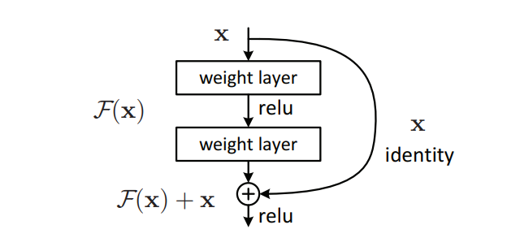

정말 간단하게 층이나 블록의 입력을 출력에 더하기만 하면 된다. 잔차 연결은 relu 활성화 함수, 드롭아웃 층처럼 파괴적이거나 잡음이 있는 블록들을 돌아가는 정보의 지름길(information shortcut)이다. 이전 층의 오차 그레이디언트 정보가 잡음 없이 네트워크 깊숙히 전파되게 만든다.

잔차 연결은 다음과 같이 구현할 수 있다.

**코드 9-1. 잔차 연결 의사 코드**
```
# 입력 텐서
x = ...
# 원본 입력을 별도로 저장한다. 이를 잔차라고 부른다.
residual = x
# 이 계산 블록은 파괴적이거나 잡음이 있을 수 있다.
x = block(x)
# 원본 입력을 층의 출력에 더한다. 최종 출력은 항상 원본 입력의 전체 정보를 보존한다.
x = add([x, residual])
```

입력을 블록의 출력에 다시 더한다는 것은 입력과 출력의 크기가 같아야 함을 의미한다. 출력 크기가 다를 경우엔 활성화 함수가 없는 1X1 Conv2D 층을 사용하여 잔차를 원하는 출력 크기로 선형적으로 투영할 수 있다. 블록에 있는 합성곱 층은 패딩 때문에 공간 방향으로 다운샘플링되지 않도록 padding="same" 옵션을 사용한다. 또는 최대 풀링 층으로 인한 다운샘플링에 맞추기 위해 잔차 투영에 스트라이드를 사용할 수 있다.

**코드 9-2. 필터 개수가 변경되는 잔차 블록**
```
from tensorflow import keras
from tensorflow.keras import layers

inputs = keras.Input(shape=(32, 32, 3))
x = layers.Conv2D(32, 3, activation="relu")(inputs)
residual = x
x = layers.Conv2D(64, 3, activation="relu", padding="same")(x)
residual = layers.Conv2D(64, 1)(residual)
x = layers.add([x, residual])
```

**코드 9-3. 최대 풀링 층을 가진 잔차 블록**
```
inputs = keras.Input(shape=(32, 32, 3))
x = layers.Conv2D(32, 3, activation="relu")(inputs)
residual = x
x = layers.Conv2D(64, 3, activation="relu", padding="same")(x)
x = layers.MaxPooling2D(2, padding="same")(x)
residual = layers.Conv2D(64, 1, strides=2)(residual)
x = layers.add([x, residual])
```

조금 더 구체적으로 여러 개의 블록으로 구성된 간단한 컨브넷을 구성해 보자. 각 블록은 2개의 합성곱 층과 하나의 선택적인 최대 풀링 층으로 이루어져 있고 각 블록마다 잔차 연결을 가진다.

```
inputs = keras.Input(shape=(32, 32, 3))
x = layers.Rescaling(1./255)(inputs)

def residual_block(x, filters, pooling=False):
    residual = x
    x = layers.Conv2D(filters, 3, activation="relu", padding="same")(x)
    x = layers.Conv2D(filters, 3, activation="relu", padding="same")(x)
    if pooling:
        x = layers.MaxPooling2D(2, padding="same")(x)
        residual = layers.Conv2D(filters, 1, strides=2)(residual)
    elif filters != residual.shape[-1]:
        residual = layers.Conv2D(filters, 1)(residual)
    x = layers.add([x, residual])
    return x

x = residual_block(x, filters=32, pooling=True)
x = residual_block(x, filters=64, pooling=True)
x = residual_block(x, filters=128, pooling=False)

x = layers.GlobalAveragePooling2D()(x)
outputs = layers.Dense(1, activation="sigmoid")(x)
model = keras.Model(inputs=inputs, outputs=outputs)
model.summary()
```

```
Model: "model_1"
__________________________________________________________________________________________________
 Layer (type)                Output Shape                 Param #   Connected to                  
==================================================================================================
 input_4 (InputLayer)        [(None, 32, 32, 3)]          0         []                            
                                                                                                  
 rescaling_1 (Rescaling)     (None, 32, 32, 3)            0         ['input_4[0][0]']             
                                                                                                  
 conv2d_13 (Conv2D)          (None, 32, 32, 32)           896       ['rescaling_1[0][0]']         
                                                                                                  
 conv2d_14 (Conv2D)          (None, 32, 32, 32)           9248      ['conv2d_13[0][0]']           
                                                                                                  
 max_pooling2d_1 (MaxPoolin  (None, 16, 16, 32)           0         ['conv2d_14[0][0]']           
 g2D)                                                                                             
                                                                                                  
 conv2d_15 (Conv2D)          (None, 16, 16, 32)           128       ['rescaling_1[0][0]']         
                                                                                                  
 add_2 (Add)                 (None, 16, 16, 32)           0         ['max_pooling2d_1[0][0]',     
                                                                     'conv2d_15[0][0]']           
                                                                                                  
 conv2d_16 (Conv2D)          (None, 16, 16, 64)           18496     ['add_2[0][0]']               
                                                                                                  
 conv2d_17 (Conv2D)          (None, 16, 16, 64)           36928     ['conv2d_16[0][0]']           
                                                                                                  
 max_pooling2d_2 (MaxPoolin  (None, 8, 8, 64)             0         ['conv2d_17[0][0]']           
 g2D)                                                                                             
                                                                                                  
 conv2d_18 (Conv2D)          (None, 8, 8, 64)             2112      ['add_2[0][0]']               
                                                                                                  
 add_3 (Add)                 (None, 8, 8, 64)             0         ['max_pooling2d_2[0][0]',     
                                                                     'conv2d_18[0][0]']           
                                                                                                  
 conv2d_19 (Conv2D)          (None, 8, 8, 128)            73856     ['add_3[0][0]']               
                                                                                                  
 conv2d_20 (Conv2D)          (None, 8, 8, 128)            147584    ['conv2d_19[0][0]']           
                                                                                                  
 conv2d_21 (Conv2D)          (None, 8, 8, 128)            8320      ['add_3[0][0]']               
                                                                                                  
 add_4 (Add)                 (None, 8, 8, 128)            0         ['conv2d_20[0][0]',           
                                                                     'conv2d_21[0][0]']           
                                                                                                  
 global_average_pooling2d (  (None, 128)                  0         ['add_4[0][0]']               
 GlobalAveragePooling2D)                                                                          
                                                                                                  
 dense (Dense)               (None, 1)                    129       ['global_average_pooling2d[0][
                                                                    0]']                          
                                                                                                  
==================================================================================================
Total params: 297697 (1.14 MB)
Trainable params: 297697 (1.14 MB)
Non-trainable params: 0 (0.00 Byte)
__________________________________________________________________________________________________
```

이렇듯 잔차 연결을 사용하면 그레이디언트 소실에 대해 걱정하지 않고 원하는 깊이의 네트워크를 만들 수 있다.

### 9.3.3 배치 정규화

**정규화**(normalization)는 머신 러닝 모델에 주입되는 샘플들을 균일하게 만드는 광범위한 방법이다. 이 방법은 모델이 학습하고 새로운 데이터에 잘 일반화되도록 돕는다. 가장 일반적인 형태는 데이터가 정규 분포(가우스 분포)를 따른다고 가정하고 분포를 원점에 맞춘 후 분산이 1이 되도록 조정하는 것이다.

```
normalized_data = (data - np.mean(data, axis=...)) / np.std(data, axis=...)
```

Dense나 Conv2D 층에 들어가는 입력 데이터가 정규화되어 있더라도 출력 데이터가 동일한 분포를 가질 것이라고 기대하긴 어렵다. 따라서 활성화 함수의 출력을 정규화하는 아이디어가 제안된다. 이것이 배치 정규화(batch normalization)의 역할이다. 훈련하는 동안 현재 배치 데이터의 평균과 분산을 사용하여 샘플을 정규화한다. 대표성을 가질 만큼 충분히 크지 않다면 훈련에서 본 배치 데이터에서 구한 평균과 분산의 지수 이동 평균을 사용한다.

2015년 아이오페와 세게디가 배치 정규화를 처음 제안했을 때는 내부 공변량 변화(internal covariate shift)를 감소시키기 때문에 도움이 된다고 언급되었지만, 누구도 왜 배치 정규화가 도움이 되는지를 확실히 알지 못한다. 가설은 많지만 정확한 근거는 존재하지 않는다.

실제로 배치 정규화의 주요 효과는 잔차 연결과 매우 흡사하게 그레이디언트의 전파를 도와주는 것으로 보인다. 따라서 더 깊은 네트워크를 구성할 수 있게 된다. 매우 깊은 네트워크라면 여러 개의 `BatchNormalization` 층을 포함해야 훈련할 수 있다. 케라스에 포함된 ResNet50, EfficientNet, Xception 등의 고급 컨브넷 구조는 배치 정규화를 많이 사용한다.

`BatchNormalization` 층은 어떤 층 다음에도 사용할 수 있다.

아직 논란의 여지가 있지만, 일반적으로 활성화 층 이전에 배치 정규화 층을 놓는 것이 권장된다. 다음 두 코드의 차이점에 유의한다.

**코드 9-4. 피해야 할 배치 정규화 사용법**
```
x = layers.Conv2D(32, 3, activation="relu")(x)
x = layers.BatchNormalization()(x)
```

**코드 9-5. 배치 정규화 사용법: 활성화 층이 마지막에 온다**
```
x = layers.Conv2D(32, 3, use_bias=False)(x)
x = layers.BatchNormalization()(x)
x = layers.Activation("relu")(x)
```

이렇게 하는 이유는 배치 정규화가 입력 평균을 0으로 만들지만 relu 활성화 함수는 0을 기준으로 값을 필터링하기 때문이다. 활성화 함수 이전에 정규화를 수행하면 활성화 함수의 활용도가 극대화된다. 물론 순서가 바뀐다고 해도 모델은 여전히 훈련될 것이며, 항상 더 나쁜 결과가 되지는 않을 것이다.

`BatchNormalization` 층이 있는 모델을 미세 조정할 때 이 층들을 동결하는 것이 좋다. 그렇지 않으면 내부 평균과 분산이 계속 업데이트되어 Conv2D 층에 적용할 매우 작은 업데이트를 방해할 수 있다.

### 9.3.4 깊이별 분리 합성곱

**깊이별 분리 합성곱**(depthwise separable convolution) 층은 `Conv2D`를 대체하면서 훈련할 모델 파라미터가 더 적고 부동 소수점 연산이 더 적고 모델의 성능을 몇 퍼센트 높일 수 있다. 케라스에서는 `SeparableConv2D`에 구현되어 있다. 이 층은 입력 채널별로 따로따로 공간 방향의 합성곱을 수행한다. 그 다음 점별 합성곱(pointwise convolution)(1X1 합성곱)을 통해 출력 채널을 합친다.

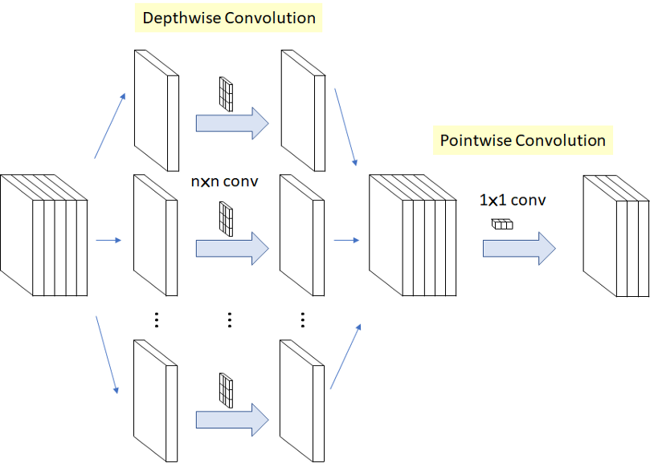

이는 공간 특성의 학습과 채널 방향 특성의 학습을 분리하는 효과를 낸다. 합성곱은 이미지상의 패턴이 특정 위치에 묶여 있지 않다는 가정에 의존한다. 마찬가지로 깊이별 분리 합성곱은 중간 활성화에 있는 **공간상의 위치**가 **높은 상관관계**를 가지지만 채널 간에는 **매우 독립적**이라는 가정에 의존한다. 심층 신경망에 의해 학습되는 이미지 표현의 경우 이 가정이 일반적으로 맞기 때문에 모델이 훈련 데이터를 더 효율적으로 사용할 수 있도록 도와준다. 처리할 정보 구조에 대한 강한 가정을 가진 모델은 이 가정이 맞는 한 더 좋은 모델이다.

깊이별 분리 합성곱은 일반 합성곱보다 훨씬 적은 개수의 파라미터를 사용하고 더 적은 수의 연산을 수행하면서 유사한 표현 능력을 가지고 있다. 수렴이 더 빠르고 쉽게 과대적합되지 않는 작은 모델을 만든다. 이런 장점은 제한된 데이터로 밑바닥부터 모델을 훈련할 때 특히 중요하다.

케라스에 포함된 고성능 컨브넷 구조인 Xception의 기반으로 깊이별 분리 합성곱이 사용되었다. 더 자세한 이론적 배경은 "Xception: Deep Learning with Depthwise Separable Convolutions" 논문에 소개되어 있다.

### 9.3.5 Xception 유사 모델에 모두 적용하기

지금까지 배운 컨브넷 아키텍처 원칙을 정리하면 다음과 같다.

- 모델은 반복되는 층 **블록**으로 조직되어야 한다. 블록은 일반적으로 여러 개의 합성곱 층과 최대 풀링 층으로 구성된다.
- 특성 맵의 공간 방향 크기가 줄어듦에 따라 필터 개수는 증가해야 한다.
- 깊고 좁은 아키텍처가 넓고 얕은 것보다 낫다.
- 층 블록에 잔차 연결을 추가하면 깊은 네트워크를 훈련하는 데 도움이 된다.
- 합성곱 층 다음에 배치 정규화 층을 추가하면 도움이 될 수 있다.
- Conv2D 층을 파라미터 효율성이 더 좋은 SeparableConv2D 층으로 바꾸면 도움이 될 수 있다.

이런 아이디어를 하나의 모델에 적용해 보자. 이 모델은 작은 버전의 Xception 모델과 비슷하다. 이 모델을 이전 장에서 본 강아지 vs 고양이 데이터셋에 적용한다. 데이터 로딩과 모델 훈련 방식은 동일하게 하고 컨브넷 구조만 다음과 같이 변경한다.

```
inputs = keras.Input(shape=(180, 180, 3))
x = data_augmentation(inputs)
x = layers.Rescaling(1./255)(x)
# 분리 합성곱의 기본 가정은 RGB 이미지에는 맞지 않으므로 첫 번째 층은 일반적인 Conv2D이다다
x = layers.Conv2D(filters=32, kernel_size=5, use_bias=False)(x)

for size in [32, 64, 128, 256, 512]:
    residual = x
    
    x = layers.BatchNormalization()(x)
    x = layers.Activation("relu")(x)
    x = layers.SeparableConv2D(size, 3, padding="same", use_bias=False)(x)
    
    x = layers.BatchNormalization()(x)
    x = layers.Activation("relu")(x)
    x = layers.SeparableConv2D(size, 3, padding="same", use_bias=False)(x)
    
    x = layers.MaxPooling2D(3, strides=2, padding="same")(x)
    
    residual = layers.Conv2D(size, 1, strides=2, padding="same", use_bias=False)(residual)
    
    x = layers.add([x, residual])
    
# Flatten 층 대신 GlobalAveragePooling2D 층을 사용한다
x = layers.GlobalAveragePooling2D()(x)
# 규제를 위해 드롭아웃 층을 사용한다
x = layers.Dropout(0.5)(x)

outputs = layers.Dense(1, activation="sigmoid")(x)
model = keras.Model(inputs=inputs, outputs=outputs)

model.compile(optimizer="rmsprop",
              loss="binary_crossentropy",
              metrics=["accuracy"])

callbacks = [
    keras.callbacks.ModelCheckpoint(
        filepath="convnet_from_scratch_with_augmentation.keras",
        save_best_only=True,
        monitor="val_loss",
    )
]

history = model.fit(
    train_dataset,
    epochs=100,
    validation_data=validation_dataset,
    callbacks=callbacks,
)
```

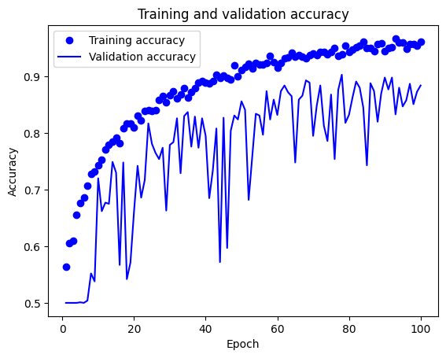
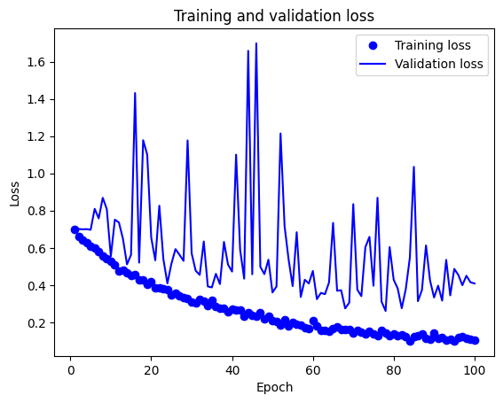

```
test_model = keras.models.load_model("mini_Xception.keras")
test_loss, test_acc = test_model.evaluate(test_dataset)
print(f"테스트 정확도: {test_acc:.3f}")
```

새로운 모델은 89.1%의 테스트 정확도를 달성했다. 이처럼 아키텍처 모범 사례를 따르면 모델 성능에 즉각적이고 괄목할 만한 영향을 줄 수 있다.

이 시점에서 모델의 성능을 더 향상시키려면 모델의 파라미터를 체계적으로 튜닝해야 한다. 이 과정이 없으면 모델의 구성은 순수하게 모범 사례와 모델 크기에 대한 약간의 직관을 기반으로 한다.


## 9.4 컨브넷이 학습한 것 해석하기

컴퓨터 비전 애플리케이션을 구축할 때의 근본적인 문제는 **해석 가능성**(interpretability)이다. 

딥러닝 모델을 자주 블랙박스에 비유한다. 모델이 학습한 표현을 사람이 이해하기 쉬운 형태로 제시하기 어렵기 때문이다. 하지만 이 비유는 컨브넷에는 들어맞지 않는다. 컨브넷이 학습한 표현은 시각화하기가 좋다. 가장 사용이 편하고 유용한 세 가지 시각화 기법은 다음과 같다.

- **컨브넷 중간층의 출력(중간층에 있는 활성화)을 시각화하기**: 연속된 컨브넷 층이 어떻게 입력을 변형시키는지 이해하고 개별적인 컨브넷 필터의 의미를 파악하는 데 도움이 된다.
- **컨브넷 필터를 시각화하기**: 컨브넷의 필터가 찾으려는 시각적인 패턴과 개념이 무엇인지 상세하게 이해하는 데 도움이 된다.
- **클래스 활성화에 대한 히트맵(heatmap)을 이미지에 시각화하기**: 어떤 클래스에 속하는 데 이미지의 어느 부분이 기여했는지 이해하고 이미지에서 객체의 위치를 추정(localization)하는 데 도움이 된다.

첫 번째 방법은 8장에서 훈련한 **convnet_from_scratch_with_augmentation.keras**에 적용하고, 나머지 방법은 사전 훈련된 Xception 모델에 적용해 보자.

### 9.4.1 중간 활성화 시각화

중간층의 활성화 시각화는 어떤 입력에 대해 모델에 있는 여러 합성곱과 풀링 층이 반환하는 값을 그리는 것이다. 층의 출력을 종종 활성화 함수의 활성화(activation)라고 부르기 때문에 활성화 시각화라고 부르는 것이다. 이 방법으로는 네트워크가 입력을 분해하는 방식을 보여준다. 너비, 높이, 깊이(채널)의 3개 차원에 대한 특성 맵을 시각화하는 것이 좋다.

```
>>> from tensorflow import keras
>>> model = keras.models.load_model("convnet_from_scratch_with_augmentation.keras")
>>> model.summary()
Model: "model_1"
_________________________________________________________________
 Layer (type)                Output Shape              Param #   
=================================================================
 input_2 (InputLayer)        [(None, 180, 180, 3)]     0         
                                                                 
 sequential (Sequential)     (None, 180, 180, 3)       0         
                                                                 
 rescaling_1 (Rescaling)     (None, 180, 180, 3)       0         
                                                                 
 conv2d_5 (Conv2D)           (None, 178, 178, 32)      896       
                                                                 
 max_pooling2d_4 (MaxPoolin  (None, 89, 89, 32)        0         
 g2D)                                                            
                                                                 
 conv2d_6 (Conv2D)           (None, 87, 87, 64)        18496     
                                                                 
 max_pooling2d_5 (MaxPoolin  (None, 43, 43, 64)        0         
 g2D)                                                            
                                                                 
 conv2d_7 (Conv2D)           (None, 41, 41, 128)       73856     
                                                                 
 max_pooling2d_6 (MaxPoolin  (None, 20, 20, 128)       0         
 g2D)                                                            
                                                                 
 conv2d_8 (Conv2D)           (None, 18, 18, 256)       295168    
                                                                 
 max_pooling2d_7 (MaxPoolin  (None, 9, 9, 256)         0         
 g2D)                                                            
                                                                 
 conv2d_9 (Conv2D)           (None, 7, 7, 256)         590080    
                                                                 
 flatten_1 (Flatten)         (None, 12544)             0         
                                                                 
 dropout (Dropout)           (None, 12544)             0         
                                                                 
 dense_1 (Dense)             (None, 1)                 12545     
                                                                 
=================================================================
Total params: 991041 (3.78 MB)
Trainable params: 991041 (3.78 MB)
Non-trainable params: 0 (0.00 Byte)
_________________________________________________________________
```

그 다음 이 네트워크를 훈련할 때 사용한 이미지가 아닌 다른 고양이 사진 하나를 입력 이미지로 선택한다.

**코드 9-6. 1개의 이미지 전처리하기**
```
from tensorflow import keras
import numpy as np

img_path = keras.utils.get_file(
    fname="cat.jpg",
    origin="https://img-datasets.s3.amazonaws.com/cat.jpg",
)

def get_img_array(img_path, target_size):
    img = keras.utils.load_img(img_path, target_size=target_size)
    array = keras.utils.img_to_array(img)
    array = np.expand_dims(array, axis=0)
    return array

img_tensor = get_img_array(img_path, target_size=(180, 180))
```

**코드 9-7. 테스트 이미지 출력하기**
```
import matplotlib.pyplot as plt

plt.axis("off")
plt.imshow(img_tensor[0].astype("uint8"))
plt.show()
```


이미지 배치를 입력으로 받아 모든 합성곱과 풀링 층의 활성화를 출력하는 케라스 모델을 만든다.

**코드 9-8. 층 활성화를 반환하는 모델 만들기**
```
from tensorflow.keras import layers

layer_outputs = []
layer_names = []
for layer in model.layers:
    if isinstance(layer, (layers.Conv2D, layers.MaxPooling2D)):
        layer_outputs.append(layer.output)
        layer_names.append(layer.name)
activation_model = keras.Model(inputs=model.input, outputs=layer_outputs)
```

입력 이미지가 주입되면 이 모델은 원본 모델의 활성화 값을 반환한다. 이 모델은 하나의 다중 출력 모델으로 하나의 입력에 대해 9개의 출력을 가진다.

**코드 9-9. 층 활성화 계산하기**
```
activations = activation_model.predict(img_tensor)
```

다음은 고양이 이미지에 대한 첫 번째 합성곱 층의 활성화 값이다.

```
>>> first_layer_activation = activations[0]
>>> print(first_layer_activation.shape)
(1, 178, 178, 32)
```

원본 모델의 첫 번째 층 활성화 중에서 다섯 번째 채널을 그려보자.

**코드 9-10. 다섯 번째 채널 시각화하기**
```
import matplotlib.pyplot as plt

plt.matshow(first_layer_activation[0, :, :, 4], cmap="viridis")
plt.show()
```

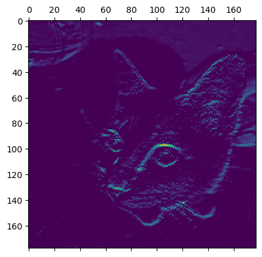

이제 네트워크의 모든 활성화를 시각화해 보자. 각 층의 활성화에 있는 모든 채널을 그리기 위해 하나의 큰 이미지 그리드(grid)에 추출한 결과를 나란히 쌓는다.

**코드 9-11. 모든 층의 활성화에 있는 전체 채널 시각화하기**
```
images_per_row = 16
for layer_name, layer_activation in zip(layer_names, activations):
    n_features = layer_activation.shape[-1]
    size = layer_activation.shape[1]
    n_cols = n_features // images_per_row
    display_grid = np.zeros(((size + 1) * n_cols - 1, images_per_row * (size + 1) - 1))
    
    for col in range(n_cols):
        for row in range(images_per_row):
            channel_index = col * images_per_row + row
            channel_image = layer_activation[0, :, :, channel_index].copy()
            if channel_image.sum() != 0:
                channel_image -= channel_image.mean()
                channel_image /= channel_image.std()
                channel_image *= 64
                channel_image += 128
            channel_image = np.clip(channel_image, 0, 255).astype("uint8")
            display_grid[
                col * (size + 1): (col + 1) * size + col,
                row * (size + 1): (row + 1) * size + row
            ] = channel_image
    scale = 1. / size

    plt.figure(figsize=(scale * display_grid.shape[1], scale * display_grid.shape[0]))
    plt.title(layer_name)
    plt.grid(False)
    plt.axis("off")
    plt.imshow(display_grid, aspect="auto", cmap="viridis")
```

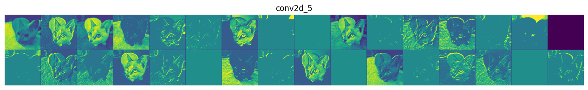
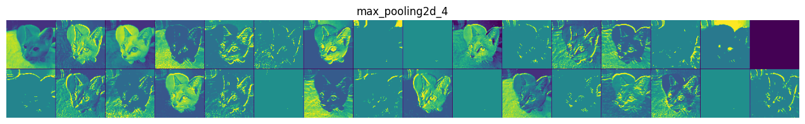
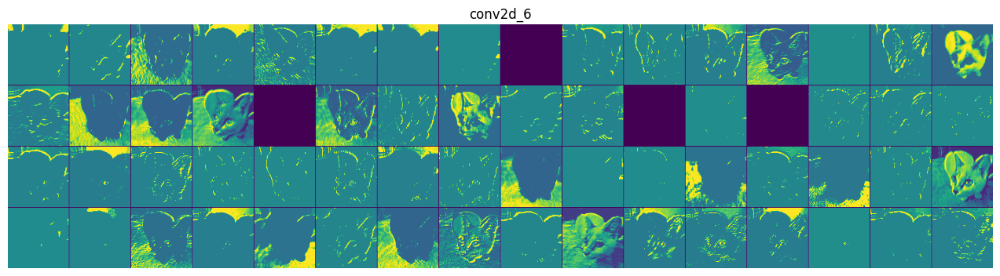
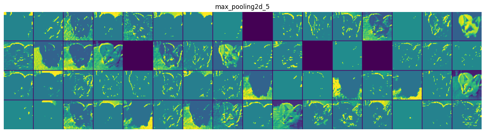
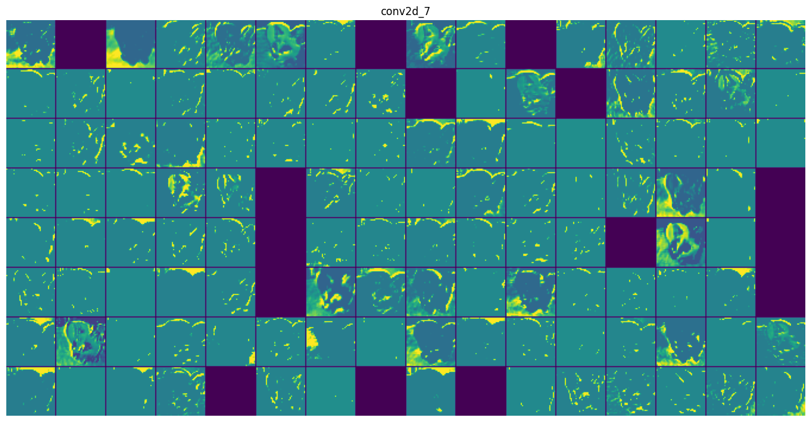

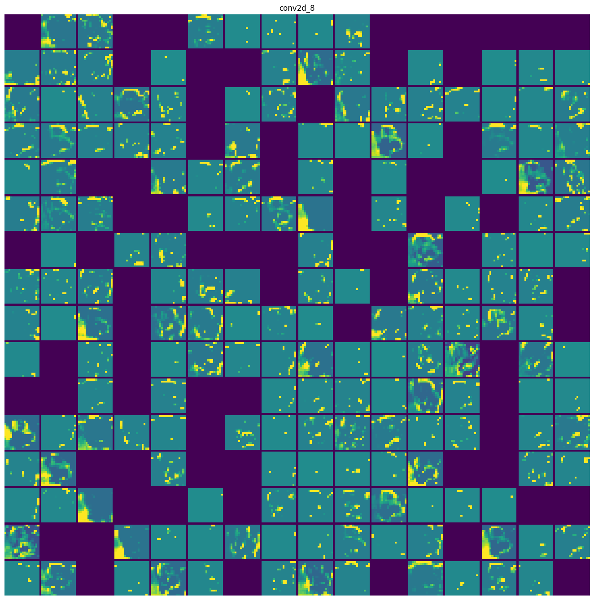
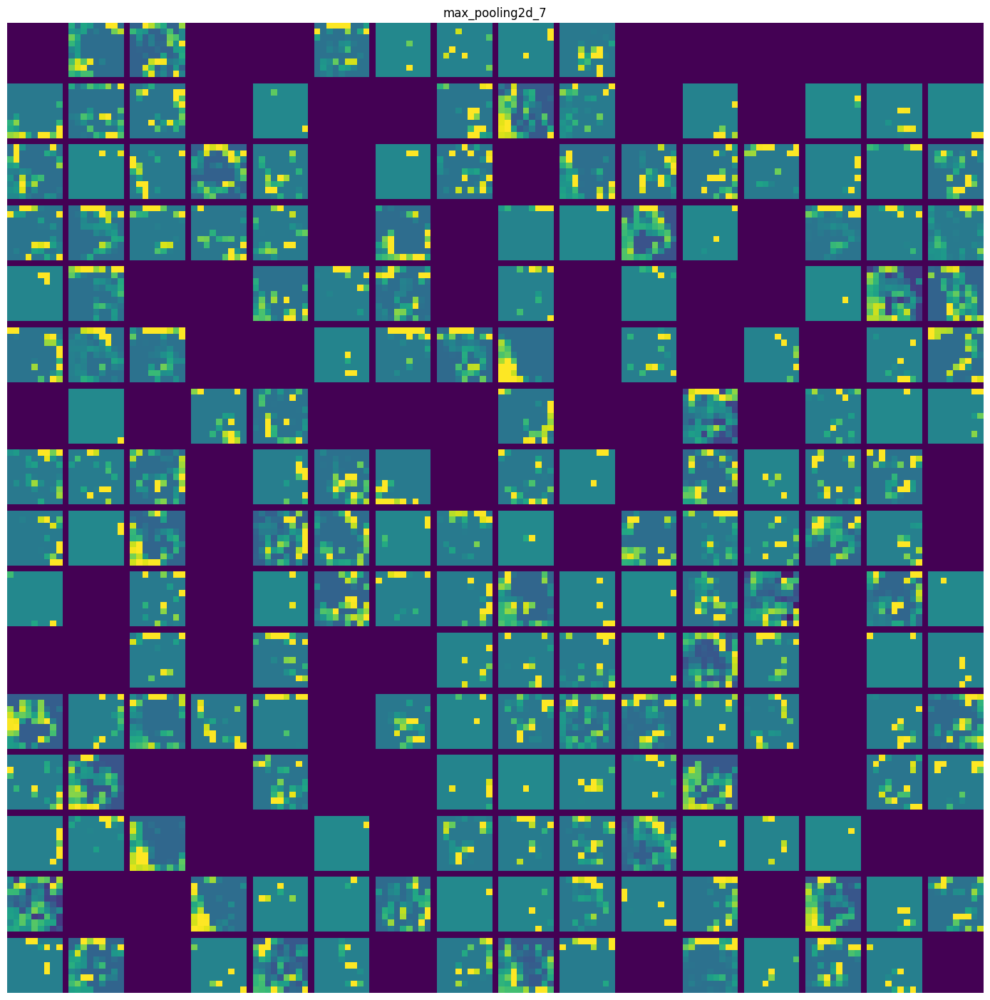
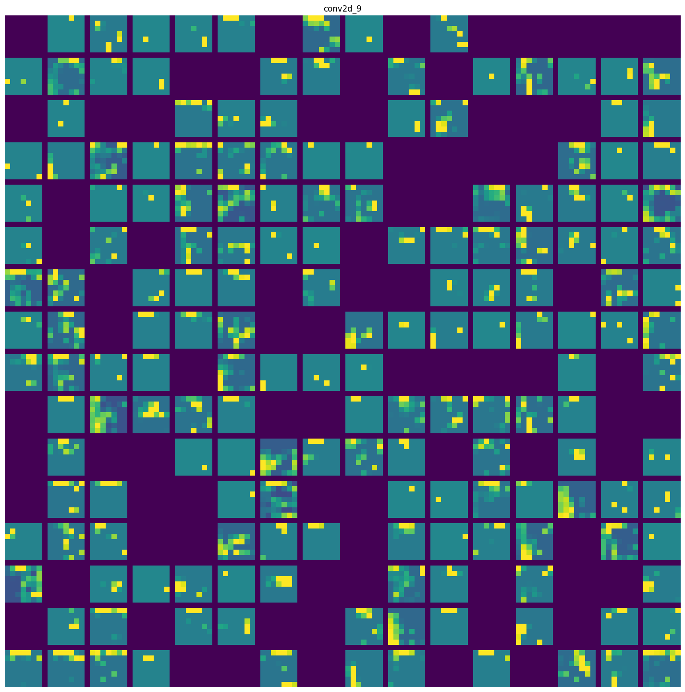

몇 가지 주목할 내용은 다음과 같다.

- 첫 번째 층은 여러 종류의 에지 감지기를 모아놓은 것 같다. 이 단계의 활성화에는 초기 이미지의 거의 모든 정보가 유지된다.
- 층이 깊어질수록 활성화는 점점 더 추상적으로 되고 시각적으로 이해하기 어려워진다. 고양이 귀, 고양이 눈처럼 고수준 개념을 인코딩하기 시작한다. 깊은 층의 표현은 이미지의 시각적 콘텐츠에 관한 정보가 점점 줄어들고 이미지의 클래스에 관한 정보가 점점 증가한다.
- 비어 있는 활성화가 층이 깊어짐에 따라 늘어난다. 첫 번째 층에서는 거의 모든 필터가 입력 이미지에 활성화되었지만 층을 올라가면서 활성화되지 않는 필터들이 생긴다. 이는 필터에 인코딩된 패턴이 입력 이미지에 나타나지 않았다는 것을 의미한다.

사람과 동물이 세상을 인지하는 방식이 이와 비슷하다. 우리 뇌는 시각적 입력에서 관련성이 적은 요소를 필터링하여 고수준 개념으로 변환한다. 이렇게 완전히 추상적으로 학습하는 모습은 심층 신경망이 깊어질 수록 특정 입력에 관한 정보보다는 타깃에 관한 정보가 더 늘어나는 것과 비슷하다.

### 9.4.2 컨브넷 필터 시각화하기

각 필터가 반응하는 시각적 패턴을 그려봄으로써 컨브넷이 학습한 필터를 조사할 수도 있다. 빈 입력 이미지에서 시작해 특정 필터의 응답을 최대화하기 위해 컨브넷 입력 이미지에 경사 상승법을 적용한다. 그러면 결과적으로 입력 이미지는 필터가 최대로 응답하는 이미지가 된다.

이 실습에는 ImageNet에서 사전 학습된 Xception 모델의 필터를 사용한다. 전체 과정은 간단한데, 먼저 특정 합성곱 층의 한 필터 값을 최대화하는 손실 함수를 정의한다. 활성화 값을 최대화하기 위해 입력 이미지를 변경하도록 확률적 경사 상승법을 사용한다. 이는 `GradientTape` 객체를 사용하여 저수준 훈련 루프를 구현하는 예이다.

먼저 Xception 모델을 만든다.

**코드 9-12. Xception 합성곱 기반 모델 만들기**
```
model = keras.applications.xception.Xception(
    weights="imagenet",
    include_top=False,
)
```

이 모델의 합성곱 층인 `Conv2D`, `SeparableConv2D` 층에 관심이 있으므로 층의 이름을 출력해 보자.

**코드 9-13. Xception에 있는 모든 합성곱 층의 이름 출력하기**
```
for layer in model.layers:
    if isinstance(layer, (keras.layers.Conv2D, keras.layers.SeparableConv2D)):
        print(layer.name)
```

```
block1_conv1
block1_conv2
block2_sepconv1
block2_sepconv2
conv2d
block3_sepconv1
block3_sepconv2
conv2d_1
block4_sepconv1
block4_sepconv2
conv2d_2
block5_sepconv1
block5_sepconv2
block5_sepconv3
block6_sepconv1
block6_sepconv2
block6_sepconv3
block7_sepconv1
block7_sepconv2
block7_sepconv3
block8_sepconv1
block8_sepconv2
block8_sepconv3
block9_sepconv1
block9_sepconv2
block9_sepconv3
block10_sepconv1
block10_sepconv2
block10_sepconv3
block11_sepconv1
block11_sepconv2
block11_sepconv3
block12_sepconv1
block12_sepconv2
block12_sepconv3
block13_sepconv1
block13_sepconv2
conv2d_3
block14_sepconv1
block14_sepconv2
```

Xception은 여러 개의 합성곱 층을 담은 블록으로 구성되어 있다.

이제 특정 층의 출력을 반환하는 두 번째 모델, 특성 추출 모델을 만들어 보자. 함수형 API를 사용한 모델이므로 분석하기 용이하다. 한 층의 output을 추출하여 새 모델에 재사용할 수 있다.

**코드 9-14. 특성 추출 모델 만들기**
```
layer_name = "block3_sepconv1"
layer = model.get_layer(name=layer_name)
feature_extractor = keras.Model(inputs=model.input, outputs=layer.output)
```

이 모델을 사용하려면 어떤 입력 데이터에서 모델을 호출하면 된다. Xception 모델의 입력은 `keras.applications.xception.preprocess_input` 함수로 전처리되어야 한다.

**코드 9-15. 특성 추출 모델 사용하기**
```
activation = feature_extractor(keras.applications.xception.preprocess_input(img_tensor))
```

특성 추출 모델을 사용해 입력 이미지가 층의 필터를 얼마나 활성화하는지 정량화된 스칼라 값을 반환하는 함수를 정의한다. 이 함수는 경사 상승법 과정 동안 최대화할 손실 함수가 된다.

```
import tensorflow as tf

def compute_loss(image, filter_index):
    activation = feature_extractor(image)
    filter_activation = activation[:, 2:-2, 2:-2, filter_index]
    return tf.reduce_mean(filter_activation)
```

`GradientTape`를 사용하여 경사 상승법 단계를 구성한다. 경사 상승법 과정을 부드럽게 하기 위해 그레이디언트 텐서를 L2 노름으로 나누어 정규화한다. 이렇게 하면 입력 이미지에 적용할 수정량의 크기를 항상 일정 범위 안에 놓을 수 있다.

**코드 9-16. 경사 상승법을 사용한 손실 최대화**
```
@tf.function
def gradient_ascent_step(image, filter_index, learning_rate):
    with tf.GradientTape() as tape:
        tape.watch(image)
        loss = compute_loss(image, filter_index)
    grads = tape.gradient(loss, image)
    grads = tf.math.l2_normalize(grads)
    image += learning_rate * grads
    return image
```

이제 층의 이름과 필터 인덱스를 입력으로 받고 지정된 필터의 활성화를 최대화하는 패턴을 나타내는 텐서를 반환하는 파이썬 함수를 만든다.

**코드 9-17. 필터 시각화 생성 함수**
```
img_width = 200
img_height = 200

def generate_filter_pattern(filter_index):
    iterations = 30
    learning_rate = 10.
    image = tf.random.uniform(
        minval = 0.4,
        maxval = 0.6,
        shape=(1, img_width, img_height, 3),
    )
    for i in range(iterations):
        image = gradient_ascent_step(image, filter_index, learning_rate)
    return image[0].numpy()
```

결과 이미지 텐서는 (200, 200, 3) 크기의 부동 소수점 텐서이다. 이 텐서 값은 [0, 255] 범위의 정수가 아니므로 후처리하는 함수를 정의한다.

**코드 9-18. 텐서를 이미지로 변환하기 위한 유틸리티 함수**
```
def deprocess_image(image):
    image -= image.mean()
    image /= image.std()
    image *= 64
    image += 128
    image = np.clip(image, 0, 255).astype("uint8")
    image = image[25:-25, 25:-25, :]
    return image
```

함수를 실행한다.

```
plt.axis("off")
plt.imshow(deprocess_image(generate_filter_pattern(filter_index=2)))
plt.show()
```

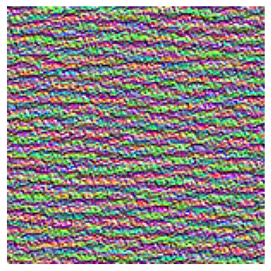

`block3_sepconv1` 층에 있는 세 번째 필터는 마치 물이나 털 같은 수평 패턴에 반응하는 것처럼 보인다.

이제 층의 모든 필터를 시각화하거나 모델에 있는 모든 층의 필터를 시각화할 수 있다.

**코드 9-19. 층에 있는 모든 필터의 응답 패턴에 대한 그리드 생성하기**
```
all_images = []
for filter_index in range(64):
    print(f"{filter_index}번 필터 처리 중")
    image = deprocess_image(generate_filter_pattern(filter_index))
    all_images.append(image)
    
margin = 5
n = 8
cropped_width = img_width - 25 * 2
cropped_height = img_height - 25 * 2
width = n * cropped_width + (n - 1) * margin
height = n * cropped_height + (n - 1) * margin
stitched_filters = np.zeros((width, height, 3))

for i in range(n):
    for j in range(n):
        image = all_images[i * n + j]
        stitched_filters[
            (cropped_width + margin) * i : (cropped_width + margin) * i + cropped_width,
            (cropped_height + margin) * j : (cropped_height + margin) * j + cropped_height,
            :,
        ] = image
        
keras.utils.save_img(f"filters/filters_for_layer_{layer_name}.png", stitched_filters)
```


컨브넷의 각 층은 필터의 조합으로 입력을 표현할 수 있는 일련의 필터를 학습한다. 이는 푸리에 변환(Fourier transform)을 사용하여 신호를 일련의 코사인 함수로 분해할 수 있는 것과 비슷하다. 컨브넷 필터들은 모델의 층이 깊어질수록 점점 더 복잡해지고 개선된다.

- 모델에 있는 첫 번째 층의 필터는 간단한 대각선 방향의 에지와 색깔(또는 어떤 경우에 색깔이 있는 에지)을 인코딩한다.
- 조금 더 나중에 있는 층의 필터는 에지나 색깔의 조합으로 만들어진 간단한 질감을 인코딩한다.
- 더 뒤에 있는 층의 필터는 자연적인 이미지에서 찾을 수 있는 질감을 닮아 가기 시작한다.

### 9.4.3 클래스 활성화의 히트맵 시각화하기

이 방법은 이미지의 어느 부분이 컨브넷의 최종 분류 결정에 기여하는지 이해하는 데 유용하다. **모델 해석 가능성**(model interpretability)이라고 부르는 분야로, 분류에 실수가 있는 경우 컨브넷의 결정 과정을 디버깅하는 데 도움이 된다. 또한, 이미지에 특정 물체가 있는 위치를 파악하는 데 사용할 수도 있다.

이러한 종류의 시각화 기법을 **클래스 활성화 맵**(Class Activation Map, CAM) 시각화라고 부른다. 클래스 활성화 히트맵은 특정 출력 클래스에 대해 입력 이미지의 모든 위치를 계산한 2D 점수 그리드이다. 클래스에 대해 각 위치가 얼마나 중요한지 알려준다.

여기에서 사용할 구체적인 구현은 "Grad-CAM: Visual Explanations from Deep Networks via Gradient-based Localization"에 기술되어 있다.

`Grad-CAM`은 입력 이미지가 주어지면 합성곱 층에 있는 특성 맵의 출력을 추출한다. 그 다음 특성 맵의 모든 채널 출력에 채널에 대한 클래스의 그레이디언트 평균을 곱한다. 이는 '**입력 이미지가 각 채널을 활성화하는 정도**'에 대한 공간적인 맵을 '**클래스에 대한 각 채널의 중요도**'로 가중치를 부여하여 '**입력 이미지가 클래스를 활성화하는 정도**'에 대한 공간적인 맵을 만드는 것이다.

사전 훈련된 Xception 모델을 다시 사용하여 이 기법을 시연한다.

**코드 9-20. 사전 훈련된 가중치로 Xception 네트워크 로드하기**
```
model = keras.applications.xception.Xception(weights="imagenet")
```

초원을 걷는 어미와 새끼 아프리카 코끼리 이미지를 적용한다. 이 이미지를 Xception 모델이 인식할 수 있도록 299X299 크기로 변경하고, 넘파이 float32 텐서로 바꾼 후 전처리 함수를 적용해 변환한다.

**코드 9-21. Xception 모델에 맞게 입력 이미지 전처리하기**
```
img_path = keras.utils.get_file(
    fname="elephant.jpg",
    origin="https://img-datasets.s3.amazonaws.com/elephant.jpg"
)

def get_img_array(img_path, target_size):
    img = keras.utils.load_img(img_path, target_size=target_size)
    array = keras.utils.img_to_array(img)
    array = np.expand_dims(array, axis=0)
    array = keras.applications.xception.preprocess_input(array)
    return array

img_array = get_img_array(img_path, target_size=(299, 299))
```

