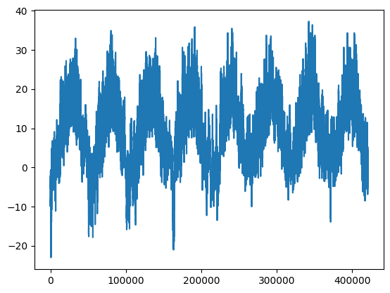
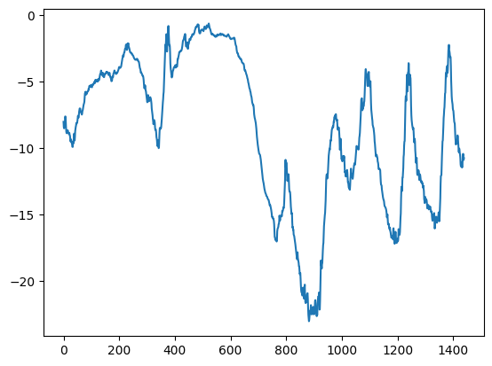

# 케라스 창시자에게 배우는 딥러닝
## 10장, *시계열을 위한 딥러닝*

## 10.1 다양한 종류의 시계열 작업

**시계열**(timeseries) 데이터는 일정한 간격으로 측정하여 얻은 모든 데이터를 말한다. 시계열을 다루려면 주기성, 시간에 따른 트렌드, 규칙적인 형태와 급격한 증가 등 시스템의 역학(dynamics)을 이해해야 한다.

가장 일반적인 시계열 관련 작업은 **예측**(forecasting)이다. 이 장의 초점 또한 예측에 맞춰져 있다. 그러나 시계열로 할 수 있는 일은 다양하다.

- **분류**: 하나 이상의 범주형 레이블을 시계열에 분류한다. 예를 들어 웹 사이트 방문자 활동에 대한 시계열이 주어지면 사용자가 봇(bot)인지 사람인지 분류한다.
- **이벤트 감지**: 연속된 데이터 스트림에서 예상되는 특정 이벤트 발생을 식별한다. 유용한 어플리케이션은 핫워드(hotword) 감지로 모델이 오디오 스트림을 모니터링하다가 "하이 빅스비", "시리" 등의 시작 단어를 감지한다.
- **이상치 탐지**(anomaly detection): 연속된 데이터 스트림에서 발생하는 비정상적인 현상을 감지한다. 이상치 탐지는 일반적으로 비지도 학습(unsupervised learning)으로 수행된다. 어떤 종류의 이상치를 찾는지 모르는 경우가 많아 구체적인 이상치 샘플로 훈련할 수 없기 때문이다.

이 장에서는 순환 신경망(Recurrent Neural Network, RNN)에 배우고 시계열 예측에 적용하는 방법을 알아본다.


## 10.2 온도 예측 문제

이 장의 모든 코드 예제는 하나의 문제를 다룰 것이다. 바로 지붕 위의 센서에서 최근에 기록한 기압, 습도와 같은 매시간 측정값의 시계열이 주어졌을 때 24시간 뒤의 온도를 예측하는 문제이다.

데이터셋은 독일 예나(Jena) 시에 있는 막스 플랑크 생물지구화학연구소(Max Planck Institute for Biogeochemistry)의 기상 관측소에서 수집한 것이다. 수년 간에 걸쳐 14개의 관측치가 10분마다 기록되어 있다. 원본 데이터는 2003년부터 기록되어 있지만 이 예제에서는 2009~2016년 사이의 데이터만 사용한다.

먼저 데이터를 내려받고 압축을 해제한다.

```
!wget https://s3.amazonaws.com/keras-datasets/jena_climate_2009_2016.csv.zip
!unzip jena_climate_2009_2016.csv.zip
!rm -f jena_climate_2009_2016.csv.zip
```

데이터를 살펴보자.

**코드 10-1. 예나 날씨 데이터셋 조사하기**
```
import os
fname = os.path.join("jena_climate_2009_2016.csv")

with open(fname) as f:
    data = f.read()

lines = data.split("\n")
header = lines[0].split(",")
lines = lines[1:]
print(header)
print(len(lines))
```

출력된 줄의 개수는 420,451개이다. 헤더는 다음과 같다.

```
['"Date Time"', '"p (mbar)"', '"T (degC)"', '"Tpot (K)"', '"Tdew (degC)"', '"rh (%)"', '"VPmax (mbar)"', '"VPact (mbar)"', '"VPdef (mbar)"', '"sh (g/kg)"', '"H2OC (mmol/mol)"', '"rho (g/m**3)"', '"wv (m/s)"', '"max. wv (m/s)"', '"wd (deg)"']
```

데이터 전체를 넘파이 배열로 변환한다. 온도를 하나의 배열로 만들고 나머지 데이터를 또 다른 배열로 만든다. 두 번째로 만드는 배열이 미래 온도를 예측하기 위해 사용할 특성이다. 이때 `Date Time` 열은 제외한다.

**코드 10-2. 데이터 파싱**
```
import numpy as np

temperature = np.zeros((len(lines), ))
raw_data = np.zeros((len(lines), len(header) - 1))
for i, line in enumerate(lines):
    values = [float(x) for x in line.split(",")[1:]]
    temperature[i] = values[1]
    raw_data[i, :] = values[:]
```

시간에 따른 온도 그래프를 그려 확인해 보자.

**코드 10-3. 전체 온도를 그래프로 그리기**
```
from matplotlib import pyplot as plt

plt.plot(range(len(temperature)), temperature)
plt.show()
```



그래프를 통해 매년 온도에 주기성이 있다는 것을 확인할 수 있다.

처음 10일 간의 온도 그래프도 그려 확인해 보겠다.

**코드 10-4. 처음 10일 간의 온도를 그래프로 그리기**
```
plt.plot(range(1440), temperature[:1440])
plt.show()
```



이 그래프에서는 일별 주기성을 확인할 수 있다. 특히 마지막 4일 간의 추세를 보면 확실히 이 기간이 아주 추운 겨울에 해당함을 알 수 있다.

여러 시간 범위에 걸친 주기성은 시계열 데이터에서 중요하고 매우 일반적인 성질이다. 어떤 시계열 데이터에서나 일별 주기성, 연간 주기성을 확인할 수 있다. 데이터를 탐색할 때 이런 패턴을 찾아보는 것이 좋다.

모든 예제에서 훈련, 검증, 테스트 데이터의 비율을 2:1:1로 사용한다. 시계열 데이터를 다룰 때 검증 데이터와 테스트 데이터는 항상 훈련 데이터보다 최신의 것이어야 한다. 과거를 바탕으로 미래를 예측하는 것이기 때문이다. 이 구도에 맞게 검증 세트와 테스트 세트를 분할해야 한다. 어떤 문제들은 시간 축을 거꾸로 함으로써 쉽게 해결 가능하다.

**코드 10-5. 각 분할에 사용할 샘플 개수 계산하기**
```
>>> num_train_samples = int(0.5 * len(raw_data))
>>> num_val_samples = int(0.25 * len(raw_data))
>>> num_test_samples = len(raw_data) - num_train_samples - num_val_samples
>>> print(f"num_train_samples: {num_train_samples}")
>>> print(f"num_val_samples: {num_val_samples}")
>>> print(f"num_test_samples: {num_test_samples}")
num_train_samples: 210225
num_val_samples: 105112
num_test_samples: 105114
```

### 10.2.1 데이터 준비

이 문제의 정확한 정의는 "한 시간에 한 번씩 샘플링된 5일 간의 데이터가 주어졌을 때 24시간 뒤의 온도를 예측할 수 있는가?"이다.

먼저 데이터를 신경망에 주입할 수 있는 형태로 전처리해 보자. 데이터가 이미 수치형이기 때문에 어떤 벡터화도 필요하지 않다. 하지만 이 데이터에 있는 시계열은 스케일이 각기 다르다. 예를 들어 mbar로 측정된 기압은 약 1,000이지만 H2OC는 mmol/mol로 측정되어 약 3 정도이다. 각 시계열을 독립적으로 정규화하여 비슷한 범위를 가진 작은 값으로 바꾼다. 처음 210,225개의 타임스텝(timestep)을 훈련 데이터로 사용하므로 이 범위에서 평균과 표준 편차를 계산한다.

**코드 10-6. 데이터 정규화**
```
mean = raw_data[:num_train_samples].mean(axis=0)
raw_data -= mean
std = raw_data[:num_train_samples].std(axis=0)
raw_data /= std
```

이제 과거 5일치 데이터와 24시간 뒤 타깃 온도의 배치를 반환하는 `Dataset` 객체를 만들어 보자. 이 데이터셋에 있는 샘플은 중복이 많다. 모든 샘플을 메모리에 적재하면 낭비가 심하다. 그 대신 `raw_data`, `temperature` 배열만 메모리에 유지하고 그때그때 샘플을 생성한다.

파이썬 제네레이터를 만들어 처리할 수도 있고, 케라스 내장 데이터셋 유틸리티 `timeseries_dataset_from_array()`를 사용할 수도 있다. 이 함수는 모든 종류의 시계열 예측 작업에 일반적으로 사용할 수 있다.

`timeseries_dataset_from_array()`를 사용하여 훈련, 검증, 테스트 데이터셋을 만들 것이다. 이때 다음과 같은 매개변수 값을 사용한다.

- **sampling_rate = 6**: 시간당 하나의 데이터 포인트가 샘플링된다. 즉, 6개의 데이터 포인트 중 하나만 사용한다.
- **sequence_length = 120**: 이전 5일 간(120시간) 데이터를 사용한다.
- **delay = sampling_rate * (sequence_length + 24 - 1)**: 시퀀스의 타깃은 시퀀스 끝에서 24시간 후의 온도이다.