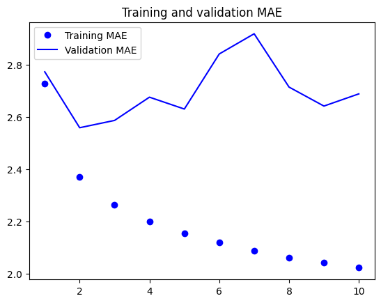

# 케라스 창시자에게 배우는 딥러닝
## 10장, *시계열을 위한 딥러닝*

## 10.1 다양한 종류의 시계열 작업

**시계열**(timeseries) 데이터는 일정한 간격으로 측정하여 얻은 모든 데이터를 말한다. 시계열을 다루려면 주기성, 시간에 따른 트렌드, 규칙적인 형태와 급격한 증가 등 시스템의 역학(dynamics)을 이해해야 한다.

가장 일반적인 시계열 관련 작업은 **예측**(forecasting)이다. 이 장의 초점 또한 예측에 맞춰져 있다. 그러나 시계열로 할 수 있는 일은 다양하다.

- **분류**: 하나 이상의 범주형 레이블을 시계열에 분류한다. 예를 들어 웹 사이트 방문자 활동에 대한 시계열이 주어지면 사용자가 봇(bot)인지 사람인지 분류한다.
- **이벤트 감지**: 연속된 데이터 스트림에서 예상되는 특정 이벤트 발생을 식별한다. 유용한 어플리케이션은 핫워드(hotword) 감지로 모델이 오디오 스트림을 모니터링하다가 "하이 빅스비", "시리" 등의 시작 단어를 감지한다.
- **이상치 탐지**(anomaly detection): 연속된 데이터 스트림에서 발생하는 비정상적인 현상을 감지한다. 이상치 탐지는 일반적으로 비지도 학습(unsupervised learning)으로 수행된다. 어떤 종류의 이상치를 찾는지 모르는 경우가 많아 구체적인 이상치 샘플로 훈련할 수 없기 때문이다.

이 장에서는 순환 신경망(Recurrent Neural Network, RNN)에 배우고 시계열 예측에 적용하는 방법을 알아본다.


## 10.2 온도 예측 문제

이 장의 모든 코드 예제는 하나의 문제를 다룰 것이다. 바로 지붕 위의 센서에서 최근에 기록한 기압, 습도와 같은 매시간 측정값의 시계열이 주어졌을 때 24시간 뒤의 온도를 예측하는 문제이다.

데이터셋은 독일 예나(Jena) 시에 있는 막스 플랑크 생물지구화학연구소(Max Planck Institute for Biogeochemistry)의 기상 관측소에서 수집한 것이다. 수년 간에 걸쳐 14개의 관측치가 10분마다 기록되어 있다. 원본 데이터는 2003년부터 기록되어 있지만 이 예제에서는 2009~2016년 사이의 데이터만 사용한다.

먼저 데이터를 내려받고 압축을 해제한다.

```
!wget https://s3.amazonaws.com/keras-datasets/jena_climate_2009_2016.csv.zip
!unzip jena_climate_2009_2016.csv.zip
!rm -f jena_climate_2009_2016.csv.zip
```

데이터를 살펴보자.

**코드 10-1. 예나 날씨 데이터셋 조사하기**
```
import os
fname = os.path.join("jena_climate_2009_2016.csv")

with open(fname) as f:
    data = f.read()

lines = data.split("\n")
header = lines[0].split(",")
lines = lines[1:]
print(header)
print(len(lines))
```

출력된 줄의 개수는 420,451개이다. 헤더는 다음과 같다.

```
['"Date Time"', '"p (mbar)"', '"T (degC)"', '"Tpot (K)"', '"Tdew (degC)"', '"rh (%)"', '"VPmax (mbar)"', '"VPact (mbar)"', '"VPdef (mbar)"', '"sh (g/kg)"', '"H2OC (mmol/mol)"', '"rho (g/m**3)"', '"wv (m/s)"', '"max. wv (m/s)"', '"wd (deg)"']
```

데이터 전체를 넘파이 배열로 변환한다. 온도를 하나의 배열로 만들고 나머지 데이터를 또 다른 배열로 만든다. 두 번째로 만드는 배열이 미래 온도를 예측하기 위해 사용할 특성이다. 이때 `Date Time` 열은 제외한다.

**코드 10-2. 데이터 파싱**
```
import numpy as np

temperature = np.zeros((len(lines), ))
raw_data = np.zeros((len(lines), len(header) - 1))
for i, line in enumerate(lines):
    values = [float(x) for x in line.split(",")[1:]]
    temperature[i] = values[1]
    raw_data[i, :] = values[:]
```

시간에 따른 온도 그래프를 그려 확인해 보자.

**코드 10-3. 전체 온도를 그래프로 그리기**
```
from matplotlib import pyplot as plt

plt.plot(range(len(temperature)), temperature)
plt.show()
```


그래프를 통해 매년 온도에 주기성이 있다는 것을 확인할 수 있다.

처음 10일 간의 온도 그래프도 그려 확인해 보겠다.

**코드 10-4. 처음 10일 간의 온도를 그래프로 그리기**
```
plt.plot(range(1440), temperature[:1440])
plt.show()
```


이 그래프에서는 일별 주기성을 확인할 수 있다. 특히 마지막 4일 간의 추세를 보면 확실히 이 기간이 아주 추운 겨울에 해당함을 알 수 있다.

여러 시간 범위에 걸친 주기성은 시계열 데이터에서 중요하고 매우 일반적인 성질이다. 어떤 시계열 데이터에서나 일별 주기성, 연간 주기성을 확인할 수 있다. 데이터를 탐색할 때 이런 패턴을 찾아보는 것이 좋다.

모든 예제에서 훈련, 검증, 테스트 데이터의 비율을 2:1:1로 사용한다. 시계열 데이터를 다룰 때 검증 데이터와 테스트 데이터는 항상 훈련 데이터보다 최신의 것이어야 한다. 과거를 바탕으로 미래를 예측하는 것이기 때문이다. 이 구도에 맞게 검증 세트와 테스트 세트를 분할해야 한다. 어떤 문제들은 시간 축을 거꾸로 함으로써 쉽게 해결 가능하다.

**코드 10-5. 각 분할에 사용할 샘플 개수 계산하기**
```
>>> num_train_samples = int(0.5 * len(raw_data))
>>> num_val_samples = int(0.25 * len(raw_data))
>>> num_test_samples = len(raw_data) - num_train_samples - num_val_samples
>>> print(f"num_train_samples: {num_train_samples}")
>>> print(f"num_val_samples: {num_val_samples}")
>>> print(f"num_test_samples: {num_test_samples}")
num_train_samples: 210225
num_val_samples: 105112
num_test_samples: 105114
```

### 10.2.1 데이터 준비

이 문제의 정확한 정의는 "한 시간에 한 번씩 샘플링된 5일 간의 데이터가 주어졌을 때 24시간 뒤의 온도를 예측할 수 있는가?"이다.

먼저 데이터를 신경망에 주입할 수 있는 형태로 전처리해 보자. 데이터가 이미 수치형이기 때문에 어떤 벡터화도 필요하지 않다. 하지만 이 데이터에 있는 시계열은 스케일이 각기 다르다. 예를 들어 mbar로 측정된 기압은 약 1,000이지만 H2OC는 mmol/mol로 측정되어 약 3 정도이다. 각 시계열을 독립적으로 정규화하여 비슷한 범위를 가진 작은 값으로 바꾼다. 처음 210,225개의 타임스텝(timestep)을 훈련 데이터로 사용하므로 이 범위에서 평균과 표준 편차를 계산한다.

**코드 10-6. 데이터 정규화**
```
mean = raw_data[:num_train_samples].mean(axis=0)
raw_data -= mean
std = raw_data[:num_train_samples].std(axis=0)
raw_data /= std
```

이제 과거 5일치 데이터와 24시간 뒤 타깃 온도의 배치를 반환하는 `Dataset` 객체를 만들어 보자. 이 데이터셋에 있는 샘플은 중복이 많다. 모든 샘플을 메모리에 적재하면 낭비가 심하다. 그 대신 `raw_data`, `temperature` 배열만 메모리에 유지하고 그때그때 샘플을 생성한다.

파이썬 제네레이터를 만들어 처리할 수도 있고, 케라스 내장 데이터셋 유틸리티 `timeseries_dataset_from_array()`를 사용할 수도 있다. 이 함수는 모든 종류의 시계열 예측 작업에 일반적으로 사용할 수 있다.

`timeseries_dataset_from_array()`를 사용하여 훈련, 검증, 테스트 데이터셋을 만들 것이다. 이때 다음과 같은 매개변수 값을 사용한다.

- **sampling_rate = 6**: 시간당 하나의 데이터 포인트가 샘플링된다. 즉, 6개의 데이터 포인트 중 하나만 사용한다.
- **sequence_length = 120**: 이전 5일 간(120시간) 데이터를 사용한다.
- **delay = sampling_rate * (sequence_length + 24 - 1)**: 시퀀스의 타깃은 시퀀스 끝에서 24시간 후의 온도이다.

**코드 10-7. 훈련, 검증, 테스트 데이터셋 만들기**
```
sampling_rate = 6
sequence_length = 120
delay = sampling_rate * (sequence_length + 24 - 1)
batch_size = 256

train_dataset = keras.utils.timeseries_dataset_from_array(
    raw_data[:-delay],
    targets=temperature[delay:],
    sampling_rate=sampling_rate,
    sequence_length=sequence_length,
    shuffle=True,
    batch_size=batch_size,
    start_index=0,
    end_index=num_train_samples,
)

val_dataset = keras.utils.timeseries_dataset_from_array(
    raw_data[:-delay],
    targets=temperature[delay:],
    sampling_rate=sampling_rate,
    sequence_length=sequence_length,
    shuffle=True,
    batch_size=batch_size,
    start_index=num_train_samples,
    end_index=num_train_samples + num_val_samples,
)

test_dataset = keras.utils.timeseries_dataset_from_array(
    raw_data[:-delay],
    targets=temperature[delay:],
    sampling_rate=sampling_rate,
    sequence_length=sequence_length,
    shuffle=True,
    batch_size=batch_size,
    start_index=num_train_samples + num_val_samples,
)
```

각 데이터셋은 (samples, targets) 크기의 튜플을 반환한다. `samples`는 256개의 샘플로 이루어진 배치이다. 각 샘플은 연속된 120시간의 입력 데이터를 담고 있다. `targets`는 256개의 타깃 온도에 해당하는 배열이다. 샘플들은 랜덤하게 섞여 있기 때문에 연속된 두 샘플이 시간적으로 가깝다는 보장은 없다.

**코드 10-8. 훈련 데이터셋의 배치 크기 확인하기**
```
>>> for samples, targets in train_dataset:
>>>     print("샘플 크기:", samples.shape)
>>>     print("타깃 크기:", targets.shape)
>>>     break
샘플 크기: (256, 120, 14)
타깃 크기: (256,)
```

### 10.2.2 상식 수준의 기준점

딥러닝 모델 사용 전 간단한 상식 수준의 해법을 시도해 보자. 이는 정상적인 문제인지 확인하기 위한 용도이며 고수준 머신 러닝 모델이라면 뛰어넘어야 할 기준점이 된다.

시계열 데이터는 연속성이 있고 일자별로 주기성을 가진다고 가정할 수 있다. 그렇기 때문에 상식 수준의 해결책은 지금으로부터 24시간 후의 온도는 지금과 동일하다고 예측하는 것이다. 이 방법을 다음과 같이 정의된 평균 절댓값 오차(MAE)로 평가해 볼 것이다.

```
np.mean(np.abs(preds - targets))
```

**코드 10-9. 상식 수준 모델의 MAE 계산하기**
```
def evaluate_naive_method(dataset):
    total_abs_err = 0.
    samples_seen = 0
    for samples, targets in dataset:
        preds = samples[:, -1, 1] * std[1] + mean[1]
        total_abs_err += np.sum(np.abs(preds - targets))
        samples_seen += samples.shape[0]
    return total_abs_err / samples_seen

print(f"검증 MAE: {evaluate_naive_method(val_dataset):.2f}")
print(f"테스트 MAE: {evaluate_naive_method(test_dataset):.2f}")
```

상식 수준의 모델은 섭씨 2.44도의 검증 MAE와 2.62도의 테스트 MAE를 달성했다. 따라서 24시간 후의 온도를 항상 현재와 같다고 가정하면 평균적으로 2.5도 정도 차이가 날 것이다.

### 10.2.3 기본적인 머신 러닝 모델 시도해 보기

RNN처럼 복잡하고 연산 비용이 많이 드는 모델을 시도하기 전 간단하고 손쉽게 만들 수 있는 머신 러닝 모델을 먼저 만드는 것이 좋다. 이를 바탕으로 더 복잡한 방법을 도입하는 근거가 마련되고 실제적인 이득도 얻게 될 것이다.

데이터를 펼쳐서 2개의 Dense 층을 통과시키는 완전 연결 네트워크를 먼저 만들어 보자. 전형적인 회귀 문제이므로 마지막 Dense 층에는 활성화 함수를 두지 않는다. 손실 함수로는 MAE 대신 평균 제곱 오차(MSE)를 사용한다. 이는 원점에서 미분 가능하기 때문에 경사 하강법에 잘 맞는다. compile() 메소드에 모니터링할 지표로 MAE를 추가한다.

**코드 10-10. 밀집 연결 모델 훈련하고 평가하기**
```
from tensorflow import keras
from tensorflow.keras import layers

inputs = keras.Input(shape=(sequence_length, raw_data.shape[-1]))
x = layers.Flatten()(inputs)
x = layers.Dense(16, activation="relu")(x)
outputs = layers.Dense(1)(x)
model = keras.Model(inputs=inputs, outputs=outputs)

callbacks = [
    keras.callbacks.ModelCheckpoint("jena_dense.keras", save_best_only=True)
]

model.compile(optimizer="rmsprop", loss="mse", metrics=["mae"])

history = model.fit(
    train_dataset,
    epochs=10,
    validation_data=val_dataset,
    callbacks=callbacks,
)

model = keras.models.load_model("jena_dense.keras")

print(f"테스트 MAE: {model.evaluate(test_dataset)[1]:.2f}")
```

테스트 MAE는 2.59이다. 훈련과 검증 MAE 곡선도 그려 보자.

**코드 10-11. 결과 그래프 그리기**
```
import matplotlib.pyplot as plt

mae = history.history["mae"]
val_mae = history.history["val_mae"]
epochs = range(1, len(mae) + 1)

plt.figure()
plt.plot(epochs, mae, "bo", label="Training MAE")
plt.plot(epochs, val_mae, "b", label="Validation MAE")
plt.title("Training and validation MAE")
plt.legend()
plt.show()
```



이 문제는 기준 모델의 성능을 앞지르기가 쉽지 않은 것으로 보인다. 이것은 머신 러닝이 가진 심각한 제약 사항과 관련된다. 상식 수준의 모델은 가설 공간에서 표현할 수 있는 수백만 가지의 가중치 조합 중 하나이기 때문에 기술적으로 경사 하강법이 이를 못 찾을 가능성이 훨씬 높다. 이것이 좋은 특성 공학 및 문제와 관련된 아키텍처 구조를 활용하는 것이 중요한 이유이다. 즉, 모델이 찾아야 할 것을 정확히 알려주어야 한다.

### 10.2.4 1D 합성곱 모델 시도해 보기

입력 시퀀스는 일별 주기를 가지기 때문에 합성곱 모델을 적용할 수 있다. 시간 축에 대한 합성곱은 다른 날에 있는 동일한 표현을 재사용할 수 있다. 마치 공간 방향 합성곱이 이미지에서 다른 위치에 있는 같은 표현을 재사용하는 것과 같다.

`Conv2D`, `SeparableConv2D` 층은 작은 윈도우로 2D 그리드 위를 이동하면서 입력을 바라본다. `Conv1D`, `SeparableConv1D`는 1D 윈도우를 사용하여 입력 시퀀스를 슬라이딩한다. `Conv3D` 층은 정육면체 윈도우를 사용하여 입력 볼륨 위를 슬라이딩한다.

1D 컨브넷 역시 평행 이동 불변성 가정을 따르는 어떤 시퀀스 데이터에도 잘 맞는다. 즉, 시퀀스 위로 윈도우를 슬라이딩하면 윈도우 안의 내용이 위치에 상관없이 동일한 성질을 가진다는 의미이다.

이를 온도 예측 문제에 적용한다. 초기 윈도우 길이는 24로 정하여 한 주기에 24시간의 데이터를 보게 한다. `MaxPooling1D` 층으로 시퀀스를 다운샘플링하기 때문에 그에 맞추어 윈도우의 크기를 줄인다.

```
from tensorflow import keras
from tensorflow.keras import layers

inputs = keras.Input(shape=(sequence_length, raw_data.shape[-1]))
x = layers.Conv1D(8, 24, activation="relu")(inputs)
x = layers.MaxPooling1D(2)(x)
x = layers.Conv1D(8, 12, activation="relu")(x)
x = layers.MaxPooling1D(2)(x)
x = layers.Conv1D(8, 6, activation="relu")(x)
x = layers.GlobalAveragePooling1D()(x)
outputs = layers.Dense(1)(x)

model = keras.Model(inputs=inputs, outputs=outputs)

callbacks = [
    keras.callbacks.ModelCheckpoint("jena_conv.keras", save_best_only=True)
]

model.compile(optimizer="rmsprop", loss="mse", metrics=["mae"])

history = model.fit(
    train_dataset,
    epochs=10,
    validation_data=val_dataset,
    callbacks=callbacks,
)

model = keras.models.load_model("jena_conv.keras")

print(f"테스트 MAE: {model.evaluate(test_dataset)[1]:.2f}")
```

훈련과 검증 MAE 곡선은 다음과 같다.

```
import matplotlib.pyplot as plt

mae = history.history["mae"]
val_mae = history.history["val_mae"]
epochs = range(1, len(mae) + 1)

plt.figure()
plt.plot(epochs, mae, "bo", label="Training MAE")
plt.plot(epochs, val_mae, "b", label="Validation MAE")
plt.title("Training and validation MAE")
plt.legend()
plt.show()
```


이 모델은 밀집 연결 모델보다 더 성능이 나쁘다. 테스트 MAE는 3.14를 달성하여 상식 수준의 모델과의 차이가 크다. 문제점은 두 가지가 있다.

- 날씨 데이터는 평행 이동 불변성 가정을 많이 따르지 않는다. 데이터에 일별 주기성이 있긴 하나 아침 데이터는 저녁이나 한밤중의 데이터와 성질이 다르다. 날씨 데이터는 매우 특정한 시간 범위에 대해서만 평행 이동 불변성을 가진다.
- 이 데이터는 순서가 많이 중요하다. 최근 데이터가 5일 전 데이터보다 내일 온도를 예측하는 데 훨씬 더 유용하다. 1D 컨브넷은 이러한 사실을 활용할 수 없다. 특히 최대 풀링과 전역 평균 풀링 층 때문에 순서 정보가 많이 삭제된다.

### 10.2.5 첫 번째 순환 신경망

