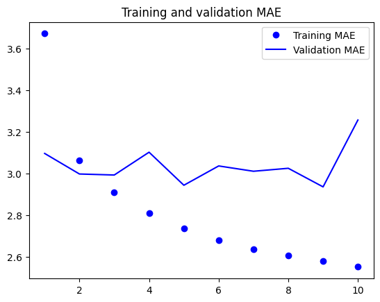

# 케라스 창시자에게 배우는 딥러닝
## 10장, *시계열을 위한 딥러닝*

## 10.1 다양한 종류의 시계열 작업

**시계열**(timeseries) 데이터는 일정한 간격으로 측정하여 얻은 모든 데이터를 말한다. 시계열을 다루려면 주기성, 시간에 따른 트렌드, 규칙적인 형태와 급격한 증가 등 시스템의 역학(dynamics)을 이해해야 한다.

가장 일반적인 시계열 관련 작업은 **예측**(forecasting)이다. 이 장의 초점 또한 예측에 맞춰져 있다. 그러나 시계열로 할 수 있는 일은 다양하다.

- **분류**: 하나 이상의 범주형 레이블을 시계열에 분류한다. 예를 들어 웹 사이트 방문자 활동에 대한 시계열이 주어지면 사용자가 봇(bot)인지 사람인지 분류한다.
- **이벤트 감지**: 연속된 데이터 스트림에서 예상되는 특정 이벤트 발생을 식별한다. 유용한 어플리케이션은 핫워드(hotword) 감지로 모델이 오디오 스트림을 모니터링하다가 "하이 빅스비", "시리" 등의 시작 단어를 감지한다.
- **이상치 탐지**(anomaly detection): 연속된 데이터 스트림에서 발생하는 비정상적인 현상을 감지한다. 이상치 탐지는 일반적으로 비지도 학습(unsupervised learning)으로 수행된다. 어떤 종류의 이상치를 찾는지 모르는 경우가 많아 구체적인 이상치 샘플로 훈련할 수 없기 때문이다.

이 장에서는 순환 신경망(Recurrent Neural Network, RNN)에 배우고 시계열 예측에 적용하는 방법을 알아본다.


## 10.2 온도 예측 문제

이 장의 모든 코드 예제는 하나의 문제를 다룰 것이다. 바로 지붕 위의 센서에서 최근에 기록한 기압, 습도와 같은 매시간 측정값의 시계열이 주어졌을 때 24시간 뒤의 온도를 예측하는 문제이다.

데이터셋은 독일 예나(Jena) 시에 있는 막스 플랑크 생물지구화학연구소(Max Planck Institute for Biogeochemistry)의 기상 관측소에서 수집한 것이다. 수년 간에 걸쳐 14개의 관측치가 10분마다 기록되어 있다. 원본 데이터는 2003년부터 기록되어 있지만 이 예제에서는 2009~2016년 사이의 데이터만 사용한다.

먼저 데이터를 내려받고 압축을 해제한다.

```
!wget https://s3.amazonaws.com/keras-datasets/jena_climate_2009_2016.csv.zip
!unzip jena_climate_2009_2016.csv.zip
!rm -f jena_climate_2009_2016.csv.zip
```

데이터를 살펴보자.

**코드 10-1. 예나 날씨 데이터셋 조사하기**
```
import os
fname = os.path.join("jena_climate_2009_2016.csv")

with open(fname) as f:
    data = f.read()

lines = data.split("\n")
header = lines[0].split(",")
lines = lines[1:]
print(header)
print(len(lines))
```

출력된 줄의 개수는 420,451개이다. 헤더는 다음과 같다.

```
['"Date Time"', '"p (mbar)"', '"T (degC)"', '"Tpot (K)"', '"Tdew (degC)"', '"rh (%)"', '"VPmax (mbar)"', '"VPact (mbar)"', '"VPdef (mbar)"', '"sh (g/kg)"', '"H2OC (mmol/mol)"', '"rho (g/m**3)"', '"wv (m/s)"', '"max. wv (m/s)"', '"wd (deg)"']
```

데이터 전체를 넘파이 배열로 변환한다. 온도를 하나의 배열로 만들고 나머지 데이터를 또 다른 배열로 만든다. 두 번째로 만드는 배열이 미래 온도를 예측하기 위해 사용할 특성이다. 이때 `Date Time` 열은 제외한다.

**코드 10-2. 데이터 파싱**
```
import numpy as np

temperature = np.zeros((len(lines), ))
raw_data = np.zeros((len(lines), len(header) - 1))
for i, line in enumerate(lines):
    values = [float(x) for x in line.split(",")[1:]]
    temperature[i] = values[1]
    raw_data[i, :] = values[:]
```

시간에 따른 온도 그래프를 그려 확인해 보자.

**코드 10-3. 전체 온도를 그래프로 그리기**
```
from matplotlib import pyplot as plt

plt.plot(range(len(temperature)), temperature)
plt.show()
```


그래프를 통해 매년 온도에 주기성이 있다는 것을 확인할 수 있다.

처음 10일 간의 온도 그래프도 그려 확인해 보겠다.

**코드 10-4. 처음 10일 간의 온도를 그래프로 그리기**
```
plt.plot(range(1440), temperature[:1440])
plt.show()
```


이 그래프에서는 일별 주기성을 확인할 수 있다. 특히 마지막 4일 간의 추세를 보면 확실히 이 기간이 아주 추운 겨울에 해당함을 알 수 있다.

여러 시간 범위에 걸친 주기성은 시계열 데이터에서 중요하고 매우 일반적인 성질이다. 어떤 시계열 데이터에서나 일별 주기성, 연간 주기성을 확인할 수 있다. 데이터를 탐색할 때 이런 패턴을 찾아보는 것이 좋다.

모든 예제에서 훈련, 검증, 테스트 데이터의 비율을 2:1:1로 사용한다. 시계열 데이터를 다룰 때 검증 데이터와 테스트 데이터는 항상 훈련 데이터보다 최신의 것이어야 한다. 과거를 바탕으로 미래를 예측하는 것이기 때문이다. 이 구도에 맞게 검증 세트와 테스트 세트를 분할해야 한다. 어떤 문제들은 시간 축을 거꾸로 함으로써 쉽게 해결 가능하다.

**코드 10-5. 각 분할에 사용할 샘플 개수 계산하기**
```
>>> num_train_samples = int(0.5 * len(raw_data))
>>> num_val_samples = int(0.25 * len(raw_data))
>>> num_test_samples = len(raw_data) - num_train_samples - num_val_samples
>>> print(f"num_train_samples: {num_train_samples}")
>>> print(f"num_val_samples: {num_val_samples}")
>>> print(f"num_test_samples: {num_test_samples}")
num_train_samples: 210225
num_val_samples: 105112
num_test_samples: 105114
```

### 10.2.1 데이터 준비

이 문제의 정확한 정의는 "한 시간에 한 번씩 샘플링된 5일 간의 데이터가 주어졌을 때 24시간 뒤의 온도를 예측할 수 있는가?"이다.

먼저 데이터를 신경망에 주입할 수 있는 형태로 전처리해 보자. 데이터가 이미 수치형이기 때문에 어떤 벡터화도 필요하지 않다. 하지만 이 데이터에 있는 시계열은 스케일이 각기 다르다. 예를 들어 mbar로 측정된 기압은 약 1,000이지만 H2OC는 mmol/mol로 측정되어 약 3 정도이다. 각 시계열을 독립적으로 정규화하여 비슷한 범위를 가진 작은 값으로 바꾼다. 처음 210,225개의 타임스텝(timestep)을 훈련 데이터로 사용하므로 이 범위에서 평균과 표준 편차를 계산한다.

**코드 10-6. 데이터 정규화**
```
mean = raw_data[:num_train_samples].mean(axis=0)
raw_data -= mean
std = raw_data[:num_train_samples].std(axis=0)
raw_data /= std
```

이제 과거 5일치 데이터와 24시간 뒤 타깃 온도의 배치를 반환하는 `Dataset` 객체를 만들어 보자. 이 데이터셋에 있는 샘플은 중복이 많다. 모든 샘플을 메모리에 적재하면 낭비가 심하다. 그 대신 `raw_data`, `temperature` 배열만 메모리에 유지하고 그때그때 샘플을 생성한다.

파이썬 제네레이터를 만들어 처리할 수도 있고, 케라스 내장 데이터셋 유틸리티 `timeseries_dataset_from_array()`를 사용할 수도 있다. 이 함수는 모든 종류의 시계열 예측 작업에 일반적으로 사용할 수 있다.

`timeseries_dataset_from_array()`를 사용하여 훈련, 검증, 테스트 데이터셋을 만들 것이다. 이때 다음과 같은 매개변수 값을 사용한다.

- **sampling_rate = 6**: 시간당 하나의 데이터 포인트가 샘플링된다. 즉, 6개의 데이터 포인트 중 하나만 사용한다.
- **sequence_length = 120**: 이전 5일 간(120시간) 데이터를 사용한다.
- **delay = sampling_rate * (sequence_length + 24 - 1)**: 시퀀스의 타깃은 시퀀스 끝에서 24시간 후의 온도이다.

**코드 10-7. 훈련, 검증, 테스트 데이터셋 만들기**
```
sampling_rate = 6
sequence_length = 120
delay = sampling_rate * (sequence_length + 24 - 1)
batch_size = 256

train_dataset = keras.utils.timeseries_dataset_from_array(
    raw_data[:-delay],
    targets=temperature[delay:],
    sampling_rate=sampling_rate,
    sequence_length=sequence_length,
    shuffle=True,
    batch_size=batch_size,
    start_index=0,
    end_index=num_train_samples,
)

val_dataset = keras.utils.timeseries_dataset_from_array(
    raw_data[:-delay],
    targets=temperature[delay:],
    sampling_rate=sampling_rate,
    sequence_length=sequence_length,
    shuffle=True,
    batch_size=batch_size,
    start_index=num_train_samples,
    end_index=num_train_samples + num_val_samples,
)

test_dataset = keras.utils.timeseries_dataset_from_array(
    raw_data[:-delay],
    targets=temperature[delay:],
    sampling_rate=sampling_rate,
    sequence_length=sequence_length,
    shuffle=True,
    batch_size=batch_size,
    start_index=num_train_samples + num_val_samples,
)
```

각 데이터셋은 (samples, targets) 크기의 튜플을 반환한다. `samples`는 256개의 샘플로 이루어진 배치이다. 각 샘플은 연속된 120시간의 입력 데이터를 담고 있다. `targets`는 256개의 타깃 온도에 해당하는 배열이다. 샘플들은 랜덤하게 섞여 있기 때문에 연속된 두 샘플이 시간적으로 가깝다는 보장은 없다.

**코드 10-8. 훈련 데이터셋의 배치 크기 확인하기**
```
>>> for samples, targets in train_dataset:
>>>     print("샘플 크기:", samples.shape)
>>>     print("타깃 크기:", targets.shape)
>>>     break
샘플 크기: (256, 120, 14)
타깃 크기: (256,)
```

### 10.2.2 상식 수준의 기준점

딥러닝 모델 사용 전 간단한 상식 수준의 해법을 시도해 보자. 이는 정상적인 문제인지 확인하기 위한 용도이며 고수준 머신 러닝 모델이라면 뛰어넘어야 할 기준점이 된다.

시계열 데이터는 연속성이 있고 일자별로 주기성을 가진다고 가정할 수 있다. 그렇기 때문에 상식 수준의 해결책은 지금으로부터 24시간 후의 온도는 지금과 동일하다고 예측하는 것이다. 이 방법을 다음과 같이 정의된 평균 절댓값 오차(MAE)로 평가해 볼 것이다.

```
np.mean(np.abs(preds - targets))
```

**코드 10-9. 상식 수준 모델의 MAE 계산하기**
```
def evaluate_naive_method(dataset):
    total_abs_err = 0.
    samples_seen = 0
    for samples, targets in dataset:
        preds = samples[:, -1, 1] * std[1] + mean[1]
        total_abs_err += np.sum(np.abs(preds - targets))
        samples_seen += samples.shape[0]
    return total_abs_err / samples_seen

print(f"검증 MAE: {evaluate_naive_method(val_dataset):.2f}")
print(f"테스트 MAE: {evaluate_naive_method(test_dataset):.2f}")
```

상식 수준의 모델은 섭씨 2.44도의 검증 MAE와 2.62도의 테스트 MAE를 달성했다. 따라서 24시간 후의 온도를 항상 현재와 같다고 가정하면 평균적으로 2.5도 정도 차이가 날 것이다.

### 10.2.3 기본적인 머신 러닝 모델 시도해 보기

RNN처럼 복잡하고 연산 비용이 많이 드는 모델을 시도하기 전 간단하고 손쉽게 만들 수 있는 머신 러닝 모델을 먼저 만드는 것이 좋다. 이를 바탕으로 더 복잡한 방법을 도입하는 근거가 마련되고 실제적인 이득도 얻게 될 것이다.

데이터를 펼쳐서 2개의 Dense 층을 통과시키는 완전 연결 네트워크를 먼저 만들어 보자. 전형적인 회귀 문제이므로 마지막 Dense 층에는 활성화 함수를 두지 않는다. 손실 함수로는 MAE 대신 평균 제곱 오차(MSE)를 사용한다. 이는 원점에서 미분 가능하기 때문에 경사 하강법에 잘 맞는다. compile() 메소드에 모니터링할 지표로 MAE를 추가한다.

**코드 10-10. 밀집 연결 모델 훈련하고 평가하기**
```
from tensorflow import keras
from tensorflow.keras import layers

inputs = keras.Input(shape=(sequence_length, raw_data.shape[-1]))
x = layers.Flatten()(inputs)
x = layers.Dense(16, activation="relu")(x)
outputs = layers.Dense(1)(x)
model = keras.Model(inputs=inputs, outputs=outputs)

callbacks = [
    keras.callbacks.ModelCheckpoint("jena_dense.keras", save_best_only=True)
]

model.compile(optimizer="rmsprop", loss="mse", metrics=["mae"])

history = model.fit(
    train_dataset,
    epochs=10,
    validation_data=val_dataset,
    callbacks=callbacks,
)

model = keras.models.load_model("jena_dense.keras")

print(f"테스트 MAE: {model.evaluate(test_dataset)[1]:.2f}")
```

테스트 MAE는 2.59이다. 훈련과 검증 MAE 곡선도 그려 보자.

**코드 10-11. 결과 그래프 그리기**
```
import matplotlib.pyplot as plt

mae = history.history["mae"]
val_mae = history.history["val_mae"]
epochs = range(1, len(mae) + 1)

plt.figure()
plt.plot(epochs, mae, "bo", label="Training MAE")
plt.plot(epochs, val_mae, "b", label="Validation MAE")
plt.title("Training and validation MAE")
plt.legend()
plt.show()
```


이 문제는 기준 모델의 성능을 앞지르기가 쉽지 않은 것으로 보인다. 이것은 머신 러닝이 가진 심각한 제약 사항과 관련된다. 상식 수준의 모델은 가설 공간에서 표현할 수 있는 수백만 가지의 가중치 조합 중 하나이기 때문에 기술적으로 경사 하강법이 이를 못 찾을 가능성이 훨씬 높다. 이것이 좋은 특성 공학 및 문제와 관련된 아키텍처 구조를 활용하는 것이 중요한 이유이다. 즉, 모델이 찾아야 할 것을 정확히 알려주어야 한다.

### 10.2.4 1D 합성곱 모델 시도해 보기

입력 시퀀스는 일별 주기를 가지기 때문에 합성곱 모델을 적용할 수 있다. 시간 축에 대한 합성곱은 다른 날에 있는 동일한 표현을 재사용할 수 있다. 마치 공간 방향 합성곱이 이미지에서 다른 위치에 있는 같은 표현을 재사용하는 것과 같다.

`Conv2D`, `SeparableConv2D` 층은 작은 윈도우로 2D 그리드 위를 이동하면서 입력을 바라본다. `Conv1D`, `SeparableConv1D`는 1D 윈도우를 사용하여 입력 시퀀스를 슬라이딩한다. `Conv3D` 층은 정육면체 윈도우를 사용하여 입력 볼륨 위를 슬라이딩한다.

1D 컨브넷 역시 평행 이동 불변성 가정을 따르는 어떤 시퀀스 데이터에도 잘 맞는다. 즉, 시퀀스 위로 윈도우를 슬라이딩하면 윈도우 안의 내용이 위치에 상관없이 동일한 성질을 가진다는 의미이다.

이를 온도 예측 문제에 적용한다. 초기 윈도우 길이는 24로 정하여 한 주기에 24시간의 데이터를 보게 한다. `MaxPooling1D` 층으로 시퀀스를 다운샘플링하기 때문에 그에 맞추어 윈도우의 크기를 줄인다.

```
from tensorflow import keras
from tensorflow.keras import layers

inputs = keras.Input(shape=(sequence_length, raw_data.shape[-1]))
x = layers.Conv1D(8, 24, activation="relu")(inputs)
x = layers.MaxPooling1D(2)(x)
x = layers.Conv1D(8, 12, activation="relu")(x)
x = layers.MaxPooling1D(2)(x)
x = layers.Conv1D(8, 6, activation="relu")(x)
x = layers.GlobalAveragePooling1D()(x)
outputs = layers.Dense(1)(x)

model = keras.Model(inputs=inputs, outputs=outputs)

callbacks = [
    keras.callbacks.ModelCheckpoint("jena_conv.keras", save_best_only=True)
]

model.compile(optimizer="rmsprop", loss="mse", metrics=["mae"])

history = model.fit(
    train_dataset,
    epochs=10,
    validation_data=val_dataset,
    callbacks=callbacks,
)

model = keras.models.load_model("jena_conv.keras")

print(f"테스트 MAE: {model.evaluate(test_dataset)[1]:.2f}")
```

훈련과 검증 MAE 곡선은 다음과 같다.

```
import matplotlib.pyplot as plt

mae = history.history["mae"]
val_mae = history.history["val_mae"]
epochs = range(1, len(mae) + 1)

plt.figure()
plt.plot(epochs, mae, "bo", label="Training MAE")
plt.plot(epochs, val_mae, "b", label="Validation MAE")
plt.title("Training and validation MAE")
plt.legend()
plt.show()
```



이 모델은 밀집 연결 모델보다 더 성능이 나쁘다. 테스트 MAE는 3.14를 달성하여 상식 수준의 모델과의 차이가 크다. 문제점은 두 가지가 있다.

- 날씨 데이터는 평행 이동 불변성 가정을 많이 따르지 않는다. 데이터에 일별 주기성이 있긴 하나 아침 데이터는 저녁이나 한밤중의 데이터와 성질이 다르다. 날씨 데이터는 매우 특정한 시간 범위에 대해서만 평행 이동 불변성을 가진다.
- 이 데이터는 순서가 많이 중요하다. 최근 데이터가 5일 전 데이터보다 내일 온도를 예측하는 데 훨씬 더 유용하다. 1D 컨브넷은 이러한 사실을 활용할 수 없다. 특히 최대 풀링과 전역 평균 풀링 층 때문에 순서 정보가 많이 삭제된다.

### 10.2.5 첫 번째 순환 신경망

밀집 연결 모델은 시계열 데이터를 펼쳤기 때문에 입력 데이터에서 시간 개념을 잃어버렸다. 합성곱 모델은 데이터의 모든 부분을 비슷한 방식으로 처리했으며 풀링을 적용하여 순서 정보를 잃어버렸다. 이런 방법 대신 인과 관계와 순서가 의미 있는 시퀀스 데이터를 그대로 사용한다.

이런 문제를 위해 특별히 고안된 신경망 구조가 순환 신경망이다. 그중에서도 LSTM(Long Short-Term Memory) 층이 오랫동안 인기가 많았다. LSTM 층을 적용해 보자.

**코드 10-12. 간단한 LSTM 기반 모델**
```
inputs = keras.Input(shape=(sequence_length, raw_data.shape[-1]))
x = layers.LSTM(16)(inputs)
outputs = layers.Dense(1)(x)

model = keras.Model(inputs=inputs, outputs=outputs)

callbacks = [
    keras.callbacks.ModelCheckpoint("jena_lstm.keras", save_best_only=True)
]

model.compile(optimizer="rmsprop", loss="mse", metrics=["mae"])

history = model.fit(
    train_dataset,
    epochs=10,
    validation_data=val_dataset,
    callbacks=callbacks,
)

model = keras.models.load_model("jena_lstm.keras")

print(f"테스트 MAE: {model.evaluate(test_dataset)[1]:.2f}")
```

테스트 MAE가 2.56으로 드디어 기준 모델과 성능이 비슷해졌다. 검증 및 손실 MAE 그래프도 그려보자.

```
import matplotlib.pyplot as plt

mae = history.history["mae"]
val_mae = history.history["val_mae"]
epochs = range(1, len(mae) + 1)

plt.figure()
plt.plot(epochs, mae, "bo", label="Training MAE")
plt.plot(epochs, val_mae, "b", label="Validation MAE")
plt.title("Training and validation MAE")
plt.legend()
plt.show()
```


## 10.3 순환 신경망 이해하기

순환 신경망 이전에 본 모든 신경망의 공통점은 메모리가 없다는 것이다. 네트워크에 주입되는 입력은 개별적으로 처리되며 입력 간에 유지되는 상태가 없다. 이런 네트워크로 시퀀스나 시계열 데이터 포인트를 처리하려면 네트워크에 전체 시퀀스를 주입해야 한다. 즉, 전체 시퀀스를 하나의 데이터 포인트로 변환해야 한다. 예를 들어 밀집 연결 모델과 같이 5일치 데이터를 펼쳐서 하나의 큰 벡터로 만들어야 한다. 이런 네트워크를 **피드포워드 네트워크**(feedforward network)라고 한다.

반면 인간은 문장을 읽을 때 이전에 나온 것을 기억하면서 단어별로, 또는 한눈에 들어오는 만큼 처리한다. 생물학적 지능은 정보 처리를 위한 내부 모델을 유지하면서 점진적으로 정보를 처리한다. 이 모델은 과거 정보를 기반으로 구축되며 새롭게 얻은 정보를 계속해서 업데이트한다.

**순환 신경망**(Recurrent Neural Network, RNN)은 이와 같은 원리를 극단적으로 단순화시킨 버전이다. 시퀀스의 원소를 순회하면서 지금까지 처리한 정보를 **상태**(state)에 저장한다. RNN은 내부에 루프(loop)를 가진 신경망의 한 종류이다.


RNN의 상태는 2개의 서로 다른 시퀀스를 처리하는 과정 사이에 재설정된다. 따라서 하나의 시퀀스를 여전히 네트워크에 주입되는 하나의 입력으로 간주할 수 있다. 이 데이터 포인트가 한 번에 처리되지 않을 뿐이다. 그 대신 네트워크는 내부적으로 시퀀스의 원소를 순회한다.

간단한 RNN 정방향 패스를 구현해 보자. 이 RNN은 (timesteps, input_features) 크기의 랭크-2 텐서로 인코딩된 벡터의 시퀀스를 입력받는다. 타임스텝을 따라 루프를 돌면서 각 타임스텝 t에서 현재 상태와 크기가 (input_features, )인 입력을 연결하여 출력을 계산한다. 그 다음 이 출력을 다음 스텝의 상태로 설정한다. 첫 번째 t에서는 이전 출력이 정의되지 않으므로 **초기 상태**(initial state)인 0 벡터로 상태를 초기화한다.

RNN의 의사 코드는 다음과 같다.

**코드 10-13. 의사 코드로 표현한 RNN**
```
state_t = 0
for input_t in input_sequence:
    output_t = f(input_t, state_t)
    state_t = output_t
```

f 함수는 입력과 상태를 출력으로 변환한다. 이를 2개의 행렬 W, U 그리고 편향 벡터를 사용하는 변환으로 바꿀 수 있다. 이는 피드포워드 네트워크의 밀집 연결 층에서 수행되는 변환과 비슷하다.

**코드 10-14. 좀 더 자세한 의사 코드로 표현한 RNN**
```
state_t = 0
for input_t in input_sequence:
    output_t = activation(dot(W, input_t) + dot(U, state_t) + b)
    state_t = output_t
```

간단한 RNN의 정방향 계산을 넘파이로 구현해 보자.

**코드 10-15. 넘파이로 구현한 간단한 RNN**
```
import numpy as np

timesteps = 100
input_features = 32
output_features = 64

inputs = np.random.random((timesteps, input_features))
state_t = np.zeros((output_features, ))

W = np.random.random((output_features, input_features))
U = np.random.random((output_features, output_features))
b = np.random.random((output_features, ))

successive_outputs = []
for input_t in inputs:
    output_t = np.tanh(np.dot(W, input_t) + np.dot(U, state_t) + b)
    successive_outputs.append(output_t)
    state_t = output_t
    
final_output_sequence = np.stack(successive_outputs, axis=0)
```

요약하면 RNN은 반복할 때 이전에 계산한 정보를 재사용하는 for 루프에 지나지 않는다. RNN은 스텝(step) 함수에 의해 특화된다. 이 예에서는 스텝 함수가 다음과 같다.

```
output_t = np.tanh(np.dot(W, input_t) + np.dot(U, state_t) + b)
```

이 예에서 최종 출력의 각 타임스텝은 시간 t에서의 출력을 나타낸다. 출력 텐서의 각 타임스텝 t에는 0부터 t까지 전체 과거에 대한 정보를 담고 있다. 따라서 많은 경우 전체 출력 시퀀스가 필요하지 않고 마지막 출력만 있으면 된다.

### 10.3.1 케라스의 순환 층

앞서 넘파이로 간단히 구현한 RNN 과정이 실제 케라스의 `SimpleRNN` 층에 해당한다.

`SimpleRNN`이 한 가지 다른 점은 하나의 시퀀스가 아닌 시퀀스의 배치를 처리한다는 것이다. 즉, (batch_size, timesteps, input_features) 크기의 입력을 받는다. 시작할 때 `Input()` 함수의 `shape` 매개변수 중 `timesteps` 항목을 None으로 지정할 수 있다. 이렇게 하면 임의의 길이를 가진 시퀀스를 처리할 수 있다.

**코드 10-16. 어떤 길이의 시퀀스도 처리할 수 있는 RNN 층**
```
num_features = 14
inputs = keras.Input(shape=(None, num_features))
outputs = layers.SimpleRNN(16)(inputs)
```

이는 모델이 가변 길이 시퀀스를 처리해야 한다면 특히 유용하다. 그러나 `model.summary()`의 유용성, 일부 성능 최적화 활용 가능성을 생각한다면 시퀀스 길이가 모두 같은 경우엔 완전한 입력 크기를 지정하는 것이 좋다.

케라스에 있는 모든 순환 층(`SimpleRNN`, `LSTM`, `GRU`)은 두 가지 모드로 실행할 수 있다. 각 타임스텝의 출력을 모은 전체 시퀀스((batch_size, timesteps, output_features) 크기의 랭크-3 텐서)를 반환하거나, 입력 시퀀스의 마지막 출력((batch_size, output_features) 크기의 랭크-2 텐서)만 반환할 수 있다. 두 모드는 생성자의 `return_sequences` 매개변수로 제어할 수 있다.

**코드 10-17. 마지막 출력 스텝만 반환하는 RNN 층**
```
>>> num_features = 14
>>> steps = 120
>>> inputs = keras.Input(shape=(steps, num_features))
>>> outputs = layers.SimpleRNN(16, return_sequences=False)(inputs)
>>> print(outputs.shape)
(None, 16)
```

**코드 10-18. 전체 출력 시퀀스를 반환하는 RNN 층**
```
>>> num_features = 14
>>> steps = 120
>>> inputs = keras.Input(shape=(steps, num_features))
>>> outputs = layers.SimpleRNN(16, return_sequences=True)(inputs)
>>> print(outputs.shape)
(None, 120, 16)
```

네트워크의 표현력을 증가시키기 위해 여러 개의 순환 층을 차례대로 쌓는 것이 유용할 때가 있다. 이런 설정에서는 중간층들이 **전체 출력 시퀀스**를 반환하도록 설정해야 한다.

**코드 10-19. 스태킹(stacking) RNN 층**
```
from tensorflow import keras
from tensorflow.keras import layers

inputs = keras.Input(shape=(steps, num_features))
x = layers.SimpleRNN(16, return_sequences=True)(inputs)
x = layers.SimpleRNN(16, return_sequences=True)(x)
outputs = layers.SimpleRNN(16)(x)
```

`SimpleRNN`은 이론적으로는 이전의 모든 타임스텝 정보를 유지할 수 있지만, 현실적으로 그레이디언트 소실(vanishing gradient) 문제가 존재하기 때문에 긴 시간에 걸친 의존성은 학습할 수 없다.

이 문제를 해결하기 위해 `LSTM`, `GRU` 층이 고안되었다.

장·단기 메모리(Long Short-Term Memory, LSTM) 알고리즘은 호크라이터와 슈미트후버가 1997년에 개발했다. 이 알고리즘은 그레이디언트 소실 문제에 대한 연구의 결정체이다. 처리할 시퀀스에 나란히 작동하는 컨베이어 벨트가 있는 것처럼, 시퀀스의 어느 지점에서 추출된 정보가 필요한 시점의 타임스텝으로 이동하여 떨구어진다. 이처럼 나중을 위해 앞의 정보를 저장함으로써 오래된 시그널이 점차 소실되는 것을 막아준다. 이는 **잔차 연결**과 비슷한 아이디어이다.

일반적인 `SimpleRNN` 구조를 생각해 보자. `LSTM`은 타임스텝 n에서 `SimpleRNN` 셀을 가로지르는 이동 상태 c_t가 정의된다. n+1에서는 c_t+1, n-1에서는 c_t-1이다. 이동 상태는 밀집 연결 층과 같은 변환을 통해 입력 연결과 순환 연결(상태)에 연결된다.

데이터 흐름에서 다음 이동 상태(c_t+1)가 계산되는 방식은 3개의 서로 다른 변환이 관련된다. 3개 모두 `SimpleRNN`과 같은 형태를 가진다.

```
y = activation(dot(state_t, U) + dot(input_t, W) + b)
```

하지만 3개의 변환 모두 자신만의 가중치 행렬을 가진다. 서로 다른 행렬을 i, f, k로 구분하면 다음과 같은 의사 코드를 작성할 수 있다.

**코드 10-20. LSTM 구조의 의사 코드(1/2)**
```
output_t = activation(c_t) * activation(dot(input_t, Wo) + dot(state_t, Uo) + bo)
i_t = activation(dot(state_t, Ui) + dot(input_t, Wi) + bi)
f_t = activation(dot(state_t, Uf) + dot(input_t, Wf) + bf)
k_t = activation(dot(state_t, Uk) + dot(input_t, Wk) + bk)
```

`i_t`, `f_t`, `k_t`를 결합하여 새로운 이동 상태(c_t+1)를 구한다.

**코드 10-21. LSTM 구조의 의사 코드(2/2)**
```
c_t+1 = i_t * k_t + c_t * f_t
```

`c_t`와 `f_t`의 곱셈은 이동을 위한 데이터 흐름에서 관련이 적은 정보를 의도적으로 삭제하는 것이다. 한편, `i_t`와 `k_t`는 현재에 대한 정보를 제공하고 이동 트랙을 새로운 정보로 업데이트한다. 하지만 셀의 가중치에 따라 연산이 크게 바뀌기 때문에 이러한 연산 조합이 엔지니어링적인 설계가 아닌 가설 공간의 제약 조건이라고 해석하는 것이 낫다.

LSTM 셀의 구체적인 구조에 대해선 이해할 필요가 없다. 그냥 LSTM 셀이 과거 정보를 나중에 다시 주입하여 그레이디언트 소실 문제를 해결한다는 것만 기억하면 된다.


## 10.4 순환 신경망의 고급 사용법

이 절에서는 딥러닝 시퀀스 모델을 최대한 활용하기 위해 다음과 같은 내용을 다룬다.

- **순환 드롭아웃**(recurrent dropout): 드롭아웃의 한 종류로 순환 층에서 과대적합을 방지하기 위해 사용한다.
- **스태킹 순환 층**(stacking recurrent layer): 모델의 표현 능력(representational power)을 증가시킨다(그 대신 계산 비용이 많이 든다).
- **양방향 순환 층**(bidirectional recurrent layer): 순환 네트워크에 같은 정보를 다른 방향으로 주입하여 정확도를 높이고 기억을 좀 더 오래 유지시킨다.

### 10.4.1 과대적합을 감소하기 위해 순환 드롭아웃 사용하기

상식 수준의 기준점에 근사한 첫 번째 모델인 LSTM 기반 모델을 다시 사용한다. 훈련 손실과 검증 손실을 곡선을 보면 모델이 과대적합인지 알 수 있다. 이전에 드롭아웃을 알아보았으나, 일반적인 드롭아웃 방식을 그대로 순환 신경망에 적용하는 것은 간단하지 않다.

순환 층 이전에 드롭아웃을 적용하면 규제에 도움이 되는 것보다는 학습에 더 방해되는 것으로 오랫동안 알려져왔다. 그러나 2016년 야린 갈(Yarin Gal)이 베이지안 딥러닝에 관한 박사 논문에서 순환 네트워크에 적절하게 드롭아웃을 사용하는 방법을 알아낸다. 타임스텝마다 랜덤하게 드롭아웃 마스크를 변경하는 것이 아닌 동일한 드롭아웃 마스크를 모든 타임스텝에 적용해야 한다. `GRU`나 `LSTM` 같은 순환 게이트에 의해 만들어지는 표현을 규제하려면 순환 층 내부 계산에 사용된 활성화 함수에 타임스텝마다 동일한 드롭아웃 마스크를 적용해야 한다. 이러면 네트워크가 학습 오차를 타임스텝에 걸쳐 적절히 전파할 수 있다. 타임스텝마다 랜덤한 드롭아웃 마스크가 사용될 시 오차 신호가 전파되는 것을 방해하고 학습 과정에 해를 끼친다.

케라스에 있는 모든 순환 층은 2개의 드롭아웃 매개변수를 가지고 있다. `dropout`은 층의 입력에 대한 드롭아웃 비율을 정하는 부동 소수점 값이고, `recurrent_dropout`은 순환 상태의 드롭아웃 비율을 정한다. 첫 번째 LSTM 예제의 `LSTM` 층에 순환 드롭아웃을 적용하여 과대적합에 어떤 영향을 미치는지 알아보자.

드롭아웃 덕분에 규제를 위해 네트워크 크기에 신경 쓸 필요가 없다. 2배 더 많은 유닛을 가진 `LSTM` 층을 사용한다. 만약 규제가 없다면 이 네트워크는 시작과 동시에 과대적합될 것이다. 그러나 드롭아웃으로 규제된 네트워크는 완전히 수렴하는 데 언제나 훨씬 더 오래 걸리기 때문에 에포크를 늘려 네트워크를 훈련한다.

**코드 10-22. 드롭아웃 규제를 적용한 LSTM 모델 훈련하고 평가하기**
```
inputs = keras.Input(shape=(sequence_length, raw_data.shape[-1]))
x = layers.LSTM(32, recurrent_dropout=0.25)(inputs)
x = layers.Dropout(0.5)(x)
outputs = layers.Dense(1)(x)

model = keras.Model(inputs=inputs, outputs=outputs)

callbacks = [
    keras.callbacks.ModelCheckpoint("jena_lstm_dropout.keras", save_best_only=True)
]

model.compile(optimizer="rmsprop", loss="mse", metrics=["mae"])

history = model.fit(
    train_dataset,
    epochs=50,
    validation_data=val_dataset,
    callbacks=callbacks,
)
```


괜찮은 수준의 MAE를 달성하였다.

층에 순환 드롭아웃을 추가하면 cnDNN을 사용할 수 없다. 이때 RNN 층의 속도를 높이는 방법으로 층을 **언롤링**(unrolling)하는 것이 있다. 단, 입력 층의 크기가 정확히 정의되어 있어야 언롤링을 사용할 수 있다. 다음과 같이 사용한다.

```
inputs = keras.Input(shape=(sequence_length, num_features))
x = layers.LSTM(32, recurrent_dropout=0.2, unroll=True)(inputs)
```

### 10.4.2 스태킹 순환 층

과대적합은 더 이상 없지만 성능상 병목이 있는 것 같으므로 네트워크의 용량과 표현력을 늘려야 한다. 너무 많이 과대적합되지 않는 한 아직 충분한 용량에 도달한 것이 아니다.

네트워크의 용량을 늘리려면 일반적으로 층에 있는 유닛의 개수를 늘리거나 층을 더 많이 추가해야 한다. 순환 층 스태킹은 더 강력한 순환 네트워크를 만드는 고전적인 방법이다.

다시 한번, 케라스에서 순환 층을 차례대로 쌓으려면 모든 중간 층은 마지막 타임스텝만 출력하는 것이 아니라 전체 시퀀스(랭크-3 텐서)를 출력해야 한다. 이를 위해 `return_sequence=True`로 옵션을 지정하면 된다.

드롭아웃 규제를 사용하면서 2개의 순환 층을 스태킹해 보자. `LSTM` 대신에 `GRU`(Gated Recurrent Unit)를 사용한다. `GRU`는 `LSTM` 구조의 간단하고 간소화된 버전으로 생각할 수 있다. 순환 신경망이 소규모 연구 커뮤니티에서 관심을 받기 시작할 때 2014년 조경현 등이 `GRU`를 소개했다.

**코드 10-23. 드롭아웃 규제와 스태킹을 적용한 GRU 모델을 훈련하고 평가하기**
```
inputs = keras.Input(shape=(sequence_length, raw_data.shape[-1]))
x = layers.GRU(32, recurrent_dropout=0.5, return_sequences=True)(inputs)
x = layers.GRU(32, recurrent_dropout=0.5)(x)
x = layers.Dropout(0.5)(x)
outputs = layers.Dense(1)(x)

model = keras.Model(inputs=inputs, outputs=outputs)

callbacks = [
    keras.callbacks.ModelCheckpoint("jena_stacked_gru_dropout.keras", save_best_only=True)
]

model.compile(optimizer="rmsprop", loss="mse", metrics=["mae"])

history = model.fit(
    train_dataset,
    epochs=50,
    validation_data=val_dataset,
    callbacks=callbacks,
)

model = keras.models.load_model("jena_stacked_gru_dropout.keras")

print(f"테스트 MAE: {model.evaluate(test_dataset)[1]:.2f}")
```

테스트 MAE는 2.46를 달성했다. 네트워크의 용량을 늘리는 것이 도움되진 않는다고 결론지을 수 있다.


### 10.4.3 양방향 RNN 사용하기

**앙방향 RNN**(bidirectional RNN)은 `RNN`의 한 변종으로, 특정 작업에서는 기본 `RNN`보다 훨씬 좋은 성능을 보인다. 자연어 처리에서는 맥가이버 칼에 비유될 정도로 자주 사용된다.

`RNN`은 특히 순서에 민감하다. 타임스텝을 섞거나 거꾸로 하면 시퀀스에서 학습하는 표현이 완전히 바뀐다. 이는 온도 예측과 같이 순서에 의미가 있는 문제에 더 잘 맞는 이유이기도 하다. `양방향 RNN`은 `RNN`이 순서에 민감하다는 성질을 이용해 `LSTM`, `GRU` 같은 `RNN` 2개를 사용한다. 각 `RNN`은 입력 시퀀스를 시간 순서나 반대 순서의 한 방향으로 처리한 후 각 표현을 합친다. 시퀀스를 양쪽 방향으로 처리하기 때문에 `단방향 RNN`이 놓치기 쉬운 패턴을 감지할 수 있다.

매우 중요한 사실은 `RNN` 층이 시간 순서대로 오래된 타임스텝이 먼저 나오도록 시퀀스를 처리하는 것이 근거 없는 결정이라는 것이다.

이전의 예제에서 입력 시퀀스를 시간 차원을 따라 거꾸로 변환해 `LSTM`으로 훈련하면 상식 수준의 기준점보다도 성능이 낮게 나온다. 사실 이는 `LSTM` 층이 일반적으로 먼 과거의 데이터 포인트보다 최근의 것을 더 잘 기억하고 날씨 데이터 포인트는 최근의 것이 예측에 더 유리하기 때문에 당연한 결과이다.

하지만 이런 가정이 항상 통하는 것은 아니다. 자연어 처리를 포함한 다른 많은 문제를 생각해 보면 문장 내 단어 위치가 문장 해석에 중요한 영향을 주지 않는다. 텍스트 데이터셋에서는 그러므로 순서를 뒤집어 처리해도 그렇지 않은 경우와 비슷한 성능을 보인다. 사람 역시 거꾸로 문장을 읽어도 문장을 이해하는 데 큰 어려움이 없다.

머신 러닝에서는 다른 표현이 유용하다면 항상 사용할 가치가 있다. 이 표현이 많이 다를수록 오히려 데이터를 바라보는 새로운 시각을 제공하고 다른 방식에서 놓칠 수 있는 데이터의 특징을 잘 감지해낸다. 이런 표현들이 작업 성능을 올리는 데 도움을 준다. 이것이 바로 **앙상블**(ensemble) 개념이다.

`양방향 RNN`은 앙상블 개념에 근거하여 시간 순서대로 처리하는 `RNN`의 성능을 향상시킨다. 입력 시퀀스를 양쪽 방향으로 바라보는 것만으로 잠재적으로 풍부한 표현을 얻고 시간 순서대로 처리할 때 놓칠 수 있는 표현을 감지할 수 있다.

케라스에서는 `Bidirectional` 층을 사용하여 `양방향 RNN`을 만든다. 이 클래스는 첫 번째 매개변수로 순환 층 객체를 전달받고 그것으로 시간 순서대로 입력 시퀀스를 처리하는 객체, 반대 순서로 입력 시퀀스를 처리하는 객체를 생성한다.

**코드 10-24. 양방향 LSTM 모델 훈련하고 평가하기**
```
inputs = keras.Input(shape=(sequence_length, raw_data.shape[-1]))
x = layers.Bidirectional(layers.LSTM(16))(inputs)
outputs = layers.Dense(1)(x)

model = keras.Model(inputs=inputs, outputs=outputs)

model.compile(optimizer="rmsprop", loss="mse", metrics=["mae"])

history = model.fit(
    train_dataset,
    epochs=10,
    validation_data=val_dataset,
)
```


이 모델은 평범한 `LSTM` 층만큼의 성능을 보이지 못한다. 이유는 간단히 절반의 층만 예측 성능이 좋고 나머지 절반의 층은 좋지 않기 때문이다. 데이터셋이 특수하기 때문으로 시간 반대 순서로 처리하는 층이 오히려 네트워크의 용량을 2배로 늘리고 과대적합을 훨씬 더 일찍 발생시키게 된다.

하지만 `양방향 RNN`은 텍스트 데이터 또는 순서가 중요하지만 사용 순서 자체는 중요하지 않은 다른 종류의 데이터에 잘 맞는다. 트랜스포머(Transformer) 구조가 등장하기 전까지는 2016년 잠시 동안 `양방향 LSTM` 층이 많은 자연어 처리 작업에서 최고 수준의 성능을 냈다.

### 10.4.4 더 나아가서

온도 예측 문제의 성능을 향상하기 위해 시도해 볼 수 있는 것을 나열한다.

- 스태킹한 각 순환 층의 유닛 개수와 드롭아웃의 양을 조정한다.
- RMSprop 옵티마이저의 학습률을 조정하거나 다른 옵티마이저를 사용한다.
- 순환 층 위에 놓을 회귀 모델을 위해 하나가 아닌 여러 개의 Dense 층을 쌓는다.
- 모델의 입력을 개선한다. 더 길거나 짧은 시퀀스를 테스트해 보거나 샘플링 간격(sampling_rate)을 바꾼다. 또는 특성 공학을 수행한다.

이 책의 저자는 머신 러닝을 사용하지 않은 기준점에서 10%의 성능을 향상시키는 것이 그 데이터셋에서의 최선일 것이라고 가정한다. 


## 10.5 요약

- 새로운 문제를 해결할 때는 선택한 지표에서 상식 수준의 기준점을 설정하는 것이 좋다. 기준점을 가지고 있지 않으면 실제로 향상되었는지 알 수 없다.
- 추가 비용이 합리적인지 판단하기 위해 계산 비용이 높은 모델 전에 간단한 모델을 시도한다. 이따금 간단한 모델이 최선일 때가 있다.
- 시간 순서가 중요한 데이터, 특히 시계열 데이터가 있다면 순환 신경망이 적합하다. 시계열 데이터를 펼쳐서 처리하는 모델의 성능을 쉽게 앞지를 수 있다. 케라스에서 핵심적인 RNN 층 2개는 LSTM 층과 GRU 층이다.
- 순환 네트워크에 드롭아웃을 사용하려면 타임스텝 동안 동일한 드롭아웃 마스크와 순환 드롭아웃 마스크를 사용해야 한다. 둘 다 케라스 순환 층에 포함되어 있다. 순환 층에 있는 recurrent_dropout 매개변수를 사용하면 된다.
- 스태킹 RNN은 단일 RNN 층보다 더 강력한 표현 능력을 제공한다. 하지만 계산 비용이 많이 들기 때문에 항상 시도할 가치가 있지는 않다. 기계 번역과 같은 복잡한 문제에서 확실히 도움이 되지만 작고 간단한 문제에서는 항상 그렇진 않다.