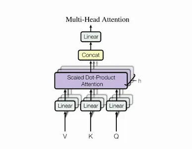
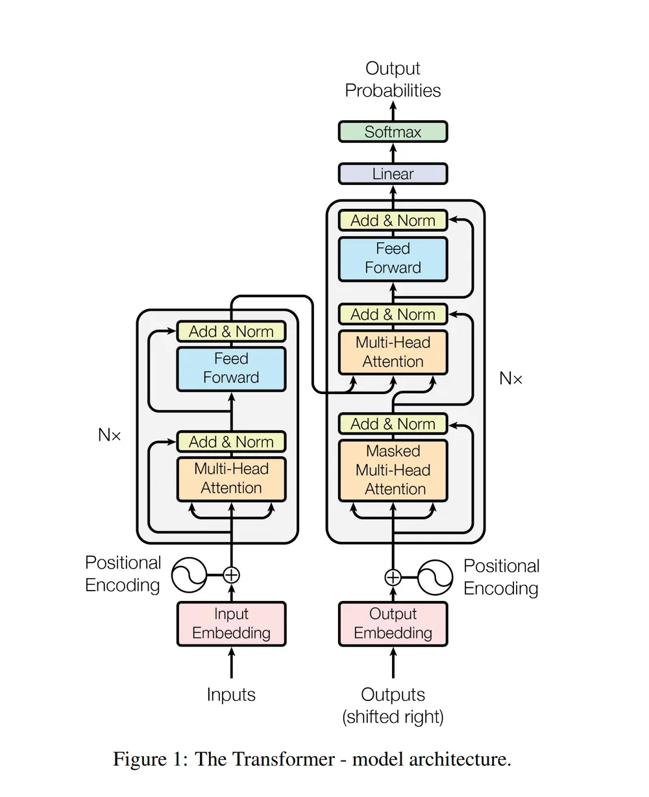

# 케라스 창시자에게 배우는 딥러닝
## 11장, *텍스트를 위한 딥러닝*

## 11.1 자연어 처리 소개

컴퓨터 과학에서는 사람의 언어를 기계어와 구분하기 위해 자연어(natural language)라고 부른다. 모든 기계어는 설계된 것으로, 규칙이 먼저 완성된 후 언어를 사용한다. 그러나 자연어는 반대로 먼저 사용되고 나중에 규칙이 생긴다. 자연어는 유기체와 매우 비슷하게 진화 과정에 의해 형성되기 때문에 자연이라는 단어가 붙는다. 결과적으로 기계어는 매우 구조적이고 엄격하며 고정된 어휘에서 정확하게 정의된 개념을 표현하기 위해 정확한 문법 규칙을 사용한다. 반면 자연어는 복잡하고 모호하고 혼란스럽고 불규칙하고 끊임없이 변화한다.

자연어 처리(Natural Language Processing, NLP) 시스템은 응용 언어학(applied linguistics)의 입장에서 가장 먼저 시도되었다. 엔지니어와 언어학자는 복잡한 언어 규칙을 직접 만들어 기초적인 기계 번역(machine translation)을 수행하거나 간단한 챗봇(chatbot)을 만들었다. 하지만 언어는 항상 규칙에 맞을 수 없고 쉽게 체계화할 수 없다.

수동으로 규칙을 만드는 방식은 1990년대까지 지배적이었다. 하지만 컴퓨팅 파워의 증가에 따라 1980년대 후반부터 자연어 처리에 머신 러닝 방법이 적용되기 시작한다. 머신 러닝 방법의 초기 시도는 결정 트리 기반이었다. 이전 시스템의 if/then/else 같은 규칙을 자동으로 찾도록 한 것에 지나지 않았다. 그 다음에는 로지스틱 회귀와 같은 통계적 방법이 빠르게 퍼졌다. 이후 학습된 파라미터를 가진 모델이 완전히 자리를 잡아감에 따라 언어학자의 필요성이 점차 사라졌다.

이것이 현대적인 NLP이다. 머신 러닝과 대규모 데이터셋을 사용해서 컴퓨터에 언어를 이해하는 능력을 부여하는 것이 아니라, 입력으로 언어를 받아 유용한 결과를 반환하도록 하는 것이다. 예를 들어 다음과 같은 것들이 있다.

- "이 글의 주제는 무엇인가요?" (텍스트 분류)
- "이 텍스트에 부적절한 내용이 들어 있나요?" (콘텐츠 필터링)
- "이 텍스트가 긍정적인가요? 아니면 부정적인가요?" (감성 분석)
- "문장을 완성하기 위해 다음 단어는 무엇이 되어야 하나요?" (언어 모델링)
- "이 문장은 독일어로 어떻게 되나요?" (번역)
- "이 글을 하나의 문단으로 요약하면 어떻게 되나요?" (요약)
- 기타

텍스트 처리 모델은 사람처럼 언어를 이해하는 것이 아니라 입력에 있는 통계적인 규칙성을 찾는 것뿐이다. 이는 여러 가지 간단한 작업을 수행하는 데 충분하다. 컴퓨터 비전이 픽셀에 적용하는 패턴 인식인 것처럼 NLP는 단어, 문장, 문단에 적용되는 패턴 인식이다.

NLP 도구(결정 트리, 로지스틱 회귀)는 1990년대부터 2010년대까지 느리게 발전했다. 대부분의 연구자들의 관심사는 특성 공학이었고 2014~2015년 즈음부터 마침내 많은 연구자가 순환 신경망, 특히 LSTM의 언어 이해 능력을 분석하기 시작한다. 2015년부터 2017년까지 순환 신경망이 급성장하는 NLP 분야를 지배했다. 이때 LSTM 모델이 요약(summarization)에서 질문-대답(question-answering), 기계 번역까지 많은 중요 작업에서 최고 수준의 성능을 달성한다.

마지막으로 2017~2018년 즈음에 새로운 아키텍처인 트랜스포머(Transformer)가 등장해 RNN을 대체하였다. 트랜스포머가 짧은 기간 동안 자연어 처리 분야에서 상당한 진전을 이루어 내었고, 오늘날 대부분의 NLP 시스템이 트랜스포머를 기반으로 한다.


## 11.2 텍스트 데이터 준비

미분 가능한 함수인 딥러닝 모델은 수치 텐서만 처리할 수 있다. 따라서 원시 텍스트는 입력으로 사용할 수 없다. **텍스트 벡터화**(vectorization)는 텍스트를 수치 텐서로 바꾸는 과정이다. 벡터화 과정은 다양한 모양과 형식을 띠지만 동일한 템플릿을 따른다.

- 처리하기 쉽도록 텍스트를 **표준화**(standardization)한다. 소문자로 바꾸거나 구두점을 제거하는 등의 작업이다.
- 텍스트를 **토큰**(token)이라고 부르는 단위로 분할한다. 문자, 단어, 단어의 그룹이 토큰이 될 수 있다. 이를 **토큰화**(tokenization)이라고 한다.
- 각 토큰을 수치 벡터로 바꾼다. 일반적으로 데이터에 등장하는 모든 토큰을 우선 **인덱싱**(indexing)한다.

### 11.2.1 텍스트 표준화

다음과 같은 두 문장을 생각해 보자.

- "sunset came. i was staring at the Mexico sky. isnt nature splendid??"
- "Sunset came; I stared at the México sky. isn't nature splendid?"

두 문장은 거의 동일함에도 바이트 문자열로 바꾸면 매우 다른 표현이 된다. 

텍스트 표준화는 모델이 인코딩 차이를 고려하지 않도록 두 문장 간의 차이점과 같은 것들을 제거하기 위한 기초적인 특성 공학의 한 형태이다. 이는 머신 러닝에만 국한된 것이 아니고, 검색 엔진과 같은 것을 만들 때도 동일한 작업이 필요하다.

가장 간단하고 널리 사용되는 텍스트 표준화 방법 중 하나는 소문자로 바꾸고 구두점 문자를 삭제하는 것이다. 앞의 두 문장에 이를 적용하면 다음과 같이 바뀐다.

- "sunset came i was staring at the mexico sky isnt nature splendid"
- "sunset came i stared at the méxico sky isnt nature splendid"

두 문장이 훨씬 비슷해졌다. 이 외에도 'é'와 같은 특수문자를 'e'처럼 표준 형태로 바꾸는 것이 자주 사용된다.

마지막으로 머신 러닝에서 드물게 사용되는 **어간 추출**(stemming)이라는 고급 표준화 패턴이 있다. 동사의 시제 표현 차이처럼 같은 단어가 형태만 변형된 경우 공통된 하나의 표현으로 바꾸는 것이다. 예를 들어 "was staring", "stared"가 둘 다 "[stare]"가 된다. 결국 두 문장이 동일한 인코딩을 갖게 될 수 있다.

- "sunset came i [stare] at the mexico sky isnt nature splendid"

이런 표준화 기법을 사용함으로써 모델에 필요한 훈련 데이터가 줄어들고 일반화가 더 잘 된다. 그러나 표준화를 함으로써 일정량의 정보가 삭제될 수도 있다는 점에 유의한다. 예를 들어 질문을 추출하는 모델을 만들고 싶다면 '?'는 유용한 신호가 될 수 있으므로 반드시 별도의 토큰으로 다루어야 한다.

### 11.2.2 텍스트 분할(토큰화)

텍스트 표준화 이후엔 **토큰화**(tokenization)를 통해 벡터화할 단위인 토큰으로 나누어야 한다. 세 가지 방법으로 이를 수행할 수 있다.

- **단어 수준 토큰화**: 토큰이 공백 또는 구두점으로 구분된 부분 문자열이다. 비슷한 다른 방법으로 가능한 경우 단어를 부분 단어(subword)로 더 나눌 수 있다. 예를 들어 "staring"을 "star+ing"으로, "called"를 "call+ed"로 다루는 것이 있다.
- **N-그램(N-gram) 토큰화**: 토큰이 N개의 연속된 단어 그룹이다. 예를 들어 "the cat" 또는 "he was"는 2-그램 또는 바이그램(bigram) 토큰이다.
- **문자 수준 토큰화**: 각 문자가 하나의 토큰이다. 실제로 잘 쓰이지 않고, 텍스트 생성이나 음성 인식과 같은 특별한 작업에서만 사용된다.

일반적으로 단어 수준 토큰화나 N-그램 토큰화를 항상 사용할 것이다.

텍스트 처리 모델에는 단어의 순서를 고려하는 **시퀀스 모델**(sequence model)과 입력 단어의 순서를 무시하고 집합으로 다루는 **BoW 모델**(Bag-of-Words model)이 있다. 시퀀스 모델을 만들 때는 단어 수준 토큰화를 사용하고, BoW 모델을 만들 때는 N-그램 토큰화를 사용한다. N-그램은 인공적으로 모델에 국부적인 단어 순서에 대한 소량의 정보를 주입한다.

### 11.2.3 어휘 사전 인덱싱

텍스트를 토큰으로 나눈 후 각 토큰을 수치 표현으로 인코딩해야 한다. 토큰을 해싱(hashing)하여 고정 크기의 이진 벡터로 바꾸는 것처럼 상태가 없는 방식을 사용할 수 있다. 하지만 실전에서는 훈련 데이터에 있는 모든 토큰의 인덱스(어휘 사전(vocabulary))를 만들어 어휘 사전의 각 항목에 고유한 정수를 할당하는 방법을 사용한다.

예를 들어 다음과 같다.

```
vocabulary = {}
for text in dataset:
    text = standardize(text)
    tokens = tokenize(text)
    for token in tokens:
        if token not in vocabulary:
            vocabulary[token] = len(vocabulary)
```

그 다음 이 정수를 신경망이 처리할 수 있도록 원-핫 벡터 같은 벡터 인코딩으로 바꿀 수 있다.

```
def one_hot_encode_token(token):
    vector = np.zeros((len(vocabulary), ))
    token_index = vocabulary[token]
    vector[token_index] = 1
    return vector
```

이 단계에서는 보통 훈련 데이터상의 최빈 단어 2~3만 개 정도로만 어휘 사전을 제한한다.

어휘 사전 인덱스에서 새로우 토큰을 찾을 때 토큰이 항상 존재하리란 법은 없다. 따라서 이런 상황을 다루기 위해 예외 어휘(out of vocabulary) 인덱스를 사용한다. 약어로 OOV 인덱스라고 한다. 이 인덱스는 어휘 사전에 없는 모든 토큰에 대응되고 일반적으로 1이다. 실제로 `token_index = vocabulary.get(token, 1)`과 같이 인덱스를 추출한다. 정수 시퀀스를 단어로 디코딩할 때는 1이 "[UNK]" 같은 OOV 토큰으로 변환된다.

일반적으로 사용하는 특별한 토큰이 두 개 있다. 첫 번째는 인덱스 0으로 사용되는 마스킹(masking) 토큰이고, 두 번째는 인덱스 1으로 사용되는 OOV 토큰이다. OOV 토큰이 "인식할 수 없는 단어"라는 의미인 반면 마스킹 토큰은 "단어가 아니라 무시할 수 있는 토큰"이라는 뜻이다. 특히 시퀀스 데이터를 패딩하기 위해 사용된다. 배치 데이터는 동일해야 하기 때문에 배치에 있는 모든 시퀀스는 길이가 같아야 한다. 따라서 길이가 짧은 시퀀스를 긴 것에 맞추기 위해 패딩할 때 사용할 수 있다. IMDB 데이터셋의 정수 시퀀스 배치 역시 이런 식으로 패딩되어 있다.

### 11.2.4 TextVectorization 층 사용하기

텍스트 벡터화 과정은 다음과 같이 파이썬으로 쉽게 구현할 수 있다.

```
import string

class Vectorizer:
    def standardize(self, text):
        text = text.lower()
        return "".join(char for char in text
                       if char not in string.punctuation)
        
    def tokenize(self, text):
        return text.split()
    
    def make_vocabulary(self, dataset):
        self.vocabulary = { "": 0, "[UNK]": 1 }
        for text in dataset:
            text = self.standardize(text)
            tokens = self.tokenize(text)
            for token in tokens:
                if token not in self.vocabulary:
                    self.vocabulary[token] = len(self.vocabulary)
        self.inverse_vocabulary = dict(
            (v, k) for k, v in self.vocabulary.items()
        )
    
    def encode(self, text):
        text = self.standardize(text)
        tokens = self.tokenize(text)
        return [self.vocabulary.get(token, 1) for token in tokens]
    
    def decode(self, int_sequence):
        return " ".join(
            self.inverse_vocabulary.get(i, "[UNK]") for i in int_sequence
        )

vectorizer = Vectorizer()
dataset = [
    "I write, erase, rewrite",
    "Erase again, and then",
    "A poppy blooms.",
]
vectorizer.make_vocabulary(dataset)
```

다음과 같이 사용한다.

```
>>> test_sentence = "I write, rewrite, and still rewrite again"
>>> encoded_sequence = vectorizer.encode(test_sentence)
>>> print(encoded_sequence)
[2, 3, 5, 7, 1, 5, 6]
>>> decoded_sentence = vectorizer.decode(encoded_sequence)
>>> print(decoded_sentence)
i write rewrite and [UNK] rewrite again
```

하지만 이런 방식은 성능이 높지 않기 때문에 실전에서는 케라스의 `TextVectorization` 층을 사용한다. 이 층은 `tf.data` 파이프라인이나 케라스 모델에 사용할 수 있다.

`TextVectorization` 층은 다음과 같이 사용한다.

```
from tensorflow.keras.layers import TextVectorization
text_vectorization = TextVectorization(
    output_mode="int",
)
```

`TextVectorization` 층은 기본적으로 텍스트 표준화를 위해 소문자로 바꾸고 구두점을 제거하며 토큰화를 위해 공백으로 나눈다. 하지만 사용자 정의 함수를 제공하여 표준화와 토큰화 절차를 조정할 수 있기 때문에 충분히 유연하다. 이때 사용자 정의 함수는 표준 문자열이 아닌 `tf.string` 텐서를 처리해야 한다. 예를 들어 이 층의 기본적인 동작은 다음 함수와 동일하다.

```
import re
import string
import tensorflow as tf

def custom_standardization_fn(string_tensor):
    lowercase_string = tf.strings.lower(string_tensor)
    return tf.strings.regex_replace(
        lowercase_string, f"[{re.escape(string.punctuation)}]", ""
    )

def custom_split_fn(string_tensor):
    return tf.strings.split(string_tensor)

text_vectorization = TextVectorization(
    output_mode="int",
    standardize=custom_standardization_fn,
    split=custom_split_fn,
)
```

텍스트 말뭉치(corpus)의 어휘 사전을 인덱싱하려면 문자열을 반환하는 `Dataset` 객체나 파이썬 문자열의 리스트로 이 층의 `adapt()` 메소드를 호출하면 된다.

```
dataset = [
    "I write, erase, rewrite",
    "Erase again, and then",
    "A poppy blooms.",
]
text_vectorization.adapt(dataset)
```

`get_vocabulary()` 메소드를 사용해 계산된 어휘 사전을 추출할 수 있다. 정수 시퀀스로 인코딩된 텍스트를 다시 단어로 변환할 때 유용하다. 어휘 사전의 처음 두 항목은 마스킹 토큰(인덱스 0), OOV 토큰(인덱스 1)이다. 어휘 사전의 항목은 빈도 순으로 정렬되어 있다. 따라서 실제 데이터셋의 경우 "the", "a" 같은 매우 흔한 단어가 먼저 나온다.

**코드 11-1. 어휘 사전 출력하기**
```
>>> text_vectorization.get_vocabulary()
['',
 '[UNK]',
 'erase',
 'write',
 'then',
 'rewrite',
 'poppy',
 'i',
 'blooms',
 'and',
 'again',
 'a']
```

예시 문장을 인코딩하고 디코딩해 보자.

```
>>> vocabulary = text_vectorization.get_vocabulary()
>>> test_sentence = "I write, rewrite, and still rewrite again"
>>> encoded_sentence = text_vectorization(test_sentence)
>>> print(encoded_sentence)
tf.Tensor([ 7  3  5  9  1  5 10], shape=(7,), dtype=int64)
>>> inverse_vocabulary = dict(enumerate(vocabulary))
>>> decoded_sentence = " ".join(inverse_vocabulary[int(i)] for i in encoded_sentence)
>>> print(decoded_sentence)
i write rewrite and [UNK] rewrite again
```

`TextVectorization` 층은 대부분 딕셔너리 룩업(lookup) 연산이기 때문에 GPU 또는 TPU에서 실행할 수 없고 CPU에서만 실행된다. 따라서 GPU에서 모델을 훈련할 시 CPU가 먼저 층을 실행한 후 그 출력이 GPU로 전송될 것이다. 이는 성능에 큰 영향을 미친다.

`TextVectorization` 층을 사용하는 방법은 두 가지가 있다. 먼저 다음과 같이 `tf.data` 파이프라인에 넣는 것이다.

```
# string_dataset은 문자열 텐서를 반환하는 데이터셋이다.
int_sequence_dataset = string_dataset.map(
    text_vectorization,
    # num_parallel_calls 매개변수를 사용하여 여러 개의 CPU 코어에서 map() 메소드를 병렬화한다.
    num_parallel_calls=4,
)
```

두 번째 방법은 다음과 같이 모델의 일부로 만드는 것이다.

```
# 문자열을 기대하는 심볼릭 입력을 만든다.
text_input = keras.Input(shape=(), dtype="string")
# 텍스트 벡터화 층을 적용한다.
vectorized_text = text_vectorization(text_input)
# 일반적인 함수형 API 모델처럼 그 위에 새로운 층을 추가할 수 있다.
embedded_input = keras.layers.Embedding(...)(vectorized_text)
output = ...
model = keras.Model(text_input, output)
```

벡터화 단계가 모델의 일부이면 모델의 나머지 부분과 동기적으로 수행된다. 훈련 단계마다 GPU에 놓인 모델의 나머지 부분이 CPU에 놓인 텍스트 벡터화 층 출력을 기다린다는 의미이다. 반면 `tf.data` 파이프라인에 층을 넣으면 CPU에서 데이터 처리를 비동기적으로 수행할 수 있다. 즉, GPU가 벡터화된 데이터 배치에서 모델을 실행하는 동안 CPU가 원시 문자열의 다음 배치를 벡터화할 수 있는 것이다.

따라서 모델을 GPU 또는 TPU에서 훈련하는 경우 첫 번째 방법을 사용하는 것이 최상의 성능을 얻기 위한 방법이다.


## 11.3 단어 그룹을 표현하는 두 가지 방법: 집합과 시퀀스

단어는 범주형 특성(미리 정의된 집합에 있는 값)이고 이를 처리하는 방법은 정해져 있다. 단어를 특성 공간의 차원으로 인코딩하거나 범주 벡터(단어 벡터)로 인코딩한다. 하지만 단어를 문장으로 구성하는 방식인 단어 순서를 인코딩하는 방법이 더 중요하다.

자연어에서 순서 문제는 흥미로운 문제이다. 시계열 데이터처럼 표준이 되는 순서가 없다. 언어가 다르면 비슷한 단어도 매우 다른 방식으로 나열된다. 순서가 확실히 중요하지만 의미와의 관계는 간단하지 않다.

단어의 순서 표현 방식은 여러 종류의 NLP 아키텍처를 발생시키는 핵심이다. 가장 쉬운 방법은 순서를 무시하고 텍스트를 순서가 없는 단어의 집합으로 처리하는 것이다. 이것이 **BoW 모델**이다. 시계열의 타임스텝처럼 한 번에 하나의 단어씩 등장하는 순서대로 처리해야 한다고 결정할 수 있다. 이런 경우엔 순환 신경망을 활용할 수 있다. 마지막으로 하이브리드 방식도 가능한데, 트랜스포머 아키텍처는 기술적으로 순서에 구애받지 않지만 처리하는 표현에 단어 위치 정보를 주입한다. 이를 통해 순서를 고려하면서 RNN과 달리 문장의 여러 부분을 동시에 볼 수 있다. 단어 순서를 고려하기 때문에 RNN과 트랜스포머 모두 **시퀀스 모델**이라고 부른다.

역사적으로 초기 머신 러닝 NLP 애플리케이션은 대부분 BoW 모델을 사용했다. 그러나 순환 신경망이 재발견되면서 2015년에서야 시퀀스 모델에 대해 관심이 생기기 시작했고, 오늘날에도 여전히 두 방식이 혼용되고 있다.

### 11.3.1 IMDB 영화 리뷰 데이터 준비하기

다시 IMDB 영화 리뷰 감성 분류 데이터셋을 사용할 것인데, 이전에 사용했던 것과 달리 원시 IMDB 텍스트 데이터부터 처리해 보자.

먼저 앤드류 마스(Andrew Maas)의 스탠포드 페이지에서 데이터셋을 내려받고 압축을 해제한다.

```
!curl -O https://ai.stanford.edu/~amaas/data/sentiment/aclImdb_v1.tar.gz
!tar -xf aclImdb_v1.tar.gz
!rm -f aclImdb_v1.tar.gz
```

다음과 같은 구조를 가진 aclImdb 디렉터리가 생긴다.

```
aclImdb/
...train/
......pos/
......neg/
...test/
......pos/
......neg/
```

예를 들어 train/pos/ 디렉터리에는 1만 2,500개의 텍스트 파일이 담겨 있다. 각 파일은 훈련 데이터로 사용할 긍정적인 영화 리뷰의 텍스트를 담고 있으며, 부정적인 리뷰는 neg/ 디렉터리에 담겨 있다. 모두 합쳐 훈련용으로 2만 5,000개의 텍스트 파일이 있고 테스트용으로 또 다른 2만 5,000개의 파일이 있다.

train/unsup 디렉터리도 있는데, 이 디렉터리는 필요하지 않으므로 삭제한다.

```
!rm -r aclImdb/train/unsup
```

텍스트 데이터나 이미지 데이터를 다룰 때 모델링으로 들어가기 전 항상 데이터가 어떤 모습인지 조사해야 한다. 이를 통해 실제 모델이 하는 작업에 대한 직관을 기를 수 있다.

```
>>> !cat aclImdb/train/pos/4077_10.txt
I first saw this back in the early 90s on UK TV, i did like it then but i missed the chance to tape it, many years passed but the film always stuck with me and i lost hope of seeing it TV again, the main thing that stuck with me was the end, the hole castle part really touched me, its easy to watch, has a great story, great music, the list goes on and on, its OK me saying how good it is but everyone will take there own best bits away with them once they have seen it, yes the animation is top notch and beautiful to watch, it does show its age in a very few parts but that has now become part of it beauty, i am so glad it has came out on DVD as it is one of my top 10 films of all time. Buy it or rent it just see it, best viewing is at night alone with drink and food in reach so you don't have to stop the film.<br /><br />Enjoy
```

다음으로는 훈련 데이터에서 20%를 새로운 디렉터리 aclImdb/val로 덜어내어 검증 세트를 만들어 보자.

```
import os, pathlib, shutil, random

base_dir = pathlib.Path("aclImdb")
val_dir = base_dir / "val"
train_dir = base_dir / "train"
for category in ("neg", "pos"):
    os.makedirs(val_dir / category)
    files = os.listdir(train_dir / category)
    random.Random(1337).shuffle(files)
    num_val_samples = int(0.2 * len(files))
    val_files = files[-num_val_samples:]
    for fname in val_files:
        shutil.move(train_dir / category / fname,
                    val_dir / category / fname)
```

8장에서 `image_dataset_from_directory` 유틸리티를 사용해 디렉터리 구조를 바탕으로 데이터 배치 `Dataset`을 만들었다. 텍스트 파일에 대해서도 `text_dataset_from_directory` 유틸리티를 사용하면 동일한 방식으로 만들 수 있다. 훈련, 검증, 테스트를 위한 3개의 `Dataset` 객체를 만들어 보자.

```
from tensorflow import keras
batch_size = 32

train_ds = keras.utils.text_dataset_from_directory(
    "aclImdb/train", batch_size=batch_size
)

val_ds = keras.utils.text_dataset_from_directory(
    "aclImdb/val", batch_size=batch_size
)

test_ds = keras.utils.text_dataset_from_directory(
    "aclImdb/test", batch_size=batch_size
)
```

이 데이터셋은 텐서플로의 `tf.string` 텐서 입력과 0 또는 1로 인코딩된 `int32` 텐서 타깃을 반환한다.

**코드 11-2. 첫 번째 배치의 크기와 dtype 출력하기**
```
>>> for inputs, targets in train_ds:
>>>     print("inputs.shape:", inputs.shape)
>>>     print("inputs.dtype:", inputs.dtype)
>>>     print("targets.shape:", targets.shape)
>>>     print("targets.dtype:", targets.dtype)
>>>     print("inputs[0]:", inputs[0])
>>>     print("targets[0]:", targets[0])
>>>     break
inputs.shape: (32,)
inputs.dtype: <dtype: 'string'>
targets.shape: (32,)
targets.dtype: <dtype: 'int32'>
inputs[0]: tf.Tensor(b"As an ex-teacher(!) I must confess to cringing through many scenes - 'though I continued to watch to the end. I wonder why?! (Boredom, perhaps?) :-)<br /><br />The initial opening scenes struck me as incredibly mish-mashed and unfocussed. The plot, too, although there were some good ideas - the plight of a relief teacher, for example - were not concentrated enough in any one direction for 3-D development.<br /><br />Not one of Mr Nolte's finer moments. As to young Mr Macchio, does he speak that way in *every* movie?<br /><br />Plot and acting complaints aside, the hair-styles alone were a nostalgic (if nauseating) trip.<br /><br />", shape=(), dtype=string)
targets[0]: tf.Tensor(0, shape=(), dtype=int32)
```

### 11.3.2 단어를 집합으로 처리하기: BoW 방식

머신 러닝 모델로 텍스트를 처리하기 위해 인코딩하는 가장 간단한 방법은 순서를 무시하고 토큰 집합으로 다루는 것이다. 개별 단어(유니그램(unigram))를 사용하거나 또는 연속된 토큰 그룹(N-그램)으로 국부적인 순서 정보를 유지할 수 있다.

#### 이진 인코딩을 사용한 유니그램

개별 단어의 집합을 사용하면 "the cat sat on the mat"이라는 문장은 다음과 같이 표현된다.

```
{"cat", "mat", "on", "sat", "the"}
```

이 인코딩은 전체 텍스트를 하나의 벡터로 표현할 수 있다는 장점이 있다. 벡터의 각 원소는 한 단어의 존재 유무를 나타낸다. 예를 들어 멀티-핫(multi-hot) 이진 인코딩(binary encoding)을 사용하면 하나의 텍스트를 어휘 사전의 단어 개수만큼의 차원을 가진 벡터로 인코딩한다. 텍스트에 있는 단어에 해당하는 차원은 1로, 나머지는 0으로 매핑된다.

먼저 원시 텍스트를 `TextVectorization` 층으로 처리하여 멀티-핫 인코딩된 이진 단어 벡터로 만든다. 이 층은 하나의 단어씩 처리하므로 유니그램이다.

**코드 11-3. TextVectorization 층으로 데이터 전처리하기**
```
text_vectorization = TextVectorization(
    max_tokens=20000,
    output_mode="multi_hot",
)

text_only_train_ds = train_ds.map(lambda x, y: x)
text_vectorization.adapt(text_only_train_ds)

binary_1gram_train_ds = train_ds.map(
    lambda x, y: (text_vectorization(x), y),
    num_parallel_calls=8,
)
binary_1gram_val_ds = val_ds.map(
    lambda x, y: (text_vectorization(x), y),
    num_parallel_calls=8,
)
binary_1gram_test_ds = test_ds.map(
    lambda x, y: (text_vectorization(x), y),
    num_parallel_calls=8,
)
```

데이터셋들 중 하나의 출력을 확인해 보자.

**코드 11-4. 이진 유니그램 데이터셋의 출력 확인하기**
```
>>> for inputs, targets in binary_1gram_train_ds:
>>>     print("inputs.shape:", inputs.shape)
>>>     print("inputs.dtype:", inputs.dtype)
>>>     print("targets.shape:", targets.shape)
>>>     print("targets.dtype:", targets.dtype)
>>>     print("inputs[0]:", inputs[0])
>>>     print("targets[0]:", targets[0])
>>>     break
inputs.shape: (32, 20000)
inputs.dtype: <dtype: 'float32'>
targets.shape: (32,)
targets.dtype: <dtype: 'int32'>
inputs[0]: tf.Tensor([1. 1. 1. ... 0. 0. 0.], shape=(20000,), dtype=float32)
targets[0]: tf.Tensor(1, shape=(), dtype=int32)
```

다음으로 이 절에서 사용할 모델 생성 함수를 정의한다.

**코드 11-5. 모델 생성 유틸리티**
```
from tensorflow import keras
from tensorflow.keras import layers

def get_model(max_tokens=20000, hidden_dim=16):
    inputs = keras.Input(shape=(max_tokens, ))
    x = layers.Dense(hidden_dim, activation="relu")(inputs)
    x = layers.Dropout(0.5)(x)
    outputs = layers.Dense(1, activation="sigmoid")(x)
    model = keras.Model(inputs=inputs, outputs=outputs)
    model.compile(optimizer="rmsprop",
                  loss="binary_crossentropy",
                  metrics=["accuracy"])
    return model
```

마지막으로 모델을 훈련하고 테스트한다.

**코드 11-6. 이진 유니그램 모델 훈련하고 테스트하기**
```
model = get_model()
model.summary()
callbacks = [
    keras.callbacks.ModelCheckpoint("binary_1gram.keras", save_best_only=True)
]
model.fit(
    binary_1gram_train_ds.cache(),
    epochs=10,
    callbacks=callbacks,
)
model = keras.models.load_model("binary_1gram.keras")
print(f"테스트 정확도: {model.evaluate(binary_1gram_test_ds)[1]:.3f}")
```

테스트 정확도는 88.8%를 얻었다. 균형 잡힌 이진 분류 데이터셋의 단순한 기준점은 50%이다. 외부 데이터를 활용하지 않는다면 이 데이터셋에서 달성할 수 있는 최상의 테스트 정확도는 약 95%이다.

#### 이진 인코딩을 사용한 바이그램

하나의 개념이 여러 단어로 표현될 수 있기 때문에 단어의 순서를 아예 무시하는 것은 매우 파괴적이다. 예를 들어 "United States"는 "states"와 "united" 단어의 개별적 의미와 많이 다른 개념을 제공한다. 따라서 N-그램을 사용해 국부적인 순서 정보를 BoW 표현에 추가하게 된다. 특히 바이그램이 가장 널리 사용된다.

바이그램을 사용할 시 앞의 예시 문장은 다음과 같이 표현된다.

```
{"the", "the cat", "cat", "cat sat", "sat",
"sat on", "on", "on the", "the mat", "mat"}
```

`TextVectorization` 층은 바이그램, 트라이그램(trigram)을 포함하여 임의의 N-그램을 반환할 수 있다. 다음 코드와 같이 `ngrams=N` 매개변수를 설정하면 된다.

**코드 11-7. 바이그램을 반환하는 TextVectorization 층 만들기**
```
text_vectorization = TextVectorization(
    ngrams=2,
    max_tokens=20000,
    output_mode="multi_hot",
)
```

이진 인코딩된 바이그램에서 훈련한 모델의 성능을 확인해 보자.

**코드 11-8. 이진 바이그램 모델 훈련하고 테스트하기**
```
text_vectorization.adapt(text_only_train_ds)

binary_2gram_train_ds = train_ds.map(
    lambda x, y: (text_vectorization(x), y),
    num_parallel_calls=8,
)

binary_2gram_val_ds = val_ds.map(
    lambda x, y: (text_vectorization(x), y),
    num_parallel_calls=8,
)

binary_2gram_test_ds = test_ds.map(
    lambda x, y: (text_vectorization(x), y),
    num_parallel_calls=8,
)

model = get_model()
model.summary()

callbacks = [
    keras.callbacks.ModelCheckpoint("binary_2gram.keras", save_best_only=True)
]

model.fit(
    binary_2gram_train_ds,
    epochs=10,
    validation_data=binary_2gram_val_ds,
    callbacks=callbacks,
)

model = keras.models.load_model("binary_2gram.keras")
print(f"테스트 정확도: {model.evaluate(binary_2gram_test_ds)[1]:.3f}")
```

90%의 테스트 정확도를 달성했다. 정확도가 크게 향상되었다는 점에서 국부적인 순서가 매우 중요하다는 것을 알 수 있다.

#### TF-IDF 인코딩을 사용한 바이그램

이 표현에서는 개별 단어나 N-그램의 등장 횟수를 카운트한 정보를 추가할 수 있다. 즉, 텍스트에 대한 단어의 히스토그램(histogram)을 사용한다.

```
{"the": 2, "the cat": 1, "cat": 1, "cat sat": 1, "sat": 1,
"sat on": 1, "on": 1, "on the": 1, "the mat": 1, "mat": 1}
```

텍스트 분류 작업에선 단어의 빈도 정보 역시 중요하다. 예를 들어 감성 분류에 상관없이 충분히 긴 영화 리뷰라면 "terrible"이란 단어를 포함할 수 있다. 하지만 "terrible"이 많이 포함된 리뷰는 부정적일 가능성이 높다.

`TextVectorization` 층으로 바이그램 등장 횟수를 카운트하는 코드는 다음 코드와 같다.

**코드 11-9. 토큰 카운트를 반환하는 TextVectorization 층**
```
text_vectorization = TextVectorization(
    ngrams=2,
    max_tokens=20000,
    output_mode="count",
)
```

"the", "a", "is", "are"과 같이 일부 단어는 텍스트와 상관없이 다른 단어보다 많이 등장한다. 분류 작업에 거의 쓸모없는 특성임에도 항상 단어 카운트 히스토그램을 압도하여 다른 단어의 카운트 의미를 퇴색시킨다. 정규화를 사용하여 이러한 문제를 해결할 수 있다. 전체 훈련 데이터셋에서 계산된 평균을 빼고 분산으로 나누어 단어 카운트를 정규화하는 것이 한 가지 방법이다.

그러나 벡터화된 문장 대부분은 벡터 원소 대부분이 0으로 구성된다. 이러한 속성을 희소성(sparsity)이라고 부른다. 희소성은 계산 부하를 줄이고 과대적합의 위험을 감소시킨다는 점에서 매우 좋은 속성이다. 그러나 각 특성에서 평균을 빼면 희소성이 깨진다. 따라서 나눗셈만 사용하는 정규화 방식을 사용해야 한다. 이럴 때 사용되는 것이 **TF-IDF 정규화**(Term Frequency-Inverse Document Frequency, 단어 빈도-역문서 빈도)이다.

TF-IDF 정규화는 현재 문서에 단어가 등장하는 횟수인 **단어 빈도**로 해당 단어에 가중치를 부여하고, 데이터셋 전체에 단어가 등장하는 횟수인 **문서 빈도**로 나눈다. 예를 들어 다음과 같이 계산할 수 있다.

```
def tfidf(term, document, dataset):
    term_freq = document.count(term)
    doc_freq = math.log(sum(doc.count(term) for doc in dataset) + 1)
    return term_freq / doc_freq
```

이러면 거의 모든 텍스트에 등장하는 단어들은 그 중요성이 자연스레 퇴색된다.

TF-IDF는 널리 사용되는 방법이기 때문에 `TextVectorization` 층에서 `output_mode="tf_idf"` 매개변수를 전달하여 사용할 수 있다.

**코드 11-10. TF-IDF 가중치가 적용된 출력을 반환하는 TextVectorization 층**
```
text_vectorization = TextVectorization(
    ngrams=2,
    max_tokens=20000,
    output_mode="tf_idf",
)
```

새로운 모델을 훈련해 보자.

**코드 11-11. TF-IDF 바이그램 모델 훈련하고 테스트하기**
```
text_vectorization.adapt(text_only_train_ds)

tfidf_2gram_train_ds = train_ds.map(
    lambda x, y: (text_vectorization(x), y),
    num_parallel_calls=8,
)

tfidf_2gram_val_ds = val_ds.map(
    lambda x, y: (text_vectorization(x), y),
    num_parallel_calls=8,
)

tfidf_2gram_test_ds = test_ds.map(
    lambda x, y: (text_vectorization(x), y),
    num_parallel_calls=8,
)

model = get_model()
model.summary()

callbacks = [
    keras.callbacks.ModelCheckpoint("tfidf_2gram.keras", save_best_only=True)
]

model.fit(
    tfidf_2gram_train_ds,
    epochs=10,
    validation_data=tfidf_2gram_val_ds,
    callbacks=callbacks,
)

model = keras.models.load_model("tfidf_2gram.keras")
print(f"테스트 정확도: {model.evaluate(tfidf_2gram_test_ds)[1]:.3f}")
```

테스트 정확도가 88.2%로 오히려 감소하였다. 이 문제에서는 TF-IDF 방식이 특별하게 도움이 안 되는 것 같다. 하지만 많은 텍스트 분류 데이터셋에서 기본 이진 인코딩에 비해 TF-IDF를 사용했을 때 일반적으로 1%p의 성능을 높일 수 있다.

위 예제에서는 `tf.data` 파이프라인의 일부로 텍스트 표준화, 분할, 인덱싱을 수행했다. 하지만 파이프라인과 독립적으로 실행되는 모델을 배포해야 한다면 자체적인 텍스트 전처리를 사용해야 한다.

`TextVectorization` 층을 재사용하는 새로운 모델을 만들고 방금 훈련된 모델을 추가하면 된다.

```
inputs = keras.Input(shape=(1, ), dtype="string")
processed_inputs = text_vectorization(inputs)
outputs = model(processed_inputs)
inference_model = keras.Model(inputs, outputs)
```

만들어진 모델을 사용해 원시 문자열의 배치를 처리할 수 있다.

```
import tensorflow as tf

raw_text_data = tf.convert_to_tensor([
    ["That was an excellent movie, I loved it."],
])
predictions = inference_model(raw_text_data)
print(f"긍정적인 리뷰일 확률: {float(predictions[0] * 100):.2f}%%")
```

### 11.3.3 단어를 시퀀스로 처리하기: 시퀀스 모델 방식

**시퀀스 모델**(sequence model)은 순서 기반의 특성을 수동으로 만들어 모델에 전달하는 대신 원시 단어 시퀀스를 모델에 전달하면 스스로 이런 특성을 학습하도록 한다.

시퀀스 모델을 구현할 때는 먼저 입력 샘플을 정수 인덱스의 시퀀스로 표현해야 한다. 그 다음 각 정수를 벡터로 매핑하여 벡터 시퀀스를 얻는다. 마지막으로 이 벡터 시퀀스를 1D 컨브넷, RNN, 트랜스포머와 같이 인접한 벡터의 특징을 비교할 수 있는 층에 전달한다.

2016~2017년 사이에 양방향 RNN(특히 양방향 LSTM)이 시퀀스 모델링에서 최고의 성능을 낸다고 간주되었으나 현재는 트랜스포머를 사용하여 대부분의 시퀀스 모델링을 수행한다.

양방향 RNN 아키텍처를 이미 다루어 본 적이 있으므로 먼저 이 아키텍처로 시퀀스 모델링을 수행해 보자.

#### 첫 번째 예제

먼저 정수 시퀀스를 반환하는 데이터셋을 준비한다.

**코드 11-12. 정수 시퀀스 데이터셋 준비하기**
```
from tensorflow.keras import layers

max_length = 600
max_tokens = 20000
text_vectorization = layers.TextVectorization(
    max_tokens=max_tokens,
    output_mode="int",
    output_sequence_length=max_length,
)
text_vectorization.adapt(text_only_train_ds)

int_train_ds = train_ds.map(
    lambda x, y: (text_vectorization(x), y),
    num_parallel_calls=8,
)
int_val_ds = val_ds.map(
    lambda x, y: (text_vectorization(x), y),
    num_parallel_calls=8,
)
int_test_ds = test_ds.map(
    lambda x, y: (text_vectorization(x), y),
    num_parallel_calls=8,
)
```

그 다음 모델을 만든다. 정수 시퀀스를 벡터 시퀀스로 바꾸는 가장 간단한 방법은 원-핫 인코딩이다. 원-핫 벡터 위에 간단한 양방향 LSTM 층을 추가한다.

**코드 11-13. 원-핫 인코딩된 벡터 시퀀스로 시퀀스 모델 만들기**
```
import tensorflow as tf

inputs = keras.Input(shape=(None, ), dtype="int64")
embedded = tf.one_hot(inputs, depth=max_tokens)
x = layers.Bidirectional(layers.LSTM(32))(embedded)
x = layers.Dropout(0.5)(x)
outputs = layers.Dense(1, activation="sigmoid")(x)
model = keras.Model(inputs=inputs, outputs=outputs)

model.compile(optimizer="rmsprop",
              loss="binary_crossentropy",
              metrics=["accuracy"])

model.summary()
```

이 모델을 훈련한다.

**코드 11-14. 첫 번째 시퀀스 모델 훈련하기**
```
callbacks = [
    keras.callbacks.ModelCheckpoint("one_hot_bidir_lstm.keras", save_best_only=True)
]

model.fit(
    int_train_ds,
    validation_data=int_val_ds,
    epochs=10,
    callbacks=callbacks,
)

model = keras.models.load_model("one_hot_bidir_lstm.keras")
print(f"테스트 정확도: {model.evaluate(int_test_ds)[1]:.3f}")
```

이 모델의 훈련은 매우 느리고, 테스트 정확도 87.7%로 매우 빠른 이진 유니그램 모델만큼 성능이 좋지 않다. 그 이유는 각 입력 샘플이 (600, 20000) 크기의 행렬로 인코딩되어 있어 하나의 영화 리뷰가 1,200만 개의 부동 소수점으로 이루어지게 되어 너무 크기 때문이다.

#### 단어 임베딩 이해하기

원-핫 인코딩보다 나은 방법으로 **단어 임베딩**(word embedding)이 있다.

원-핫 벡터끼리는 기본적으로 모두 직교하기 때문에 원-핫 인코딩 자체가 특성 공간의 구조에 대해 기초적인 가정을 하고 있다. 따라서 원-핫 인코딩 역시 특성 공학에 포함된다. 그러나 벡터끼리 직교한다는 가정이 단어에 있어선 명백히 잘못되었다. 단어는 구조적인 공간을 형성하기 때문이다. 예를 들어 "movie"와 "film"은 대부분의 문장에서 동일한 의미로 사용되기 때문에 "movie"를 나타내는 벡터와 "film"을 나타내는 벡터는 서로 직교해서는 안 된다.

두 단어 사이의 기하학적 관계는 단어 사이의 의미 관계를 반영해야 한다. 따라서 의미가 가까운 단어는 서로 가까운 기하학적 거리를 가져야 하고, 의미가 먼 단어는 서로 먼 기하학적 거리를 가져야 한다.

단어 임베딩은 사람의 언어를 구조적인 기하학적 공간에 매핑함으로써 두 단어의 기하학적 관계를 반영한다.

원-핫 인코딩은 희소성을 가지는 고차원 이진 벡터를 만들지만, 단어 임베딩은 저차원의 부동 소수점 벡터(밀집 벡터)를 만든다. 일반적으로 256, 512, 1,024차원만으로 매우 큰 어휘 사전을 다룰 수 있으며 따라서 많은 정보를 더 적은 차원으로 압축한다.

단어 임베딩은 또한 구조적인 표현이며 이 구조는 데이터로부터 학습된다. 비슷한 단어는 가까운 위치에 임베딩된다. 더 나아가 임베딩 공간의 특정 방향이 의미를 가질 수도 있다.

실제 단어 임베딩 공간에서 의미 있는 기하학적 변환의 일반적인 예는 성별 벡터와 복수(plural) 벡터이다. 예를 들어 "king" 벡터에 "female" 벡터를 더하면 "queen" 벡터가 된다. 여기에 "plural" 벡터를 더하면 "queens"가 된다. 단어 임베딩 공간 상에는 일반적으로 이러한 해석이 가능하고 잠재적으로 유용한 수천 개의 벡터가 존재한다.

단어 임베딩을 만드는 방법은 두 가지이다.

- 현재 작업과 함께 단어 임베딩을 학습한다. 랜덤한 단어 벡터로 시작하여 신경망의 가중치를 학습하는 것과 같은 방식으로 단어 벡터를 학습한다.
- 다른 머신 러닝 작업에서 미리 계산된 단어 임베딩을 모델에 로드한다. 이를 **사전 훈련된 단어 임베딩**(pretrained word embedding)이라고 부른다.

#### Embedding 층으로 단어 임베딩 학습하기

`Embedding` 층의 가중치를 학습하면 새로운 임베딩을 간단히 학습할 수 있다.

**코드 11-15. Embedding 층 만들기**
```
embedding_layer = layers.Embedding(input_dim=max_tokens, output_dim=256)
```

`Embedding` 층은 사실상의 딕셔너리 룩업(lookup)으로, 특정 단어를 나타내는 정수 인덱스를 밀집 벡터로 매핑하는 딕셔너리로 이해하는 것이 좋다.

(batch_size, sequence_length)인 랭크-2 정수 텐서를 입력으로 받는다. 각 항목은 정수의 시퀀스이다. 이 층은 크기가 (batch_size, sequence_length, embedding_dimensionality)인 랭크-3 부동 소수점 텐서를 반환한다.

층의 가중치는 처음엔 랜덤하게 초기화되고 훈련 중에 역전파를 통해 점차 조정되고 최종적으로 후속 모델이 사용할 수 있도록 임베딩 공간을 구성한다. 훈련 이후에 임베딩 공간은 특정 문제에 전문화된 여러 가지 구조를 가지게 된다.

`Embedding` 층을 포함한 모델을 만들고 성능을 확인해 보자.

**코드 11-16. 밑바닥부터 훈련하는 Embedding 층을 사용한 모델**
```
inputs = keras.Input(shape=(None, ), dtype="int64")
embedded = layers.Embedding(input_dim=max_tokens, output_dim=256)(inputs)
x = layers.Bidirectional(layers.LSTM(32))(embedded)
x = layers.Dropout(0.5)(x)
outputs = layers.Dense(1, activation="sigmoid")(x)

model = keras.Model(inputs=inputs, outputs=outputs)

model.compile(optimizer="rmsprop",
              loss="binary_crossentropy",
              metrics=["accuracy"])

model.summary()

callbacks = [
    keras.callbacks.ModelCheckpoint("embeddings_bidir_lstm.keras", save_best_only=True)
]

model.fit(
    int_train_ds,
    validation_data=int_val_ds,
    epochs=10,
    callbacks=callbacks,
)

model = keras.models.load_model("embeddings_bidir_lstm.keras")
print(f"테스트 정확도: {model.evaluate(int_test_ds)[1]:.3f}")
```

LSTM이 20,000차원이 아닌 256차원 벡터를 처리하기 때문에 훈련 속도가 훨씬 빠르다. 그러나 테스트 정확도는 87.2%로 여전히 기본적인 바이그램 모델의 결과보다 차이가 나는데, 그 이유 중 하나는 모델이 약간 적은 데이터를 사용하기 때문이다. 바이그램 모델은 전체 리뷰를 처리하지만 이 시퀀스 모델은 600개의 단어 이후의 시퀀스는 잘라버린다.

#### 패딩과 마스킹 이해하기

입력 시퀀스가 0으로 가득 차 있으면 모델의 성능에 나쁜 영향을 미친다. 이는 `TextVectorization` 층에 `output_sequence_length=max_length` 옵션을 사용한 결과이다. 600개의 토큰보다 긴 문장은 길이 600으로 잘린다. 600개의 토큰보다 짧은 문장은 끝에 0이 패딩되는데 이렇게 해서 다른 시퀀스와 연결하여 배치를 채울 수 있었다.

이러면 양방향 RNN을 사용하면서 정방향으로 토큰을 처리하는 RNN 층이 마지막에 패딩이 인코딩된 벡터만 처리함에 따라 내부 상태에 저장된 정보를 잃어갈 것이다.

따라서 RNN 층이 이런 패딩을 건너뛰게 만들 방법이 필요한데 이를 위한 API가 **마스킹**(masking)이다.

`Embedding` 층은 입력 데이터에 상응하는 (batch_size, sequence_length) 크기의 텐서인 마스킹을 생성할 수 있다. `mask[i, t]`는 샘플 i의 타임스텝 t를 건너뛰어야 할지 말아야 할지를 나타낸다.

기본적으로 이 옵션은 비활성화되어 있기 때문에 `mask_zero=True` 옵션을 `Embedding` 층에 추가해야 한다. 또한 `Embedding` 층의 `compute_mask()` 메소드로 어떤 입력에 대한 마스킹을 추출할 수 있다.

```
>>> embedding_layer = layers.Embedding(input_dim=10, output_dim=256, mask_zero=True)
>>> some_input = [
>>>     [4, 3, 2, 1, 0, 0, 0],
>>>     [5, 4, 3, 2, 1, 0, 0],
>>>     [2, 1, 0, 0, 0, 0, 0]
>>> ]
>>> mask = embedding_layer.compute_mask(some_input)
>>> print(mask)
tf.Tensor(
[[ True  True  True  True False False False]
 [ True  True  True  True  True False False]
 [ True  True False False False False False]], shape=(3, 7), dtype=bool)
```

실전에서는 수동으로 마스킹을 관리할 필요가 거의 없다. 케라스가 마스킹을 처리할 수 있는 모든 층에 자동으로 전달하기 때문이다. RNN 층은 이 마스킹을 사용하여 스텝을 건너뛸 수 있다. 모델이 전체 시퀀스를 반환한다면 손실 함수도 마스킹을 사용하여 출력 시퀀스에서 마스킹된 스텝을 건너뛸 것이다.

마스킹을 활성화하여 모델을 다시 훈련해 보자.

**코드 11-17. 마스킹을 활성화한 Embedding 층 사용하기**
```
inputs = keras.Input(shape=(None, ), dtype="int64")
embedded = layers.Embedding(
    input_dim=max_tokens,
    output_dim=256,
    mask_zero=True,
)(inputs)
x = layers.Bidirectional(layers.LSTM(32))(embedded)
x = layers.Dropout(0.5)(x)
outputs = layers.Dense(1, activation="sigmoid")(x)

model = keras.Model(inputs=inputs, outputs=outputs)

model.compile(optimizer="rmsprop",
              loss="binary_crossentropy",
              metrics=["accuracy"])

model.summary()

callbacks = [
    keras.callbacks.ModelCheckpoint("embeddings_bidir_lstm_with_masking.keras",
                                    save_best_only=True)
]

model.fit(
    int_train_ds,
    validation_data=int_val_ds,
    epochs=10,
    callbacks=callbacks,
)

model = keras.models.load_model("embeddings_bidir_lstm_with_masking.keras")
print(f"테스트 정확도: {model.evaluate(int_test_ds)[1]:.3f}")
```

적지만 성능이 향상된다.

#### 사전 훈련된 단어 임베딩 사용하기

훈련 데이터가 부족한 경우엔 미리 계산된 임베딩 공간의 임베딩 벡터를 로드할 수 있다. 이런 임베딩 공간은 뛰어난 구조와 유용한 성질을 가지고 있어 언어 구조의 일반적인 측면을 잡아낼 수 있다. 충분한 데이터가 없어 자신만의 표현을 학습하지 못한다면 고려할 수 있는 방법이다.

단어 임베딩은 일반적으로 함께 등장하는 단어를 관찰하는 단어 출현 통계를 사용하여 계산된다. 2013년 구글의 토마스 미코로프가 개발한 `Word2Vec` 알고리즘이 가장 유명하고 성공적인 단어 임베딩 방법이다. 또 2014년 스탠포드 대학의 연구자들이 개발한 GloVe(Global Vectors for Word Representation)이 있다.

둘 다 `Embedding` 층을 위해 내려받을 수 있다. `GloVe` 임베딩을 케라스 모델에 사용하는 방법을 대표적으로 알아볼 것이다. `Word2vec` 임베딩이나 다른 단어 임베딩 데이터베이스도 사용하는 방법은 같다. 먼저 `GloVe` 파일을 내려받고 파싱한 후 단어 벡터를 케라스 `Embedding` 층으로 로드하여 새로운 모델을 만든다.

2014년 영어 위키피디아 데이터셋에서 미리 계산된 `GloVe` 단어 임베딩을 내려받는다. 아 파일은 822MB 크기의 압축 파일이고 40만 개의 단어 또는 단어가 아닌 토큰에 대한 100차원 임베딩 벡터를 담고 있다.

```
!wget http://nlp.stanford.edu/data/glove.6B.zip
!unzip -q glove.6B.zip
!rm -f glove.6B.zip
```

압축 해제한 텍스트 파일을 파싱하여 단어와 이에 상응하는 벡터 표현을 매핑하는 인덱스를 만든다.

**코드 11-18. GloVe 단어 임베딩 파일 파싱하기**
```
import numpy as np

path_to_glove_file = "glove.6B.100d.txt"
embeddings_index = {}
with open(path_to_glove_file) as f:
    for line in f:
        word, coefs = line.split(maxsplit=1)
        coefs = np.fromstring(coefs, "f", sep=" ")
        embeddings_index[word] = coefs

print(f"단어 벡터 개수: {len(embeddings_index)}")
```

그 다음 `Embedding` 층에 로드할 수 있는 임베딩 행렬을 만든다. 이 행렬의 크기는 (max_words, embedding_dim)이어야 한다. 이 행렬의 i번째 원소는 토큰화로 만든 단어 인덱스의 i번째 단어에 상응하는 embedding_dim 차원의 벡터이다.

**코드 11-19. GloVe 단어 임베딩 행렬 준비하기**
```
embedding_dim = 100

vocabulary = text_vectorization.get_vocabulary()
word_index = dict(zip(vocabulary, range(len(vocabulary))))

embedding_matrix = np.zeros((max_tokens, embedding_dim))
for word, i in word_index.items():
    if i < max_tokens:
        embedding_vector = embeddings_index.get(word)
    if embedding_vector is not None:
        embedding_matrix[i] = embedding_vector
```

마지막으로 `Constant` 초기화를 사용하여 사전 훈련된 임베딩을 로드한다. 훈련하는 동안 사전 훈련된 표현이 변경되지 않도록 `trainable=False`로 층을 동결한다.

```
embedding_layer = layers.Embedding(
    max_tokens,
    embedding_dim,
    embeddings_initializer=keras.initializers.Constant(embedding_matrix),
    trainable=False,
    mask_zero=True,
)
```

이제 100차원의 사전 훈련된 GloVe 임베딩으로 새로운 모델을 훈련한다.

**코드 11-20. 사전 훈련된 임베딩을 사용하는 모델**
```
inputs = keras.Input(shape=(None, ), dtype="int64")
embedded = embedding_layer(inputs)
x = layers.Bidirectional(layers.LSTM(32))(embedded)
x = layers.Dropout(0.5)(x)
outputs = layers.Dense(1, activation="sigmoid")(x)

model = keras.Model(inputs=inputs, outputs=outputs)

model.compile(optimizer="rmsprop",
              loss="binary_crossentropy",
              metrics=["accuracy"])

model.summary()

callbacks = [
    keras.callbacks.ModelCheckpoint("glove_embeddings_sequence_model.keras",
                                    save_best_only=True)
]

model.fit(
    int_train_ds,
    validation_data=int_val_ds,
    epochs=10,
    callbacks=callbacks,
)

model = keras.models.load_model("glove_embeddings_sequence_model.keras")
print(f"테스트 정확도: {model.evaluate(int_test_ds)[1]:.3f}")
```

테스트 정확도는 87.4%로 이 작업에서는 사전 훈련된 임베딩이 별로 도움이 되지 않는 듯하다. 이는 작업에 특화된 임베딩 공간을 밑바닥부터 학습하기에 충분한 샘플이 데이터셋에 있기 때문이다. 하지만 작은 데이터셋을 다룰 때는 사전 훈련된 임베딩이 크게 도움이 될 수 있다.


## 11.4 트랜스포머 아키텍처

트랜스포머(Transformer)는 바스와니(Vaswani) 등의 논문 "Attention is all you need"에서 소개되었다. 순환 층이나 합성곱 층을 사용하지 않고 뉴럴 어텐션(neural attention)이라고 부르는 간단한 메커니즘을 사용하여 강력한 시퀀스 모델을 만들 수 있다.

### 11.4.1 셀프 어텐션 이해하기

책을 읽을 때 목표나 관심 사항에 따라 어떤 부분은 그냥 훑어보고 다른 부분은 주의 깊게 읽을 수 있다. 모델 역시 이처럼 어떤 특성에 조금 더 주의를 기울이고, 다른 특성에 조금 덜 주의를 기울여야 한다.

- 컨브넷에서 최대 풀링은 어떤 공간에 있는 특성 집합에서 단 하나의 특성을 선택한다. 이것은 "전부이거나 아니거나"와 같은 어텐션 형태이다. 가장 중요한 특성은 유지하고 나머지는 버린다.
- TF-IDF 정규화는 토큰이 전달하는 정보량에 따라 토큰에 중요도를 할당한다. 중요한 토큰은 강조되고 관련 없는 토큰은 무시된다. 이것은 연속적인 어텐션 형태이다.

어떤 종류의 어텐션 메커니즘은 단순히 어떤 특성을 강조하거나 삭제하는 것 이상을 위해 사용할 수 있다. **문맥 인식**(context-aware) 특성도 이 메커니즘으로 만들 수 있다. 단어 임베딩에서는 단어 하나가 공간 상에서 고정된 위치를 가졌지만 실제 언어는 이렇게 동작하지 않고 문맥에 따라 다른 의미를 가질 수 있다.

스마트한 임베딩 공간이라면 주변 단어에 따라 단어의 벡터 표현이 달라져야 하고 여기에 **셀프 어텐션**이 사용된다. 셀프 어텐션의 목적은 시퀀스에 있는 관련된 토큰의 표현을 사용하여 한 토큰의 표현을 조절하는 것이다. 이로 인해 문맥을 고려한 토큰이 만들어진다.

셀프 어텐션의 단계 1은 벡터와 문장에 있는 다른 모든 단어 사이의 관련성 점수(어텐션 점수)를 계산한다. 두 단어 벡터 사이의 점곱을 사용하여 관계의 강도를 측정한다. 계산적으로 매우 효율적인 거리 함수이며 트랜스포머 훨씬 이전에 이미 두 단어의 임베딩을 서로 관련시키는 표준적인 방법이었다.

단계 2는 관련성 점수로 가중치를 두어 문장에 있는 모든 단어 벡터의 합을 계산한다. 밀접하게 관련된 단어들은 덧셈에 더 많이 기여하고 그렇지 않은 단어들은 거의 기여하지 않을 것이다. 만들어진 단어의 벡터는 새로운 표현이며 주변 문맥을 통합하는 표현이다.

문장에 있는 모든 단어에 대해 이 과정을 반복하여 문장을 인코딩하는 새로운 벡터 시퀀스를 만든다. 넘파이 스타일의 의사 코드로 이 과정을 나타내면 다음과 같다.

```
def self_attention(input_sequence):
    output = np.zeros(shape=input_sequence.shape)
    for i, pivot_vector in enumerate(input_sequence):
        scores = np.zeros(shape=(len(input_sequence), ))
        for j, vector in enumerate(input_sequence):
            scores[j] = np.dot(pivot_vector, vector.T)
        scores /= np.sqrt(input_sequence.shape[1])
        scores = softmax(scores)
        new_pivot_representation = np.zeros(shape=pivot_vector.shape)
        for j, vector in enumerate(input_sequence):
            new_pivot_representation += vector * scores[j]
        output[i] = new_pivot_representation
    return output
```

실전에서는 벡터화된 구현을 사용하며, 케라스에서는 `MultiHeadAttention` 층을 제공한다. 사용 방법은 다음과 같다.

```
num_heads = 4
embed_dim = 256
mha_layer = MultiHeadAttention(num_heads=num_heads, key_dim=embed_dim)
outputs = mha_layer(inputs, inputs, inputs)
```

위 코드를 보면 두 가지 의문점이 생긴다.

- 이 층에 입력을 세 번이나 전달하는 이유가 무엇인가?
- 멀티 헤드(multi head)는 무엇인가?

#### 일반화된 셀프 어텐션: 쿼리-키-값 모델

트랜스포머 아키텍처는 원래 기계 번역을 위해 개발되었다. 기계 번역에서는 현재 번역하려는 소스 시퀀스(source sequence)와 변환하려는 타깃 시퀀스 2개의 입력 시퀀스를 다루어야 한다. 트랜스포머는 즉 한 시퀀스를 다른 시퀀스로 변환하기 위해 고안된 **시퀀스-투-시퀀스**(sequence-to-sequence) 모델이다.

셀프 어텐션 메커니즘은 대략적으로 다음과 같이 수행된다.

```
outputs = sum(inputs(C) * pairwise_scores(inputs(A), inputs(B)))
```

이는 inputs(A)에 있는 모든 토큰이 inputs(B)에 있는 모든 토큰과 얼마나 관련되어 있는지 계산하고 이 점수를 사용하여 inputs(C)에 있는 모든 토큰의 가중치 합을 계산한다는 것을 의미한다. A, B, C가 동일한 입력 시퀀스일 필요는 없으며 일반적으로 3개의 서로 다른 시퀀스로 이를 수행할 수 있다. 각각을 쿼리(query), 키(key), 값(value)이라고 부른다. 즉, 이 연산은 쿼리에 있는 모든 원소가 키에 있는 모든 원소에 얼마나 관련되어 있는지 계산하고, 이 점수를 사용하여 값에 있는 모든 원소의 가중치 합을 계산하는 것이다.

```
outputs = sum(values * pairwise_scores(query, keys))
```

개념적으로 트랜스포머 스타일의 어텐션이 하는 일은 다음과 같다. 찾고 있는 것을 설명하는 참조 시퀀스인 쿼리가 있고, 정보를 추출할 지식의 본체인 값(value)을 가지고 있으며 쿼리와 쉽게 비교할 수 있는 포맷으로 값을 설명하는 키가 각 값에 할당되어 있다. 따라서 쿼리와 키를 매칭한 후 값의 가중치 합을 반환한다.

실제로 키와 값은 같은 시퀀스인 경우가 많으며 기계 번역에서는 쿼리가 타깃 시퀀스고, 키와 값은 소스 시퀀스이다. 타깃의 각 단어에 대해 소스에서 이와 관련된 단어를 찾는다. 시퀀스 분류라면 자연스럽게 쿼리, 키, 값이 모두 같다. 시퀀스가 자기 자신과 비교하여 각 토큰에 전체 시퀀스의 풍부한 맥락을 부여한다.

이것이 `MultiHeadAttention` 층에 `inputs`를 세 번 전달해야 하는 이유이다.

### 11.4.2 멀티 헤드 어텐션

멀티 헤드 어텐션은 "Attention is all you need"에 소개된 셀프 어텐션의 변형이다. 멀티 헤드라는 이름은 셀프 어텐션의 출력 공간이 독립적으로 학습되는 부분 공간으로 나뉘어진다는 사실을 의미한다. 초기 쿼리, 키, 값이 독립적인 3개의 밀집 투영(dense projection)을 통과해서 3개의 별개 벡터가 된다. 각 벡터는 뉴럴 어텐션으로 처리되고 이 출력이 하나의 출력 시퀀스로 연결된다. 이런 각 부분 공간을 헤드라고 부른다.



밀집 투영은 학습 가능하기 때문에 층이 실제로 무언가를 학습할 수 있다. 또한, 독립적인 헤드가 있으면 층이 토큰마다 다양한 특성 그룹을 학습하는 데 도움이 된다. 한 그룹 내의 특성은 다른 특성과 연관되어 있지만 다른 그룹에 있는 특성과는 거의 독립적이다.

이는 대체로 깊이별 분리 합성곱의 작동 방식과 비슷하다. 컴퓨터 비전에는 깊이별 분리 합성곱과 이와 깊게 관련된 **그룹 합성곱**(grouped convolution)이 있는데, 멀티 헤드 어텐션은 동일한 아이디어를 셀프 어텐션에 적용한 것이다.

### 11.4.3 트랜스포머 인코더

트랜스포머 아키텍처에는 밀집 층, 잔차, 정규화 층을 넣는 과정이 포함되어 있다. 이는 모든 복잡한 모델에서 활용하는 표준 아키텍처 패턴이다. 이런 요소들이 트랜스포머 구조를 구성하는 두 가지 핵심 부분 중 하나인 **트랜스포머 인코더**(Transformer encoder)를 형성한다.


원본 트랜스포머 아키텍처는 소스 시퀀스를 처리하는 **트랜스포머 인코더**와 소스 시퀀스를 사용하여 변환된 버전을 생성하는 **트랜스포머 디코더**(Transformer decoder)로 구성된다.

결정적으로 인코더 부분은 텍스트 분류에 사용할 수 있다. 시퀀스를 주입하고 더 유용한 표현으로 바꾸는 것을 학습하는 일반적인 모듈이다. 트랜스포머 인코더를 구현하여 영화 리뷰 감성 분류 작업에 적용해 보자.

**코드 11-21. Layer 층을 상속하여 구현한 트랜스포머 인코더**
```
import tensorflow as tf
from tensorflow import keras
from tensorflow.keras import layers

class TransformerEncoder(layers.Layer):
    def __init__(self, embed_dim, dense_dim, num_heads, **kwargs):
        super().__init__(**kwargs)
        self.embed_dim = embed_dim      # 입력 토큰 벡터의 크기
        self.dense_dim = dense_dim      # 내부 밀집 층의 크기
        self.num_heads = num_heads      # 어텐션 헤드의 개수
        self.attention = layers.MultiHeadAttention(
            num_heads=num_heads,
            key_dim = embed_dim,
        )
        self.dense_proj = keras.Sequential(
            [layers.Dense(dense_dim, activation="relu"),
             layers.Dense(embed_dim)]
        )
        self.layernorm_1 = layers.LayerNormalization(epsilon=1e-7)
        self.layernorm_2 = layers.LayerNormalization(epsilon=1e-7)
        
    # call 메소드에서 연산을 수행한다.
    def call(self, inputs, mask=None):
        # Embedding 층에서 생성하는 마스크는 2D이지만 어텐션 층은 3D 또는 4D를 기대하므로 랭크를 높인다.
        if mask is not None:
            mask = mask[:, tf.newaxis, :]
        attention_output = self.attention(
            inputs, inputs, attention_mask=mask,
        )
        proj_input = self.layernorm_1(inputs + attention_output)
        proj_output = self.dense_proj(proj_input)
        return self.layernorm_2(proj_input + proj_output)
    
    # 모델을 저장할 수 있도록 직렬화를 구현한다.
    def get_config(self):
        config = super().get_config()
        config.update({
            "embed_dim": self.embed_dim,
            "num_heads": self.num_heads,
            "dense_dim": self.dense_dim,
        })
        return config
```

여기에서 사용한 정규화 층은 `BatchNormalization` 층이 아니다. 시퀀스 데이터에는 잘 맞지 않기 때문이다. 대신 배치에 있는 각 시퀀스를 독립적으로 정규화하는 `LayerNormalization` 층을 사용한다. 넘파이 스타일의 의사 코드로 나타내면 다음과 같은 로직이다.

```
# 입력 크기: (batch_size, sequence_length, embedding_dim)
def layer_normalization(batch_of_sequences):
    mean = np.mean(batch_of_sequences, keepdims=True, axis=-1)
    variance = np.var(batch_of_sequences, keepdims=True, axis=-1)
    return (batch_of_sequences - mean) / variance
```

`BatchNormalization` 층과 비교해 보자.

```
# 입력 크기: (batch_size, height, width, channels)
def batch_normalization(batch_of_images):
    mean = np.mean(batch_of_images, keepdims=True, axis=(0, 1, 2))
    variance = np.var(batch_of_images, keepdims=True, axis=(0, 1, 2))
    return (batch_of_images - mean) / variance
```

`BatchNormalization` 층은 특성의 평균과 분산에 대한 정확한 통계 값을 구하기 위해 많은 샘플에서 정보를 수집한다. 반면 `LayerNormalization` 층은 각 시퀀스 안에서 데이터를 개별적으로 구하기 때문에 시퀀스 데이터에 더 적절하다.

`TransformerEncoder`를 사용하여 앞서 본 LSTM 기반 모델과 비슷한 텍스트 분류 모델을 만들어 보자.

**코드 11-22. 트랜스포머 인코더를 사용하여 텍스트 분류하기**
```
vocab_size = 20000
embed_dim = 256
num_heads = 2
dense_dim = 32

inputs = keras.Input(shape=(None, ), dtype="int64")
x = layers.Embedding(vocab_size, embed_dim)(inputs)
x = TransformerEncoder(embed_dim, dense_dim, num_heads)(x)
x = layers.GlobalMaxPooling1D()(x)
x = layers.Dropout(0.5)(x)
outputs = layers.Dense(1, activation="sigmoid")(x)

model = keras.Model(inputs=inputs, outputs=outputs)

model.compile(optimizer="rmsprop",
              loss="binary_crossentropy",
              metrics=["accuracy"])

model.summary()
```

모델을 훈련한다.

**코드 11-23. 트랜스포머 인코더 기반 모델 훈련하고 평가하기**
```
callbacks = [
    keras.callbacks.ModelCheckpoint("transformer_encoder.keras", save_best_only=True)
]

model.fit(
    int_train_ds,
    validation_data=int_val_ds,
    epochs=20,
    callbacks=callbacks,
)

model = keras.models.load_model(
    "transformer_encoder.keras",
    custom_objects={"TransformerEncoder": TransformerEncoder}   # 모델 사용 시 사용자 정의 TransformerEncoder 클래스를 지정한다.
)
print(f"테스트 정확도: {model.evaluate(int_test_ds)[1]:.3f}")
```

이 모델은 87.6%의 테스트 정확도를 달성한다.

셀프 어텐션은 시퀀스 원소 쌍 사이의 관계에 초점을 맞춘 집합 처리 메커니즘이다. 따라서 시퀀스에 있는 토큰 순서를 바꾸어도 동일한 정확도를 달성할 것이다. 그러므로 메커니즘 자체는 시퀀스 모델이라고 할 순 없다.

하지만 트랜스포머는 기술적으로 순서에 구애받지 않지만 모델이 처리하는 표현에 순서 정보를 수동으로 주입하는 하이브리드 방식이다. 이를 **위치 인코딩**(positional encoding)이라고 한다. 이에 따라 시퀀스 모델의 특성을 갖게 되는 것이다.

#### 위치 인코딩을 사용해서 위치 정보 주입하기

위치 인코딩은 모델에 단어 순서 정보를 제공하기 위해 문장의 단어 위치를 각 단어 임베딩에 추가하는 작업이다. 입력 단어의 임베딩은 두 부분으로 구성된다. 특정 문맥에 독립적으로 단어를 표현하는 일반적인 단어 임베딩, 현재 문장의 단어 위치를 표현하는 위치 벡터이다.

가장 간단한 방법은 위치 축을 추가하고 첫 번째 단어는 0, 두 번째 단어는 1과 같이 채워나가는 것이다. 습하지만 위치가 매우 큰 정수가 되어 임베딩 벡터 값의 범위를 넘어설 수 있기 때문에 이상적이지 않다. 신경망은 큰 입력 값이나 이산적인 입력 분포에는 잘 동작하지 않는다.

"Attention is all you need" 논문에서는 위치에 따라 주기적으로 바뀌는 [-1, 1] 범위의 값을 가진 벡터를 단어 임베딩에 추가했다(이를 위해 코사인 함수를 사용했다). 이 트릭은 작은 값의 벡터로 넓은 범위의 어떤 정수도 고유하게 표현할 수 있다.

여기서는 위 방법을 사용하진 않고 단어 인덱스의 임베딩을 학습하는 것처럼 위치 임베딩 벡터를 학습할 것이다. 그 다음 위치 임베딩을 이에 해당하는 단어 임베딩에 추가하여 위치를 고려한 단어 임베딩을 만든다. 이런 기법을 위치 임베딩(positional embedding)이라고 한다. 다음은 이를 구현한 코드이다.

**코드 11-24. 서브클래싱으로 위치 임베딩 구현하기**
```
class PositionalEmbedding(layers.Layer):
    # 위치 임베딩의 단점은 시퀀스 길이를 미리 알아야 한다는 것이다.
    def __init__(self, sequence_length, input_dim, output_dim, **kwargs):
        super().__init__(**kwargs)
        # 토큰 인덱스를 위한 Embedding 층을 준비한다.
        self.token_embeddings = layers.Embedding(
            input_dim=input_dim, output_dim=output_dim,
        )
        # 토큰 위치를 위한 Embedding 층을 준비한다.
        self.position_embeddings = layers.Embedding(
            input_dim=sequence_length, output_dim=output_dim,
        )
        self.sequence_length = sequence_length
        self.input_dim = input_dim
        self.output_dim = output_dim
    
    def call(self, inputs):
        length = tf.shape(inputs)[-1]
        positions = tf.range(start=0, limit=length, delta=1)
        embedded_tokens = self.token_embeddings(inputs)
        embedded_positions = self.position_embeddings(positions)
        # 두 임베딩 벡터를 더한다.
        return embedded_tokens + embedded_positions

    def compute_mask(self, inputs, mask=None):
        return tf.math.not_equal(inputs, 0)
    
    # 모델 저장을 위한 직렬화를 구현한다.
    def get_config(self):
        config = super().get_config()
        config.update({
            "output_dim": self.output_dim,
            "sequence_length": self.sequence_length,
            "input_dim": self.input_dim,
        })
        return config
```

#### 텍스트 분류 트랜스포머

단어 위치를 고려하려면 `Embedding` 층을 `PositionalEmbedding` 층으로 바꾸기만 하면 된다.

**코드 11-25. 트랜스포머 인코더와 위치 임베딩 합치기**
```
vocab_size = 20000
sequence_length = 600
embed_dim = 256
num_heads = 2
dense_dim = 32

inputs = keras.Input(shape=(None, ), dtype="int64")
x = PositionalEmbedding(sequence_length, vocab_size, embed_dim)(inputs)
x = TransformerEncoder(embed_dim, dense_dim, num_heads)(x)
x = layers.GlobalMaxPooling1D()(x)
x = layers.Dropout(0.5)(x)
outputs = layers.Dense(1, activation="sigmoid")(x)

model = keras.Model(inputs=inputs, outputs=outputs)

model.compile(optimizer="rmsprop",
              loss="binary_crossentropy",
              metrics=["accuracy"])

model.summary()

callbacks = [
    keras.callbacks.ModelCheckpoint("full_transformer_encoder.keras",
                                    save_best_only=True)
]

model.fit(
    int_train_ds,
    validation_data=int_val_ds,
    epochs=20,
    callbacks=callbacks,
)

model = keras.models.load_model(
    "full_transformer_encoder.keras",
    custom_objects={"TransformerEncoder": TransformerEncoder,
                    "PositionalEmbedding": PositionalEmbedding}
)
print(f"테스트 정확도: {model.evaluate(int_test_ds)[1]:.3f}")
```

이 모델은 87.8%의 테스트 정확도를 달성하였다. 여전히 BoW 방식보다는 우수하지 않다.

### 11.4.4 Bow 모델 대신 언제 시퀀스 모델을 사용하나요?

훈련 데이터에 있는 샘플 개수와 샘플에 있는 평균 단어 개수 사이의 비율을 보면 된다. 비율이 1,500보다 작으면 BoW 모델의 성능이 더 나을 것이며, 보너스로 훨씬 빠르게 훈련되고 많이 반복할 수 있다. 이 비율이 1,500보다 크면 시퀀스 모델을 사용해야 한다. 시퀀스 모델은 훈련 데이터가 많고 비교적 샘플의 길이가 짧은 경우에 잘 동작한다.

시퀀스 모델의 입력은 더 풍부하고 복잡한 공간을 표현하기 때문에 이 공간을 매핑하는 데 더 많은 데이터가 필요하다. 한편 평범한 단어 집합은 단순한 공간이므로 수백 또는 수천 개의 샘플만으로 로지스틱 회귀를 훈련할 수 있다. 또한, 샘플이 짧을수록 모델이 샘플에 담긴 정보를 무시할 수 없다. 특히 이 경우 단어의 순서가 더 중요해져 무시하면 모호해질 수 있다. 반면 샘플이 길수록 단어 통계를 더 신뢰할 수 있고 단어 히스토그램만으로 주제나 감성을 잘 드러낼 수 있다.

이 경험 규칙은 텍스트 분류를 위해 개발된 것으로 다른 NLP 작업에 적용되지는 않는다.


## 11.5 텍스트 분류를 넘어: 시퀀스-투-시퀀스 학습

**시퀀스-투-시퀀스 모델**(sequence-to-sequence model)은 입력으로 시퀀스를 받아 이를 다른 시퀀스로 바꾼다.

- **기계 번역**(machine translation): 소스 언어에 있는 문단을 타깃 언어의 문단으로 바꾼다.
- **텍스트 요약**(text summarization): 긴 문서를 대부분의 중요한 정보를 유지한 짧은 버전으로 바꾼다.
- **질문 답변**(question answering): 입력 질문에 대한 답변을 생성한다.
- **챗봇**(chatbot): 입력된 대화나 또는 대화 이력에서 다음 응답을 생성한다.
- **텍스트 생성**: 시작 텍스트를 사용하여 하나의 문단을 완성한다.
- 기타

시퀀스-투-시퀀스 모델의 훈련 중에는 다음과 같은 작업을 수행한다.

- **인코더**(encoder) 모델이 소스 시퀀스를 중간 표현으로 바꾼다.
- **디코더**(decoder)는 0에서 i-1까지의 이전 토큰과 인코딩된 소스 시퀀스를 보고 타깃 시퀀스에 있는 다음 토큰 i를 예측하도록 훈련된다.

추론에서는 타깃 시퀀스를 사용하지 못하므로 처음부터 예측해야 한다. 한 번에 하나의 토큰을 생성한다.

1. 인코더가 소스 시퀀스를 인코딩한다.
2. 디코더가 인코딩된 소스 시퀀스와 초기 시드(seed) 토큰을 사용하여 시퀀스의 첫 번째 토큰을 예측한다.
3. 지금까지 예측된 시퀀스를 디코더에 다시 주입하고 다음 토큰을 생성하는 식으로 종료 토큰이 생성될 때까지 반복한다.

### 11.5.1 기계 번역 예제

기계 번역 작업에 시퀀스-투-시퀀스 모델을 적용할 것이다. 순환 층을 사용하는 시퀀스 모델로 시작해서 완전한 트랜스포머 아키텍처까지 만들어 본다.

https://www.manythings.org/anki/에 있는 영어-스페인어 번역 데이터셋을 사용한다. 먼저 파일을 내려받는다.

```
!wget http://storage.googleapis.com/download.tensorflow.org/data/spa-eng.zip
!unzip -q spa-eng.zip
!rm -f spa-eng.zip
```

텍스트 파일은 한 라인이 하나의 샘플로 구성되어 있다. 영어 문장 다음 탭이 있고 그 다음 스페인어 문장이 있다. 이 파일을 파싱해 보자.

```
text_file = "spa-eng/spa.txt"
with open(text_file) as f:
    lines = f.read().split("\n")[:-1]
text_pairs = []
for line in lines:
    english, spanish = line.split("\t")
    spanish = "[start] " + spanish + " [end]"
    text_pairs.append((english, spanish))
```

`text_pairs`의 내용은 다음과 같다.

```
>>> import random
>>> print(random.choice(text_pairs))
('Go.', '[start] Ve. [end]')
```

이를 섞은 후 훈련, 검증, 테스트 세트로 나눈다.

```
import random

random.shuffle(text_pairs)
num_val_samples = int(0.15 * len(text_pairs))
num_train_samples = len(text_pairs) - 2 * num_val_samples
train_pairs = text_pairs[:num_train_samples]
val_pairs = text_pairs[num_train_samples : num_train_samples + num_val_samples]
test_pairs = text_pairs[num_train_samples + num_val_samples:]
```

그 다음 문자열을 전처리하는 방식을 커스터마이징하기 위해 영어와 스페인어 각각을 위한 `TextVectorization` 층을 준비한다.

- 앞에서 추가한 "[start]", "[end]" 토큰을 유지해야 한다. 기본적으로 '[', ']' 문자가 삭제되지만 여기에서는 "start"와 "[start]"를 별개로 취급하기 위해 두 문자를 유지한다.
- 구두점은 언어마다 다르다. 스페인어 `TextVectorization` 층에서 구두점 문자를 삭제하려면 '¿' 문자도 삭제해야 한다.

실제 번역 모델에서는 구두점이 들어간 문장을 생성할 수 있어야 하므로 구두점 문자를 삭제하지 않고 별개의 토큰으로 다룰 것이다. 여기에서는 간단한 예를 위해 구두점을 삭제한다.

**코드 11-26. 영어와 스페인어 텍스트 쌍을 벡터화하기**
```
import tensorflow as tf
import string
import re

strip_chars = string.punctuation + "¿"
strip_chars = strip_chars.replace("[", "")
strip_chars = strip_chars.replace("]", "")

def custom_standardization(input_string):
    lowercase = tf.strings.lower(input_string)
    return tf.strings.regex_replace(
        lowercase, f"[{re.escape(strip_chars)}]", ""
    )

vocab_size = 15000
sequence_length = 20

# 영어 층
source_vectorization = layers.TextVectorization(
    max_tokens=vocab_size,
    output_mode="int",
    output_sequence_length=sequence_length,
)
# 스페인어 층
target_vectorization = layers.TextVectorization(
    max_tokens=vocab_size,
    output_mode="int",
    output_sequence_length=sequence_length + 1,     # 훈련하는 동안 한 스텝 앞선 문장이 필요하기 때문에 토큰 하나가 추가된 스페인어 문장을 생성한다.
    standardize=custom_standardization,
)

train_english_texts = [pair[0] for pair in train_pairs]
train_spanish_texts = [pair[1] for pair in train_pairs]
# 각 언어의 어휘 사전을 만든다.
source_vectorization.adapt(train_english_texts)
target_vectorization.adapt(train_spanish_texts)
```

마지막으로 데이터를 `tf.data` 파이프라인으로 변환할 수 있다. 이 데이터셋은 (inputs, target)의 튜플을 반환한다. `inputs`는 encoder_inputs(영어 문장), decoder_inputs(스페인어 문장) 키 2개를 가진 딕셔너리이다. `target`은 한 스텝 앞의 스페인어 문장이다.

**코드 11-27. 번역 작업을 위한 데이터셋 준비하기**
```
batch_size = 64

def format_dataset(eng, spa):
    eng = source_vectorization(eng)
    spa = target_vectorization(spa)
    return ({
        "english": eng,
        "spanish": spa[:, :-1],     # 입력 스페인어 문장은 마지막 토큰을 포함하지 않기 때문에 입력과 타깃 길이가 같다.
    }, spa[:, 1:])                  # 타깃 스페인어 문장은 한 스텝 앞의 문장이다. 길이는 입력과 같다.

def make_dataset(pairs):
    eng_texts, spa_texts = zip(*pairs)
    eng_texts = list(eng_texts)
    spa_texts = list(spa_texts)
    dataset = tf.data.Dataset.from_tensor_slices((eng_texts, spa_texts))
    dataset = dataset.batch(batch_size)
    dataset = dataset.map(format_dataset, num_parallel_calls=8)
    return dataset.shuffle(2048).prefetch(16).cache()

train_ds = make_dataset(train_pairs)
val_ds = make_dataset(val_pairs)
```

데이터셋의 크기를 확인해 보자.

```
>>> for inputs, targets in train_ds.take(1):
>>>     print(f"inputs[\"english\"].shape: {inputs['english'].shape}")
>>>     print(f"inputs[\"spanish\"].shape: {inputs['spanish'].shape}")
>>>     print(f"targets.shape: {targets.shape}")
inputs["english"].shape: (64, 20)
inputs["spanish"].shape: (64, 20)
targets.shape: (64, 20)
```

이제 모델을 만들 차례이다. 먼저 순환 신경망으로 시퀀스-투-시퀀스 모델을 만들어 보고, 이후에 트랜스포머로 만들어 볼 것이다.

### 11.5.2 RNN을 사용한 시퀀스-투-시퀀스 모델

2015~2017년 사이에 많은 기계 번역 시스템의 기초는 순환 신경망을 사용한 시퀀스-투-시퀀스 학습이었다. 2017년경 구글 번역 시스템은 7개의 대형 LSTM 층을 쌓은 모델을 사용했다.

RNN을 사용하여 한 시퀀스를 다른 시퀀스로 바꾸는 가장 간단하고 쉬운 방법은 각 타임스텝의 RNN 출력을 그대로 유지하는 것이다. 케라스에서는 다음과 같이 작성한다.

```
inputs = keras.Input(shape=(sequence_length, ), dtype="int64")
x = layers.Embedding(input_dim=vocab_size, output_dim=128)(inputs)
x = layers.LSTM(32, return_sequences=True)(x)
outputs = layers.Dense(vocab_size, activation="softmax")(x)
model = keras.Model(inputs=inputs, outputs=outputs)
```

하지만 이 방식에는 두 가지 이슈가 있다.

- 타깃 시퀀스가 항상 소스 시퀀스와 동일한 길이여야 한다. 실제로는 이런 경우가 드물다. 따라서 소스 시퀀스나 타깃 시퀀스에 패딩을 추가하여 길이를 맞출 수 있다.
- RNN의 스텝별 처리 특징 때문에 모델이 타깃 시퀀스에 있는 토큰 N을 예측하기 위해 소스 시퀀스에 있는 토큰 0...N만 참조할 것이다. 이런 제약 때문에 이 방식이 대부분의 작업 특히 번역에 적합하지 않다. 어순이 바뀌면 예측이 불가능해질 수 있다.

시퀀스-투-시퀀스 모델은 사람이 번역하듯이 번역을 시작하기 전 소스 문장 전체를 먼저 읽는다. 영어와 일본어같이 어순이 크게 다른 언어를 다루는 경우 이러한 과정은 특히 중요하다.

적절한 시퀀스-투-시퀀스 구조에서는 먼저 RNN(인코더)을 사용하여 전체 소스 문장을 하나의 벡터 또는 벡터 집합으로 바꾼다. 이 벡터는 RNN의 마지막 출력이거나 마지막 상태 벡터일 수 있다. 그 다음 이 벡터 또는 벡터 집합을 다른 RNN(디코더)의 초기 상태로 사용한다. 이 RNN은 타깃 시퀀스에 있는 원소 0...N을 사용하여 스텝 N+1을 예측한다.

케라스로 `GRU` 기반의 인코더와 디코더를 구현해 볼 것이다. `LSTM`은 여러 개의 상태 벡터를 가지지만 `GRU`는 상태 벡터가 하나이기 때문에 조금 더 간단해진다.

**코드 11-28. GRU 기반 인코더**
```
from tensorflow import keras
from tensorflow.keras import layers

embed_dim = 256
latent_dim = 1024

source = keras.Input(shape=(None, ), dtype="int64", name="english")     # 영어 소스 문장이 여기에 입력된다. 입력 이름을 지정함으로써 입력 딕셔너리로 모델을 훈련할 수 있다.
x = layers.Embedding(vocab_size, embed_dim, mask_zero=True)(source)     # 마스킹은 이 방식에서 중요하다.
encoded_source = layers.Bidirectional(
    layers.GRU(latent_dim), merge_mode="sum"
)(x)    # 인코딩된 소스 문장은 양방향 GRU의 마지막 출력이다.
```

다음으로 인코딩된 소스 문장을 초기 상태로 사용하는 간단한 `GRU` 층으로 디코더를 추가한다. 그 위에 `Dense` 층을 추가해 출력 스텝마다 스페인어 어휘 사전에 대한 확률 분포를 생성한다.

**코드 11-29. GRU 기반 디코더와 엔드-투-엔드 모델**
```
past_target = keras.Input(shape=(None, ), dtype="int64", name="spanish")    # 스페인어 타깃 시퀀스가 여기에 입력된다.
x = layers.Embedding(vocab_size, embed_dim, mask_zero=True)(past_target)    # 마스킹은 필수이다.
decoder_gru = layers.GRU(latent_dim, return_sequences=True)
x = decoder_gru(x, initial_state=encoded_source)                            # 인코딩된 소스 시퀀스는 디코더 GRU의 초기 상태가 된다.
x = layers.Dropout(0.5)(x)
target_next_step = layers.Dense(vocab_size, activation="softmax")(x)        # 다음 토큰을 예측한다.
# 엔드-투-엔드 모델은 소스 시퀀스와 타깃 시퀀스를 한 스텝 앞의 타깃 시퀀스에 매핑한다.
seq2seq_rnn = keras.Model(inputs=[source, past_target], outputs=target_next_step)
```

훈련하는 동안 디코더는 전체 타깃 시퀀스를 입력받는다. 하지만 RNN의 스텝별 처리 특징 덕분에 입력에 있는 토큰 0...N만 사용하여 타깃에 있는 토큰 N을 예측한다(타깃을 한 스텝 앞서게 만들었기 때문에 시퀀스의 다음 토큰에 해당한다). 이는 과거의 정보만을 이용해서 미래를 예측한다는 의미이다.

훈련을 시작한다.

**코드 11-30. RNN 기반 시퀀스-투-시퀀스 모델 훈련하기**
```
seq2seq_rnn.compile(
    optimizer="rmsprop",
    loss="sparse_categorical_crossentropy",
    metrics=["accuracy"],
)

seq2seq_rnn.fit(
    train_ds,
    epochs=15,
    validation_data=val_ds,
)
```

이 모델은 검증 세트에서 66.1%의 정확도를 달성한다. 평균적으로 모델이 스페인 문장의 다음 단어를 64%의 확률로 예측하는 것이다. 하지만 실제로 다음 토큰의 정확도는 기계 번역에서 좋은 척도가 아니다. 특히 토큰 N+1을 예측할 때 0에서 N까지 정확한 타깃 토큰을 알고 있다고 가정해야 하기 때문이다. 실제로는 이전에 생성된 토큰이 100% 정확할 것이라고 신뢰할 수 없다. 실전에서는 BLEU 점수를 사용해서 모델을 평가할 가능성이 높다. 이 지표는 생성된 전체 시퀀스를 사용하며 사람이 번역 품질을 판단하는 것과 상관관계가 있는 것으로 보인다.

마지막으로 이 모델을 사용해 추론을 해 볼 것이다. 테스트 세트에서 몇 개의 문장을 선택하여 모델이 어떻게 번역하는지 확인한다. 시드 토큰 "[start]"와 인코딩된 영어 소스 문장을 디코더 모델에 주입한다. 이후 다음 토큰을 예측하고 이를 디코더에 반복적으로 다시 주입한다. 이런 식으로 "[end]" 토큰이나 최대 문장 길이에 도달할 때까지 반복마다 새로운 타깃 토큰을 생성한다.

**코드 11-31. RNN 인코더와 디코더로 새로운 문장 번역하기**
```
import numpy as np

# 예측된 인덱스를 문자열 토큰으로 변환하기 위한 딕셔너리를 준비한다.
spa_vocab = target_vectorization.get_vocabulary()
spa_index_lookup = dict(zip(range(len(spa_vocab)), spa_vocab))
max_decoded_sentence_length = 20

def decode_sequence(input_sentence):
    tokenized_input_sentence = source_vectorization([input_sentence])
    decoded_sentence = "[start]"        # 시드 토큰
    for i in range(max_decoded_sentence_length):
        tokenized_target_sentence = target_vectorization([decoded_sentence])
        # 다음 토큰을 샘플링한다.
        next_token_predictions = seq2seq_rnn.predict([tokenized_input_sentence, tokenized_target_sentence])
        sampled_token_index = np.argmax(next_token_predictions[0, i, :])
        # 다음 토큰 예측을 문자열로 바꾸고 생성된 문장에 추가한다.
        sampled_token = spa_index_lookup[sampled_token_index]
        decoded_sentence += (" " + sampled_token)
        if sampled_token == "[end]":    # 종료 조건: 최대 길이에 도달하거나 종료 문자가 생성된 경우
            break
    return decoded_sentence

test_eng_texts = [pair[0] for pair in test_pairs]
for _ in range(20):
    input_sentence = random.choice(test_eng_texts)
    print("-")
    print(input_sentence)
    print(decode_sequence(input_sentence))
```

이런 추론 방식은 매우 간단하지만 효율적이지 않다. 전체 소스 시퀀스와 지금까지 생성된 전체 타깃 시퀀스를 새로운 단어를 샘플링할 때마다 모두 다시 처리해야 하기 때문이다. 실전에서는 인코더와 디코더를 별개의 모델로 나누고 토큰 샘플링 반복마다 이전 내부 상태를 재사용하여 디코더가 한 스텝만 실행될 것이다.

번역 결과는 다음과 같다.

**코드 11-32. 순환 번역 모델의 결과 샘플**
```
-
This is nonsense.
1/1 [==============================] - 2s 2s/step
1/1 [==============================] - 0s 19ms/step
1/1 [==============================] - 0s 19ms/step
1/1 [==============================] - 0s 19ms/step
[start] esto es [UNK] [end]
-
You'll learn how to do it sooner or later.
1/1 [==============================] - 0s 19ms/step
1/1 [==============================] - 0s 19ms/step
1/1 [==============================] - 0s 19ms/step
1/1 [==============================] - 0s 19ms/step
1/1 [==============================] - 0s 20ms/step
1/1 [==============================] - 0s 20ms/step
1/1 [==============================] - 0s 19ms/step
[start] aprenderás a hacerlo tarde o temprano [end]
-
They haven't come back home yet.
1/1 [==============================] - 0s 19ms/step
1/1 [==============================] - 0s 19ms/step
1/1 [==============================] - 0s 20ms/step
1/1 [==============================] - 0s 20ms/step
1/1 [==============================] - 0s 19ms/step
1/1 [==============================] - 0s 19ms/step
1/1 [==============================] - 0s 19ms/step
[start] todavía no han venido de casa [end]
-
Sorry for the harsh words.
1/1 [==============================] - 0s 19ms/step
1/1 [==============================] - 0s 20ms/step
1/1 [==============================] - 0s 18ms/step
1/1 [==============================] - 0s 19ms/step
1/1 [==============================] - 0s 19ms/step
1/1 [==============================] - 0s 19ms/step
1/1 [==============================] - 0s 19ms/step
[start] [UNK] por el proyecto de palabras [end]
-
I'm leaving on Sunday.
1/1 [==============================] - 0s 20ms/step
1/1 [==============================] - 0s 19ms/step
1/1 [==============================] - 0s 19ms/step
1/1 [==============================] - 0s 20ms/step
1/1 [==============================] - 0s 20ms/step
1/1 [==============================] - 0s 20ms/step
[start] me voy a la playa [end]
-
I thought it'd be more comfortable if we sat here.
1/1 [==============================] - 0s 19ms/step
1/1 [==============================] - 0s 19ms/step
1/1 [==============================] - 0s 20ms/step
1/1 [==============================] - 0s 20ms/step
1/1 [==============================] - 0s 20ms/step
1/1 [==============================] - 0s 19ms/step
1/1 [==============================] - 0s 19ms/step
1/1 [==============================] - 0s 20ms/step
1/1 [==============================] - 0s 21ms/step
1/1 [==============================] - 0s 19ms/step
1/1 [==============================] - 0s 20ms/step
[start] pensé que sería más tiempo para que nos [UNK] aquí [end]
-
Tom is proud of his daughter.
1/1 [==============================] - 0s 20ms/step
1/1 [==============================] - 0s 20ms/step
1/1 [==============================] - 0s 18ms/step
1/1 [==============================] - 0s 19ms/step
1/1 [==============================] - 0s 20ms/step
1/1 [==============================] - 0s 19ms/step
1/1 [==============================] - 0s 20ms/step
[start] tom está orgulloso de su hija [end]
-
We are out of danger.
1/1 [==============================] - 0s 21ms/step
1/1 [==============================] - 0s 19ms/step
1/1 [==============================] - 0s 19ms/step
1/1 [==============================] - 0s 19ms/step
[start] estamos de acuerdo [end]
-
Her house is close to the park.
1/1 [==============================] - 0s 20ms/step
1/1 [==============================] - 0s 20ms/step
1/1 [==============================] - 0s 20ms/step
1/1 [==============================] - 0s 19ms/step
1/1 [==============================] - 0s 20ms/step
1/1 [==============================] - 0s 19ms/step
1/1 [==============================] - 0s 20ms/step
[start] su casa está cerca del parque [end]
-
I don't want to talk to you.
1/1 [==============================] - 0s 20ms/step
1/1 [==============================] - 0s 21ms/step
1/1 [==============================] - 0s 20ms/step
1/1 [==============================] - 0s 20ms/step
1/1 [==============================] - 0s 20ms/step
[start] no quiero hablar contigo [end]
-
It's healthy and normal.
1/1 [==============================] - 0s 19ms/step
1/1 [==============================] - 0s 20ms/step
1/1 [==============================] - 0s 20ms/step
1/1 [==============================] - 0s 20ms/step
1/1 [==============================] - 0s 20ms/step
[start] es hora y [UNK] [end]
-
I hate rules.
1/1 [==============================] - 0s 21ms/step
1/1 [==============================] - 0s 20ms/step
1/1 [==============================] - 0s 19ms/step
1/1 [==============================] - 0s 19ms/step
[start] odio las reglas [end]
-
She traveled around the world.
1/1 [==============================] - 0s 21ms/step
1/1 [==============================] - 0s 20ms/step
1/1 [==============================] - 0s 21ms/step
1/1 [==============================] - 0s 19ms/step
1/1 [==============================] - 0s 20ms/step
1/1 [==============================] - 0s 19ms/step
1/1 [==============================] - 0s 19ms/step
[start] ella viajó por todo el mundo [end]
-
He's probably wrong.
1/1 [==============================] - 0s 20ms/step
1/1 [==============================] - 0s 20ms/step
1/1 [==============================] - 0s 19ms/step
1/1 [==============================] - 0s 19ms/step
1/1 [==============================] - 0s 19ms/step
[start] Él probablemente está mal [end]
-
She is not a good person.
1/1 [==============================] - 0s 22ms/step
1/1 [==============================] - 0s 20ms/step
1/1 [==============================] - 0s 19ms/step
1/1 [==============================] - 0s 19ms/step
1/1 [==============================] - 0s 20ms/step
1/1 [==============================] - 0s 20ms/step
1/1 [==============================] - 0s 20ms/step
[start] ella no es una buena persona [end]
-
I'm all tuckered out.
1/1 [==============================] - 0s 20ms/step
1/1 [==============================] - 0s 19ms/step
1/1 [==============================] - 0s 20ms/step
1/1 [==============================] - 0s 20ms/step
1/1 [==============================] - 0s 22ms/step
[start] estoy todo el [UNK] [end]
-
Do I remind you of the one of the guys you left behind?
1/1 [==============================] - 0s 21ms/step
1/1 [==============================] - 0s 21ms/step
1/1 [==============================] - 0s 21ms/step
1/1 [==============================] - 0s 21ms/step
1/1 [==============================] - 0s 21ms/step
1/1 [==============================] - 0s 21ms/step
1/1 [==============================] - 0s 21ms/step
1/1 [==============================] - 0s 19ms/step
1/1 [==============================] - 0s 21ms/step
1/1 [==============================] - 0s 21ms/step
[start] te [UNK] de la cabeza cuando se le [UNK] [end]
-
Tom wore a white jacket.
1/1 [==============================] - 0s 20ms/step
1/1 [==============================] - 0s 20ms/step
1/1 [==============================] - 0s 19ms/step
1/1 [==============================] - 0s 19ms/step
1/1 [==============================] - 0s 20ms/step
1/1 [==============================] - 0s 19ms/step
1/1 [==============================] - 0s 20ms/step
[start] tom llevaba un vestido de rojo [end]
-
Tom doesn't know what Mary meant.
1/1 [==============================] - 0s 21ms/step
1/1 [==============================] - 0s 20ms/step
1/1 [==============================] - 0s 19ms/step
1/1 [==============================] - 0s 19ms/step
1/1 [==============================] - 0s 19ms/step
1/1 [==============================] - 0s 20ms/step
1/1 [==============================] - 0s 20ms/step
1/1 [==============================] - 0s 21ms/step
1/1 [==============================] - 0s 20ms/step
[start] tom no sabe lo que maría hizo mary [end]
-
Do come in.
1/1 [==============================] - 0s 23ms/step
1/1 [==============================] - 0s 19ms/step
[start] pasa [end]
```

이 예제를 개선할 수 있는 방법이 여러 가지 있다. 인코더와 디코더의 순환 층을 여러 개 쌓을 수 있다(디코더의 경우 이렇게 하면 상태 관리가 조금 더 복잡해진다). `GRU` 대신에 `LSTM`을 사용할 수도 있다. 하지만 이런 개선 방법에도 시퀀스-투-시퀀스 학습을 위한 RNN 방식은 몇 가지 근본적인 제약이 따른다.

- 소스 시퀀스가 인코더 상태 벡터 또는 벡터 집합으로 완전히 표현되어야 한다. 이는 번역할 수 있는 문장의 크기와 복잡도에 큰 제약이 된다. 사람이 번역할 때 소스 시퀀스를 두 번 보지 않고 완전히 단기 기억만을 사용해 번역하는 것과 같다.
- RNN은 오래된 과거를 점진적으로 잊어버리는 경향이 있기 때문에 매우 긴 문장을 처리하는 데 문제가 있다. 어느 시퀀스에서든지 100번째 토큰에 도달하면 시작 부분에 대한 정보가 거의 남아 있지 않다. 이는 RNN 기반 모델이 긴 문서를 번역하는 데 필수적인 넓은 범위의 문맥을 감지할 수 없다는 것이다.

이런 제약으로 인해 머신 러닝 커뮤니티는 시퀀스-투-시퀀스 문제에 트랜스포머 아키텍처를 적용하게 되었다.

### 11.5.3 트랜스포머를 사용한 시퀀스-투-시퀀스 모델

뉴럴 어텐션으로 인해 트랜스포머 모델이 RNN이 다룰 수 있는 것보다 훨씬 길고 복잡한 시퀀스를 성공적으로 처리할 수 있다.

사람이 번역을 수행할 때는 한 번에 소스 시퀀스를 기억하고 타깃 시퀀스를 한 단어씩 생성해 나가진 않을 것이다. 이런 방식보다는 소스 문장과 진행 중인 번역 사이를 왔다 갔다 하며 번역 문장의 부분 부분을 작성할 것이다.

이를 뉴럴 어텐션과 트랜스포머로 구현할 수 있다. 셀프 어텐션을 사용하여 입력 시퀀스에 있는 토큰에 대해 문맥을 고려한 표현을 만드는 트랜스포머 인코더를 이전에 구현했다. 시퀀스-투-시퀀스 트랜스포머에서 인코더는 소스 문장을 읽고 인코딩된 표현을 만든다. 하지만 RNN 인코더와 달리 시퀀스 형태로 인코딩된 표현을 유지한다. 즉, 문맥을 고려한 임베딩 벡터의 시퀀스이다.

모델의 나머지 절반은 **트랜스포머 디코더**(Transformer decoder)이다. 타깃 시퀀스에 있는 토큰 0...N을 읽고 토큰 N+1을 예측한다. 중요한 점은 뉴럴 어텐션을 사용해 인코딩된 소스 문장에서 어떤 토큰이 현재 예측하려는 타깃 토큰에 가장 관련이 높은지 식별한다는 것이다. 쿼리-키-값 모델을 다시 떠올려 보면 트랜스포머 디코더에서 타깃 시퀀스는 소스 시퀀스에 있는 다른 부분에 더 주의를 집중하기 위해 사용하는 어텐션 쿼리 역할을 하고, 소스 시퀀스는 키와 값 역할을 한다.

#### 트랜스포머 디코더



트랜스포머 디코더 내부를 살펴보면 인코더와 매우 비슷한 구조를 가지고 있음을 알 수 있다. 그러나 타깃 시퀀스에 적용되는 셀프 어텐션 블록과 마지막 블록의 밀집 층 사이에 추가적인 어텐션 블록이 들어가 있다.

`TransformerEncoder`와 비슷하게 `Layer` 클래스를 서브클래싱하여 디코더를 구현해 보자. 먼저 클래스 생성자에서 필요한 층을 정의한다.

**코드 11-33. TransformerDecoder 클래스**
```
class TransformerDecoder(layers.Layer):
    def __init__(self, embed_dim, dense_dim, num_heads, **kwargs):
        super().__init__(**kwargs)
        self.embed_dim = embed_dim
        self.dense_dim = dense_dim
        self.num_heads = num_heads
        self.attention_1 = layers.MultiHeadAttention(num_heads=num_heads, key_dim=embed_dim)
        self.attention_2 = layers.MultiHeadAttention(num_heads=num_heads, key_dim=embed_dim)
        self.dense_proj = keras.Sequential([
            layers.Dense(dense_dim, activation="relu"),
            layers.Dense(embed_dim),
        ])
        self.layernorm_1 = layers.LayerNormalization(epsilon=1e-7)
        self.layernorm_2 = layers.LayerNormalization(epsilon=1e-7)
        self.layernorm_3 = layers.LayerNormalization(epsilon=1e-7)
        # 이 속성은 층이 입력 마스킹을 출력으로 전달하도록 만든다.
        # 케라스에서 마스킹을 사용하려면 명시적으로 설정을 해야 한다.
        # compute_mask() 메소드를 구현하지 않으면서 supports_masking 속성을 제공하지 않는 층에 마스킹을 전달하면 에러가 발생한다.
        self.supports_masking = True
        
    def get_config(self):
        config = super().get_config()
        config.update({
            "embed_dim": self.embed_dim,
            "num_heads": self.num_heads,
            "dense_dim": self.dense_dim,
        })
        return config
```

`call()` 메소드는 기본적으로 트랜스포머 구조를 그대로 구현할 것이다. 하지만 추가적으로 **코잘 패딩**(causal padding)을 고려해야 한다. RNN은 한 번에 한 스텝씩 입력을 본다. 따라서 출력 스텝 N을 생성하기 위해 스텝 0...N만 사용할 수 있다. 하지만 `TrnasformerDecoder`는 순서에 구애받지 않고 한 번에 타깃 시퀀스 전체를 바라본다. 전체 입력을 사용하도록 둔다면 단순히 입력 스텝 N+1을 출력 위치 N에 복사하는 방법을 학습할 것이다.

해결 방법은 간단히 모델이 미래에서 온 정보에 주의를 기울이지 못하도록 어텐션 행렬의 위쪽 절반을 마스킹하면 된다. 즉, 타깃 토큰 N+1을 생성할 때 타깃 시퀀스에 있는 토큰 0...N에서 온 정보만 사용해야 한다. 이를 위해 `TransformerDecoder` 클래스에 `get_causal_attention_mask(self, inputs)` 메소드를 추가하여 `MultiHeadAttention` 층에 전달할 수 있는 어텐션 행렬을 만든다.

**코드 11-34. 코잘 마스킹을 생성하는 TransformerDecoder 메소드**
```
    def get_causal_attention_mask(self, inputs):
        input_shape = tf.shape(inputs)
        batch_size, sequence_length = input_shape[0], input_shape[1]
        i = tf.range(sequence_length)[:, tf.newaxis]
        j = tf.range(sequence_length)
        mask = tf.cast(i >= j, dtype="int32")   # 절반은 1이고 나머지는 0인 (sequence_length, sequence_length) 크기의 행렬을 만든다.
        # 배치 축에 반복하여 (batch_size, sequence_length, sequence_length) 크기의 행렬을 얻는다.
        mask = tf.reshape(mask, (1, input_shape[1], input_shape[1]))
        mult = tf.concat([
            tf.expand_dims(batch_size, -1),
            tf.constant([1, 1], dtype=tf.int32)
        ], axis=0)
        return tf.tile(mask, mult)
```

이제 디코더의 정방향 패스를 구현하는 완전한 `call()` 메소드를 작성한다.

**코드 11-35. TransformerDecoder의 정방향 패스**
```
    def call(self, inputs, encoder_outputs, mask=None):
        causal_mask = self.get_causal_attention_mask(inputs)        # 코잘 마스킹을 추출한다.
        # 타깃 시퀀스에 있는 패딩 위치를 나타내는 입력 마스킹을 준비한다.
        if mask is not None:
            padding_mask = tf.cast(mask[:, tf.newaxis, :], dtype="int32")
            padding_mask = tf.minimum(padding_mask, causal_mask)    # 두 마스킹을 합친다.
        attention_output_1 = self.attention_1(
            query=inputs,
            value=inputs,
            key=inputs,
            attention_mask=causal_mask,
        )
        attention_output_1 = self.layernorm_1(inputs + attention_output_1)
        attention_output_2 = self.attention_2(
            query=attention_output_1,
            value=encoder_outputs,
            key=encoder_outputs,
            attention_mask=padding_mask,
        )
        attention_output_2 = self.layernorm_2(attention_output_1 + attention_output_2)
        proj_output = self.dense_proj(attention_output_2)
        return self.layernorm_3(attention_output_2 + proj_output)
```

#### 기계 번역을 위한 트랜스포머

엔드-투-엔드 트랜스포머가 훈련할 모델이다. 이 모델은 소스 시퀀스와 타깃 시퀀스를 한 스텝 앞의 타깃 시퀀스에 매핑한다. 지금까지 만든 `PositionalEmbedding` 층, `TransformerEncoder`, `TransformerDecoder` 클래스를 합치면 된다. 인코더와 디코더는 모두 입출력 크기에 영향을 받지 않으므로 여러 개를 쌓아 더 강력한 인코더와 디코더를 만들 수 있다. 이 예에서는 하나씩만 사용한다.

**코드 11-36. 엔드-투-엔드 트랜스포머**
```
embed_dim = 256
dense_dim = 2048
num_heads = 8

encoder_inputs = keras.Input(shape=(None, ), dtype="int64", name="english")
x = PositionalEmbedding(sequence_length, vocab_size, embed_dim)(encoder_inputs)
encoder_outputs = TransformerEncoder(embed_dim, dense_dim, num_heads)(x)

decoder_inputs = keras.Input(shape=(None, ), dtype="int64", name="spanish")
x = PositionalEmbedding(sequence_length, vocab_size, embed_dim)(decoder_inputs)
x = TransformerDecoder(embed_dim, dense_dim, num_heads)(x, encoder_outputs)
x = layers.Dropout(0.5)(x)
decoder_outputs = layers.Dense(vocab_size, activation="softmax")(x)

transformer = keras.Model(inputs=[encoder_inputs, decoder_inputs], outputs=decoder_outputs)
```

이제 모델을 훈련한다.

**코드 11-37. 시퀀스-투-시퀀스 트랜스포머 훈련하기**
```
transformer.compile(
    optimizer="rmsprop",
    loss="sparse_categorical_crossentropy",
    metrics=["accuracy"],
)

transformer.fit(
    train_ds,
    epochs=30,
    validation_data=val_ds,
)
```

마지막으로 모델을 사용하여 테스트 세트에 있는, 이전에 본 적 없는 영어 문장을 번역해 보자. 이 과정은 시퀀스-투-시퀀스 RNN 모델의 과정과 동일하다.

**코드 11-38. 트랜스포머 모델을 사용하여 새로운 문장 번역하기**
```
import numpy as np

spa_vocab = target_vectorization.get_vocabulary()
spa_index_lookup = dict(zip(range(len(spa_vocab)), spa_vocab))
max_decoded_sentence_length = 20

def decode_sequence(input_sentence):
    tokenized_input_sentence = source_vectorization([input_sentence])
    decoded_sentence = "[start]"
    for i in range(max_decoded_sentence_length):
        tokenized_target_sentence = target_vectorization([decoded_sentence])[:, :-1]
        predictions = transformer([tokenized_input_sentence, tokenized_target_sentence])
        sampled_token_index = np.argmax(predictions[0, i, :])
        sampled_token = spa_index_lookup[sampled_token_index]
        decoded_sentence += (" " + sampled_token)
        if sampled_token == "[end]":
            break
    return decoded_sentence

test_eng_texts = [pair[0] for pair in test_pairs]
for _ in range(20):
    input_sentence = random.choice(test_eng_texts)
    print("-")
    print(input_sentence)
    print(decode_sequence(input_sentence))
```

**코드 11-39. 트랜스포머 번역 모델의 결과 샘플**
```

```


## 11.6 요약

- 두 종류의 NLP 모델이 있다. 단어 순서를 고려하지 않고 단어 집합이나 N-그램을 처리하는 **BoW 모델**과 단어를 순서대로 처리하는 **시퀀스 모델**이다. BoW 모델은 Dense 층으로 구성되지만 시퀀스 모델은 RNN, 1D 컨브넷, 트랜스포머로 만들 수 있다.
- 텍스트 분류의 경우 훈련 데이터 샘플 개수와 샘플당 평균 단어 개수의 비율을 사용하면 BoW 모델을 사용할지 시퀀스 모델을 사용할지 결정하는 데 도움이 된다.
- **단어 임베딩**(word embedding)은 단어 사이의 의미 관계를 단어를 표현하는 벡터 사이의 거리로 모델링한 벡터 공간이다.
- **시퀀스-투-시퀀스 학습**은 기계 번역을 포함하여 많은 NLP 문제를 해결하는 데 적용할 수 있는 일반적이고 강력한 학습 프레임워크이다. 시퀀스-투-시퀀스 모델은 소스 시퀀스를 처리하는 인코더, 인코더가 처리한 소스 시퀀스의 도움을 받아 과거 토큰에서 타깃 시퀀스의 미래 토큰을 예측하는 디코더로 구성된다.
- **뉴럴 어텐션**은 문맥을 고려한 단어 표현을 만드는 방법으로 트랜스포머 아키텍처의 기초가 된다.
- `TransformerEncoder`, `TransformerDecoder`로 구성된 트랜스포머 아키텍처는 시퀀스-투-시퀀스 작업에서 훌륭한 결과를 만든다. 이 모델의 앞부분인 `TransformerEncoder`는 텍스트 분류 또는 입력이 하나인 어떤 NLP 작업에도 사용할 수 있다.