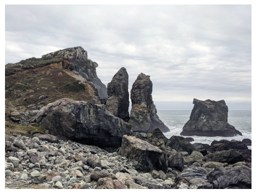
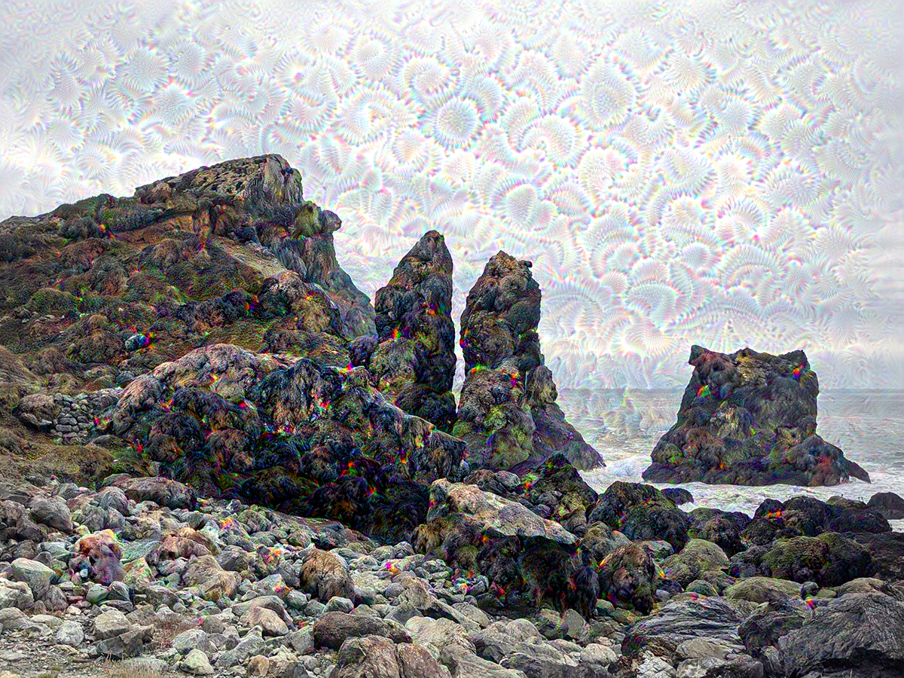
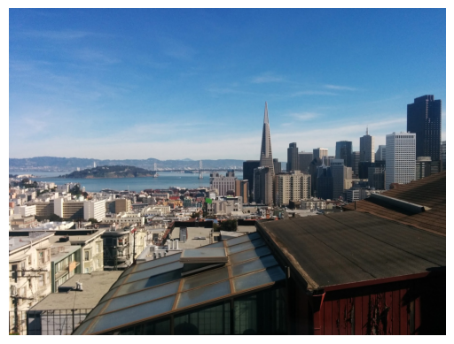
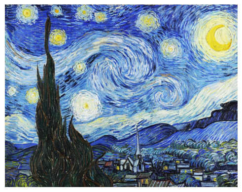

# 케라스 창시자에게 배우는 딥러닝
## 12장, *생성 모델을 위한 딥러닝*

예술 창작의 대부분은 간단한 패턴 인식과 기교로 만들어진다. 여기에 AI가 필요하다. 사람의 지각, 언어, 예술 작품은 모두 통계적 구조를 가지며 딥러닝 알고리즘은 이 구조를 학습하는 데 뛰어나다. 머신 러닝 모델은 이미지, 음악, 글의 통계적 **잠재 공간**(latent space)을 학습할 수 있다. 그 다음 이 공간에서 샘플을 뽑아 새로운 예술 작품을 만들 수 있다. 이런 샘플링 자체는 수학 연산에 불과하지만 숙련된 예술가가 사용하면 알고리즘 창작 자체가 의미 있고 아름다운 것으로 바뀔 수 있다.


## 12.1 텍스트 생성

이 절에서는 순환 신경망으로 시퀀스 데이터를 생성하는 방법을 알아볼 것이다. 텍스트 생성을 예로 들지만 동일한 기법으로 어떤 종류의 시퀀스 데이터도 생성할 수 있다. 음표에 적용하여 새로운 음악을 만들거나 연속된 붓질 시퀀스에 적용하여 한 획씩 그림을 그릴 수도 있다.

### 12.1.1 시퀀스 생성을 위한 딥러닝 모델의 간단한 역사

순환 네트워크를 사용하여 데이터를 성공적으로 생성한 애플리케이션은 2016년이 되어서야 주류가 되기 시작했다.

2002년 더글라스 에크는 스위스의 슈미드후버의 연구실에서 LSTM을 음악 생성이 최초로 적용하여 가능성 있는 결과를 얻어냈고, 2016년에는 구글에서 마젠타라는 새로운 연구 그룹을 만들어 최신 딥러닝 기술로 멋진 음악을 만드는 것에 집중하였다.

2000년대 후반과 2010년대 초반에 알렉스 그레이브스는 순환 네트워크를 사용하여 시퀀스 데이터를 생성하는 데 아주 중요한 선구적인 일을 하였다. 2013년에 펜 위치를 기록한 시계열 데이터로 순환 네트워크와 완전 연결 네트워크를 혼합한 네트워크로 사람이 쓴 것 같은 손글씨를 생성했고, 이 작업이 전환점이 되었다.

2015년에서 2017년 사이에 순환 신경망은 텍스트와 대화 생성, 음악 생성, 음성 합성에 성공적으로 사용되었다.

그 다음 2017년~2018년 즈음에 트랜스포머 아키텍처가 자연어 처리 지도 학습 작업뿐만 아니라 시퀀스 생성 모델, 특히 언어 모델링(단어 수준의 텍스트 생성)에서 순환 신경망을 압도하기 시작했다. 가장 잘 알려진 생성 트랜스포머의 예는 1,750억 개의 파라미터를 가진 텍스트 생성 모델인 GPT-3이다.

### 12.1.2 시퀀스 데이터를 어떻게 생성할까?

딥러닝에서 시퀀스 데이터를 생성하는 일반적인 방법은 이전 토큰을 입력으로 사용하여 시퀀스의 다음 1개 또는 몇 개의 토큰을 트랜스포머나 RNN으로 예측하는 것이다. 텍스트 데이터를 다룰 때 다음 토큰은 보통 단어 또는 글자이다. 이전 토큰들이 주어졌을 때 다음 토큰의 확률을 모델링할 수 있는 네트워크를 **언어 모델**(language model)이라고 부른다. 언어 모델은 언어의 통계적 구조인 잠재 공간을 탐색한다.

언어 모델 훈련 후에는 이 모델에서 샘플링을 할 수 있다(새로운 시퀀스를 생성한다). 초기 텍스트 문자열인 **조건 데이터**(conditioning data)를 주입하고 새로운 글자나 단어를 생성한다(한 번에 여러 개의 토큰을 생성할 수도 있다). 생성된 출력은 다시 입력 데이터로 추가된다. 이 과정을 여러 번 반복한다. 이런 반복을 통해 모델이 훈련한 데이터 구조가 반영된 임의의 길이를 가진 시퀀스를 생성할 수 있다. 이런 시퀀스는 사람이 쓴 문장과 거의 비슷하다.

### 12.1.3 샘플링 전략의 중요성

텍스트 생성 시 다음 문자를 선택하는 방법은 아주 중요하다. 단순한 방법은 항상 가장 높은 확률을 가진 글자를 선택하는 **탐욕적 샘플링**(greedy sampling)이다. 이 방법은 반복적이고 예상 가능한 문자열을 만들기 때문에 논리적인 언어처럼 보이지 않는다. 이 외에 다음 단어를 확률 분포에서 샘플링하는 과정에 무작위성을 주입하는 **확률적 샘플링**(stochastic sampling)이 있다. 만약 어떤 단어가 문장의 다음 단어가 될 확률이 0.3이라면 확률적 샘플링 모델의 30% 정도는 이 단어를 선택한다. 탐욕적 샘플링을 확률적 샘플링의 한 종류로 설명할 수도 있는데, 한 단어만 확률이 1이고 나머지는 모두 0인 확률 분포를 가지는 경우이다.

모델의 소프트맥스 출력은 확률적 샘플링에 사용하기 좋다. 훈련 데이터에는 없으나 실제 같은 새로운 문장을 만들기 때문에 더 흥미롭게 보이는 문장이 만들어지고 이따금씩 창의성을 보이기도 한다. 그러나 샘플링 과정에서 무작위성을 조절할 방법이 없다는 문제점이 존재한다.

만약 무작위성이 최대인(즉, 엔트로피가 최대인) 균등 확률 분포에서 다음 단어를 추출한다고 가정하자. 이 경우엔 흥미로운 것들을 생성할 수 없기 때문에 문제가 있다. 반대로 무작위성이 최소라면 탐욕적 샘플링이 되어 최소의 엔트로피를 가진다. 모델의 소프트맥스 출력인 실제 확률 분포에서 샘플링하는 것은 이 두 극단적인 케이스의 중간에 위치해 있다. 작은 엔트로피는 예상 가능한 구조를 가진 시퀀스를 생성하여 더 실제처럼 보일 수 있고, 높은 엔트로피는 놀랍고 창의적인 시퀀스를 만든다. 생성 모델에서 샘플링을 할 때 생성 과정에 무작위성의 양을 바꾸어 시도해 보는 것이 좋다. 흥미라는 것은 매우 주관적이므로 최적의 엔트로피 값을 미리 알 수 없기 때문에 사람이 판단해야 한다.

샘플링 과정에서 확률의 양을 조절하기 위해 **소프트맥스 온도**(softmax temperature)라는 파라미터를 사용한다. 이 파라미터는 샘플링에 사용되는 확률 분포의 엔트로피를 나타낸다. 얼마나 놀라운, 또는 예상되는 단어를 선택할지 결정한다. `temperature` 값이 주어지면 다음과 같이 가중치를 적용하여 모델의 소프트맥스 출력인 원본 확률 분포에서 새로운 확률 분포를 계산한다.

**코드 12-1. 다른 온도 값을 사용하여 확률 분포의 가중치 바꾸기**
```
import numpy as np

# original_distribution은 전체 합이 1인 1D 넘파이 배열이다.
# temperature는 출력 분포의 엔트로피의 양을 결정한다.
def reweight_distribution(original_distribution, temperature=0.5):
    distribution = np.log(original_distribution) / temperature
    distribution = np.exp(distribution)
    return distribution / np.sum(distribution)  # 원본 분포의 가중치를 변경하며 반환한다. 이 분포의 합은 1이 아닐 수 있으므로 새로운 분포의 합으로 나눈다.
```

높은 온도는 엔트로피가 높은 샘플링 분포를 만들어 더 놀랍고 생소한 데이터를 생성한다. 반면 낮은 온도는 무작위성이 낮기 때문에 예상할 수 있는 데이터를 생성한다.

### 12.1.4 케라스를 사용한 텍스트 생성 모델 구현

언어 모델을 학습하기 위해 많은 텍스트 데이터가 필요하다. 위키피디아(Wikipedia)나 <반지의 제왕(The Lord of the Rings)>처럼 아주 큰 텍스트 파일이나 텍스트 파일의 묶음을 사용할 수 있다.

이 예제에서는 IMDB 영화 리뷰 데이터셋을 사용하여 이전에 본 적 없는 영화 리뷰를 생성하는 방법을 학습시켜 본다. 따라서 이 언어 모델은 일반적인 영어가 아닌 영화 리뷰의 스타일과 주제를 모델링할 것이다.

#### 데이터 준비

IMDB 영화 리뷰 데이터셋을 내려받아 압축을 해제한다.

**코드 12-2. IMDB 영화 리뷰 데이터셋 내려받아 압축 풀기**
```
!wget https://ai.stanford.edu/~amaas/data/sentiment/aclImdb_v1.tar.gz
!tar -xf aclImdb_v1.tar.gz
!rm -f aclImdb_v1.tar.gz
```

`label_mode=None` 옵션으로 `text_dataset_from_directory` 함수를 호출하여 파일을 읽어 각 파일의 텍스트 내용을 반환하는 데이터셋을 만들어 보자.

**코드 12-3. 텍스트 파일(한 파일 = 한 샘플)에서 데이터셋 만들기**
```
import tensorflow as tf
from tensorflow import keras

dataset = keras.utils.text_dataset_from_directory(
    directory="aclImdb", label_mode=None, batch_size=256,
)
dataset = dataset.map(lambda x: tf.strings.regex_replace(x, "<br />", " "))
```

`TextVectorization` 층을 사용하여 예제에서 사용할 어휘 사전을 만든다. 각 리뷰에서 처음 `sequence_length` 개의 단어만 사용한다.

**코드 12-4. TextVectorization 층 준비하기**
```
from tensorflow.keras.layers import TextVectorization

sequence_length = 100
vocab_size = 15000
text_vectorization = TextVectorization(
    max_tokens=vocab_size,
    output_mode="int",
    # 길이가 100인 입력과 타깃을 사용한다(타깃은 한 스텝 차이가 나기 때문에 모델은 99개의 단어 시퀀스를 보게 된다).
    output_sequence_length=sequence_length,
)
text_vectorization.adapt(dataset)
```

이 층을 사용해 언어 모델링 데이터셋을 만든다. 입력 샘플은 벡터화된 텍스트고 타깃은 한 스텝 앞의 동일 텍스트이다.

**코드 12-5. 언어 모델링 데이터셋 만들기**
```
def prepare_Im_dataset(text_batch):
    vectorized_sequences = text_vectorization(text_batch)
    x = vectorized_sequences[:, :-1]    # 마지막 단어를 제외한 입력을 만든다.
    y = vectorized_sequences[:, 1:]     # 첫 단어를 제외한 타깃을 만든다.
    return x, y

Im_dataset = dataset.map(prepare_Im_dataset, num_parallel_calls=8)
```

#### 트랜스포머 기반의 시퀀스-투-시퀀스 모델

몇 개의 초기 단어가 주어지면 문장의 다음 단어에 대한 확률 분포를 예측하는 모델을 훈련한다. 초기 문장을 주입하고, 다음 단어를 샘플링하여 이 문장에 추가하는 식으로 짧은 문단을 생성할 때까지 반복한다.

N개의 단어를 시퀀스로 입력받아 N+1번째 단어를 예측하는 모델을 훈련한다. 하지만 시퀀스 생성 관점에서 여기에는 몇 가지 이슈가 있다.

첫 번째로, N개의 단어로 예측을 만드는 방법을 학습하지만 N개보다 적은 단어로 예측을 시작할 수 있어야 한다. 그렇지 않으면 비교적 긴 시작 문장을 사용해야 하는 제약이 생긴다.

둘째로, 훈련에 사용하는 많은 시퀀스는 중복되어 있다. N=4일 때를 예로 "A complete sentence must have, at minimum, three things: a subject, verb and an object"는 다음과 같은 훈련 시퀀스를 만든다.

- "A complete sentence must"
- "complete sentence must have"
- "sentence must have at"
- ...
- "verb and an object"

이런 시퀀스를 모두 독립적인 샘플로 처리하는 모델은 이전에 처리했던 시퀀스를 여러 번 다시 인코딩해야 한다. 그렇다고 몇 단어를 건너뛰는 식으로 학습하면 훈련 데이터가 줄어들게 된다.

이를 해결하기 위해 시퀀스-투-시퀀스 모델을 사용한다. 단어 N개의 시퀀스를 모델에 주입하고 한 스텝 다음의 시퀀스를 예측한다. 코잘 마스킹(causal masking)을 사용하여 어떤 인덱스 i에서 모델이 0부터 i까지 단어만 사용해서 i+1번째 단어를 예측하도록 만들 것이다. 대부분 중복되지만 N개의 다른 문제를 해결하도록 모델을 동시 훈련한다는 의미이다. 생성 단계에서는 하나의 단어만 모델에 전달해도 다음 단어에 대한 확률 분포를 만들 수 있을 것이다.

텍스트 생성에서는 소스 시퀀스가 존재하지 않는다. 과거 토큰이 주어지면 타깃 시퀀스에 있는 다음 토큰을 예측할 뿐이다. 따라서 이 작업은 디코더만 사용해서 수행할 수 있다. 코잘 패딩 덕분에 디코더는 단어 N+1을 예측하기 위해 단어 0...N만 바라볼 것이다.

11장의 `PositionalEmbedding`과 `TransformerDecoder`를 재사용하여 모델을 만들어 보자.

**코드 12-6. 간단한 트랜스포머 기반 언어 모델**
```
from tensorflow.keras import layers
embed_dim = 256
latent_dim = 2048
num_heads = 2

inputs = keras.Input(shape=(None, ), dtype="int64")
x = PositionalEmbedding(sequence_length, vocab_size, embed_dim)(inputs)
x = TransformerDecoder(embed_dim, latent_dim, num_heads)(x, x)
outputs = layers.Dense(vocab_size, activation="softmax")(x)

model = keras.Model(inputs, outputs)

model.compile(
    optimizer="rmsprop",
    loss="sparse_categorical_crossentropy",
)
```

### 12.1.5 가변 온도 샘플링을 사용한 텍스트 생성 콜백

콜백을 사용하여 에포크가 끝날 때마다 다양한 온도로 텍스트를 생성한다. 모델이 수렴하면서 생성된 텍스트가 어떻게 발전하는지, 온도가 샘플링 전략에 미치는 영향이 어떤지를 확인할 수 있다. 시작 단어로는 "this movie"를 사용한다. 즉, 이 두 단어를 시작으로 모든 텍스트를 생성할 것이다.

**코드 12-7. 텍스트 생성 콜백**
```
import numpy as np

tokens_index = dict(enumerate(text_vectorization.get_vocabulary()))

def sample_next(predictions, temperature=1.0):
    predictions = np.asarray(predictions).astype("float64")
    predictions = np.log(predictions) / temperature
    exp_preds = np.exp(predictions)
    predictions = exp_preds / np.sum(exp_preds)
    probas = np.random.multinomial(1, predictions, 1)
    return np.argmax(probas)

class TextGenerator(keras.callbacks.Callback):
    def __init__(self,
                 prompt,                # 텍스트 생성을 위한 시작 문장
                 generate_length,       # 생성할 단어 개수
                 model_input_length,
                 temperatures=(1., ),   # 샘플링에 사용할 온도 범위
                 print_freq=1):
        self.prompt = prompt
        self.generate_length = generate_length
        self.model_input_length = model_input_length
        self.temperatures = temperatures
        self.print_freq = print_freq
        
    def on_epoch_end(self, epoch, logs=None):
        if (epoch + 1) % self.print_freq != 0:
            return
        for temperature in self.temperatures:
            print("== Generating with temperature", temperature)
            sentence = self.prompt      # 시작 단어에서부터 텍스트를 생성한다.
            for i in range(self.generate_length):
                # 현재 시퀀스를 모델에 주입한다.
                tokenized_sentence = text_vectorization([sentence])
                predictions = self.model(tokenized_sentence)
                # 마지막 타임스텝의 예측을 추출하여 다음 단어를 샘플링한다.
                next_token = sample_next(predictions[0, i, :])
                sampled_token = tokens_index[next_token]
                # 새로운 단어를 현재 시퀀스에 추가하고 반복한다.
                sentence += " " + sampled_token
            print(sentence)

prompt = "This movie"
text_gen_callback = TextGenerator(
    prompt,
    generate_length=50,
    model_input_length=sequence_length,
    temperatures=(0.2, 0.5, 0.7, 1., 1.5)
)
```

`fit()` 메소드를 호출해 보자.

**코드 12-8. 언어 모델 훈련하기**
```
model.fit(Im_dataset, epochs=10, callbacks=[text_gen_callback])
```

낮은 온도는 매우 단조롭고 반복적인 텍스트를 만든다. 이로 인해 이따금 생성 단계가 루프 안에 갇힐 수 있다. 더 높은 온도에서 생성된 텍스트는 아주 흥미롭고 놀라우며 창의적이기도 하다. 매우 높은 온도에서는 국부적인 구조가 무너지기 시작하고 출력이 대체로 랜덤하게 보인다. 항상 다양한 샘플링 전략으로 실험해 보아야 한다. 학습된 구조와 무작위성 사이에 균형을 잘 맞추면 흥미로운 것을 만들 수 있다.

GPT-3도 이 예제에서 훈련한 것과 사실상 동일하지만 트랜스포머 디코더를 쌓았으며 훨씬 큰 훈련 데이터를 사용했다.

언어 모델이 하는 일은 사람이 살기 위해 언어를 사용하면서 생성하는 관찰 가능한 인공물(책, 온라인 영화 리뷰, 트윗)의 통계적 구조를 감지하는 것이다. 이런 인공물이 통계적 구조를 가지고 있다는 사실은 전적으로 사람이 언어를 구사하는 방식의 부수 효과이다.

### 12.1.6 정리

- 이전의 토큰이 주어지면 다음 토큰(들)을 예측하는 모델을 훈련하여 시퀀스 데이터를 생성할 수 있다.
- 텍스트의 경우 이런 모델을 **언어 모델**이라고 부른다. 단어 또는 글자 단위 모두 가능하다.
- 다음 토큰을 샘플링할 때 모델이 만든 출력에 집중하는 것과 무작위성을 주입하는 것 사이에 균형을 맞추어야 한다.
- 이를 위해 소프트맥스 온도 개념을 사용한다. 항상 다양한 온도를 실험해서 적절한 값을 찾는다.


## 12.2 딥드림

**딥드림**(DeepDream)은 합성곱 신경망이 학습한 표현을 사용하여 예술적으로 이미지를 조작하는 기법이다. 딥드림은 다양한 종류의 강아지와 새가 있는 ImageNet 데이터셋에서 훈련된 컨브넷을 사용하였다.

딥드림 알고리즘은 9장에서 소개된 컨브넷을 거꾸로 실행하는 컨브넷 필터 시각화 기법과 거의 동일하다. 컨브넷 상위 층에 있는 특정 필터의 활성화를 극대화하기 위해 컨브넷의 입력에 경사 상승법을 적용하였다. 몇 개의 사소한 차이를 빼면 딥드림도 동일한 아이디어를 사용한다.

- 딥드림에서는 특정 필터가 아닌 전체 층의 활성화를 최대화한다. 한꺼번에 많은 특성을 섞어 시각화한다.
- 빈 이미지나 노이즈가 조금 있는 입력이 아니라 이미 가지고 있는 이미지를 사용한다. 그 결과 기존 시각 패턴을 바탕으로 이미지의 요소들을 다소 예술적인 스타일로 왜곡시킨다.
- 입력 이미지는 시각 품질을 높이기 위해 여러 다른 스케일(**옥타브**(octave))로 처리한다.

### 12.2.1 케라스 딥드림 구현

먼저 딥드림에 사용할 테스트 이미지를 준비해 보자. 바위가 많은 북부 캘리포니아 해안의 겨울 사진을 사용할 것이다.

**코드 12-9. 테스트 이미지 내려받기**
```
from tensorflow import keras
import matplotlib.pyplot as plt

base_image_path = keras.utils.get_file(
    "coast.jpg",
    origin="https://img-datasets.s3.amazonaws.com/coast.jpg"
)

plt.axis("off")
plt.imshow(keras.utils.load_img(base_image_path))
```



그 다음 사전 훈련된 컨브넷이 필요하다. 케라스에는 `VGG16`, `VGG19`, `Xception`, `ResNet50` 등이 존재한다. 모두 ImageNet에서 훈련된 가중치를 함께 제공한다. 이 중 어느 것을 사용해도 딥드림을 구현할 수 있다. 각 컨브넷 구조가 학습한 특성이 다르기 때문에 어떤 컨브넷을 선택했느냐에 따라 시각화에 영향을 미친다. 딥드림에서 사용한 모델은 인셉션 모델이었다. 그러므로 여기에서도 케라스의 인셉션 V3 모델을 사용한다.

**코드 12-10. 사전 훈련된 InceptionV3 모델 로드하기**
```
from tensorflow.keras.applications import inception_v3

model = inception_v3.InceptionV3(weights="imagenet", include_top=False)
```

사전 훈련된 컨브넷을 사용하여 다음과 같이 다양한 중간 층의 활성화를 반환하는 특성 추출 모델을 만든다. 경사 상승법 단계 동안에 최대화할 손실에 대한 각 층의 기여도에 가중치를 주기 위해 스칼라 값을 선택한다. 다른 층을 선택하고 싶다면 `model.summary()`에서 제공되는 전체 층 이름을 참고하면 된다.

**코드 12-11. 딥드림 손실에 대한 각 층의 기여도 설정하기**
```
layer_settings = {
    "mixed4": 1.0,
    "mixed5": 1.5,
    "mixed6": 2.0,
    "mixed7": 2.5,
}

outputs_dict = dict([
    (layer.name, layer.output)
    for layer in [
        model.get_layer(name)
        for name in layer_settings.keys()
    ]
])

feature_extractor = keras.Model(inputs=model.inputs, outputs=outputs_dict)
```

그 다음 경사 상승법으로 각 스케일마다 최대화할 손실을 계산한다. 여러 층에 있는 모든 필터 활성화를 동시에 최대화할 것이다. 특별히 상위 층에 있는 활성화의 L2 노름에 대한 가중치 평균을 최대화한다. 정확히 어떤 층들을 선택했는지에 따라 (당연히 최종 손실에 기여한 정도에 따라) 만들어내는 시각 요소에 큰 영향을 미친다. 어떤 층을 선택할지 파라미터로 손쉽게 바꿀 수 있어야 좋다. 하위 층은 기하학적인 패턴을 만들고 상위 층은 ImageNet에 있는 클래스로 보이는 시각 요소를 만든다. 먼저 임의로 4개의 층을 선택해 본다.

**코드 12-12. 딥드림 손실**
```
def compute_loss(input_image):
    features = feature_extractor(input_image)   # 활성화를 추출한다.
    loss = tf.zeros(shape=())                   # 손실을 0으로 초기화한다.
    for name in features.keys():
        coeff = layer_settings[name]
        activation = features[name]
        # 경계 부근의 인공적인 패턴을 피하기 위해 테두리가 아닌 픽셀만 손실에 추가한다.
        loss += (coeff * tf.reduce_mean(tf.square(activation[:, 2:-2, 2:-2, :])))
    return loss
```

이제 각 옥타브에서 실행할 경사 상승법 단계를 준비한다.

**코드 12-13. 딥드림 경사 상승법 단계**
```
import tensorflow as tf

@tf.function
def gradient_ascent_step(image, learning_rate):
    # 현재 이미지에 대한 딥드림 손실의 그레이디언트를 계산한다.
    with tf.GradientTape() as tape:
        tape.watch(image)
        loss = compute_loss(image)
    grads = tape.gradient(loss, image)
    grads = tf.math.l2_normalize(grads)     # 그레이디언트를 정규화한다.
    image += (learning_rate * grads)
    return loss, image

# 주어진 이미지 스케일(옥타브)에 대한 경사 상승법을 수행한다.
def gradient_ascent_loop(image, iterations, learning_rate, max_loss=None):
    for i in range(iterations):
        loss, image = gradient_ascent_step(image, learning_rate)
        # 손실이 임계 값을 넘으면 중지한다. 과도하게 최적화하면 원치 않는 이미지를 얻을 수 있다.
        if max_loss is not None and loss > max_loss:
            break
        print(f"... 스텝 {i}에서 손실 값: {loss:.2f}")
    return image
```

마지막으로 딥드림 알고리즘의 바깥쪽 루프이다. 이미지를 처리하기 위해 옥타브라고 부르는 스케일의 리스트를 정의한다. 3개의 다른 옥타브로 이미지를 처리할 것이다. 가장 작은 값에서 가장 큰 값까지 각 옥타브에서 `gradient_ascent_loop()`로 경사 상승법 단계를 30번 실행하여 앞서 정의한 손실을 최대화한다. 각 옥타브 사이에는 이미지가 40% 커진다. 작은 이미지로 시작하여 점점 크기를 키우자.

다음 코드에서 이 과정에 필요한 파라미터를 정의한다. 이런 파라미터를 바꾸면 새로운 효과를 낼 수 있다.

```
# parameters
step = 20.          # 경사 상승법 단계 크기
num_octave = 3      # 경사 상승법을 실행할 스케일 횟수
octave_scale = 1.4  # 연속적인 스케일 사이의 크기 비율
iterations = 30     # 스케일 단계마다 수행할 경사 상승법 단계 횟수
max_loss = 15.      # 이보다 손실이 커지면 현재 스케일에서 경사 상승법 과정을 중지한다.
```

이미지를 로드하고 저장하는 유틸리티 함수도 구현한다.

**코드 12-14. 이미지 처리 유틸리티**
```
import numpy as np

# 이미지를 로드하고 크기를 바꾸어 적절한 배열로 변환하는 유틸리티 함수
def preprocess_image(image_path):
    img = keras.utils.load_img(image_path)
    img = keras.utils.img_to_array(img)
    img = np.expand_dims(img, axis=0)
    img = keras.applications.inception_v3.preprocess_input(img)
    return img

# 넘파이 배열을 이미지로 변환하는 유틸리티 함수
def deprocess_image(img):
    img = img.reshape((img.shape[1], img.shape[2], 3))
    # InceptionV3 전처리 복원하기
    img += 1.0
    img *= 127.5
    img = np.clip(img, 0, 255).astype("uint8")  # uint8로 바꾸고 [0, 255] 범위로 클리핑한다.
    return img
```

다음은 바깥쪽 루프이다. 스케일을 연속적으로 증가시키면서 점점 뭉개지거나 픽셀 경계가 나타나므로 이미지 디테일을 많이 잃지 않도록 간단한 기교를 사용할 수 있다. 스케일을 늘린 후 이미지에 손실된 디테일을 재주입한다. 이는 원본 이미지가 크기를 늘렸을 때 어땠는지 알기 때문에 가능한 기법이다. 작은 이미지 크기 S와 큰 이미지 크기 L이 주어지면 크기 L로 변경된 원본 이미지와 크기 S로 변경된 원본 이미지 사이의 차이를 계산한다. 이 차이가 S에서 L로 변경되었을 때 잃어버린 디테일이다.

**코드 12-15. 연속적인 여러 개의 '옥타브'에 걸쳐 경사 상승법 실행하기**
```
original_img = preprocess_image(base_image_path)
original_shape = original_img.shape[1:3]

# 여러 옥타브에서 이미지 크기를 계산한다.
successive_shapes = [original_shape]
for i in range(1, num_octave):
    shape = tuple([int(dim / (octave_scale ** i)) for dim in original_shape])
    successive_shapes.append(shape)
successive_shapes = successive_shapes[::-1]

shrunk_original_img = tf.image.resize(original_img, successive_shapes[0])

img = tf.identity(original_img)                 # 이미지를 하드 카피한다.
for i, shape in enumerate(successive_shapes):   # 여러 옥타브에 대해 반복한다.
    print(f"{shape} 크기의 {i}번째 옥타브 처리")
    img = tf.image.resize(img, shape)           # 딥드림 이미지의 스케일을 높인다.
    img = gradient_ascent_loop(
        img, iterations=iterations, learning_rate=step, max_loss=max_loss,
    )
    # 작은 버전의 원본 이미지의 스케일을 높인다. 픽셀 경계가 보일 것이다.
    upscaled_shrunk_original_img = tf.image.resize(shrunk_original_img, shape)
    # 이 크기에 해당하는 고해상도 버전의 원본 이미지를 계산한다.
    same_size_original = tf.image.resize(original_img, shape)
    # 두 이미지의 차이가 스케일을 높였을 때 손실된 디테일이다.
    lost_detail = same_size_original - upscaled_shrunk_original_img
    # 손실된 디테일을 딥드림 이미지에 다시 주입한다.
    img += lost_detail
    shrunk_original_img = tf.image.resize(original_img, shape)

keras.utils.save_img("dream.png", deprocess_image(img.numpy()))
```



### 12.2.2 정리

- 딥드림은 네트워크가 학습한 표현을 기반으로 컨브넷을 거꾸로 실행하여 입력 이미지를 생성한다.
- 재미있는 결과가 만들어지고, 때로는 환각제 때문에 시야가 몽롱해진 사람이 만든 이미지 같기도 하다.
- 이 과정은 이미지 모델이나 컨브넷에 국한되지 않는다. 음성, 음악 등에도 적용될 수 있다.


## 12.3 뉴럴 스타일 트랜스퍼

딥드림 이외에 딥러닝을 사용하여 이미지를 변경하는 또 다른 주요 분야는 **뉴럴 스타일 트랜스퍼**(neural style transfer)이다. 이는 타깃 이미지의 콘텐츠를 보존하면서 참조 이미지의 스타일을 타깃 이미지에 적용한다.

여기서 스타일은 질감, 색깔, 이미지에 있는 다양한 크기의 시각 요소를 의미한다. 콘텐츠는 이미지에 있는 고수준의 대형 구조를 말한다. 

스타일 트랜스퍼 구현 이면에 있는 핵심 개념은 모든 딥러닝 알고리즘의 핵심과 동일하다. 목표를 표현한 손실 함수를 정의하고 이 손실을 최소화한다. 이 동안 참조 이미지의 스타일을 적용하면서 원본 이미지의 콘텐츠를 보존한다. 콘텐츠와 스타일을 수학적으로 정의할 수 있다면 최소화할 손실 함수는 다음과 같을 것이다.

```
loss = distance(style(reference_image) - style(combination_image)) +
       distance(content(original_image) - content(combination_image))
```

여기서 `distance`는 L2 같은 노름 함수이다. `content` 함수는 이미지의 콘텐츠 표현을 계산하고, `style` 함수는 이미지의 스타일 표현을 계산한다. 손실을 최소화하면 이미지의 스타일은 참조 이미지에 가까워지고, 콘텐츠는 원본 이미지에 가까워질 것이다.

심층 합성곱 신경망을 사용하여 `style`과 `content` 함수를 수학적으로 정의할 수 있음은 2015년 여름 리온 게티스 등이 증명하였다.

### 12.3.1 콘텐츠 손실

네트워크의 하위 층 활성화는 이미지에 관한 국부적인 정보를 담고 있고, 상위 층의 활성화일수록 점점 전역적이고 추상적인 정보를 담게 된다. 다른 방식으로 생각하면 컨브넷 층의 활성화는 이미지를 다른 크기의 콘텐츠로 분해한다. 즉, 컨브넷 상위 층의 표현을 사용하면 전역적이고 추상적인 이미지 콘텐츠를 찾을 수 있을 것이다.

타깃 이미지와 생성된 이미지를 사전 훈련된 컨브넷에 주입하여 상위 층의 활성화를 계산한다. 이 두 값 사이의 L2 노름이 콘텐츠 손실로 사용하기 좋다. 상위 층에서 보았을 때의 생성된 이미지, 원본 타깃 이미지를 서로 비슷하게 만들 것이다. 컨브넷의 상위 층에서 보는 것이 입력 이미지의 콘텐츠라고 가정하면 이미지의 콘텐츠를 보존하는 방법으로 사용할 수 있다.

콘텐츠 손실은 하나의 상위 층만 사용한다.

### 12.3.2 스타일 손실

게티스 등이 정의한 스타일 손실은 컨브넷의 여러 층을 사용한다. 하나의 스타일이 아니라 참조 이미지에서 컨브넷이 추출한 모든 크기의 스타일을 잡아야 한다. 게티스 등은 층의 활성화 출력의 **그람 행렬**(Gram matrix)을 스타일 손실로 사용했다. 이는 층의 특성 맵들의 내적(inner product)이다. 내적은 층의 특성 사이에 있는 상관관계를 표현한다고 이해할 수 있다. 이런 특성의 상관관계는 특정 크기의 공간적인 패턴 통계를 잡아낸다. 경험적으로 보았을 때 층에서 찾은 텍스처에 대응된다.

스타일 참조 이미지와 생성된 이미지로 층의 활성화를 계산한다. 스타일 손실은 그 안에 내재된 상관관계를 비슷하게 보존하는 것이 목적이다. 결과적으로 스타일 참조 이미지와 생성된 이미지에서 여러 크기의 텍스처가 비슷하게 보이도록 만든다.

요약하면 사전 훈련된 컨브넷을 사용하여 다음 손실들을 정의할 수 있다.

- 콘텐츠를 보존하기 위해 원본 이미지와 생성된 이미지 사이에서 상위 층의 활성화를 비슷하게 유지한다. 이 컨브넷은 원본 이미지와 생성된 이미지에서 동일한 것을 보아야 한다.
- 스타일을 보존하기 위해 저수준 층과 고수준 층에서 활성화 안에 상관관계를 비슷하게 유지한다. 특성의 상관관계는 텍스처를 나타낸다. 따라서 생성된 이미지와 스타일 참조 이미지는 여러 크기의 텍스처를 공유할 것이다.

### 12.3.3 케라스로 뉴럴 스타일 트랜스퍼 구현하기

뉴럴 스타일 트랜스퍼는 사전 훈련된 컨브넷 중 어떤 것을 사용해서도 구현할 수 있다. 여기서는 게티스 등이 사용한 `VGG19` 네트워크를 사용한다.

일반적인 과정은 다음과 같다.

1. 스타일 참조 이미지, 베이스 이미지(base image), 생성된 이미지를 위해 VGG19 층의 활성화를 동시에 계산하는 네트워크를 설정한다.
2. 세 이미지에서 계산한 층 활성화를 사용하여 앞서 설명한 손실 함수를 정의한다. 이 손실을 최소화하여 스타일 트랜스퍼를 구현할 것이다.
3. 손실 함수를 최소화할 경사 하강법 과정을 설정한다.

스타일 참조 이미지와 베이스 이미지의 경로를 정의하는 것부터 시작한다.

**코드 12-16. 스타일 이미지와 콘텐츠 이미지 준비하기**
```
from tensorflow import keras

base_image_path = keras.utils.get_file(
    "sf.jpg",
    origin="https://img-datasets.s3.amazonaws.com/sf.jpg",
)
style_reference_image_path = keras.utils.get_file(
    "starry_night.jpg",
    origin="https://img-datasets.s3.amazonaws.com/starry_night.jpg",
)

original_width, original_height = keras.utils.load_img(base_image_path).size
img_height=400
img_width=round(original_width * img_height / original_height)
```





또한 컨브넷에 입출력할 이미지의 로드, 전처리, 사후 처리를 위한 유틸리티 함수도 정의한다.

**코드 12-17. 유틸리티 함수**
```
import numpy as np

def preprocess_image(image_path):
    img = keras.utils.load_img(image_path, target_size=(img_height, img_width))
    img = keras.utils.img_to_array(img)
    img = np.expand_dims(img, axis=0)
    img = keras.applications.vgg19.preprocess_input(img)
    return img

def deprocess_image(img):
    img = img.reshape((img_height, img_width, 3))
    # ImageNet의 평균 픽셀 값을 더한다. 이는 vgg19.preprocess_input 함수에서 수행한 변환을 복원한다.
    img[:, :, 0] += 103.939
    img[:, :, 1] += 116.779
    img[:, :, 2] += 123.68
    # 이미지를 BGR에서 RGB로 변경한다. 이는 vgg19.preprocess_input 함수에서 수행한 변환을 복원한다.
    img = img[:, :, ::-1]
    img = np.clip(img, 0, 255).astype("uint8")
    return img    
```

VGG19 네트워크를 준비하고 사전 훈련된 컨브넷을 사용하여 중간 층의 활성화를 반환하는 특성 추출 모델을 만든다.

**코드 12-18. 사전 훈련된 VGG19 모델을 사용해서 특성 추출기 만들기**
```
model = keras.applications.vgg19.VGG19(weights="imagenet", include_top=False)
outputs_dict = dict([(layer.name, layer.output) for layer in model.layers])
# 이 모델은 모든 타깃 층의 활성화 값을 하나의 딕셔너리로 반환한다.
feature_extractor = keras.Model(inputs=model.inputs, outputs=outputs_dict)
```

다음으로 콘텐츠 손실을 정의한다.

**코드 12-19. 콘텐츠 손실**
```
def content_loss(base_img, combination_img):
    return tf.reduce_sum(tf.square(combination_img - base_img))
```

다음은 스타일 손실을 정의한다. 유틸리티 함수를 사용하여 입력 행렬의 그람 행렬을 계산한다. 이 행렬은 원본 특성 행렬의 상관관계를 기록한 행렬이다.

**코드 12-20. 스타일 손실**
```
def gram_matrix(x):
    x = tf.transpose(x, (2, 0, 1))
    features = tf.reshape(x, (tf.shape(x)[0], -1))
    gram = tf.matmul(features, tf.transpose(features))
    return gram

def style_loss(style_img, combination_img):
    S = gram_matrix(style_img)
    C = gram_matrix(combination_img)
    channels = 3
    size = img_height * img_width
    return tf.reduce_sum(tf.square(S - C)) / (4.0 * (channels ** 2) * (size ** 2))
```

두 손실에 생성된 이미지의 픽셀을 사용하여 계산하는 **총 변위 손실**(total variation loss)를 추가한다. 이는 생성된 이미지가 공간적인 연속성을 가지도록 도와주며 픽셀의 격자 무늬가 과도하게 나타나는 것을 막아준다. 일종의 규제 항으로 해석할 수 있다.

**코드 12-21. 총 변위 손실**
```
def total_variation_loss(x):
    a = tf.square(
        x[:, :img_height-1, :img_width-1, :] - x[:, 1:, :img_width-1, :]
    )
    b = tf.square(
        x[:, :img_height-1, :img_width-1, :] - x[:, :img_height-1, 1:, :]
    )
    return tf.reduce_sum(tf.pow(a + b, 1.25))
```

최소화할 손실은 이 세 손실의 가중치 평균이다. 콘텐츠 손실은 `block5_conv2` 층 하나만 사용해서 계산한다. 스타일 손실을 계산하기 위해서는 하위 층과 상위 층에 걸쳐 여러 층을 사용한다. 그리고 마지막 층에 총 변위 손실을 추가한다.

사용하는 스타일 참조 이미지와 콘텐츠 이미지에 따라 `content_weight` 계수를 조정하는 것이 좋다. `content_weight`가 높으면 생성된 이미지에 타깃 콘텐츠가 더 많이 나타나게 된다.

**코드 12-22. 최소화할 최종 손실 정의하기**
```
style_layer_names = [                   # 스타일 손실에 사용할 층
    "block1_conv1",
    "block2_conv1",
    "block3_conv1",
    "block4_conv1",
    "block5_conv1",
]
content_layer_name = "block5_conv2"     # 콘텐츠 손실에 사용할 층
total_variation_weight = 1e-6           # 총 변이 손실의 기여 가중치
style_weight = 1e-6                     # 스타일 손실의 기여 가중치
content_weight = 2.5e-8                 # 콘텐츠 손실의 기여 가중치

def compute_loss(combination_image, base_image, style_reference_image):
    input_tensor = tf.concat(
        [base_image, style_reference_image, combination_image],
        axis=0,
    )
    features = feature_extractor(input_tensor)
    loss = tf.zeros(shape=())
    layer_features = features[content_layer_name]
    base_image_features = layer_features[0, :, :, :]
    combination_features = layer_features[2, :, :, :]
    loss += content_weight * content_loss(
        base_image_features, combination_features,
    )
    for layer_name in style_layer_names:
        layer_features = features[layer_name]
        style_reference_features = layer_features[1, :, :, :]
        combination_features = layer_features[2, :, :, :]
        style_loss_value = style_loss(
            style_reference_features, combination_features,
        )
        loss += (style_weight / len(style_layer_names)) * style_loss_value
    loss += total_variation_weight * total_variation_loss(combination_image)
    return loss
```

마지막으로 경사 하강법 단계를 설정한다. 게티스의 논문에서는 L-BFGS 알고리즘이 최적화를 수행했지만 텐서플로에는 이 알고리즘이 없기 때문에 SGD 옵티마이저로 미니 배치 경사 하강법을 수행한다. 여기에서 학습률 스케줄(learning rate schedule)이라는 옵티마이저 기능을 활용할 것이다. 이를 사용하여 매우 높은 값에서 최종적으로 아주 낮은 값까지 점진적으로 학습률을 줄인다. 이렇게 하면 훈련 초기에는 빠른 속도로 진행되며 최소 손실에 가까울수록 점점 더 조심스럽게 훈련이 진행된다.

**코드 12-23. 경사 하강법 단계 설정하기**
```
import tensorflow as tf

@tf.function
def compute_loss_and_grads(combination_image, base_image, style_reference_image):
    with tf.GradientTape() as tape:
        loss = compute_loss(combination_image, base_image, style_reference_image)
    grads = tape.gradient(loss, combination_image)
    return loss, grads

optimizer = keras.optimizers.SGD(
    keras.optimizers.schedules.ExponentialDecay(
        initial_learning_rate=100.0, decay_steps=100, decay_rate=0.96,
    )
)

base_image = preprocess_image(base_image_path)
style_reference_image = preprocess_image(style_reference_image_path)
# 훈련하는 동안 합성된 이미지를 업데이트하기 때문에 Variable에 저장한다.
combination_image = tf.Variable(preprocess_image(base_image_path))
iterations = 4000

for i in range(1, iterations + 1):
    loss, grads = compute_loss_and_grads(
        combination_image, base_image, style_reference_image,
    )
    # 스타일 트랜스퍼 손실이 감소되는 방향으로 합성 이미지를 업데이트한다.
    optimizer.apply_gradients([(grads, combination_image)])
    if i % 100 == 0:
        print(f"{i}번째 반복: loss={loss:.2f}")
        img = deprocess_image(combination_image.numpy())
        fname = f"style_transfer/combination_image_at_iteration_{i}.png"
        keras.utils.save_img(fname, img)
```

스타일 트랜스퍼 알고리즘은 느리지만 간단한 변환을 수행하기 때문에 작고 빠른 컨브넷을 사용하여 학습할 수 있다. 물론 이때 적절한 양의 훈련 데이터가 있어야 한다. 먼저 고정된 스타일 참조 이미지에 대해 여기에서 소개된 방법으로 입력-출력 샘플을 많이 생성한다. 그 다음 이 스타일 변환을 학습하는 간단한 컨브넷을 훈련하면 스타일 트랜스퍼를 빠르게 수행할 수 있다. 이런 모델을 만들면 어떤 이미지가 주어졌을 때 순식간에 스타일을 바꿀 수 있다. 그냥 이 작은 컨브넷을 통과시키기만 하면 된다.

### 12.3.4 정리

- 스타일 트랜스퍼는 참조 이미지의 스타일을 적용하면서 타깃 이미지의 콘텐츠를 보존하여 새로운 이미지를 만드는 방법이다.
- 콘텐츠는 컨브넷 상위 층의 활성화에서 얻을 수 있다.
- 스타일은 여러 컨브넷 층의 활성화 안에 내재된 상관관계에서 얻을 수 있다.
- 딥러닝에서는 사전 훈련된 컨브넷으로 손실을 정의하고 이 손실을 최적화하는 과정으로 스타일 트랜스퍼를 구성할 수 있다.
- 이런 기본 아이디어에서 출발하여 다양한 변종과 개선이 가능하다.